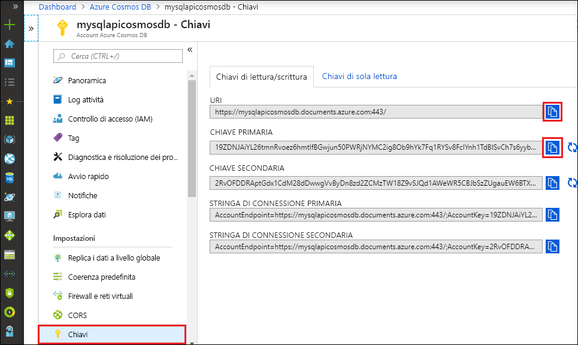

# <a name="quickstart-build-a-python-application-using-an-azure-cosmos-db-sql-api-account"></a>Guida introduttiva: Creare un'applicazione Python usando un account API SQL di Azure Cosmos DB

> [!div class="op_single_selector"]
> * [.NET V3](create-sql-api-dotnet.md)
> * [.NET V4](create-sql-api-dotnet-V4.md)
> * [Java](create-sql-api-java.md)
> * [Node.js](create-sql-api-nodejs.md)
> * [Python](create-sql-api-python.md)
> * [Xamarin](create-sql-api-xamarin-dotnet.md)

Questa guida introduttiva illustra come creare un account dell'[API SQL](sql-api-introduction.md) di Azure Cosmos DB, un database di documenti e un contenitore usando il portale di Azure. Quindi, si creerà ed eseguirà un'app console creata con Python SDK per [API SQL](sql-api-sdk-python.md).

Azure Cosmos DB è il servizio di database di Microsoft multimodello distribuito a livello globale. Questo servizio consente di creare rapidamente database di documenti, a chiave/valore, a colonne estese e a grafi e di eseguire query su di essi. Tutte queste operazioni traggono vantaggio dalla distribuzione e scalabilità di Azure Cosmos DB.

Questo argomento di avvio rapido usa la versione 4 di [Python SDK](https://pypi.org/project/azure-cosmos/#history).

[!INCLUDE [quickstarts-free-trial-note](../../includes/quickstarts-free-trial-note.md)] [!INCLUDE [cosmos-db-emulator-docdb-api](../../includes/cosmos-db-emulator-docdb-api.md)]

## <a name="prerequisites"></a>Prerequisiti

* [Python 3.6+](https://www.python.org/downloads/), con il file eseguibile `python` disponibile in `PATH`.
* [Visual Studio Code](https://code.visualstudio.com/)
* [Estensione di Python per Visual Studio Code](https://marketplace.visualstudio.com/items?itemName=ms-python.python#overview)

## <a name="create-a-database-account"></a>Creare un account di database

[!INCLUDE [cosmos-db-create-dbaccount](../../includes/cosmos-db-create-dbaccount.md)]

## <a name="add-a-container"></a>Aggiungere un contenitore

[!INCLUDE [cosmos-db-create-collection](../../includes/cosmos-db-create-collection.md)]

## <a name="add-sample-data"></a>Aggiungere dati di esempio

[!INCLUDE [cosmos-db-create-sql-api-add-sample-data](../../includes/cosmos-db-create-sql-api-add-sample-data.md)]

## <a name="query-your-data"></a>Eseguire query sui dati

[!INCLUDE [cosmos-db-create-sql-api-query-data](../../includes/cosmos-db-create-sql-api-query-data.md)]

## <a name="clone-the-sample-application"></a>Clonare l'applicazione di esempio

Clonare ora un'app per le API SQL da GitHub, impostare la stringa di connessione ed eseguirla.

1. Aprire un prompt dei comandi, creare una nuova cartella denominata git-samples e quindi chiudere il prompt dei comandi.

    ```cmd
    md "git-samples"
    ```
   Se si usa un prompt di bash, è consigliabile usare in alternativa il comando seguente:

   ```bash
   mkdir "git-samples"
   ```

2. Aprire una finestra del terminale Git, ad esempio Git Bash, ed eseguire il comando `cd` per passare a una nuova cartella in cui installare l'app di esempio.

    ```bash
    cd "git-samples"
    ```

3. Eseguire il comando seguente per clonare l'archivio di esempio. Questo comando crea una copia dell'app di esempio nel computer in uso. 

    ```bash
    git clone https://github.com/Azure-Samples/azure-cosmos-db-python-getting-started.git
    ```  

## <a name="update-your-connection-string"></a>Aggiornare la stringa di connessione

Tornare ora al portale di Azure per recuperare le informazioni sulla stringa di connessione e copiarle nell'app.

1. Nell'account Azure Cosmos nel [portale di Azure](https://portal.azure.com/) selezionare **Chiavi** nel riquadro di spostamento sinistro. Usare i pulsanti di copia sul lato destro dello schermo per copiare **URI** e **Chiave primaria** nel file `cosmos_get_started.py` nel passaggio seguente.

    

2. Aprire il file `cosmos_get_started.py` in git-samples\azure-cosmos-db-python-getting-started in Visual Studio Code.

3. Copiare il valore di **URI** dal portale (usando il pulsante di copia) e impostarlo come valore della variabile **endpoint** in ``cosmos_get_started.py``. 

    `endpoint = 'https://FILLME.documents.azure.com',`

4. Copiare quindi il valore di **CHIAVE PRIMARIA** dal portale e impostarlo come valore della **chiave** in ``cosmos_get_started.py``. L'app è stata aggiornata con tutte le informazioni necessarie per comunicare con Azure Cosmos DB. 

    `key = 'FILLME'`

5. Salvare il file.``cosmos_get_started.py``

## <a name="review-the-code"></a>Esaminare il codice

Questo passaggio è facoltativo. È possibile ottenere informazioni sulle risorse di database create in codice oppure passare direttamente a [Aggiornare la stringa di connessione](#update-your-connection-string).

Tutti i frammenti di codice seguenti sono tratti dal file `cosmos_get_started.py`.

* Viene inizializzato CosmosClient. Assicurarsi di aggiornare i valori di "endpoint" e "chiave" come descritto nella sezione [Aggiornare la stringa di connessione](#update-your-connection-string). 

    [!code-python[](~/azure-cosmos-db-python-getting-started/cosmos_get_started.py?name=create_cosmos_client)]

* Viene creato un nuovo database.

    [!code-python[](~/azure-cosmos-db-python-getting-started/cosmos_get_started.py?name=create_database_if_not_exists)]

* Viene creato un nuovo contenitore con 400 RU/sec di [unità elaborate per il provisioning](request-units.md). Scegliere `lastName` come [chiave di partizione ](partitioning-overview.md#choose-partitionkey), che consente di eseguire query efficienti che filtrano in base a questa proprietà. 

    [!code-python[](~/azure-cosmos-db-python-getting-started/cosmos_get_started.py?name=create_container_if_not_exists)]

* Alcuni elementi vengono aggiunti al contenitore. I contenitori sono una raccolta di elementi (documenti JSON) che possono avere uno schema vario. I metodi helper ```get_[name]_family_item``` restituiscono rappresentazioni di una famiglia archiviata in Azure Cosmos DB come documenti JSON.

    [!code-python[](~/azure-cosmos-db-python-getting-started/cosmos_get_started.py?name=create_item)]

* Le letture dei punti (ricerche con valori di chiave) vengono eseguite usando il metodo `read_item`. Viene stampato l'[addebito per UR](request-units.md) di ogni operazione.
    [!code-python[](~/azure-cosmos-db-python-getting-started/cosmos_get_started.py?name=read_item)]

* Viene eseguita una query con la sintassi di query SQL. Poiché si usano i valori delle chiavi di partizione di ```lastName``` nella clausola WHERE, Azure Cosmos DB instraderà in modo efficiente questa query alle partizioni pertinenti, migliorando le prestazioni.

    [!code-python[](~/azure-cosmos-db-python-getting-started/cosmos_get_started.py?name=query_items)]
   
## <a name="run-the-app"></a>Esecuzione dell'app

1. In Visual Studio Code selezionare **Visualizza** > **Riquadro comandi**. 

2. Al prompt immettere **Python: Select Interpreter** e quindi selezionare la versione di Python da usare.

    Il piè di pagina in Visual Studio Code viene aggiornato per indicare l'interprete selezionato. 

3. Selezionare **Visualizza** > **Terminale integrato** per aprire il terminale integrato di Visual Studio Code.

4. Nella finestra del terminale integrato, verificare di essere nella cartella azure-cosmos-db-python-getting-started. In caso contrario, eseguire il comando seguente per passare alla cartella di esempio. 

    ```cmd
    cd "\git-samples\azure-cosmos-db-python-getting-started"`
    ```

5. Eseguire il seguente comando per installare il pacchetto azure-cosmos. 

    ```python
    pip install --pre azure-cosmos
    ```

    Se si riceve un errore di accesso negato durante il tentativo di installazione azure-cosmos, sarà necessario [eseguire VS Code come amministratore](https://stackoverflow.com/questions/37700536/visual-studio-code-terminal-how-to-run-a-command-with-administrator-rights).

6. Usare il comando seguente per eseguire l'esempio e creare e archiviare nuovi documenti in Azure Cosmos DB.

    ```python
    python cosmos_get_started.py
    ```

7. Per verificare che i nuovi elementi siano stati creati e salvati, nel portale di Azure selezionare **Esplora dati** > **AzureSampleFamilyDatabase** > **Elementi**. Visualizzare gli elementi creati. Ecco ad esempio un documento JSON di esempio per la famiglia Andersen:

```json
{
    "id": "Andersen-1569479288379",
    "lastName": "Andersen",
    "district": "WA5",
    "parents": [
        {
            "familyName": null,
            "firstName": "Thomas"
        },
        {
            "familyName": null,
            "firstName": "Mary Kay"
        }
    ],
    "children": null,
    "address": {
        "state": "WA",
        "county": "King",
        "city": "Seattle"
    },
    "registered": true,
    "_rid": "8K5qAIYtZXeBhB4AAAAAAA==",
    "_self": "dbs/8K5qAA==/colls/8K5qAIYtZXc=/docs/8K5qAIYtZXeBhB4AAAAAAA==/",
    "_etag": "\"a3004d78-0000-0800-0000-5d8c5a780000\"",
    "_attachments": "attachments/",
    "_ts": 1569479288
}
```

## <a name="review-slas-in-the-azure-portal"></a>Esaminare i contratti di servizio nel portale di Azure

[!INCLUDE [cosmosdb-tutorial-review-slas](../../includes/cosmos-db-tutorial-review-slas.md)]

## <a name="clean-up-resources"></a>Pulire le risorse

[!INCLUDE [cosmosdb-delete-resource-group](../../includes/cosmos-db-delete-resource-group.md)]

## <a name="next-steps"></a>Passaggi successivi

In questa guida introduttiva si è appreso come creare un account Azure Cosmos, come creare un contenitore con Esplora dati e come eseguire un'app. È ora possibile importare dati aggiuntivi nell'account Cosmos DB. 

> [!div class="nextstepaction"]
> [Importare dati in Azure Cosmos DB per l'API SQL](import-data.md)


