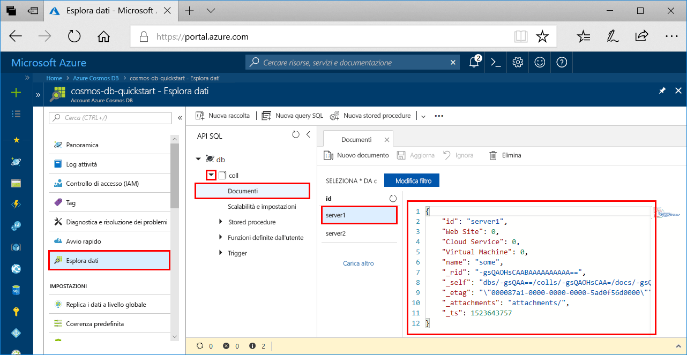

# <a name="azure-cosmos-db-build-a-sql-api-app-with-python-and-the-azure-portal"></a>Azure Cosmos DB: Creare un'app per le API SQL con Python e il portale di Azure

> [!div class="op_single_selector"]
> * [.NET](create-sql-api-dotnet.md)
> * [.NET (Preview)](create-sql-api-dotnet-preview.md)
> * [Java](create-sql-api-java.md)
> * [Node.js](create-sql-api-nodejs.md)
> * [Python](create-sql-api-python.md)
> * [Xamarin](create-sql-api-xamarin-dotnet.md)
>  

Azure Cosmos DB è il servizio di database di Microsoft multimodello distribuito a livello globale. È possibile creare ed eseguire rapidamente query su database di documenti, coppie chiave-valore e grafi, sfruttando in ognuno dei casi i vantaggi offerti dalle funzionalità di scalabilità orizzontale e distribuzione globale alla base di Azure Cosmos DB. 

Questa guida introduttiva illustra come creare un account dell'[API SQL](sql-api-introduction.md) di Azure Cosmos DB, un database di documenti e un contenitore usando il portale di Azure. Quindi, si creerà ed eseguirà un'app console creata con Python SDK per [API SQL](sql-api-sdk-python.md). Questa guida introduttiva usa la versione 3.0 del [Python SDK]. (https://pypi.org/project/azure-cosmos)

[!INCLUDE [quickstarts-free-trial-note](../../includes/quickstarts-free-trial-note.md)] [!INCLUDE [cosmos-db-emulator-docdb-api](../../includes/cosmos-db-emulator-docdb-api.md)]

## <a name="prerequisites"></a>Prerequisiti

* [Python 3.6](https://www.python.org/downloads/) con \<percorso di installazione\>\Python36 e \<percorso di installazione>\Python36\Scripts aggiunti al PERCORSO. 
* [Visual Studio Code](https://code.visualstudio.com/)
* [Estensione di Python per Visual Studio Code](https://marketplace.visualstudio.com/items?itemName=ms-python.python#overview)

## <a name="create-a-database-account"></a>Creare un account di database

[!INCLUDE [cosmos-db-create-dbaccount](../../includes/cosmos-db-create-dbaccount.md)]

## <a name="add-a-collection"></a>Aggiungere una raccolta

[!INCLUDE [cosmos-db-create-collection](../../includes/cosmos-db-create-collection.md)]

## <a name="add-sample-data"></a>Aggiungere dati di esempio

[!INCLUDE [cosmos-db-create-sql-api-add-sample-data](../../includes/cosmos-db-create-sql-api-add-sample-data.md)]

## <a name="query-your-data"></a>Eseguire query sui dati

[!INCLUDE [cosmos-db-create-sql-api-query-data](../../includes/cosmos-db-create-sql-api-query-data.md)]

## <a name="clone-the-sample-application"></a>Clonare l'applicazione di esempio

Clonare ora un'app per le API SQL da GitHub, impostare la stringa di connessione ed eseguirla.

1. Aprire un prompt dei comandi, creare una nuova cartella denominata git-samples e quindi chiudere il prompt dei comandi.

    ```bash
    md "C:\git-samples"
    ```

2. Aprire una finestra del terminale Git, ad esempio Git Bash, ed eseguire il comando `cd` per passare a una nuova cartella in cui installare l'app di esempio.

    ```bash
    cd "C:\git-samples"
    ```

3. Eseguire il comando seguente per clonare l'archivio di esempio. Questo comando crea una copia dell'app di esempio nel computer in uso. 

    ```bash
    git clone https://github.com/Azure-Samples/azure-cosmos-db-python-getting-started.git
    ```  
    
## <a name="review-the-code"></a>Esaminare il codice

Questo passaggio è facoltativo. Per scoprire in che modo le risorse del database vengono create nel codice, è possibile esaminare i frammenti di codice seguenti. In alternativa, è possibile passare ad [Aggiornare la stringa di connessione](#update-your-connection-string). 

Si noti che, se si ha familiarità con la versione precedente di Python SDK, ci si potrebbe aspettare di vedere termini come "raccolta" e "documento". Poiché Azure Cosmos DB supporta più modelli di API, nella versione 3.0+ di Python SDK vengono usati i termini generici "contenitore", che può essere una raccolta, un grafo o una tabella, ed "elemento" per descrivere il contenuto del contenitore.

Tutti i frammenti di codice seguenti sono tratti dal file `CosmosGetStarted.py`.

* Viene inizializzato CosmosClient.

    ```python
    # Initialize the Cosmos client
    client = cosmos_client.CosmosClient(url_connection=config['ENDPOINT'], auth={'masterKey': config['MASTERKEY']})
    ```

* Viene creato un nuovo database.

    ```python
    # Create a database
    db = client.CreateDatabase({ 'id': config['DATABASE'] })
    ```

* Viene creata una nuova raccolta.

    ```python
    # Create collection options
    options = {
        'offerThroughput': 400
    }

    # Create a container
    container = client.CreateContainer(db['_self'], container_definition, options)
    ```

* Alcuni elementi vengono aggiunti al contenitore.

    ```python
    # Create and add some items to the container
    item1 = client.CreateItem(container['_self'], {
        'serverId': 'server1',
        'Web Site': 0,
        'Cloud Service': 0,
        'Virtual Machine': 0,
        'message': 'Hello World from Server 1!'
        }
    )

    item2 = client.CreateItem(container['_self'], {
        'serverId': 'server2',
        'Web Site': 1,
        'Cloud Service': 0,
        'Virtual Machine': 0,
        'message': 'Hello World from Server 2!'
        }
    )
    ```

* Viene eseguita una query con SQL

    ```python
    query = {'query': 'SELECT * FROM server s'}

    options = {}
    options['enableCrossPartitionQuery'] = True
    options['maxItemCount'] = 2

    result_iterable = client.QueryItems(container['_self'], query, options)
    for item in iter(result_iterable):
        print(item['message'])
    ```

## <a name="update-your-connection-string"></a>Aggiornare la stringa di connessione

Tornare ora al portale di Azure per recuperare le informazioni sulla stringa di connessione e copiarle nell'app.

1. Nell'account Azure Cosmos DB nel [portale di Azure](https://portal.azure.com/) nel riquadro di spostamento a sinistra fare clic su **Chiavi**. Usare i pulsanti di copia sul lato destro dello schermo per copiare **URI** e **Chiave primaria** nel file `CosmosGetStarted.py` nel passaggio seguente.

    

2. Aprire il file `CosmosGetStarted.py` in C:\git-samples\azure-cosmos-db-python-getting-started in Visual Studio Code.

3. Copiare il valore di **URI** dal portale (usando il pulsante di copia) e impostarlo come valore della **chiave di endpoint** in ``CosmosGetStarted.py``. 

    `'ENDPOINT': 'https://FILLME.documents.azure.com',`

4. Copiare quindi il valore di **CHIAVE PRIMARIA** dal portale e impostarlo come valore di **config.PRIMARYKEY** in ``CosmosGetStarted.py``. L'app è stata aggiornata con tutte le informazioni necessarie per comunicare con Azure Cosmos DB. 

    `'PRIMARYKEY': 'FILLME',`

5. Salvare il file.``CosmosGetStarted.py``
    
## <a name="run-the-app"></a>Esecuzione dell'app

1. In Visual Studio Code selezionare **Visualizza**>**Riquadro comandi**. 

2. Al prompt immettere **Python: Select Interpreter** e quindi selezionare la versione di Python da usare.

    Il piè di pagina in Visual Studio Code viene aggiornato per indicare l'interprete selezionato. 

3. Selezionare **Visualizza** > **Terminale integrato** per aprire il terminale integrato di Visual Studio Code.

4. Nella finestra del terminale integrato, verificare di essere nella cartella azure-cosmos-db-python-getting-started. In caso contrario, eseguire il comando seguente per passare alla cartella di esempio. 

    ```
    cd "C:\git-samples\azure-cosmos-db-python-getting-started"`
    ```

5. Eseguire il seguente comando per installare il pacchetto azure-cosmos. 

    ```
    pip3 install azure-cosmos
    ```

    Se si riceve un errore di accesso negato durante il tentativo di installazione azure-cosmos, sarà necessario [eseguire VS Code come amministratore](https://stackoverflow.com/questions/37700536/visual-studio-code-terminal-how-to-run-a-command-with-administrator-rights).

6. Eseguire il comando seguente per eseguire l'esempio e creare e archiviare nuovi documenti in Azure Cosmos DB.

    ```
    python CosmosGetStarted.py
    ```

7. Per verificare che i nuovi elementi siano stati creati e salvati, nel portale di Azure selezionare **Esplora dati**, espandere **coll**, espandere **Documenti** e quindi selezionare il documento **server1**. Il contenuto del documento server1 corrisponde al contenuto restituito nella finestra del terminale integrato. 

    

## <a name="review-slas-in-the-azure-portal"></a>Esaminare i contratti di servizio nel portale di Azure

[!INCLUDE [cosmosdb-tutorial-review-slas](../../includes/cosmos-db-tutorial-review-slas.md)]

## <a name="clean-up-resources"></a>Pulire le risorse

[!INCLUDE [cosmosdb-delete-resource-group](../../includes/cosmos-db-delete-resource-group.md)]

## <a name="next-steps"></a>Passaggi successivi

In questa guida di avvio rapido si è appreso come creare un account Azure Cosmos DB, come creare una raccolta con Esplora dati e come eseguire un'app. È ora possibile importare dati aggiuntivi nell'account Cosmos DB. 

> [!div class="nextstepaction"]
> [Importare dati in Azure Cosmos DB per l'API SQL](import-data.md)


