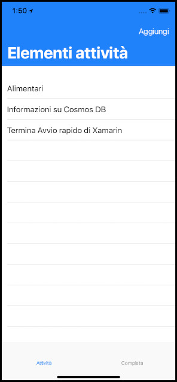
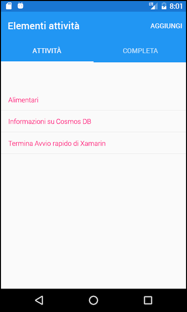
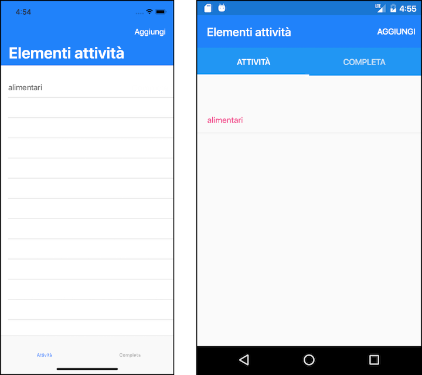
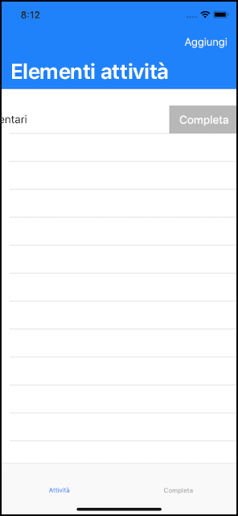
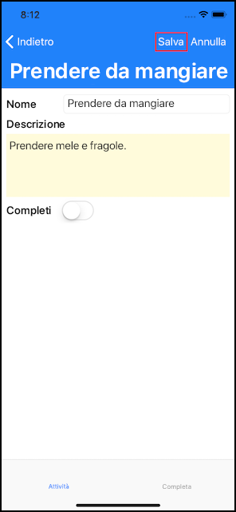
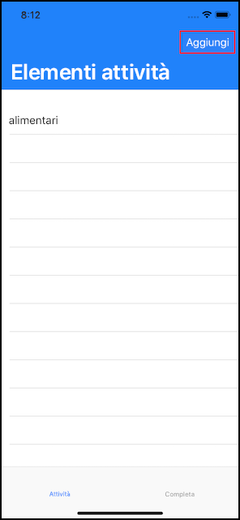

# <a name="quickstart-build-a-todo-app-with-xamarin-using-azure-cosmos-db-sql-api-account"></a>Guida introduttiva: Compilare un'app ToDo con Xamarin usando un account API SQ di Azure Cosmos DB

> [!div class="op_single_selector"]
> * [.NET](create-sql-api-dotnet.md)
> * [.NET (Preview)](create-sql-api-dotnet-preview.md)
> * [Java](create-sql-api-java.md)
> * [Node.js](create-sql-api-nodejs.md)
> * [Python](create-sql-api-python.md)
> * [Xamarin](create-sql-api-xamarin-dotnet.md)
>  

Azure Cosmos DB è il servizio di database di Microsoft multimodello distribuito a livello globale. È possibile creare ed eseguire rapidamente query su database di documenti, coppie chiave-valore e grafi, sfruttando in ognuno dei casi i vantaggi offerti dalle funzionalità di scalabilità orizzontale e distribuzione globale alla base di Azure Cosmos DB.

> [!NOTE]
> Il codice di esempio per un'intera app Xamarin canonica di esempio che include più offerte di Azure, tra cui CosmosDB, è disponibile in GitHub [qui](https://github.com/xamarinhq/app-geocontacts). Questa app offre una dimostrazione della visualizzazione di contatti in località geografiche diverse e di come consentire a tali contatti di aggiornare la propria posizione.

Questa guida introduttiva mostra come creare un account dell'API SQL di Azure Cosmos DB, un database di documenti e una raccolta di Azure Cosmos DB usando il portale di Azure. Verrà quindi creata e distribuita un'app Web ToDo basata sull'[API .NET SQL](sql-api-sdk-dotnet.md) e [Xamarin](https://docs.microsoft.com/xamarin/) tramite [Xamarin.Forms](https://docs.microsoft.com/xamarin/) e il [modello architettonico MVVM](https://docs.microsoft.com/xamarin/xamarin-forms/xaml/xaml-basics/data-bindings-to-mvvm).



## <a name="prerequisites"></a>Prerequisiti

Se si esegue lo sviluppo in Windows e Visual Studio 2019 non è ancora installato, è possibile scaricare e usare l'edizione **gratuita** [Visual Studio 2019 Community Edition](https://www.visualstudio.com/downloads/). Durante l'installazione di Visual Studio abilitare i carichi di lavoro **Sviluppo di Azure** e **Sviluppo di applicazioni per dispositivi mobili con .NET**.

Se si usa un computer Mac, è possibile scaricare la versione **gratuita** di [Visual Studio per Mac](https://www.visualstudio.com/vs/mac/).

[!INCLUDE [quickstarts-free-trial-note](../../includes/quickstarts-free-trial-note.md)]
[!INCLUDE [cosmos-db-emulator-docdb-api](../../includes/cosmos-db-emulator-docdb-api.md)]

## <a name="create-a-database-account"></a>Creare un account di database

[!INCLUDE [cosmos-db-create-dbaccount](../../includes/cosmos-db-create-dbaccount.md)]

## <a name="add-a-container"></a>Aggiungere un contenitore

[!INCLUDE [cosmos-db-create-collection](../../includes/cosmos-db-create-collection.md)]

## <a name="add-sample-data"></a>Aggiungere dati di esempio

[!INCLUDE [cosmos-db-create-sql-api-add-sample-data](../../includes/cosmos-db-create-sql-api-add-sample-data.md)]

## <a name="query-your-data"></a>Eseguire query sui dati

[!INCLUDE [cosmos-db-create-sql-api-query-data](../../includes/cosmos-db-create-sql-api-query-data.md)]

## <a name="clone-the-sample-application"></a>Clonare l'applicazione di esempio

È ora possibile clonare l'app per le API SQL Xamarin da GitHub, verificare il codice, ottenere le chiavi API ed eseguirla. Come si noterà, è facile usare i dati a livello di codice.

1. Aprire un prompt dei comandi, creare una nuova cartella denominata git-samples e quindi chiudere il prompt dei comandi.

    ```bash
    md "C:\git-samples"
    ```

2. Aprire una finestra del terminale Git, ad esempio Git Bash, ed eseguire il comando `cd` per passare a una nuova cartella in cui installare l'app di esempio.

    ```bash
    cd "C:\git-samples"
    ```

3. Eseguire il comando seguente per clonare l'archivio di esempio. Questo comando crea una copia dell'app di esempio nel computer in uso.

    ```bash
    git clone https://github.com/Azure-Samples/azure-cosmos-db-sql-xamarin-getting-started.git
    ```

4. Aprire quindi il file ToDoItems.sln dalla cartella samples/xamarin/ToDoItems in Visual Studio.

## <a name="obtain-your-api-keys"></a>Ottenere le chiavi API

Tornare al portale di Azure per recuperare le informazioni sulla chiave API e copiarla nell'app.

1. Nel [portale di Azure](https://portal.azure.com/) selezionare l'account dell'API SQL di Azure Cosmos DB e nel riquadro di spostamento a sinistra fare clic su **Chiavi** e quindi su **Chiavi di lettura/scrittura**. Usare i pulsanti di copia sul lato destro dello schermo per copiare l'URI e la chiave primaria nel file APIKeys.cs nel passaggio seguente.

    

2. In Visual Studio 2019 o Visual Studio per Mac aprire il file APIKeys.cs nella cartella azure-documentdb-dotnet/samples/xamarin/ToDoItems/ToDoItems.Core/Helpers.

3. Copiare il valore di URI dal portale (usando il pulsante di copia) e impostarlo come valore della variabile `CosmosEndpointUrl` in APIKeys.cs.

    `public static readonly string CosmosEndpointUrl = "{Azure Cosmos DB account URL}";`

4. Copiare quindi il valore di CHIAVE PRIMARIA dal portale e impostarlo come valore di `Cosmos Auth Key` in APIKeys.cs.

    `public static readonly string CosmosAuthKey = "{Azure Cosmos DB secret}";`

[!INCLUDE [cosmos-db-auth-key-info](../../includes/cosmos-db-auth-key-info.md)]

## <a name="review-the-code"></a>Esaminare il codice

Questa soluzione illustra come creare un'app usando l'API SQL di Azure Cosmos DB e Xamarin.Forms. L'app ha due schede. La prima scheda contiene una visualizzazione elenco che mostra gli elementi ToDo non ancora completati. La seconda scheda mostra gli elementi ToDo completati. Oltre a visualizzare gli elementi ToDo completati nella prima scheda, è anche possibile aggiungere nuovi elementi ToDo, modificare gli elementi esistenti e contrassegnare gli elementi come completati.



Il codice nella soluzione ToDoItems contiene:

* ToDoItems.Core: si tratta di un progetto .NET Standard che include un progetto Xamarin.Forms e codice condiviso di logica dell'applicazione che gestisce gli elementi ToDo in Azure Cosmos DB.
* ToDoItems.Android: questo progetto contiene l'app Android.
* ToDoItems.iOS: questo progetto contiene l'app iOS.

È ora possibile esaminare rapidamente il modo in cui l'app comunica con Azure Cosmos DB.

* Il pacchetto NuGet [Microsoft.Azure.DocumentDb.Core](https://www.nuget.org/packages/Microsoft.Azure.DocumentDB.Core/) deve essere aggiunto a tutti i progetti.
* La classe `ToDoItem` nella cartella azure-documentdb-dotnet/samples/xamarin/ToDoItems/ToDoItems.Core/Models modella i documenti della raccolta **Items** creata in precedenza. Si noti che i nomi delle proprietà rispettano la distinzione tra maiuscole/minuscole.
* La classe `CosmosDBService` nella cartella azure-documentdb-dotnet/samples/xamarin/ToDoItems/ToDoItems.Core/Services incapsula le comunicazioni in Azure Cosmos DB.
* Entro la classe `CosmosDBService` è disponibile una variabile di tipo `DocumentClient`. Il valore `DocumentClient` viene usato per configurare ed eseguire le richieste nell'account Azure Cosmos DB e ne viene creata un'istanza alla riga 31:

    ```csharp
    docClient = new DocumentClient(new Uri(APIKeys.CosmosEndpointUrl), APIKeys.CosmosAuthKey);
    ```

* Quando si eseguono query su una raccolta per individuare documenti, viene usato il metodo `DocumentClient.CreateDocumentQuery<T>`, come illustrato nella funzione `CosmosDBService.GetToDoItems`:

    ```csharp
    public async static Task<List<ToDoItem>> GetToDoItems()
    {
        var todos = new List<ToDoItem>();

        var todoQuery = docClient.CreateDocumentQuery<ToDoItem>(
                                UriFactory.CreateDocumentCollectionUri(databaseName, collectionName),
                                .Where(todo => todo.Completed == false)
                                .AsDocumentQuery();

        while (todoQuery.HasMoreResults)
        {
            var queryResults = await todoQuery.ExecuteNextAsync<ToDoItem>();

            todos.AddRange(queryResults);
        }

        return todos;
    }
    ```

    `CreateDocumentQuery<T>` accetta un URI che fa riferimento alla raccolta creata nella sezione precedente. È anche possibile specificare operatori LINQ come una clausola `Where`. In questo caso vengono restituiti solo gli elementi ToDo non completati.

    La funzione `CreateDocumentQuery<T>` viene eseguita in modo sincrono e restituisce `IQueryable<T>`. Il metodo `AsDocumentQuery` tuttavia converte `IQueryable<T>` in un oggetto `IDocumentQuery<T>` che può essere eseguito in modalità sincrona, evitando quindi di bloccare il thread dell'interfaccia utente per le applicazioni per dispositivi mobili.

    La funzione `IDocumentQuery<T>.ExecuteNextAsync<T>` recupera la pagina di risultati da Azure Cosmos DB, che viene verificata da `HasMoreResults` per controllare se sono presenti altri risultati da restituire.

> [!TIP]
> Alcune funzioni che interagiscono con le raccolte e i documenti di Azure Cosmos DB accettano un URI come parametro che specifica l'indirizzo della raccolta o del documento. L'URI viene creato tramite la classe `URIFactory`. Gli URI per i database, le raccolte e i documenti possono essere creati con questa classe.

* La funzione `ComsmosDBService.InsertToDoItem` alla riga 107 illustra come inserire un nuovo documento:

    ```csharp
    public async static Task InsertToDoItem(ToDoItem item)
    {
        ...
        await docClient.CreateDocumentAsync(UriFactory.CreateDocumentCollectionUri(databaseName, collectionName), item);
        ...
    }
    ```

    L'URI della raccolta di documenti viene specificato insieme all'elemento da inserire.

* La funzione `CosmosDBService.UpdateToDoItem` alla riga 124 illustra come sostituire un documento esistente con un nuovo documento:

    ```csharp
    public async static Task UpdateToDoItem(ToDoItem item)
    {
        ...
        var docUri = UriFactory.CreateDocumentUri(databaseName, collectionName, item.Id);

        await docClient.ReplaceDocumentAsync(docUri, item);
    }
    ```

    In questo caso, per identificare in modo univoco il documento da sostituire, è necessario un nuovo URI, che si ottiene tramite l'uso di `UriFactory.CreateDocumentUri` e il passaggio dei nomi dei database e delle raccolte e dell'ID del documento.

    `DocumentClient.ReplaceDocumentAsync` sostituisce il documento identificato dall'URI con il documento specificato come parametro.

* L'eliminazione di un elemento viene illustrata dalla funzione `CosmosDBService.DeleteToDoItem` alla riga 115:

    ```csharp
    public async static Task DeleteToDoItem(ToDoItem item)
    {
        ...
        var docUri = UriFactory.CreateDocumentUri(databaseName, collectionName, item.Id);

        await docClient.DeleteDocumentAsync(docUri);
    }
    ```

    Si noti anche in questo caso l'URI del documento univoco creato e passato alla funzione `DocumentClient.DeleteDocumentAsync`.

## <a name="run-the-app"></a>Esecuzione dell'app

L'app è stata aggiornata con tutte le informazioni necessarie per comunicare con Azure Cosmos DB.

La procedura seguente illustrerà come eseguire l'app tramite il debugger di Visual Studio per Mac.

> [!NOTE]
> L'uso della versione dell'app per Android è esattamente uguale. Eventuali differenze verranno segnalate nella procedura seguente. Se si vuole eseguire il debug con Visual Studio su Windows, la documentazione sulle app ToDo è disponibile per [iOS qui](https://docs.microsoft.com/xamarin/ios/deploy-test/debugging-in-xamarin-ios?tabs=vswin) e per [Android qui](https://docs.microsoft.com/xamarin/android/deploy-test/debugging/).

1. Selezionare prima di tutto la piattaforma da specificare come destinazione facendo clic sull'elenco a discesa evidenziato e selezionando ToDoItems.iOS per iOS o ToDoItems.Android per Android.

    

2. Per avviare il debug dell'app, premere cmd+INVIO o fare clic sul pulsante di riproduzione.

    

3. Quando il simulatore di iOS o l'emulatore di Android completa l'avvio, l'app mostrerà due schede nella parte inferiore dello schermo per iOS e nella parte superiore dello schermo per Android. La prima scheda mostra gli elementi ToDo non ancora completati e la seconda gli elementi ToDo completati.

    

4. Per completare un elemento ToDo in iOS, scorrere verso sinistra > toccare il pulsante **Completa**. Per completare un elemento ToDo in Android, tenere premuto a lungo l'elemento > quindi toccare il pulsante Completa.

    

5. Per modificare un elemento ToDo > toccare l'elemento > viene visualizzata una nuova schermata che consente di immettere nuovi valori. Se si tocca il pulsante Salva verranno salvate in modo permanente le modifiche ad Azure Cosmos DB.

    

6. Per aggiungere un elemento ToDo > toccare il pulsante **Aggiungi** in alto a destra nella schermata iniziale > verrà visualizzata una nuova pagina di modifica vuota.

    

## <a name="review-slas-in-the-azure-portal"></a>Esaminare i contratti di servizio nel portale di Azure

[!INCLUDE [cosmosdb-tutorial-review-slas](../../includes/cosmos-db-tutorial-review-slas.md)]

## <a name="clean-up-resources"></a>Pulire le risorse

[!INCLUDE [cosmosdb-delete-resource-group](../../includes/cosmos-db-delete-resource-group.md)]

## <a name="next-steps"></a>Passaggi successivi

In questo argomento di avvio rapido si è appreso come creare un account Azure Cosmos, come creare un contenitore con Esplora dati e come creare e distribuire un'app Xamarin. È ora possibile importare dati aggiuntivi nell'account Azure Cosmos.

> [!div class="nextstepaction"]
> [Importare dati in Azure Cosmos DB](import-data.md)
