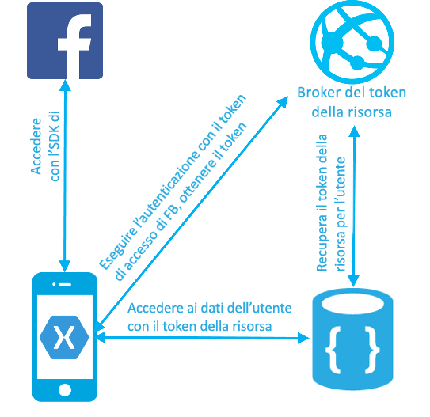
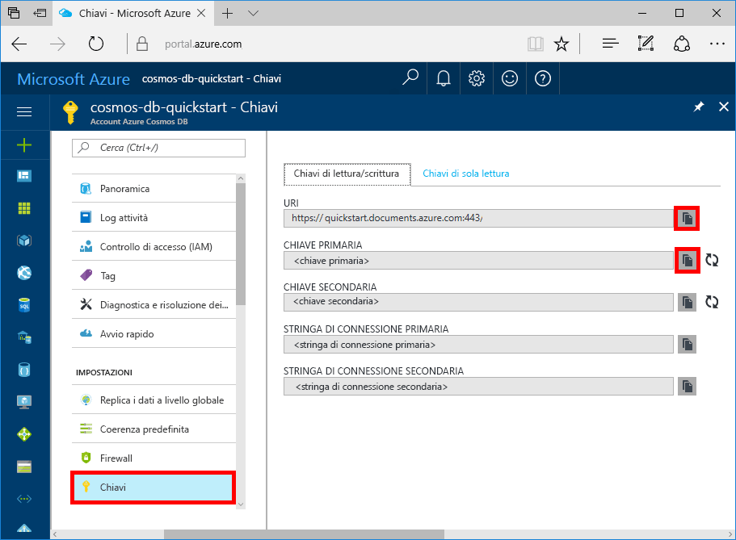

# <a name="azure-cosmos-db-build-a-web-app-with-net-xamarin-and-facebook-authentication"></a>Azure Cosmos DB: Creare un'app Web con .NET, Xamarin e l'autenticazione di Facebook

[!INCLUDE [cosmos-db-sql-api](../../includes/cosmos-db-sql-api.md)] 

Azure Cosmos DB è il servizio di database di Microsoft multimodello distribuito a livello globale. È possibile creare ed eseguire rapidamente query su database di documenti, coppie chiave-valore e grafi, sfruttando in ognuno dei casi i vantaggi offerti dalle funzionalità di scalabilità orizzontale e distribuzione globale alla base di Azure Cosmos DB. 

Questa guida di avvio rapido mostra come creare un account, un database di documenti e una raccolta di Azure Cosmos DB tramite il portale di Azure. Si creerà e distribuirà quindi l'app Web elenco attività basata sull'[API .NET SQL](sql-api-sdk-dotnet.md), su [Xamarin](https://www.xamarin.com/) e sul motore di autorizzazione di Azure Cosmos DB. L'app Web elenco attività implementa un modello di dati per utente che permette agli utenti di accedere tramite l'autenticazione di Facebook e gestire le proprie attività.

## <a name="prerequisites"></a>prerequisiti

Se Visual Studio 2017 non è ancora installato, è possibile scaricare e usare la versione **gratuita** [Visual Studio 2017 Community Edition](https://www.visualstudio.com/downloads/). Durante l'installazione di Visual Studio abilitare **Sviluppo di Azure**.

[!INCLUDE [quickstarts-free-trial-note](../../includes/quickstarts-free-trial-note.md)]
[!INCLUDE [cosmos-db-emulator-docdb-api](../../includes/cosmos-db-emulator-docdb-api.md)]

## <a name="create-a-database-account"></a>Creare un account di database

[!INCLUDE [cosmos-db-create-dbaccount](../../includes/cosmos-db-create-dbaccount.md)]

## <a name="add-a-collection"></a>Aggiungere una raccolta

[!INCLUDE [cosmos-db-create-collection](../../includes/cosmos-db-create-collection.md)]

## <a name="clone-the-sample-application"></a>Clonare l'applicazione di esempio

Clonare ora un'app per le API SQL da GitHub, impostare la stringa di connessione ed eseguirla. Come si noterà, è facile usare i dati a livello di codice. 

1. Aprire una finestra del terminale Git, ad esempio Git Bash, ed eseguire il comando `cd` per passare a una directory di lavoro.  

2. Eseguire il comando seguente per clonare l'archivio di esempio. 

    ```bash
    git clone https://github.com/Azure/azure-documentdb-dotnet.git
    ```

3. Aprire quindi il file DocumentDBTodo.sln dalla cartella samples/xamarin/UserItems/xamarin.forms in Visual Studio. 

## <a name="review-the-code"></a>Esaminare il codice

Il codice nella cartella di Xamarin contiene:

* App Xamarin. L'app archivia le attività dell'utente in una raccolta partizionata chiamata UserItems.
* API del gestore di token di risorsa. Semplice API Web ASP.NET per la gestione dei token di risorsa di Azure Cosmos DB per gli utenti connessi dell'app. I token di risorsa sono token di accesso di breve durata che forniscono all'app l'accesso ai dati dell'utente connesso.

L'autenticazione e il flusso di dati vengono mostrati nel diagramma seguente.

* La raccolta UserItems viene creata con la chiave di partizione '/userid'. Specificando una chiave di partizione per una raccolta, Azure Cosmos DB può ridimensionarsi in modo illimitato in base all'aumentare del numero di utenti ed elementi.
* L'app Xamarin permette agli utenti di accedere con le credenziali di Facebook.
* L'app Xamarin usa il token di accesso di Facebook per l'autenticazione con l'API ResourceTokenBroker
* L'API del gestore di token di risorsa autentica la richiesta tramite la funzionalità Autenticazione servizio app e richiede un token di risorsa di Azure Cosmos DB con accesso in lettura/scrittura a tutti i documenti che condividono la chiave di partizione dell'utente autenticato.
* Il gestore di token di risorsa restituisce il token di risorsa all'app client.
* L'app accede alle attività dell'utente usando il token di risorsa.


    
## <a name="update-your-connection-string"></a>Aggiornare la stringa di connessione

Tornare ora al portale di Azure per recuperare le informazioni sulla stringa di connessione e copiarle nell'app.

1. Nell'account Azure Cosmos DB nel [portale di Azure](http://portal.azure.com/) fare clic su **Chiavi** nel riquadro di spostamento a sinistra e quindi su **Chiavi di lettura/scrittura**. Usare i pulsanti di copia sul lato destro dello schermo per copiare l'URI e la chiave primaria nel file Web.config nel passaggio seguente.

    

2. In Visual Studio 2017 aprire il file Web.config nella cartella azure-documentdb-dotnet/samples/xamarin/UserItems/ResourceTokenBroker/ResourceTokenBroker. 

3. Copiare il valore di URI dal portale (usando il pulsante di copia) e impostarlo come valore di accountUrl in Web.config. 

    `<add key="accountUrl" value="{Azure Cosmos DB account URL}"/>`

4. Copiare quindi il valore di CHIAVE PRIMARIA dal portale e impostarlo come valore di accountKey in Web.config. 

    `<add key="accountKey" value="{Azure Cosmos DB secret}"/>`

L'app è stata aggiornata con tutte le informazioni necessarie per comunicare con Azure Cosmos DB. 

## <a name="build-and-deploy-the-web-app"></a>Creare e distribuire l'app Web

1. Nel portale di Azure creare il sito Web di un servizio app per ospitare l'API del gestore di token di risorsa.
2. Nel portale di Azure aprire il pannello Impostazioni app del sito Web dell'API del gestore di token di risorsa. Immettere le impostazioni dell'app seguenti:

    * accountUrl: URL dell'account Azure Cosmos DB impostato nella scheda Chiavi dell'account Azure Cosmos DB.
    * accountKey: chiave master dell'account Azure Cosmos DB impostato nella scheda Chiavi dell'account Azure Cosmos DB.
    * Valori di databaseId e collectionId del database e della raccolta creati

3. Pubblicare la soluzione ResourceTokenBroker nel sito Web creato.

4. Aprire il progetto Xamarin e passare a TodoItemManager.cs. Immettere i valori per accountURL, collectionId, databaseId, nonché per resourceTokenBrokerURL come URL HTTPS di base per il sito Web del gestore di token di risorsa.

5. Completare l'esercitazione [Come configurare un'applicazione del servizio App per usare l'account di accesso di Facebook](../app-service/app-service-mobile-how-to-configure-facebook-authentication.md) per configurare l'autenticazione di Facebook e il sito Web ResourceTokenBroker.

    Eseguire l'app Xamarin.

## <a name="review-slas-in-the-azure-portal"></a>Esaminare i contratti di servizio nel portale di Azure

[!INCLUDE [cosmosdb-tutorial-review-slas](../../includes/cosmos-db-tutorial-review-slas.md)]

## <a name="clean-up-resources"></a>Pulire le risorse

Se non si intende continuare a usare l'app, eliminare tutte le risorse create tramite questa guida di avvio rapido nel portale di Azure eseguendo questi passaggi: 

1. Scegliere **Gruppi di risorse** dal menu a sinistra del portale di Azure e quindi fare clic sul nome della risorsa appena creata. 
2. Nella pagina del gruppo di risorse fare clic su **Elimina**, digitare il nome della risorsa da eliminare nella casella di testo e quindi fare clic su **Elimina**.

## <a name="next-steps"></a>Passaggi successivi

In questa guida di avvio rapido si è appreso come creare un account Azure Cosmos DB, come creare una raccolta con Esplora dati e come creare e distribuire un'app Xamarin. È ora possibile importare dati aggiuntivi nell'account Cosmos DB. 

> [!div class="nextstepaction"]
> [Importare dati in Azure Cosmos DB](import-data.md)
