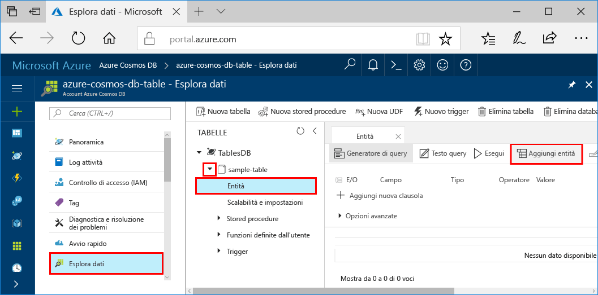

# <a name="azure-cosmos-db-build-a-net-application-using-the-table-api"></a>Azure Cosmos DB: Creare un'applicazione .NET tramite l'API di tabella

Azure Cosmos DB è il servizio di database multimodello distribuito a livello globale di Microsoft. È possibile creare ed eseguire rapidamente query su database di documenti, coppie chiave/valore e grafi, sfruttando in ognuno dei casi i vantaggi offerti dalle funzionalità di scalabilità orizzontale e distribuzione globale alla base di Azure Cosmos DB. 

Questa guida di avvio rapido mostra come creare un account Azure Cosmos DB e come creare una tabella nell'account tramite il portale di Azure. Si scriverà quindi il codice per inserire, aggiornare ed eliminare le entità, oltre che eseguire alcune query usando il nuovo pacchetto [Windows Azure Storage Premium Table](https://aka.ms/premiumtablenuget) disponibile su NuGet. Questa libreria include le stesse classi e firme di metodi disponibili nella versione pubblica di [Azure Storage SDK](https://www.nuget.org/packages/WindowsAzure.Storage), ma permette anche di connettersi agli account Azure Cosmos DB tramite l'[API di tabella](table-introduction.md) (anteprima). 

## <a name="prerequisites"></a>Prerequisiti

Se Visual Studio 2017 non è ancora installato, è possibile scaricare e usare la versione **gratuita** [Visual Studio 2017 Community Edition](https://www.visualstudio.com/downloads/). Durante l'installazione di Visual Studio abilitare **Sviluppo di Azure**.

[!INCLUDE [quickstarts-free-trial-note](../../includes/quickstarts-free-trial-note.md)]

## <a name="create-a-database-account"></a>Creare un account di database

[!INCLUDE [cosmos-db-create-dbaccount-table](../../includes/cosmos-db-create-dbaccount-table.md)]

## <a name="add-a-table"></a>Aggiungere una tabella

[!INCLUDE [cosmos-db-create-table](../../includes/cosmos-db-create-table.md)]

## <a name="add-sample-data"></a>Aggiungere dati di esempio

È ora possibile aggiungere dati alla nuova tabella usando Esplora dati (anteprima).

1. In Esplora dati espandere **sample-table**, fare clic su **Entità** e quindi su **Aggiungi entità**.

   
2. Aggiungere ora i dati alle caselle dei valori di PartitionKey e RowKey e quindi fare clic su **Aggiunti entità**.

   
  
    È ora possibile aggiungere altre entità alla tabella, modificare le entità o eseguire query sui dati in Esplora dati. Esplora dati è anche lo strumento in cui è possibile ridimensionare la velocità effettiva e aggiungere stored procedure, funzioni definite dall'utente e trigger alla tabella.

## <a name="clone-the-sample-application"></a>Clonare l'applicazione di esempio

A questo punto è possibile clonare un'app Table da GitHub, impostare la stringa di connessione ed eseguirla. Come si noterà, è facile usare i dati a livello di codice. 

1. Aprire una finestra del terminale Git, ad esempio Git Bash, ed eseguire il comando `cd` per passare a una directory di lavoro.  

2. Eseguire il comando seguente per clonare l'archivio di esempio. 

    ```bash
    git clone https://github.com/Azure-Samples/azure-cosmos-db-table-dotnet-getting-started.git
    ```

3. Aprire quindi il file della soluzione in Visual Studio. 

## <a name="review-the-code"></a>Esaminare il codice

Ecco una breve analisi di ciò che accade nell'app. Aprire il file Program.cs. Come si noterà, queste righe di codice creano le risorse di Azure Cosmos DB. 

* Viene inizializzato CloudTableClient.

    ```csharp
    CloudStorageAccount storageAccount = CloudStorageAccount.Parse(connectionString); 
    CloudTableClient tableClient = storageAccount.CreateCloudTableClient();
    ```

* Se non esiste, viene creata una nuova tabella.

    ```csharp
    CloudTable table = tableClient.GetTableReference("people");
    table.CreateIfNotExists();
    ```

* Viene eseguita una serie di passaggi sulla tabella usando la classe `TableOperation`.

   ```csharp
   TableOperation insertOperation = TableOperation.Insert(item);
   table.Execute(insertOperation);
   ```
   
   ```csharp
   TableOperation retrieveOperation = TableOperation.Retrieve<T>(items[i].PartitionKey, items[i].RowKey);
   table.Execute(retrieveOperation);
   ```
   
   ```csharp
   TableOperation deleteOperation = TableOperation.Delete(items[i]);
   table.Execute(deleteOperation);
   ```


## <a name="update-your-connection-string"></a>Aggiornare la stringa di connessione

Verranno ora aggiornate le informazioni sulla stringa di connessione, in modo che l'app possa comunicare con Azure Cosmos DB. 

1. In Visual Studio aprire il file app.config. 

2. Nel [portale di Azure](http://portal.azure.com/) nel menu di spostamento a sinistra di Azure Cosmos DB scegliere **Stringa di connessione**. Nel nuovo riquadro fare quindi clic sul pulsante Copia per la stringa di connessione. 

    

3. Incollare il valore nel file app.config come il valore di PremiumStorageConnectionString. 

    `<add key="PremiumStorageConnectionString" 
        value="DefaultEndpointsProtocol=https;AccountName=MYSTORAGEACCOUNT;AccountKey=AUTHKEY;TableEndpoint=https://COSMOSDB.documents.azure.com" />`    

    È possibile lasciare inalterato StandardStorageConnectionString.

L'app è stata aggiornata con tutte le informazioni necessarie per comunicare con Azure Cosmos DB. 

## <a name="run-the-console-app"></a>Eseguire l'app console

1. In Visual Studio fare clic con il pulsante destro del mouse sul progetto **PremiumTableGetStarted** in **Esplora soluzioni** e quindi scegliere **Gestisci pacchetti NuGet**. 

2. Nella casella **Sfoglia** di NuGet digitare *WindowsAzure.Storage-PremiumTable*.

3. Selezionare la casella **Includi versione preliminare**. 

4. Dai risultati installare la libreria **WindowsAzure.Storage-PremiumTable**. Viene installato il pacchetto dell'API di tabella di Azure Cosmos DB di anteprima, insieme a tutte le dipendenze. Si noti che si tratta di un pacchetto NuGet diverso rispetto al pacchetto di Archiviazione di Azure usato dall'archiviazione tabelle di Azure. 

5. Premere CTRL + F5 per eseguire l'applicazione.

    La finestra della console mostra i dati aggiunti, recuperati, sottoposti a query, sostituiti ed eliminati dalla tabella. Al termine dello script, premere qualsiasi tasto per chiudere la finestra della console. 
    
    

6. Per visualizzare le nuove entità in Esplora dati, è sufficiente impostare come commento le righe 188-208 nel file program.cs, in modo che non vengano eliminate, quindi eseguire di nuovo l'esempio. 

    È ora possibile tornare a Esplora dati, fare clic su **Aggiorna**, espandere la tabella **people**, fare clic su **Entità** e infine usare i nuovi dati. 

    

## <a name="review-slas-in-the-azure-portal"></a>Esaminare i contratti di servizio nel portale di Azure

[!INCLUDE [cosmosdb-tutorial-review-slas](../../includes/cosmos-db-tutorial-review-slas.md)]

## <a name="clean-up-resources"></a>Pulire le risorse

Se non si intende continuare a usare l'app, eliminare tutte le risorse create tramite questa guida di avvio rapido nel portale di Azure eseguendo questi passaggi: 

1. Scegliere **Gruppi di risorse** dal menu a sinistra del portale di Azure e quindi fare clic sul nome della risorsa creata. 
2. Nella pagina del gruppo di risorse fare clic su **Elimina**, digitare il nome della risorsa da eliminare nella casella di testo e quindi fare clic su **Elimina**.

## <a name="next-steps"></a>Passaggi successivi

In questa guida di avvio rapido si è appreso come creare un account Azure Cosmos DB, come creare una tabella con Esplora dati e come eseguire un'app.  È ora possibile eseguire query sui dati tramite l'API di tabella.  

> [!div class="nextstepaction"]
> [Eseguire query tramite l'API di tabella](tutorial-query-table.md)

