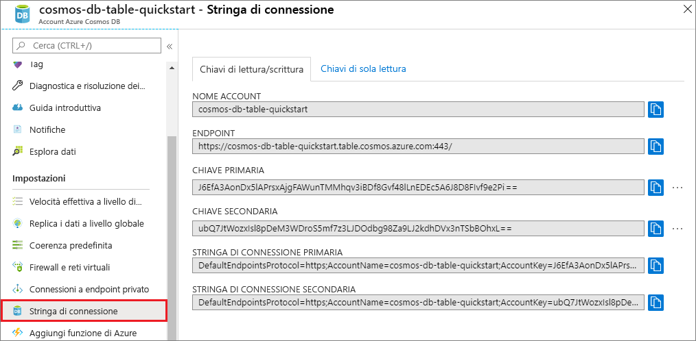

# <a name="quickstart-build-a-table-api-app-with-python-and-azure-cosmos-db"></a>Guida introduttiva: Creare un'app dell'API Tabella con Python e Azure Cosmos DB

> [!div class="op_single_selector"]
> * [.NET](create-table-dotnet.md)
> * [Java](create-table-java.md)
> * [Node.js](create-table-nodejs.md)
> * [Python](create-table-python.md)
> 

In questa guida di avvio rapido si crea e si gestisce un account dell'API Tabella di Azure Cosmos DB dal portale di Azure, nonché da Visual Studio con un'app Python clonata da GitHub. Azure Cosmos DB è un servizio di database modello che consente di creare ed eseguire rapidamente query su database di documenti, tabelle, valori chiave e grafi, con funzionalità di scalabilità orizzontale e distribuzione globale.

## <a name="prerequisites"></a>Prerequisiti

- Un account Azure con una sottoscrizione attiva. [È possibile crearne uno gratuitamente](https://azure.microsoft.com/free/?ref=microsoft.com&utm_source=microsoft.com&utm_medium=docs&utm_campaign=visualstudio). In alternativa, è possibile [provare gratuitamente Azure Cosmos DB](https://azure.microsoft.com/try/cosmosdb/) senza una sottoscrizione di Azure. È anche possibile usare l'[Emulatore di Azure Cosmos DB](https://aka.ms/cosmosdb-emulator) con l'URI `https://localhost:8081` e la chiave `C2y6yDjf5/R+ob0N8A7Cgv30VRDJIWEHLM+4QDU5DE2nQ9nDuVTqobD4b8mGGyPMbIZnqyMsEcaGQy67XIw/Jw==`.
- [Visual Studio 2019](https://www.visualstudio.com/downloads/), con i carichi di lavoro **Sviluppo di Azure** e **Sviluppo Python** selezionati durante l'installazione. 
- [Git](https://git-scm.com/downloads).

## <a name="create-a-database-account"></a>Creare un account di database

> [!IMPORTANT] 
> Per lavorare con gli SDK dell'API di tabella disponibili a livello generale, è necessario creare un nuovo account dell'API di tabella. Gli account dell'API di tabella creati durante l'anteprima non sono supportati dagli SDK disponibili a livello generale.
>

[!INCLUDE [cosmos-db-create-dbaccount-table](../../includes/cosmos-db-create-dbaccount-table.md)]

## <a name="add-a-table"></a>Aggiungere una tabella

[!INCLUDE [cosmos-db-create-table](../../includes/cosmos-db-create-table.md)]

## <a name="add-sample-data"></a>Aggiungere dati di esempio

[!INCLUDE [cosmos-db-create-table-add-sample-data](../../includes/cosmos-db-create-table-add-sample-data.md)]

## <a name="clone-the-sample-application"></a>Clonare l'applicazione di esempio

A questo punto è possibile clonare un'app Table da GitHub, impostare la stringa di connessione ed eseguirla. Come si noterà, è facile usare i dati a livello di codice. 

1. Aprire un prompt dei comandi, creare una nuova cartella denominata git-samples e quindi chiudere il prompt dei comandi.

    ```bash
    md "C:\git-samples"
    ```

2. Aprire una finestra del terminale Git, ad esempio Git Bash, ed eseguire il comando `cd` per passare a una nuova cartella in cui installare l'app di esempio.

    ```bash
    cd "C:\git-samples"
    ```

3. Eseguire il comando seguente per clonare l'archivio di esempio. Questo comando crea una copia dell'app di esempio nel computer in uso. 

    ```bash
    git clone https://github.com/Azure-Samples/storage-python-getting-started.git
    ```

3. Aprire quindi il file della soluzione in Visual Studio. 

> ![SUGGERIMENTO] Per una procedura dettagliata più completa con codice simile, vedere l'articolo relativo all'[esempio di API Tabella di Cosmos DB](table-storage-how-to-use-python.md).

## <a name="update-your-connection-string"></a>Aggiornare la stringa di connessione

Tornare ora al portale di Azure per recuperare le informazioni sulla stringa di connessione e copiarle nell'app. Questo consente all'app di comunicare con il database ospitato. 

1. Nell'account Azure Cosmos DB nel [portale di Azure](https://portal.azure.com/) selezionare **Stringa di connessione**. 

    

2. Copiare il NOME DELL'ACCOUNT usando il pulsante a destra.

3. Aprire il file *config.py* e incollare il valore di NOME ACCOUNT del portale nel valore di STORAGE_ACCOUNT_NAME nella riga 19.

4. Tornare al portale e copiare la CHIAVE PRIMARIA.

5. Incollare la CHIAVE PRIMARIA dal portale nel valore STORAGE_ACCOUNT_KEY sulla riga 20.

6. Salvare il file *config.py*.

## <a name="run-the-app"></a>Eseguire l'app

1. In Visual Studio fare clic con il pulsante destro del mouse sul progetto in **Esplora soluzioni**.

2. Selezionare l'ambiente Python corrente e quindi fare clic con il pulsante destro del mouse.

2. Scegliere *Installa pacchetto Python* e quindi immettere **azure-storage-table**.

3. Premere F5 per eseguire l'applicazione. L'app viene visualizzata nel browser. 

È ora possibile tornare a Esplora dati e visualizzare, modificare e usare questi nuovi dati, nonché eseguire query su di essi. 

## <a name="review-slas-in-the-azure-portal"></a>Esaminare i contratti di servizio nel portale di Azure

[!INCLUDE [cosmosdb-tutorial-review-slas](../../includes/cosmos-db-tutorial-review-slas.md)]

## <a name="clean-up-resources"></a>Pulire le risorse

[!INCLUDE [cosmosdb-delete-resource-group](../../includes/cosmos-db-delete-resource-group.md)]

## <a name="next-steps"></a>Passaggi successivi

In questa guida di avvio rapido si è appreso come creare un account Azure Cosmos DB, come creare una tabella con Esplora dati e come eseguire un'app Python in Visual Studio per aggiungere i dati della tabella.  È ora possibile eseguire query sui dati tramite l'API di tabella.  

> [!div class="nextstepaction"]
> [Importare i dati delle tabelle nell'API Tabelle](table-import.md)
