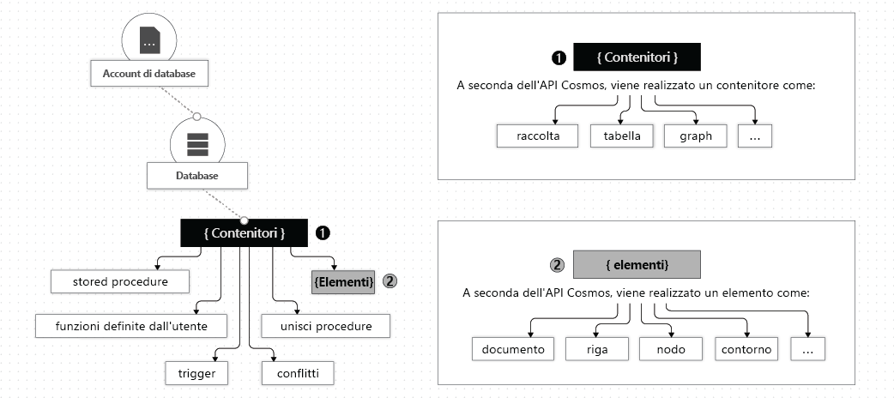

# Utilizzare database, contenitori ed elementi in Azure Cosmos DB

Dopo aver creato un [account Azure Cosmos DB](account-overview.md) nella sottoscrizione di Azure, è possibile gestire i dati nell'account creando database, contenitori ed elementi. Questo articolo descrive ognuna di queste entità. 

Nell'immagine seguente viene illustrata la gerarchia di entità diverse in un account Azure Cosmos DB:

## Database Azure Cosmos DB

È possibile creare uno o più database di Azure Cosmos nell'account. Un database è analogo a uno spazio dei nomi. Un database è l'unità di gestione per un set di contenitori di Azure Cosmos. La tabella seguente illustra il mapping di un database Azure Cosmos DB a varie entità specifiche dell'API:

| Entità di Azure Cosmos | API SQL | API Cassandra | API Azure Cosmos DB per MongoDB | API Gremlin | API di tabella |
| --- | --- | --- | --- | --- | --- |
|Database Azure Cosmos DB | Database | Keyspace | Database | Database | ND |

> [!NOTE]
> Con API Tabella account, quando si crea la prima tabella, viene creato automaticamente un database predefinito nell'account Azure Cosmos.

### Operazioni su un database Azure Cosmos DB

È possibile interagire con un database di Azure Cosmos con Azure Cosmos API, come descritto nella tabella seguente:

| Operazione | Interfaccia della riga di comando di Azure | API SQL | API Cassandra | API Azure Cosmos DB per MongoDB | API Gremlin | API di tabella |
| --- | --- | --- | --- | --- | --- | --- |
|Enumerare tutti i database| Sì | Sì | Sì (il database è mappato a un keyspace) | Sì | ND | ND |
|Leggere il database| Sì | Yes | Sì (il database è mappato a un keyspace) | Sì | ND | ND |
|Crea nuovo database| Yes | Yes | Sì (il database è mappato a un keyspace) | Sì | ND | ND |
|Aggiornare il database| Yes | Sì | Sì (il database è mappato a un keyspace) | Sì | ND | ND |

## Contenitori Azure Cosmos DB

Un contenitore di Azure Cosmos è l'unità di scalabilità per la velocità effettiva e l'archiviazione con provisioning. Un contenitore viene partizionato orizzontalmente e successivamente replicato in più aree. Gli elementi che si aggiungono al contenitore e la velocità effettiva con provisioning vengono automaticamente distribuiti in un set di partizioni logiche basato su una chiave di partizione. Per altre informazioni sul partizionamento e sulle chiavi di partizione, vedere [partizionare i dati](partition-data.md). 

Quando si crea un contenitore di Azure Cosmos, la velocità effettiva viene configurata in una delle modalità seguenti:

* **Modalità di velocità effettiva con provisioning dedicato**: La velocità effettiva di cui è stato effettuato il provisioning in un contenitore è riservata esclusivamente al contenitore ed è supportata dai contratti di contratto. Per altre informazioni, vedere [come eseguire il provisioning della velocità effettiva in un contenitore di Azure Cosmos](how-to-provision-container-throughput.md).

* **Modalità di velocità effettiva con provisioning condiviso**: Questi contenitori condividono la velocità effettiva con provisioning con gli altri contenitori nello stesso database, esclusi i contenitori che sono stati configurati con una velocità effettiva con provisioning dedicata. In altre parole, la velocità effettiva con provisioning nel database viene condivisa tra tutti i contenitori "velocità effettiva condivisa". Per altre informazioni, vedere [come eseguire il provisioning della velocità effettiva in un database di Azure Cosmos](how-to-provision-database-throughput.md).

> [!NOTE]
> È possibile configurare la velocità effettiva condivisa e dedicata solo quando si creano il database e il contenitore. Per passare dalla modalità velocità effettiva dedicata alla modalità velocità effettiva condivisa (e viceversa) dopo la creazione del contenitore, è necessario creare un nuovo contenitore ed eseguire la migrazione dei dati nel nuovo contenitore. È possibile eseguire la migrazione dei dati tramite la funzionalità Azure Cosmos DB feed delle modifiche.

Un contenitore Azure Cosmos può essere ridimensionato in modo elastico, indipendentemente dal fatto che i contenitori vengano creati usando modalità di velocità effettiva con provisioning dedicato o condiviso.

Un contenitore Azure Cosmos DB è un contenitore di elementi completamente senza schema. Gli elementi in un contenitore possono avere schemi arbitrari. Ad esempio, un elemento che rappresenta una persona e un elemento che rappresenta un'automobile può essere inserito nello *stesso contenitore*. Per impostazione predefinita, tutti gli elementi aggiunti a un contenitore vengono indicizzati automaticamente senza richiedere la gestione esplicita di indici o schemi. È possibile personalizzare il comportamento di indicizzazione configurando i [criteri di indicizzazione](index-overview.md) in un contenitore. 

È possibile impostare la [durata (TTL)](time-to-live.md) per gli elementi selezionati in un contenitore Azure Cosmos o per l'intero contenitore per eliminare normalmente tali elementi dal sistema. Azure Cosmos DB Elimina automaticamente gli elementi alla scadenza. Garantisce inoltre che una query eseguita sul contenitore non restituisca gli elementi scaduti in un limite fisso. Per altre informazioni, vedere [configurare la durata (TTL) nel contenitore](how-to-time-to-live.md).

È possibile usare il [feed delle modifiche](change-feed.md) per sottoscrivere il log operazioni gestito per ogni partizione logica del contenitore. Il feed di modifiche fornisce il log di tutti gli aggiornamenti eseguiti sul contenitore, insieme alle immagini before e After degli elementi. Per altre informazioni, vedere [compilare applicazioni reattive usando il feed di modifiche](serverless-computing-database.md). È anche possibile configurare la durata di conservazione per il feed delle modifiche usando i criteri del feed delle modifiche nel contenitore. 

È possibile registrare [stored procedure, trigger, funzioni definite dall'utente (UDF)](stored-procedures-triggers-udfs.md)e [procedure di merge](how-to-manage-conflicts.md) per il contenitore di Azure Cosmos. 

È possibile specificare un [vincolo di chiave univoca](unique-keys.md) nel contenitore di Azure Cosmos. Se si crea una chiave univoca, si ha la sicurezza che uno o più valori siano univoci per ogni chiave di partizione logica. Se si crea un contenitore usando un criterio di chiave univoca, non è possibile creare elementi nuovi o aggiornati con valori che duplicano i valori specificati dal vincolo di chiave univoca. Per altre informazioni, vedere [Unique key constraints](unique-keys.md) (Vincoli di chiave univoca).

Un contenitore di Azure Cosmos è specializzato in entità specifiche dell'API, come illustrato nella tabella seguente:

| Entità di Azure Cosmos | API SQL | API Cassandra | API Azure Cosmos DB per MongoDB | API Gremlin | API di tabella |
| --- | --- | --- | --- | --- | --- |
|Contenitore Azure Cosmos DB | Contenitore | Tabella | Collection | Grafico | Tabella |

### Proprietà di un contenitore Azure Cosmos DB

Un contenitore di Azure Cosmos dispone di un set di proprietà definite dal sistema. A seconda dell'API usata, alcune proprietà potrebbero non essere direttamente esposte. Nella tabella seguente viene descritto l'elenco delle proprietà definite dal sistema:

| Proprietà definita dal sistema | Generato dal sistema o configurabile dall'utente | Scopo | API SQL | API Cassandra | API Azure Cosmos DB per MongoDB | API Gremlin | API di tabella |
| --- | --- | --- | --- | --- | --- | --- | --- |
|\_id | Generato dal sistema | Identificatore univoco di contenitore | Sì | No | No | No | No |
|\_ETag | Generato dal sistema | Tag di entità usato per il controllo della concorrenza ottimistica | Sì | No | No | No | No |
|\_ts | Generato dal sistema | Ultimo timestamp aggiornato del contenitore | Yes | No | No | No | No |
|\_auto | Generato dal sistema | URI indirizzabile del contenitore | Sì | No | No | No | No |
|id | Configurabile dall'utente | Nome univoco definito dall'utente del contenitore | Yes | Sì | Sì | Sì | Yes |
|indexingPolicy | Configurabile dall'utente | Consente di modificare il percorso dell'indice, il tipo di indice e la modalità di indice | Yes | No | No | No | Sì |
|TimeToLive | Configurabile dall'utente | Consente di eliminare automaticamente gli elementi da un contenitore dopo un determinato periodo di tempo. Per informazioni dettagliate, vedere [durata (TTL](time-to-live.md)). | Sì | No | No | No | Sì |
|changeFeedPolicy | Configurabile dall'utente | Usato per leggere le modifiche apportate a elementi in un contenitore. Per informazioni dettagliate, vedere [feed di modifiche](change-feed.md). | Yes | No | No | No | Sì |
|uniqueKeyPolicy | Configurabile dall'utente | Utilizzato per garantire l'univocità di uno o più valori in una partizione logica. Per altre informazioni, vedere [vincoli di chiave univoca](unique-keys.md). | Yes | No | No | No | Yes |

### Operazioni su un contenitore Azure Cosmos DB

Un contenitore di Azure Cosmos supporta le operazioni seguenti quando si usa una delle API di Azure Cosmos:

| Operazione | Interfaccia della riga di comando di Azure | API SQL | API Cassandra | API Azure Cosmos DB per MongoDB | API Gremlin | API di tabella |
| --- | --- | --- | --- | --- | --- | --- |
| Enumerare i contenitori in un database | Sì | Sì | Sì | Sì | ND | ND |
| Leggere un contenitore | Sì | Sì | Sì | Sì | ND | ND |
| Crea un nuovo contenitore | Yes | Sì | Sì | Sì | ND | ND |
| Aggiornare un contenitore | Sì | Sì | Sì | Yes | ND | ND |
| Eliminare un contenitore | Yes | Sì | Sì | Yes | ND | ND |

## Elementi Azure Cosmos DB

A seconda dell'API usata, un elemento di Azure Cosmos può rappresentare un documento in una raccolta, una riga in una tabella o un nodo o un bordo in un grafico. La tabella seguente illustra il mapping di entità specifiche dell'API a un elemento di Azure Cosmos:

| Entità Cosmos | API SQL | API Cassandra | API Azure Cosmos DB per MongoDB | API Gremlin | API di tabella |
| --- | --- | --- | --- | --- | --- |
|Elemento Azure Cosmos DB | Documento | Riga | Documento | Nodo o bordo | Elemento |

### Proprietà di un elemento

Ogni elemento di Azure Cosmos presenta le seguenti proprietà definite dal sistema. A seconda dell'API usata, alcune di esse potrebbero non essere direttamente esposte.

| Proprietà definita dal sistema | Generato dal sistema o configurabile dall'utente| Scopo | API SQL | API Cassandra | API Azure Cosmos DB per MongoDB | API Gremlin | API di tabella |
| --- | --- | --- | --- | --- | --- | --- | --- |
|\_id | Generato dal sistema | Identificatore univoco dell'elemento | Sì | No | No | No | No |
|\_ETag | Generato dal sistema | Tag di entità usato per il controllo della concorrenza ottimistica | Sì | No | No | No | No |
|\_ts | Generato dal sistema | Timestamp dell'ultimo aggiornamento dell'elemento | Yes | No | No | No | No |
|\_auto | Generato dal sistema | URI indirizzabile dell'elemento | Yes | No | No | No | No |
|id | È possibile usare il | Nome univoco definito dall'utente in una partizione logica. Se l'utente non specifica l'ID, il sistema ne genera automaticamente uno. | Sì | Sì | Sì | Sì | Sì |
|Proprietà definite dall'utente arbitrarie | Route definite dall'utente | Proprietà definite dall'utente rappresentate nella rappresentazione nativa dell'API (inclusi JSON, BSON e CQL) | Yes | Sì | Sì | Sì | Sì |

> [!NOTE]
> L' `id` univocità della proprietà viene applicata solo all'interno di ogni partizione logica. Più documenti possono avere la stessa `id` proprietà con valori di chiave di partizione diversi.

### Operazioni sugli elementi

Gli elementi di Azure Cosmos supportano le operazioni seguenti. Per eseguire le operazioni, è possibile usare qualsiasi API di Azure Cosmos.

| Operazione | Interfaccia della riga di comando di Azure | API SQL | API Cassandra | API Azure Cosmos DB per MongoDB | API Gremlin | API di tabella |
| --- | --- | --- | --- | --- | --- | --- |
| Inserire, sostituire, eliminare, eseguire l'upsert, leggere | No | Yes | Sì | Sì | Sì | Sì |

## Passaggi successivi

Informazioni su queste attività e concetti:

* [Provisioning della velocità effettiva in un database di Azure Cosmos](how-to-provision-database-throughput.md)
* [Provisioning della velocità effettiva in un contenitore di Azure Cosmos](how-to-provision-container-throughput.md)
* [Usare partizioni logiche](partition-data.md)
* [Configurare la durata (TTL) in un contenitore di Azure Cosmos](how-to-time-to-live.md)
* [Compilare applicazioni reattive usando il feed delle modifiche](change-feed.md)
* [Configurare un vincolo di chiave univoca nel contenitore di Azure Cosmos](unique-keys.md)
