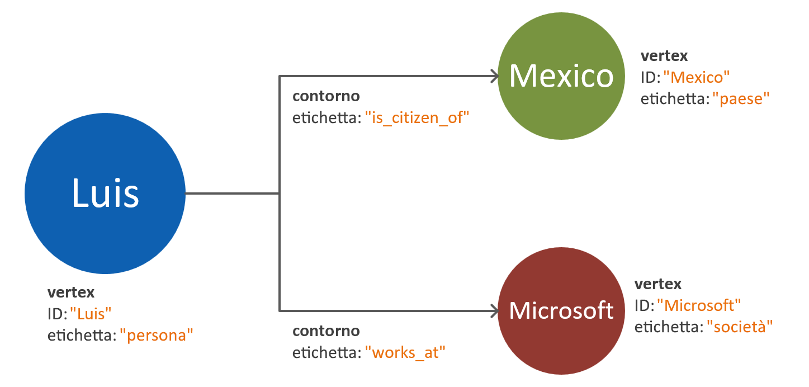
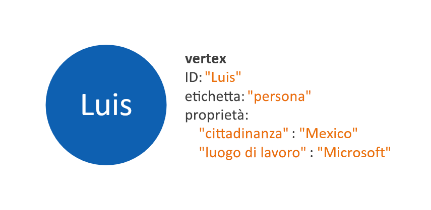
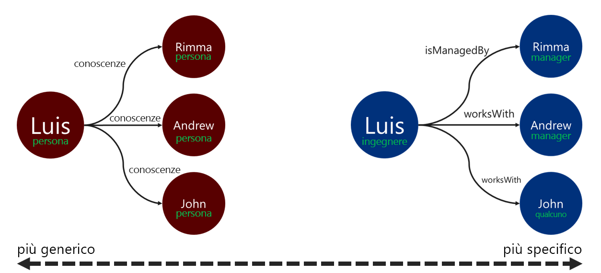

# Modellazione di dati del grafo per l'API Gremlin di Azure Cosmos DB

Il documento seguente include raccomandazioni utili per la modellazione di dati del grafo. Questo passaggio è fondamentale per garantire la scalabilità e le prestazioni di un sistema di database a grafo con l'evolvere dei dati. Un modello di dati efficace è particolarmente importante con i grafi su larga scala.

## Requisiti

Il processo descritto in questa guida è basato sui presupposti seguenti:
 * Le **entità** nello spazio del problema sono identificate. Queste entità devono essere utilizzate _in modo atomico_ per ogni richiesta. Questo significa che il sistema di database non è progettato per il recupero dei dati di una singola entità in più richieste di query.
 * I **requisiti di lettura e scrittura** del sistema di database sono noti. Questi requisiti verranno usati per le ottimizzazioni necessarie per il modello di dati del grafo.
 * I principi dello [standard per grafi di proprietà Apache Tinkerpop](http://tinkerpop.apache.org/docs/current/reference/#graph-computing) sono stati compresi.

## Quando è necessario un database a grafo?

Una soluzione di database a grafo può essere applicata in modo ottimale se le entità e le relazioni in un dominio di dati presentano una qualsiasi delle caratteristiche seguenti: 

* Le entità sono **altamente connesse** tramite relazioni descrittive. Il vantaggio di questo scenario è dato dal fatto che le relazioni vengono mantenute nell'archivio.
* Sono presenti **relazioni cicliche** o **entità che fanno riferimento a se stesse**. Questo criterio spesso costituisce un problema quando si usano database di documenti o relazionali.
* Sono presenti **relazioni a evoluzione dinamica** tra le entità. Questo criterio è applicabile soprattutto a dati gerarchici o con struttura ad albero con numerosi livelli.
* Sono presenti **relazioni molti-a-molti** tra le entità.
* Sono presenti **requisiti di scrittura e lettura per entità e relazioni**. 

Se i criteri precedenti vengono soddisfatti, è probabile che un approccio basato su database a grafo offrirà vantaggi in termini di **complessità delle query**, **scalabilità del modello di dati**, e **prestazioni delle query**.

Il passaggio successivo consiste nel determinare se il grafo verrà usato per scopi analitici o transazionali. Se il grafo deve essere usato per carichi di lavoro ingenti di calcolo ed elaborazione dati, è consigliabile considerare il [connettore Spark per Cosmos DB](https://docs.microsoft.com/azure/cosmos-db/spark-connector) e valutare l'uso della [libreria GraphX](https://spark.apache.org/graphx/). 

## Come usare gli oggetti del grafo

Nello [standard per grafi di proprietà Apache Tinkerpop](http://tinkerpop.apache.org/docs/current/reference/#graph-computing) sono definiti due tipi di oggetti, ovvero **vertici** e **archi**. 

Di seguito sono riportate le procedure consigliate per le proprietà negli oggetti del grafo:

| Oggetto | Proprietà | Type | Note |
| --- | --- | --- |  --- |
| Vertice | ID | string | Imposto in modo univoco per partizione. Se non viene fornito alcun valore durante l'inserimento, verrà archiviato un GUID generato automaticamente. |
| Vertice | label | string | Questa proprietà viene usata per definire il tipo di entità rappresentata dal vertice. Se non viene specificato alcun valore, verrà usato il valore predefinito "vertex". |
| Vertice | properties | Stringa, booleano, intero, binario | Elenco di proprietà separate archiviate come coppie chiave-valore in ogni vertice. |
| Vertice | chiave di partizione | Stringa, booleano, intero, binario | Questa proprietà consente di definire dove verranno archiviati il vertice e i relativi archi in uscita. Per altre informazioni, vedere l'articolo sul [partizionamento di grafi](graph-partitioning.md). |
| Microsoft Edge | ID | string | Imposto in modo univoco per partizione. Generato automaticamente per impostazione predefinita. Gli archi non devono in genere essere recuperati in modo univoco in base a un ID. |
| Microsoft Edge | label | string | Questa proprietà viene usata per definire il tipo di relazione tra due vertici. |
| Microsoft Edge | properties | Stringa, booleano, intero, binario | Elenco di proprietà separate archiviate come coppie chiave-valore in ogni arco. |

> [!NOTE]
> Con gli archi non è richiesto un valore per la chiave di partizione, perché il relativo valore viene assegnato automaticamente in base al vertice di origine. Per altre informazioni, vedere l'articolo sul [partizionamento di grafi](graph-partitioning.md).

## Linee guida per la modellazione di entità e relazioni

Di seguito sono elencate le linee guida per la modellazione dei dati per un database a grafo dell'API Gremlin di Azure Cosmos DB. Queste linee guida presuppongono l'esistenza di una definizione di un dominio di dati e di query per tale dominio.

> [!NOTE]
> I passaggi descritti di seguito vengono presentati come raccomandazioni. Il modello finale deve essere valutato e testato prima di poter essere considerato pronto per l'ambiente di produzione. Le raccomandazioni seguenti sono inoltre specifiche dell'implementazione dell'API Gremlin di Azure Cosmos DB. 

### Modellazione di vertici e proprietà 

Il primo passaggio per la creazione di un modello di dati del grafo consiste nell'eseguire il mapping di ogni entità identificata a un **oggetto vertice**. Il passaggio iniziale è costituito dal mapping uno-a-uno di tutte le entità ai vertici. Tale mapping è soggetto a modifica.

Un errore comune consiste nell'eseguire il mapping delle proprietà di una singola entità come vertici separati. Considerare l'esempio seguente, in cui la stessa entità è rappresentata in due modi diversi:

* **Proprietà basate su vertici**: in questo approccio l'entità usa tre vertici separati e due archi per descrivere le proprie proprietà. Pur riducendo la ridondanza, questo approccio implica un incremento della complessità del modello e di conseguenza una maggiore latenza, una maggiore complessità delle query e un aumento del costo di calcolo. Questo modello può anche presentare problemi relativi al partizionamento.

* **Vertici incorporati nelle proprietà**: questo approccio sfrutta i vantaggi dell'elenco di coppie chiave-valore per rappresentare tutte le proprietà dell'entità all'interno di un vertice. Si tratta di un approccio che consente di ridurre la complessità del modello e implica query più semplici e attraversamenti più convenienti.

> [!NOTE]
> Gli esempi precedenti mostrano un modello di grafo semplificato che illustra solo il confronto tra i due diversi modi di dividere le proprietà delle entità.

Il criterio basato su **vertici incorporati nelle proprietà** offre in genere un approccio più scalabile ed efficiente dal punto di vista delle prestazioni. Nell'approccio predefinito a un nuovo modello di dati del grafo è preferibile adottare questo criterio.

In alcuni scenari, però, fare riferimento a una proprietà può essere più vantaggioso, ad esempio se la proprietà cui viene fatto riferimento viene aggiornata di frequente. L'uso di un vertice separato per rappresentare una proprietà soggetta a modifiche continue consente di ridurre la quantità di operazioni di scrittura richieste dall'aggiornamento.

### Modellazione di relazioni con le direzioni degli archi

Dopo aver modellato i vertici è possibile aggiungere gli archi per denotare le relazioni tra loro. Il primo aspetto da valutare è la **direzione della relazione**. 

Gli oggetti arco hanno una direzione predefinita che viene seguita da un attraversamento quando si usa la funzione `out()` o `outE()`. L'uso della direzione naturale contribuisce all'efficienza dell'operazione perché tutti i vertici vengono archiviati con gli archi in uscita. 

L'attraversamento nella direzione opposta di un arco, con la funzione `in()`, implica però una query tra partizioni. Per altre informazioni, vedere l'articolo sul [partizionamento di grafi](graph-partitioning.md). Se è necessario eseguire costantemente attraversamenti con la funzione `in()`, è consigliabile aggiungere archi in entrambe le direzioni.

Per determinare la direzione degli archi, usare il predicato `.to()` o `.from()` nel passaggio `.addE()` di Gremlin. In alternativa, è possibile usare la [libreria dell'executor bulk per l'API Gremlin](bulk-executor-graph-dotnet.md).

> [!NOTE]
> Agli oggetti arco è assegnata una direzione per impostazione predefinita.

### Assegnazione di etichette alle relazioni

L'uso di etichette di relazione descrittive consente di migliorare l'efficienza delle operazioni di risoluzione degli archi. È possibile applicare questo criterio nei modi seguenti:
* Usare termini non generici per etichettare una relazione.
* Associare l'etichetta del vertice di origine per l'etichetta del vertice di destinazione con il nome della relazione.

Più specifica è l'etichetta che il traverser userà per filtrare gli archi, meglio è. Questa decisione può avere un impatto significativo anche sul costo della query. Per valutare il costo della query in qualsiasi momento, è possibile [usare il passaggio executionProfile](graph-execution-profile.md).

## Passaggi successivi: 
* Esaminare l'elenco dei [passaggi Gremlin](gremlin-support.md) supportati.
* Vedere l'articolo sul [partizionamento dei database a grafo](graph-partitioning.md) per informazioni sulla gestione di grafi su larga scala.
* Valutare le query Gremlin con il [passaggio executionProfile](graph-execution-profile.md).
