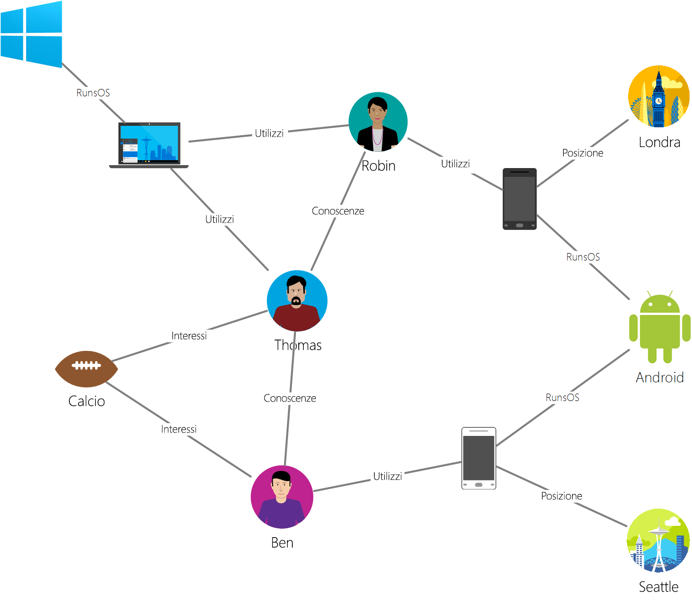

# <a name="azure-cosmos-db-gremlin-graph-support"></a>Supporto Gremlin Graph di Azure Cosmos DB
Azure Cosmos DB supporta l'API Graph [Gremlin]([Gremlin language](http://tinkerpop.apache.org/docs/current/reference/#graph-traversal-steps)) per la creazione di entità di grafi e l'esecuzione di operazioni di query e attraversamento di grafi. È possibile usare il linguaggio Gremlin per creare le entità dei grafi (vertici e archi), modificare proprietà all'interno di tali entità, eseguire query e attraversamenti ed eliminare entità. 

Azure Cosmos DB offre funzionalità di livello aziendale per database a grafi. Questo include distribuzione globale, scalabilità indipendente di archiviazione e velocità effettiva, latenze stimabili in pochissimi millisecondi, indicizzazione automatica e contratti di servizio pari al 99,99%. Poiché Azure Cosmos DB supporta TinkerPop/Gremlin, è possibile eseguire facilmente la migrazione di applicazioni scritte usando un altro database a grafi senza dover apportare modifiche al codice. In più, grazie al supporto Gremlin, Azure Cosmos DB si integra facilmente con framework di analisi abilitati per TinkerPop come [Apache Spark GraphX](http://spark.apache.org/graphx/). 

Questo articolo illustra una procedura dettagliata di Gremlin ed enumera le funzionalità e gli step di Gremlin supportati nella versione di anteprima del supporto API Graph.

## <a name="gremlin-by-example"></a>Esempio di Gremlin
Verrà ora usato un grafo di esempio per comprendere come le query possono essere espresse in Gremlin. La figura seguente illustra un'applicazione aziendale che gestisce i dati su utenti, interessi e dispositivi sotto forma di grafo.  

 

Questo grafo presenta i seguenti tipi di vertici (denominati "label" in Gremlin):

- Persone: il grafo presenta tre persone, Robin, Thomas e Ben
- Interessi: i loro interessi, in questo esempio, il gioco del football
- Dispositivi: i dispositivi usati dagli utenti
- Sistemi operativi: i sistemi operativi eseguiti dai dispositivi

Si rappresentano le relazioni tra queste entità tramite i seguenti tipi/etichette di archi:

- Conosce: ad esempio, "Thomas conosce Robin"
- Interessato: per rappresentare gli interessi delle persone nel nostro grafo, ad esempio, "Ben è interessato al football"
- RunsOS: il portatile esegue il sistema operativo Windows OS
- Usa: per rappresentare quale dispositivo viene usato da una persona. Ad esempio, Robin usa un telefono Motorola con numero di serie 77

Verranno ora eseguite alcune operazioni su questo grafo tramite la [console Gremlin](http://tinkerpop.apache.org/docs/current/reference/#gremlin-console). È anche possibile eseguire queste operazioni usando i driver Gremlin nella piattaforma di propria scelta (Java, Node.js, Python o .NET).  Prima di esaminare cosa è supportato in Azure Cosmos DB, verranno esaminati alcuni esempi per acquisire familiarità con la sintassi.

Verrà dapprima esaminato CRUD. L'istruzione Gremlin seguente inserisce il vertice "Thomas" nel grafo:

```
:> g.addV('person').property('id', 'thomas.1').property('firstName', 'Thomas').property('lastName', 'Andersen').property('age', 44)
```

Successivamente, l'istruzione Gremlin seguente inserisce un arco "conosce" tra Thomas e Robin.

```
:> g.V('thomas.1').addE('knows').to(g.V('robin.1'))
```

La query seguente restituisce i vertici "persona" secondo l'ordine decrescente dei relativi nomi:
```
:> g.V().hasLabel('person').order().by('firstName', decr)
```

I grafi sono eccellenti quando è necessario rispondere a domande come "Quali sistemi operativi usano gli amici di Thomas?". È possibile eseguire questo semplice attraversamento Gremlin per ottenere informazioni dal grafo:

```
:> g.V('thomas.1').out('knows').out('uses').out('runsos').group().by('name').by(count())
```
Ora verrà esaminato cosa Azure Cosmos DB offre agli sviluppatori di Gremlin.

## <a name="gremlin-features"></a>Funzionalità di Gremlin
TinkerPop è uno standard che copre un'ampia gamma di tecnologie a grafi. Pertanto, ha una terminologia standard usata per descrivere le funzionalità offerte da un provider di grafi. Azure Cosmos DB offre un database a grafi scrivibile, ad alta concorrenza, persistente, che può essere partizionato tra più server o cluster. 

La tabella seguente elenca le funzionalità di TinkerPop implementate da Azure Cosmos DB: 

| Categoria | Implementazione di Azure Cosmos DB |  Note | 
| --- | --- | --- |
| Funzionalità del grafo | Offre persistenza e accesso simultaneo in anteprima. Progettata per supportare le transazioni | Metodi di calcolo possono essere implementati tramite il connettore Spark. |
| Funzionalità della variabile | Supporta Boolean, Integer, Byte, Double, Float, Integer, Long, String | Supporta i tipi primitivi, è compatibile con i tipi complessi tramite modello di dati |
| Funzionalità del vertice | Supporta RemoveVertices, MetaProperties, AddVertices, MultiProperties, StringIds, UserSuppliedIds, AddProperty, RemoveProperty  | Supporta la creazione, la modifica e l'eliminazione di vertici |
| Funzionalità della proprietà del vertice | StringIds, UserSuppliedIds, AddProperty, RemoveProperty, BooleanValues, ByteValues, DoubleValues, FloatValues, IntegerValues, LongValues, StringValues | Supporta la creazione, la modifica e l'eliminazione di proprietà di vertici |
| Funzionalità dell'arco | AddEges, RemoveEdges, StringIds, UserSuppliedIds, AddProperty, RemoveProperty | Supporta la creazione, la modifica e l'eliminazione di archi |
| Funzionalità della proprietà dell'arco | Properties, BooleanValues, ByteValues, DoubleValues, FloatValues, IntegerValues, LongValues, StringValues | Supporta la creazione, la modifica e l'eliminazione di proprietà dell'arco |

## <a name="gremlin-wire-format-graphson"></a>Formato wire Gremlin: GraphSON

Azure Cosmos DB usa il [ formato GraphSON](https://github.com/thinkaurelius/faunus/wiki/GraphSON-Format) per la restituzione di risultati dalle operazioni Gremlin. GraphSON è il formato standard Gremlin per la rappresentazione di vertici, archi e proprietà (singolo e multi-valore) tramite JSON. 

Ad esempio, il frammento di codice seguente mostra una rappresentazione GraphSON di un vertice in Azure Cosmos DB. 

```json
  {
    "id": "a7111ba7-0ea1-43c9-b6b2-efc5e3aea4c0",
    "label": "person",
    "type": "vertex",
    "outE": {
      "knows": [
        {
          "id": "3ee53a60-c561-4c5e-9a9f-9c7924bc9aef",
          "inV": "04779300-1c8e-489d-9493-50fd1325a658"
        },
        {
          "id": "21984248-ee9e-43a8-a7f6-30642bc14609",
          "inV": "a8e3e741-2ef7-4c01-b7c8-199f8e43e3bc"
        }
      ]
    },
    "properties": {
      "firstName": [
        {
          "value": "Thomas"
        }
      ],
      "lastName": [
        {
          "value": "Andersen"
        }
      ],
      "age": [
        {
          "value": 45
        }
      ]
    }
  }
```

Le proprietà usate da GraphSON per i vertici sono le seguenti:

| Proprietà | Descrizione |
| --- | --- |
| id | ID del vertice. Deve essere univoco (in combinazione con il valore di _partition se applicabile) |
| label | Etichetta del vertice. Questo è facoltativo e viene usato per descrivere il tipo di entità. |
| type | Usato per distinguere i vertici da documenti non a grafo |
| properties | Contenitore delle proprietà definite dall'utente associate al vertice. Ogni proprietà può avere più valori. |
| _partition (configurabile) | La chiave di partizione del vertice. Può essere usata per scalare orizzontalmente grafi in più server |
| outE | Contiene un elenco degli archi uscenti da un vertice. L'archiviazione delle informazioni di adiacenza con il vertice consente l'esecuzione rapida degli attraversamenti. Gli archi vengono raggruppati in base alle relative etichette. |

E l'arco contiene le informazioni seguenti per spostarsi in altre parti del grafo.

| Proprietà | Descrizione |
| --- | --- |
| id | ID dell'arco. Deve essere univoco (in combinazione con il valore di _partition se applicabile) |
| label | Etichetta dell'arco. Questa proprietà è facoltativa e viene usata per descrivere il tipo di relazione. |
| inV | Contenitore delle proprietà definite dall'utente associate all'arco. Ogni proprietà può avere più valori. |
| properties | Contenitore delle proprietà definite dall'utente associate all'arco. Ogni proprietà può avere più valori. |

Ogni proprietà può archiviare più valori all'interno di una matrice. 

| Proprietà | Descrizione |
| --- | --- |
| value | Valore della proprietà

## <a name="gremlin-partitioning"></a>Partizionamento di Gremlin

In Azure Cosmos DB i grafi vengono archiviati all'interno di contenitori che possono essere scalati in modo indipendente in termini di memoria e velocità effettiva (espressa in richieste normalizzate al secondo). Ogni contenitore deve definire una proprietà della chiave di partizione facoltativa, ma consigliata, che determina un limite della partizione logica per i dati correlati. Ogni vertice/arco deve possedere una proprietà `id` univoca per le entità all'interno del valore della chiave di partizione. I dettagli sono descritti in [Partitioning in Azure Cosmos DB](partition-data.md) (Partizionamento in Azure Cosmos DB).

Le operazioni Gremlin funzionano senza problemi su dati a grafo che si estendono su più partizioni in Azure Cosmos DB. Tuttavia, si consiglia di scegliere una chiave di partizione per i grafi che venga comunemente usata come filtro nelle query, abbia molti valori distinti e una frequenza di accesso a questi valori simile. 

## <a name="gremlin-steps"></a>Step di Gremlin
Verranno ora esaminati gli step di Gremlin supportati da Azure Cosmos DB. Per informazioni complete su Gremlin, vedere [TinkerPop reference](http://tinkerpop.apache.org/docs/current/reference) (Riferimento a TinkerPop).

| step | Descrizione | Documentazione TinkerPop 3.2 | Note |
| --- | --- | --- | --- |
| `addE` | Aggiunge un arco tra due vertici | [addE step](http://tinkerpop.apache.org/docs/current/reference/#addedge-step) | |
| `addV` | Aggiunge un vertice al grafo | [addV step](http://tinkerpop.apache.org/docs/current/reference/#addvertex-step) | |
| `as` | Modulatore di step per assegnare una variabile all'output di uno step | [as step](http://tinkerpop.apache.org/docs/current/reference/#as-step) | |
| `by` | Modulatore di step usato con `group` e `order` | [by step](http://tinkerpop.apache.org/docs/current/reference/#by-step) | |
| `coalesce` | Restituisce il primo attraversamento che restituisce un risultato | [coalesce step](http://tinkerpop.apache.org/docs/current/reference/#coalesce-step) | |
| `constant` | Restituisce un valore costante. Usato con `coalesce`| [constant step](http://tinkerpop.apache.org/docs/current/reference/#constant-step) | |
| `count` | Restituisce il conteggio risultante dall'attraversamento | [count step](http://tinkerpop.apache.org/docs/current/reference/#count-step) | |
| `dedup` | Restituisce i valori con i duplicati rimossi | [dedup step](http://tinkerpop.apache.org/docs/current/reference/#dedup-step) | |
| `drop` | Elimina i valori (vertice/arco) | [drop step](http://tinkerpop.apache.org/docs/current/reference/#drop-step) | |
| `fold` | Si comporta come una barriera che calcola l'aggregazione di risultati| [fold step](http://tinkerpop.apache.org/docs/current/reference/#fold-step) | |
| `group` | Raggruppa i valori in base alle etichette specificate| [group step](http://tinkerpop.apache.org/docs/current/reference/#group-step) | |
| `has` | Usato per filtrare proprietà, vertici e archi. Supporta `hasLabel`, `hasId`, `hasNot` e le varianti `has`. | [has step](http://tinkerpop.apache.org/docs/current/reference/#has-step) | |
| `inject` | Inserisce i valori in un flusso| [inject step](http://tinkerpop.apache.org/docs/current/reference/#inject-step) | |
| `is` | Usato per eseguire un filtro con un'espressione booleana | [is step](http://tinkerpop.apache.org/docs/current/reference/#is-step) | |
| `limit` | Usato per limitare il numero di elementi nell'attraversamento| [limit step](http://tinkerpop.apache.org/docs/current/reference/#limit-step) | |
| `local` | Esegue il wrapping di una sezione di attraversamento, simile a una sottoquery | [local step](http://tinkerpop.apache.org/docs/current/reference/#local-step) | |
| `not` | Usato per produrre la negazione di un filtro | [not step](http://tinkerpop.apache.org/docs/current/reference/#not-step) | |
| `optional` | Restituisce il risultato dell'attraversamento specificato se fornisce un risultato, in caso contrario restituisce l'elemento chiamante | [optional step](http://tinkerpop.apache.org/docs/current/reference/#optional-step) | |
| `or` | Garantisce che almeno uno degli attraversamenti restituisca un valore | [or step](http://tinkerpop.apache.org/docs/current/reference/#or-step) | |
| `order` | Restituisce i risultati nell'ordinamento specificato | [order step](http://tinkerpop.apache.org/docs/current/reference/#order-step) | |
| `path` | Restituisce il percorso completo dell'attraversamento | [path step](http://tinkerpop.apache.org/docs/current/reference/#path-step) | |
| `project` | Proietta le proprietà come Mappa | [project step](http://tinkerpop.apache.org/docs/current/reference/#project-step) | |
| `properties` | Restituisce le proprietà per le etichette specificate | [properties step](http://tinkerpop.apache.org/docs/current/reference/#properties-step) | |
| `range` | Filtra per l'intervallo di valori specificato| [range step](http://tinkerpop.apache.org/docs/current/reference/#range-step) | |
| `repeat` | Ripete lo step per il numero di volte specificato. Usato per eseguire i cicli | [repeat step](http://tinkerpop.apache.org/docs/current/reference/#repeat-step) | |
| `sample` | Usato per campionare i risultati dell'attraversamento | [sample step](http://tinkerpop.apache.org/docs/current/reference/#sample-step) | |
| `select` | Usato per proiettare i risultati dell'attraversamento |  [select step](http://tinkerpop.apache.org/docs/current/reference/#select-step) | |
| `store` | Usato per le aggregazioni non bloccanti risultanti dall'attraversamento | [store step](http://tinkerpop.apache.org/docs/current/reference/#store-step) | |
| `tree` | Aggrega i percorsi da un vertice a una struttura ad albero | [tree step](http://tinkerpop.apache.org/docs/current/reference/#tree-step) | |
| `unfold` | Srotola un iteratore come step| [unfold step](http://tinkerpop.apache.org/docs/current/reference/#unfold-step) | |
| `union` | Unisce i risultati di più attraversamenti| [union step](http://tinkerpop.apache.org/docs/current/reference/#union-step) | |
| `V` | Include gli step necessari per gli attraversamenti tra vertici e archi `V`, `E`, `out`, `in`, `both`, `outE`, `inE`, `bothE`, `outV`, `inV`, `bothV`, e `otherV` per | [vertex steps](http://tinkerpop.apache.org/docs/current/reference/#vertex-steps) | |
| `where` | Usato per filtrare i risultati dell'attraversamento. Supporta `eq`, `neq`, `lt`, `lte`, `gt`, `gte` e gli operatori `between`  | [where step](http://tinkerpop.apache.org/docs/current/reference/#where-step) | |

Il motore ottimizzato per la scrittura di Azure Cosmos DB supporta l'indicizzazione automatica di tutte le proprietà all'interno di vertici e archi per impostazione predefinita. Pertanto, query con filtri, query di intervallo, ordinamento o aggregazioni in qualsiasi proprietà vengono elaborati dall'indice e serviti in modo efficiente. Per altre informazioni sul funzionamento dell'indicizzazione in Azure Cosmos DB, vedere il documento sull'[indicizzazione senza schema](http://www.vldb.org/pvldb/vol8/p1668-shukla.pdf).

## <a name="next-steps"></a>Passaggi successivi
* Iniziare a creare un'applicazione Graph [tramite SDK](create-graph-dotnet.md) 
* Altre informazioni sul [supporto Graph di Azure Cosmos DB](graph-introduction.md)

