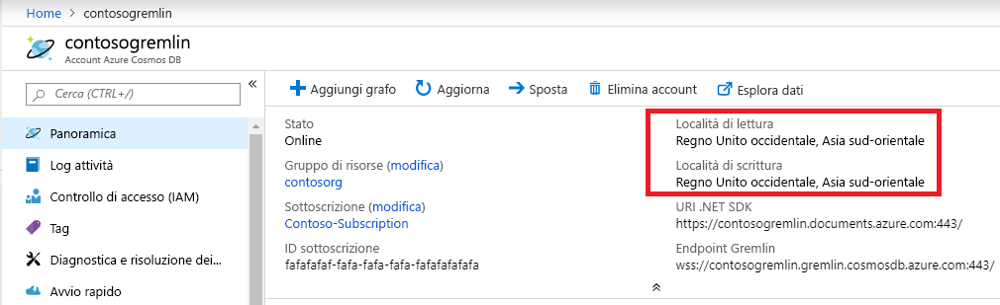

# <a name="regional-endpoints-for-azure-cosmos-db-graph-account"></a>Endpoint a livello di area per l'account del database a grafo di Azure Cosmos DB
Il database a grafo di Azure Cosmos DB è [distribuito a livello globale](distribute-data-globally.md), pertanto le applicazioni possono usare più endpoint di lettura. Le applicazioni che necessitano dell'accesso in scrittura in più posizioni devono abilitare la funzionalità [multimaster](how-to-multi-master.md).

Motivi per cui scegliere più di un'area:
1. **Scalabilità in lettura orizzontale**: man mano che il carico dell'applicazione aumenta, potrebbe essere prudente instradare il traffico di lettura verso aree di Azure diverse.
2. **Latenza più bassa**: è possibile ridurre l'overhead della latenza di rete di ogni attraversamento instradando il traffico di lettura e scrittura verso l'area di Azure più vicina.

Il requisito di **residenza dei dati** viene soddisfatto impostando criteri di Azure Resource Manager per l'account Cosmos DB. Il cliente può limitare le aree in cui Cosmos DB replica i dati.

## <a name="traffic-routing"></a>instradamento del traffico

Il motore del database a grafo di Cosmos DB è in esecuzione in più aree, ognuna contenente più cluster. Ogni cluster dispone di centinaia di computer. Il record CNAME DNS *nomeaccount.gremlin.cosmos.azure.com* dell'account del database a grafo di Cosmos DB viene risolto in un record DNS A di un cluster. Un singolo indirizzo IP di un servizio di bilanciamento del carico nasconde la topologia cluster interna.

A livello di area viene creato un record CNAME DNS per ogni area dell'account del database a grafo di Cosmos DB. Il formato dell'endpoint a livello di area è *nomeaccount-area.gremlin.cosmos.azure.com*. Il segmento relativo all'area dell'endpoint a livello di area viene ottenuto rimuovendo tutti gli spazi dal nome dell'[area di Azure](https://azure.microsoft.com/global-infrastructure/regions). Ad esempio, l'area `"East US 2"` per l'account di database globale `"contoso"` avrà *contoso-eastus2.gremlin.cosmos.azure.com* come record CNAME DNS.

Il client TinkerPop Gremlin è progettato per funzionare con un singolo server. L'applicazione può usare il record CNAME DNS scrivibile globale per il traffico di lettura e scrittura. Le applicazioni in grado di riconoscere l'area devono usare l'endpoint a livello di area per il traffico di lettura. Usare l'endpoint a livello di area per il traffico di scrittura solo se l'area specifica è configurata per accettare le operazioni di scrittura. 

> [!NOTE]
> Il motore del database a grafo di Cosmos DB può accettare un'operazione di scrittura in un'area di lettura inoltrando il traffico all'area di scrittura. Non è consigliabile inviare le operazioni di scrittura nell'area di sola lettura perché questa soluzione aumenta la latenza di attraversamento ed è soggetta a restrizioni in futuro.

Il record CNAME dell'account di database globale punta sempre a un'area di scrittura valida. Durante il failover lato server dell'area di scrittura, Cosmos DB aggiorna il record CNAME di tale account in modo che punti a una nuova area. Se l'applicazione non è in grado di gestire il rerouting del traffico dopo il failover, deve usare il record CNAME DNS dell'account di database globale.

> [!NOTE]
> Cosmos DB non instrada il traffico in base alla prossimità geografica del chiamante. Ogni applicazione deve selezionare l'area appropriata in base alle relative esigenze specifiche.

## <a name="portal-endpoint-discovery"></a>Individuazione degli endpoint tramite portale

Il modo più semplice per ottenere l'elenco delle aree per l'account del database a grafo di Azure Cosmos DB consiste nell'usare il pannello di panoramica nel portale di Azure. Questa soluzione funziona per le applicazioni che non cambiano spesso area o che sono in grado di aggiornare l'elenco tramite la propria configurazione.



L'esempio riportato di seguito illustra i principi generali dell'accesso all'endpoint Gremlin a livello di area. L'applicazione deve considerare il numero di aree a cui inviare il traffico e il numero di client Gremlin corrispondenti di cui creare un'istanza.

```csharp
// Example value: Central US, West US and UK West. This can be found in the overview blade of you Azure Cosmos DB Gremlin Account. 
// Look for Write Locations in the overview blade. You can click to copy and paste.
string[] gremlinAccountRegions = new string[] {"Central US", "West US" ,"UK West"};
string gremlinAccountName = "PUT-COSMOSDB-ACCOUNT-NAME-HERE";
string gremlinAccountKey = "PUT-ACCOUNT-KEY-HERE";
string databaseName = "PUT-DATABASE-NAME-HERE";
string graphName = "PUT-GRAPH-NAME-HERE";

foreach (string gremlinAccountRegion in gremlinAccountRegions)
{
  // Convert preferred read location to the form "[acountname]-[region].gremlin.cosmos.azure.com".
  string regionalGremlinEndPoint = $"{gremlinAccountName}-{gremlinAccountRegion.ToLowerInvariant().Replace(" ", string.Empty)}.gremlin.cosmos.azure.com";

  GremlinServer regionalGremlinServer = new GremlinServer(
    hostname: regionalGremlinEndPoint, 
    port: 443,
    enableSsl: true,
    username: "/dbs/" + databaseName + "/colls/" + graphName,
    password: gremlinAccountKey);

  GremlinClient regionalGremlinClient = new GremlinClient(
    gremlinServer: regionalGremlinServer,
    graphSONReader: new GraphSON2Reader(),
    graphSONWriter: new GraphSON2Writer(),
    mimeType: GremlinClient.GraphSON2MimeType);
}
```

## <a name="sdk-endpoint-discovery"></a>Individuazione degli endpoint tramite SDK

L'applicazione può usare [Azure Cosmos DB SDK](sql-api-sdk-dotnet.md) per individuare le posizioni di lettura e scrittura per l'account del database a grafo. Queste posizioni possono cambiare in qualsiasi momento a seguito della riconfigurazione manuale sul lato server o del failover automatico.

TinkerPop Gremlin SDK non dispone di un'API per individuare le aree dell'account del database a grafo di Cosmos DB. Le applicazioni che necessitano dell'individuazione degli endpoint in fase di runtime devono ospitare due SDK separati nello spazio del processo.

```csharp
// Depending on the version and the language of the SDK (.NET vs Java vs Python)
// the API to get readLocations and writeLocations may vary.
IDocumentClient documentClient = new DocumentClient(
    new Uri(cosmosUrl),
    cosmosPrimaryKey,
    connectionPolicy,
    consistencyLevel);

DatabaseAccount databaseAccount = await cosmosClient.GetDatabaseAccountAsync();

IEnumerable<DatabaseAccountLocation> writeLocations = databaseAccount.WritableLocations;
IEnumerable<DatabaseAccountLocation> readLocations = databaseAccount.ReadableLocations;

// Pick write or read locations to construct regional endpoints for.
foreach (string location in readLocations)
{
  // Convert preferred read location to the form "[acountname]-[region].gremlin.cosmos.azure.com".
  string regionalGremlinEndPoint = location
    .Replace("http:\/\/", string.Empty)
    .Replace("documents.azure.com:443/", "gremlin.cosmos.azure.com");
  
  // Use code from the previous sample to instantiate Gremlin client.
}
```

## <a name="next-steps"></a>Passaggi successivi
* Vedere le informazioni su [come gestire il controllo degli account di database](how-to-manage-database-account.md) in Azure Cosmos DB
* Vedere le informazioni sulla [disponibilità elevata](high-availability.md) in Azure Cosmos DB
* Vedere le informazioni sulla [distribuzione globale con Azure Cosmos DB - informazioni sul funzionamento](global-dist-under-the-hood.md)
* Vedere gli [esempi di interfaccia della riga di comando di Azure](cli-samples.md) per Azure Cosmos DB
