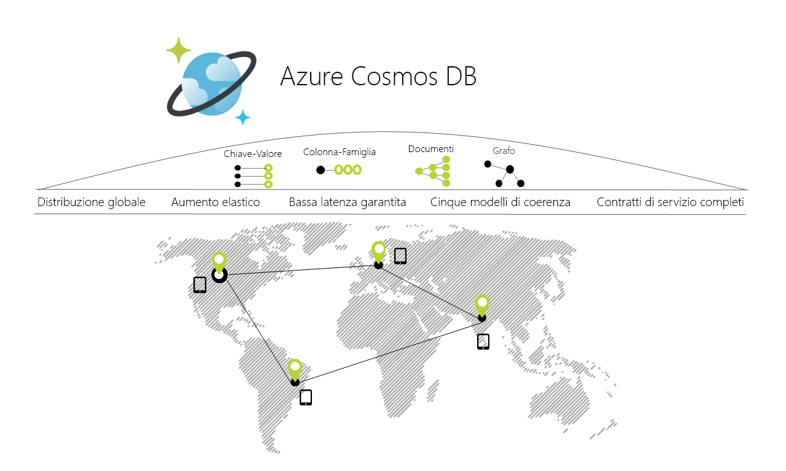

# Introduzione ad Azure Cosmos DB

Azure Cosmos DB è il database multimodello distribuito a livello globale di Microsoft. Con un semplice clic su un pulsante, Azure Cosmos DB garantisce la scalabilità elastica e indipendente della velocità effettiva e dello spazio di archiviazione tra un numero qualsiasi di aree geografiche di Azure. Assicura inoltre velocità effettiva, latenza, disponibilità e coerenza grazie a [contratti di servizio](https://aka.ms/acdbsla) (SLA, Service Level Agreement) completi, una garanzia che nessun altro servizio di database è in grado di offrire.

## Soluzioni che traggono vantaggio da Azure Cosmos DB

Qualsiasi [applicazione Web, per dispositivi mobili, di gioco e IoT](use-cases.md) che debba gestire un numero molto elevato di letture e scritture su scala [globale](distribute-data-globally.md) con tempi di risposta contenuti per una varietà di dati, può trarre beneficio dalla disponibilità, dalla velocità effettiva elevata, dalla bassa latenza e dalla coerenza ottimizzabile [garantite](https://azure.microsoft.com/support/legal/sla/cosmos-db/) di Azure Cosmos DB.

## Funzionalità principali
Come servizio di database distribuito a livello globale, Azure Cosmos DB fornisce le seguenti funzionalità, che consentono di creare applicazioni scalabili e altamente reattive:

* **Distribuzione globale chiavi in mano**
    * È possibile [distribuire i dati](distribute-data-globally.md) ad un numero qualsiasi di [aree di Azure](https://azure.microsoft.com/regions/) semplicemente [facendo clic su un pulsante](tutorial-global-distribution-documentdb.md). Ciò consente di portare i dati nelle località in cui si trovano gli utenti, garantendo loro la latenza più bassa possibile. 
    * Con l'API multi-homing di Azure Cosmos DB, l'app sa sempre dove si trova l'area più vicina e, di conseguenza, invia le richieste al data center più vicino. Tutto questo è possibile senza modificare alcuna configurazione. Si imposta l'area di scrittura e tutte le aree di lettura desiderate. Il resto viene gestito automaticamente.

* **Più modelli di dati e API comuni per l'accesso e le query sui dati**
    * Il modello di dati basato sulla sequenza di record ATOM (ARS) su cui si fonda Azure Cosmos DB supporta in modo nativo più modelli di dati, tra cui modelli di documenti, grafi, coppie chiave-valore, tabelle e colonne.
    * Qui di seguito, sono elencate le API per i modelli di dati supportati, con SDK disponibili in più lingue:
        * [API di DocumentDB](documentdb-introduction.md)
        * [API di MongoDB](mongodb-introduction.md)
        * [API di tabella](table-introduction.md)
        * [API Graph (Gremlin)](graph-introduction.md)
        * Altri modelli di dati saranno presto disponibili 

* **Ridimensionamento elastico della velocità effettiva e dell'archiviazione su richiesta, in tutto il mondo**
    * Possibilità di ridimensionare facilmente la velocità effettiva del database a granularità di [secondo](request-units.md) e [minuto](request-units-per-minute.md), modificandola in qualsiasi momento. 
    * Scalabilità dell'archiviazione [in modo trasparente e automatico](partition-data.md) per soddisfare i requisiti di dimensione presenti e futuri.

* **Creazione di applicazioni mission-critical e altamente reattive**
    * Azure Cosmos DB garantisce ai clienti una bassa latenza end-to-end al 99° percentile. 
    * Per un elemento tipico da 1 KB, Cosmos DB assicura una latenza end-to-end inferiore a 10 ms per le letture e a 15 ms per le scritture al 99° percentile, all'interno della stessa area di Azure. Le latenze medie sono significativamente inferiori (meno di 5 ms).

* **Disponibilità Always On**
    * Disponibilità del 99,99% all'interno di una singola area.
    * Distribuzione in un numero qualsiasi di [aree di Azure](https://azure.microsoft.com/regions) per una maggiore disponibilità.
    * [Simulazione di errore](regional-failover.md) di una o più aree senza perdita di dati. 

* **Scrittura di applicazioni distribuite a livello globale in modo immediato**
    * Cinque [modelli di coerenza](consistency-levels.md) offrono un'ampia gamma di livelli di coerenza, da quella assoluta di tipo SQL alla coerenza finale di tipo NoSQL, compresi i livelli intermedi. 
  
* **Recupero dell'investimento**
    * I dati sono immediatamente disponibili in modo rapido, in caso contrario l'importo versato verrà rimborsato. 
    * [Contratti di servizio](https://aka.ms/acdbsla) per garantire disponibilità, latenza, velocità effettiva e coerenza. 

* **Nessuna gestione di schemi/indici di database**
    * Non è più necessario preoccuparsi di mantenere lo schema e gli indici del database sincronizzati con lo schema dell'applicazione. La soluzione è indipendente dallo schema. 
    * Il motore di database di Azure Cosmos DB è completamente indipendente dallo schema: questo significa che indicizza automaticamente tutti i dati inseriti senza richiedere creazione di schemi o indici e consente allo stesso tempo l'esecuzione di query ultrarapide. 

* **Costo di proprietà ridotto**
    * Da cinque a dieci volte [più conveniente](https://aka.ms/cosmos-db-tco-paper) rispetto a una soluzione non gestita.
    * Tre volte meno costoso di DynamoDB.

## Confronto delle funzionalità

Azure Cosmos DB fornisce le migliori funzionalità dei database relazionali e non relazionali.

| Capabilities | Database relazionali   | Database non relazionali (NoSQL) |    Azure Cosmos DB |
| --- | --- | --- | --- |
| Distribuzione globale | No | No | Sì, distribuzione chiavi in mano in oltre 30 aree con le API multi-homing|
| Scalabilità orizzontale | No | Sì | Sì, archiviazione e velocità effettiva sono scalabili in modo indipendente | 
| Garanzie di latenza | No | Sì | Sì, 99% delle letture in <10 ms e delle scritture in <15 ms | 
| Disponibilità elevata | No | Sì | Sì, Cosmos DB è sempre online, ha compromessi secondo il teorema PACELC e offre opzioni di failover automatico e manuale|
| Modello di dati + API | Relazionale + SQL | Multimodello + API OSS | Multimodello + SQL + API OSS (altre funzionalità presto disponibili) |
| Contratti di servizio | Sì | No | Sì, contratti di servizio completi per latenza, velocità effettiva, coerenza, disponibilità |

## Passaggi successivi
Per un'introduzione ad Azure Cosmos DB, fare riferimento alle guide introduttive seguenti:

* [Come iniziare a usare l'API DocumentDB di Azure Cosmos DB](create-documentdb-dotnet.md)
* [Come iniziare a usare l'API MongoDB di Azure Cosmos DB](create-mongodb-nodejs.md)
* [Come iniziare a usare l'API Graph di Azure Cosmos DB](create-graph-dotnet.md)
* [Come iniziare a usare l'API di tabella di Azure Cosmos DB](create-table-dotnet.md)

