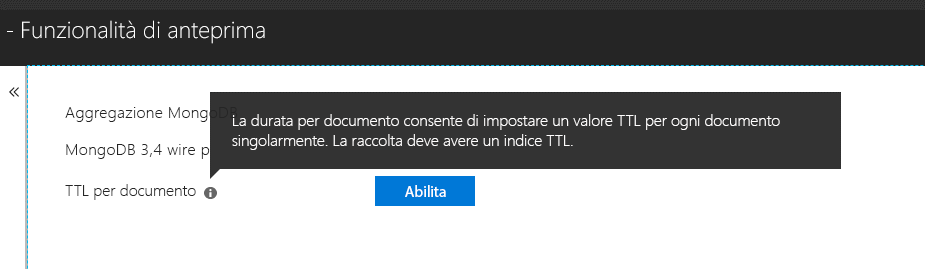

# <a name="expire-data-with-azure-cosmos-dbs-api-for-mongodb"></a>Impostare la scadenza dei dati con l'API di Azure Cosmos DB per MongoDB

La funzionalità di durata (TTL) consente di impostare la scadenza automatica dei dati nel database. L'API di Azure Cosmos DB per MongoDB usa le funzionalità di base per la durata di Cosmos DB. Sono supportate due modalità: l'impostazione di un valore di durata predefinito per l'intera raccolta e l'impostazione di valori di durata specifici per ogni documento. La logica che regola gli indici di durata e i valori di durata per singolo documento nell'API di Cosmos DB per MongoDB è la [stessa usata per Cosmos DB](../cosmos-db/mongodb-indexing.md).

## <a name="ttl-indexes"></a>Indici TTL
Per abilitare la durata per tutti i documenti di una raccolta, è necessario creare un ["indice TTL" (time-to-live)](../cosmos-db/mongodb-indexing.md). L'indice TTL è un indice sul campo _ts con un valore "expireAfterSeconds".

Esempio:
```JavaScript
globaldb:PRIMARY> db.coll.createIndex({"_ts":1}, {expireAfterSeconds: 10})
{
        "_t" : "CreateIndexesResponse",
        "ok" : 1,
        "createdCollectionAutomatically" : true,
        "numIndexesBefore" : 1,
        "numIndexesAfter" : 4
}
```

Il comando nell'esempio precedente crea un indice con funzionalità TTL. Dopo la creazione dell'indice, il database elimina automaticamente tutti i documenti della raccolta che non sono stati modificati negli ultimi 10 secondi. 

> [!NOTE]
> **_ts** è un campo specifico di Cosmos DB e non è accessibile dai client di MongoDB. Si tratta di una proprietà di sistema riservata che contiene il timestamp dell'ultima modifica del documento.
>
    
Questo è un altro esempio in C#: 

```csharp
var options = new CreateIndexOptions {ExpireAfter = TimeSpan.FromSeconds(10)}; 
var field = new StringFieldDefinition<BsonDocument>("_ts"); 
var indexDefinition = new IndexKeysDefinitionBuilder<BsonDocument>().Ascending(field); 
await collection.Indexes.CreateOneAsync(indexDefinition, options); 
``` 

## <a name="set-time-to-live-value-for-a-document"></a>Impostazione del valore di durata per un documento 
Sono supportati anche valori di durata per singolo documento. Il documento deve contenere una proprietà a livello di radice "ttl" (in lettere minuscole) e deve essere stato creato un indice di durata (TTL) per la raccolta, come descritto sopra. Il valore di durata impostato per un documento sostituirà il valore di durata della raccolta.

Il valore di durata deve essere di tipo Int32 oppure, in alternativa, un oggetto Int64 che rientra in un Int32 o un valore double senza la parte decimale che rientra in un Int32. I valori della proprietà di durata non conformi a queste specifiche sono consentiti ma non sono considerati valori di durata del documento significativi.

Il valore di durata per il documento è facoltativo. Nella raccolta possono essere inseriti documenti senza un valore di durata (TTL).  In tal caso verrà applicato il valore di durata della raccolta. 

I documenti seguenti hanno valori di durata validi. Dopo l'inserimento, i valori di durata dei documenti sostituiranno quelli della raccolta. I documenti verranno quindi rimossi dopo 20 secondi.  

```JavaScript 
globaldb:PRIMARY> db.coll.insert({id:1, location: "Paris", ttl: 20.0}) 
globaldb:PRIMARY> db.coll.insert({id:1, location: "Paris", ttl: NumberInt(20)}) 
globaldb:PRIMARY> db.coll.insert({id:1, location: "Paris", ttl: NumberLong(20)}) 
```

I seguenti documenti hanno valori di durata non validi. I documenti verranno inseriti, ma il loro valore di durata non sarà rispettato. I documenti verranno quindi rimossi dopo dieci secondi, in base al valore di durata della raccolta. 

```JavaScript 
globaldb:PRIMARY> db.coll.insert({id:1, location: "Paris", ttl: 20.5}) //TTL value contains non-zero decimal part. 
globaldb:PRIMARY> db.coll.insert({id:1, location: "Paris", ttl: NumberLong(2147483649)}) //TTL value is greater than Int32.MaxValue (2,147,483,648). 
``` 

## <a name="how-to-activate-the-per-document-ttl-feature"></a>Come attivare la funzionalità di durata per singolo documento

La funzionalità di durata per singolo documento può essere attivata con l'API di Azure Cosmos DB per MongoDB.

 

## <a name="next-steps"></a>Passaggi successivi
* [Impostare la scadenza automatica dei dati in Azure Cosmos DB con la durata (TTL)](../cosmos-db/time-to-live.md)
* [Indicizzazione del database Cosmos DB configurato con l'API di Azure Cosmos DB per MongoDB](../cosmos-db/mongodb-indexing.md)
