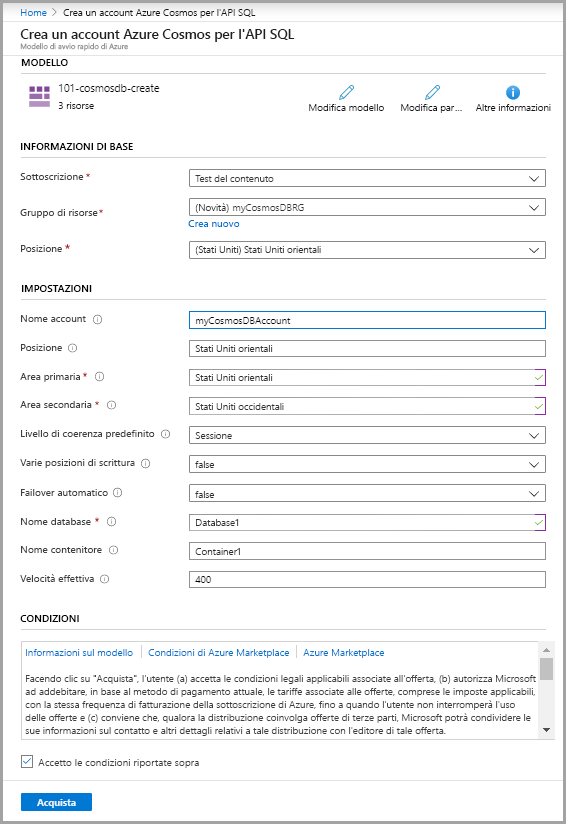
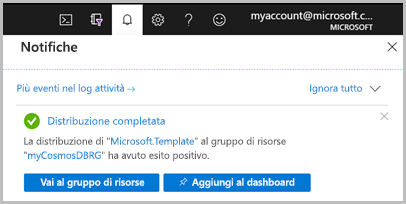

# <a name="quickstart-create-an-azure-cosmos-db-and-a-container-by-using-azure-resource-manager-template"></a>Avvio rapido: Creare un database Azure Cosmos DB e un contenitore usando un modello di Azure Resource Manager

Azure Cosmos DB è il servizio di database di Microsoft multimodello distribuito a livello globale. È possibile usare Azure Cosmos DB per creare rapidamente database di chiavi/valori, di documenti e a grafo ed eseguire query su di essi. Questo argomento di avvio rapido illustra il processo di distribuzione di un modello di Resource Manager per creare un database Azure Cosmos DB e un contenitore al suo interno. Sarà quindi possibile archiviare dati in questo contenitore.

[!INCLUDE [About Azure Resource Manager](../../includes/resource-manager-quickstart-introduction.md)]

Se non si ha una sottoscrizione di Azure, creare un [account gratuito](https://azure.microsoft.com/free/?WT.mc_id=A261C142F) prima di iniziare.

## <a name="prerequisites"></a>Prerequisiti

Una sottoscrizione di Azure o un account di prova gratuito di Azure Cosmos DB

- [!INCLUDE [quickstarts-free-trial-note](../../includes/quickstarts-free-trial-note.md)]

- [!INCLUDE [cosmos-db-emulator-docdb-api](../../includes/cosmos-db-emulator-docdb-api.md)]

## <a name="create-an-azure-cosmos-account-database-container"></a>Creare un account, un database e un contenitore Azure Cosmos DB

### <a name="review-the-template"></a>Rivedere il modello

Il modello usato in questo avvio rapido proviene dai [modelli di avvio rapido di Azure](https://azure.microsoft.com/resources/templates/101-cosmosdb-sql/).

:::code language="json" source="~/quickstart-templates/101-cosmosdb-sql/azuredeploy.json":::

Nel modello sono definite tre risorse di Azure:

* [Microsoft.DocumentDB/databaseAccounts](/azure/templates/microsoft.documentdb/databaseaccounts): crea un account Azure Cosmos DB.

* [Microsoft.DocumentDB/databaseAccounts/sqlDatabases](/azure/templates/microsoft.documentdb/databaseaccounts/sqldatabases): crea un database Azure Cosmos DB.

* [Microsoft.DocumentDB/databaseAccounts/sqlDatabases/containers](/azure/templates/microsoft.documentdb/databaseaccounts/sqldatabases/containers): crea un contenitore Azure Cosmos DB.

Altri esempi di modelli di Azure Cosmos DB sono disponibili nella [raccolta di modelli di avvio rapido di Azure](https://azure.microsoft.com/resources/templates/?resourceType=Microsoft.Documentdb).

### <a name="deploy-the-template"></a>Distribuire il modello

1. Selezionare l'immagine seguente per accedere ad Azure e aprire un modello. Il modello crea un account, un database e un contenitore Azure Cosmos DB.

   [](https://portal.azure.com/#create/Microsoft.Template/uri/https%3A%2F%2Fraw.githubusercontent.com%2FAzure%2Fazure-quickstart-templates%2Fmaster%2F101-cosmosdb-sql%2Fazuredeploy.json)

2. Selezionare o immettere i valori seguenti.

   

    Se non specificati, usare i valori predefiniti per creare le risorse di Azure Cosmos DB.

    * **Sottoscrizione**: selezionare una sottoscrizione di Azure.
    * **Gruppo di risorse**: selezionare **Crea nuovo**, immettere un nome univoco per il gruppo di risorse e quindi fare clic su **OK**.
    * **Località**: selezionare una località.  Ad esempio **Stati Uniti centrali**.
    * **Nome account**: immettere un nome per l'account Azure Cosmos DB. Deve essere univoco a livello globale.
    * **Località**: immettere una località in cui creare l'account Azure Cosmos DB. Può essere la stessa località in cui si trova il gruppo di risorse.
    * **Area primaria**: area di replica primaria per l'account Azure Cosmos DB.
    * **Area secondaria**: area di replica secondaria per l'account Azure Cosmos DB.
    * **Livello di coerenza predefinito**: livello di coerenza predefinito dell'account Azure Cosmos.
    * **Prefisso di decadimento massimo**: numero massimo di richieste non aggiornate. Obbligatorio per BoundedStaleness.
    * **Intervallo massimo in secondi**: Tempo di ritardo massimo. Obbligatorio per BoundedStaleness.
    * **Nome database**: nome del database Azure Cosmos DB.
    * **Nome contenitore**: nome del contenitore Azure Cosmos DB.
    * **Velocità effettiva**:  velocità effettiva del contenitore. Il valore minimo è 400 UR/sec.
    * **Accetto le condizioni riportate sopra**: selezionare questa casella.

3. Selezionare **Acquisto**. Al termine della distribuzione dell'account Azure Cosmos DB, si riceverà una notifica:

   

Per distribuire il modello, si usa il portale di Azure. Oltre al portale di Azure, è anche possibile usare Azure PowerShell, l'interfaccia della riga di comando di Azure e l'API REST. Per informazioni sugli altri metodi di distribuzione, vedere [Distribuire modelli](../azure-resource-manager/templates/deploy-powershell.md).

## <a name="validate-the-deployment"></a>Convalidare la distribuzione

È possibile usare il portale di Azure per controllare l'account, il database e il contenitore Azure Cosmos DB oppure usare lo script dell'interfaccia della riga di comando di Azure o di Azure PowerShell seguente per elencare il segreto creato.

# <a name="cli"></a>[CLI](#tab/CLI)

```azurecli-interactive
echo "Enter your Azure Cosmos account name:" &&
read cosmosAccountName &&
echo "Enter the resource group where the Azure Cosmos account exists:" &&
read resourcegroupName &&
az cosmosdb show -g $resourcegroupName -n $cosmosAccountName
```

# <a name="powershell"></a>[PowerShell](#tab/PowerShell)

```azurepowershell-interactive
$resourceGroupName = Read-Host -Prompt "Enter the resource group name where your Azure Cosmos account exists"
(Get-AzResource -ResourceType "Microsoft.DocumentDB/databaseAccounts" -ResourceGroupName $resourceGroupName).Name
 Write-Host "Press [ENTER] to continue..."
```

---

## <a name="clean-up-resources"></a>Pulire le risorse

Se si prevede di usare le guide di avvio rapido e le esercitazioni successive, è consigliabile non cancellare le risorse create.
Quando non è più necessario, eliminare il gruppo di risorse per eliminare l'account Azure Cosmos DB e le risorse correlate. Per eliminare il gruppo di risorse con l'interfaccia della riga di comando di Azure oppure con Azure PowerShell:

# <a name="cli"></a>[CLI](#tab/CLI)

```azurecli-interactive
echo "Enter the Resource Group name:" &&
read resourceGroupName &&
az group delete --name $resourceGroupName &&
echo "Press [ENTER] to continue ..."
```

# <a name="powershell"></a>[PowerShell](#tab/PowerShell)

```azurepowershell-interactive
$resourceGroupName = Read-Host -Prompt "Enter the Resource Group name"
Remove-AzResourceGroup -Name $resourceGroupName
Write-Host "Press [ENTER] to continue..."
```

---

## <a name="next-steps"></a>Passaggi successivi

In questo argomento di avvio rapido sono stati creati un account, un database e un contenitore Azure Cosmos DB usando un modello di Azure Resource Manager ed è stata convalidata la distribuzione. Per altre informazioni su Azure Cosmos DB e Azure Resource Manager, continuare con gli articoli seguenti.

- Leggere una [panoramica di Azure Cosmos DB](introduction.md)
- Vedere altre informazioni su [Azure Resource Manager](../azure-resource-manager/management/overview.md)
- Ottenere altri [modelli di Azure Resource Manager per Azure Cosmos DB](resource-manager-samples.md)
