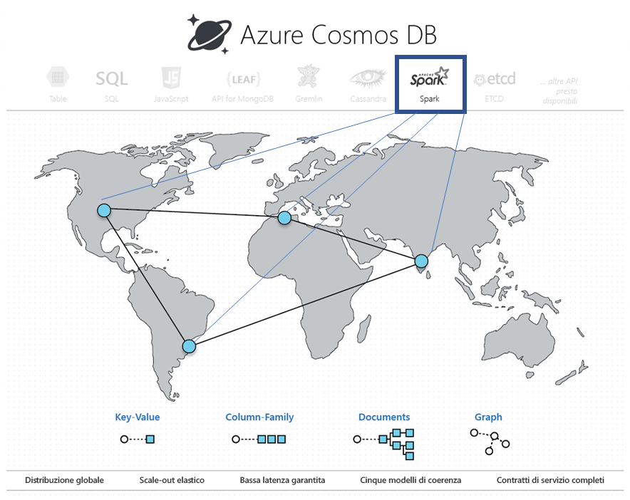

# Analisi operativa predefinita in Azure Cosmos DB con Apache Spark (anteprima) 

Il supporto predefinito di Apache Spark in Azure Cosmos DB consente di eseguire analisi da Apache Spark sui dati archiviati in un account Azure Cosmos. È disponibile il supporto nativo per l'esecuzione diretta dei processi Apache Spark nei database Cosmos distribuiti a livello globale. Con queste funzionalità, sviluppatori, data engineer e data scientist possono usare Azure Cosmos DB come piattaforma dati flessibile, scalabile e ad alte prestazioni per eseguire carichi di lavoro **OLTP e OLAP/HTAP**. 

La funzionalità di calcolo di Spark è disponibile automaticamente in tutte le aree di Azure associate all'account Azure Cosmos. I processi Spark usano la funzionalità multimaster di Azure Cosmos DB e possono scrivere o eseguire query sulle repliche locali in ogni area. 

> [!NOTE]
> Il supporto predefinito per Apache Spark in Azure Cosmos DB è attualmente in anteprima limitata. Per registrarsi per l'anteprima, passare alla [pagina di registrazione per l'anteprima](https://portal.azure.com/?feature.customportal=false#create/Microsoft.DocumentDB). 

Il supporto di Apache Spark in Azure Cosmos DB offre i vantaggi seguenti:

* È possibile ridurre al minimo il tempo necessario per ottenere informazioni dettagliate per utenti e dati distribuiti geograficamente.

* È possibile semplificare l'architettura della soluzione e ridurre il [costo totale di proprietà](total-cost-ownership.md) (TCO). Il sistema avrà il minor numero di componenti per l'elaborazione dei dati ed evita qualsiasi spostamento dei dati non necessario tra di essi.

* Crea un confine di [sicurezza](secure-access-to-data.md), [conformità](compliance.md) e controllo che include tutti i dati sottoposti a gestione.

* Fornisce funzionalità di analisi sempre attive o [a disponibilità elevata](high-availability.md) per gli utenti finali, supportate da rigorosi contratti di servizio.

 
Il supporto di Apache Spark in Azure Cosmos DB consente di creare e distribuire soluzioni come modelli di intelligenza artificiale e Deep Learning, analisi predittiva, elementi consigliati, IoT, clienti a 360°, rilevamento delle frodi, analisi clickstream e del sentiment del testo. Queste soluzioni vengono applicate direttamente ai dati di Azure Cosmos DB.

È possibile configurare un processo ETL batch e di streaming in Azure Cosmos DB, senza dover uscire dal servizio di database o aggiungere altri servizi di calcolo. È possibile incrementare in modo elastico l'ambiente di calcolo quando necessario per eseguire un processo ETL e ridurlo quando il processo è stato eseguito.

Il supporto di Apache Spark in Azure Cosmos DB offre il supporto predefinito per il Machine Learning nei runtime di Apache Spark. I runtime includono Spark MLLib, Microsoft Machine Learning per Spark, Azure Machine Learning e Servizi cognitivi. Con queste funzionalità, data scientist, data engineer e analisti dei dati possono creare e rendere operativi modelli di Machine Learning direttamente in Azure Cosmos DB, in una frazione del tempo e a costi contenuti.

## Vantaggi principali

### Analisi operativa e intelligenza artificiale distribuite a livello globale e a bassa latenza

Con Apache Spark sul database di Azure Cosmos DB distribuito a livello globale ora è possibile ottenere analisi approfondite in tempi rapidi in tutto il mondo. Azure Cosmos DB consente **analisi operative distribuite a livello globale e a bassa latenza** con scalabilità elastica attraverso tre tecniche principali:

* Poiché il database di Azure Cosmos DB è distribuito a livello globale, tutti i dati vengono inseriti in locale nella posizione in cui si trovano i produttori dei dati (ad esempio, gli utenti). Le query vengono eseguite sulle repliche locali più vicine sia ai produttori che ai consumer dei dati, indipendentemente dalla posizione in cui si trovano. 

* Tutte le query analitiche vengono eseguite direttamente sui dati indicizzati archiviati nelle partizioni dati, senza richiedere spostamenti di dati non necessari. 

* Poiché Spark condivide la stessa posizione con Azure Cosmos DB, viene eseguito un numero inferiore di conversioni intermedie e spostamenti dei dati, migliorando le prestazioni e la scalabilità.

### Esperienza serverless unificata per Apache Spark

Essendo un database multimodello, Azure Cosmos DB ora espande il proprio supporto per le API OSS, fornendo un'**esperienza serverless unificata per Apache Spark** con modelli di dati chiave-valore, documento, a grafi e con famiglie di colonne. I diversi modelli di dati sono supportati tramite le API MongoDB, Cassandra, Gremlin, Etcd e SQL, tutte le quali operano sugli stessi dati sottostanti. 

Con il supporto di Apache Spark in Azure Cosmos DB è possibile supportare in modo nativo le applicazioni scritte in Scala, Python e Java, nonché usare varie librerie strettamente integrate per SQL. Queste librerie includono ([Spark SQL](https://spark.apache.org/sql/)), Machine Learning (Spark [MLlib](https://spark.apache.org/mllib/)), elaborazione di flussi ([Spark Structured Streaming](https://spark.apache.org/streaming/)) ed elaborazione di grafi (Spark [GraphFrames]( https://docs.databricks.com/spark/latest/graph-analysis/graphframes/user-guide-python.html)). Questi strumenti rendono più semplice sfruttare Apache Spark per un'ampia gamma di casi d'uso. Non è necessario occuparsi della gestione di Spark o di configurare cluster Spark. È possibile usare le familiari API di Apache Spark e i **notebook di Jupyter** per l'API di analisi e SQL o qualsiasi API NoSQL OSS come Cassandra per l'elaborazione transazionale sugli stessi dati sottostanti nello stesso momento.

### Nessuna gestione di schemi o indici

A differenza dei tradizionali database analitici, con Azure Cosmos DB i data engineer e i data scientist non devono più occuparsi di complessi schemi e della gestione degli indici. Il motore di database in Azure Cosmos DB non richiede alcuno schema esplicito né la gestione degli indici ed è in grado di indicizzare automaticamente tutti i dati inseriti per servire rapidamente le query Apache Spark. 

### Opzioni per la coerenza

Poiché i processi Apache Spark vengono eseguiti nelle partizioni dati del database di Azure Cosmos DB, le query disporranno di [cinque opzioni ben definite per la coerenza](consistency-levels.md). Questi modelli di coerenza offrono la flessibilità di scegliere la coerenza assoluta per fornire i risultati più accurati per gli algoritmi di Machine Learning senza compromettere la latenza e la disponibilità elevata. 

### Contratti di servizio completi

I processi Apache Spark avranno i vantaggi di Azure Cosmos DB, ad esempio [contratti di servizio](https://azure.microsoft.com/support/legal/sla/documentdb/v1_1/) completi leader di settore (99,999) senza alcun sovraccarico per la gestione di cluster Apache Spark distinti. Questi contratti di servizio includono velocità effettiva, latenza al 99° percentile, coerenza e disponibilità elevata. 

### Carichi di lavoro misti

L'integrazione di Apache Spark in Azure Cosmos DB consente di superare la separazione tra transazionale e analitico, che rappresentava uno dei principali problemi dei clienti durante la creazione di applicazioni native del cloud su scala globale. 

## Supporto incorporato dei notebook di Jupyter

Azure Cosmos DB supporta i notebook di Jupyter predefiniti per tutte le API, ad esempio Cassandra, MongoDB, SQL, Gremlin e Tabella. Tali notebook vengono eseguiti all'interno degli account Azure Cosmos e migliorano l'esperienza di sviluppo. Il supporto incorporato dei notebook per tutte le API Azure Cosmos DB e i modelli di dati consente di eseguire le query in modo interattivo. È anche possibile eseguire modelli di Machine Learning e analizzare i dati archiviati nei database Azure Cosmos. Sfruttando l'esperienza di notebook di Jupyter, è possibile analizzare i dati archiviati, creare ed eseguire il training per i modelli di Machine Learning, nonché eseguire l'inferenza sui dati nel portale di Azure come mostrato nella figura seguente:

## Passaggi successivi

* Per altre informazioni sui vantaggi di Azure Cosmos DB, vedere l'articolo [Panoramica](introduction.md).
* [Come iniziare a usare l'API di Azure Cosmos DB per MongoDB](mongodb-introduction.md)
* [Introduzione all'API Cassandra di Azure Cosmos DB](cassandra-introduction.md)
* [Introduzione all'API Gremlin di Azure Cosmos DB](graph-introduction.md)
* [Introduzione all'API Tabelle di Azure Cosmos DB](table-introduction.md)

