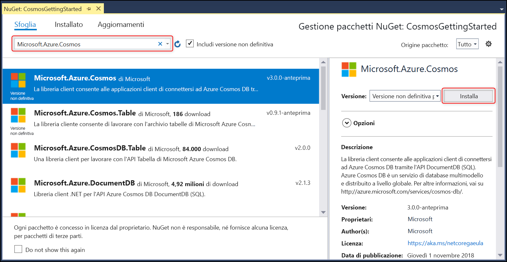

# <a name="build-a-net-console-app-to-manage-data-in-azure-cosmos-db-sql-api-account-sdk-version-3-preview"></a>Compilare un'app console .NET per gestire i dati in un account API SQL di Azure Cosmos DB (anteprima SDK versione 3)

> [!div class="op_single_selector"]
> * [.NET (Preview)](sql-api-dotnet-get-started-preview.md)
> * [.NET](sql-api-get-started.md)
> * [.NET Core](sql-api-dotnetcore-get-started.md)
> * [.NET Core (Preview)](sql-api-dotnet-core-get-started-preview.md)
> * [Java](sql-api-java-get-started.md)
> * [Async Java](sql-api-async-java-get-started.md)
> * [Node.js](sql-api-nodejs-get-started.md)
> 

Questa è un'esercitazione introduttiva per l'API SQL di Azure Cosmos DB. Dopo aver seguito questa esercitazione, si otterrà un'applicazione console che consente di creare e ridefinire le query delle risorse Azure Cosmos DB. Questa esercitazione usa la [versione 3.0+](https://www.nuget.org/packages/Microsoft.Azure.Cosmos) di Azure Cosmos DB .NET SDK, destinata a [.NET Standard 2.0.](https://docs.microsoft.com/dotnet/standard/net-standard)

Contenuto dell'esercitazione:

> [!div class="checklist"]
> * Creazione e connessione a un account Azure Cosmos
> * Configurazione del progetto in Visual Studio
> * Creazione di un database e di un contenitore
> * Aggiunta di elementi al contenitore
> * Esecuzione di query sul contenitore
> * Esecuzione di operazioni CRUD sull'elemento
> * Eliminazione del database

Non si ha tempo? Nessun problema. La soluzione completa è disponibile in [GitHub](https://github.com/Azure-Samples/cosmos-dotnet-getting-started). Per istruzioni rapide, vedere la sezione [Ottenere la soluzione completa per l'esercitazione](#GetSolution).

Ecco come procedere.

## <a name="prerequisites"></a>Prerequisiti

* Un account Azure attivo. Se non si ha un account, è possibile iscriversi per ottenere un [account gratuito](https://azure.microsoft.com/free/). 

  [!INCLUDE [cosmos-db-emulator-docdb-api](../../includes/cosmos-db-emulator-docdb-api.md)]

* [!INCLUDE [cosmos-db-emulator-vs](../../includes/cosmos-db-emulator-vs.md)]

## <a name="step-1-create-an-azure-cosmos-db-account"></a>Passaggio 1: Creare un account Azure Cosmos DB
Creare prima di tutto un account Azure Cosmos DB. Se si ha già un account, è possibile ignorare questo passaggio e passare a [Configurare la soluzione Visual Studio](#SetupVS). Se si usa l'emulatore di Azure Cosmos DB, seguire i passaggi descritti nell'articolo [Usare l'emulatore di Azure Cosmos DB per sviluppo e test locali](local-emulator.md) per configurare l'emulatore e proseguire con il passaggio [Configurare il progetto di Visual Studio](#SetupVS).

[!INCLUDE [create-dbaccount-preview](../../includes/cosmos-db-create-dbaccount-preview.md)]

## <a id="SetupVS"></a>Passaggio 2: configurare il progetto di Visual Studio
1. Aprire **Visual Studio 2017** nel computer.
1. Scegliere **Nuovo** dal menu **File** e quindi selezionare **Progetto**.
1. Nella finestra di dialogo **Nuovo progetto** selezionare **Visual C#** / **App console (.NET Framework)**, assegnare un nome al progetto e quindi fare clic su **OK**.
    
1. In **Esplora soluzioni** fare clic con il pulsante destro del mouse sulla nuova applicazione console, disponibile nella soluzione di Visual Studio, quindi scegliere **Gestisci pacchetti NuGet**.
    
    
1. Nella scheda **NuGet** fare clic su **Sfoglia** e digitare **Microsoft.Azure.Cosmos** nella casella di ricerca. Assicurarsi di selezionare *Includi versione preliminare* per trovare la versione di anteprima.
1. Nei risultati trovare **Microsoft.Azure.Cosmos** e fare clic su **Installa**.
   L'ID pacchetto per la libreria client dell'API SQL di Azure Cosmos DB è [Microsoft Azure Cosmos DB Client Library](https://www.nuget.org/packages/Microsoft.Azure.Cosmos/).
   

    Se viene visualizzato un messaggio sulla verifica delle modifiche alla soluzione, fare clic su **OK**. Se viene visualizzato un messaggio sull'accettazione della licenza, fare clic su **Accetto**.

L'installazione è riuscita. Ora che abbiamo completato l'installazione, iniziamo a scrivere il codice. Un progetto di codice completo di questa esercitazione è disponibile in [GitHub](https://github.com/Azure-Samples/cosmos-dotnet-getting-started).

## <a id="Connect"></a>Passaggio 3: collegarsi a un account di Azure Cosmos DB
1. Prima di tutto sostituire i riferimenti all'inizio dell'applicazione C#, nel file **Program.cs**, con questi riferimenti:
    ```csharp
    using System;
    using System.Threading.Tasks;
    using System.Configuration;
    using Microsoft.Azure.Cosmos;
    using System.Collections.Generic;
    using System.Net;
    ```
1. Aggiungere quindi queste costanti e variabili nella classe pubblica ``Program``.
    ```csharp
    public class Program
    {
        // ADD THIS PART TO YOUR CODE

        // The Azure Cosmos DB endpoint for running this sample.
        private static readonly string EndpointUri = "<your endpoint here>";
        // The primary key for the Azure Cosmos account.
        private static readonly string PrimaryKey = "<your primary key>";

        // The Cosmos client instance
        private CosmosClient cosmosClient;

        // The database we will create
        private CosmosDatabase database;

        // The container we will create.
        private CosmosContainer container;

        // The name of the database and container we will create
        private string databaseId = "FamilyDatabase";
        private string containerId = "FamilyContainer";
    }
    ```
    Si noti che, se si ha familiarità con la versione precedente di .NET SDK, ci si potrebbe aspettare di vedere termini come "raccolta" e "documento". Poiché Azure Cosmos DB supporta più modelli di API, nella versione 3.0+ di .NET SDK vengono usati i termini generici "contenitore" ed "elemento". Un contenitore può essere una raccolta, un grafo o una tabella. Un elemento può essere un documento, un arco/vertice o una riga ed è il contenuto all'interno di un contenitore. [Altre informazioni su database, contenitori ed elementi.](databases-containers-items.md)

1. Recuperare la chiave primaria e l'URL dell'endpoint dal [portale di Azure](https://portal.azure.com).

    Nel portale di Azure passare all'account Azure Cosmos DB e quindi fare clic su **Chiavi**.

    Copiare l'URI dal portale e incollarlo in `<your endpoint URL>` nel file ```Program.cs```. Copiare la CHIAVE PRIMARIA dal portale e incollarla in `<your primary key>`.

   

1. A questo punto occorre creare una nuova istanza di ```CosmosClient``` e configurare lo scaffolding per il programma.

    Sotto il metodo **Main** aggiungere una nuova attività asincrona denominata **GetStartedDemoAsync**, che creerà un'istanza del nuovo ```CosmosClient```. Si userà **GetStartedDemoAsync** come punto di ingresso che chiama i metodi che operano sulle risorse di Azure Cosmos DB.

    ```csharp
    public static async Task Main(string[] args)
    {
    }

    // ADD THIS PART TO YOUR CODE
    /*
        Entry point to call methods that operate on Azure Cosmos DB resources in this sample
    */   
    public async Task GetStartedDemoAsync()
    {
        // Create a new instance of the Cosmos Client
        this.cosmosClient = new CosmosClient(EndpointUri, PrimaryKey);
    }
    ```

1. Aggiungere il codice seguente per eseguire l'attività asincrona **GetStartedDemoAsync** dal metodo **Main**. Il metodo **Main** rileva le eccezioni e le scrive nella console.
    ```csharp
    public static async Task Main(string[] args)
    {
        // ADD THIS PART TO YOUR CODE
        try
        {
            Console.WriteLine("Beginning operations...\n");
            Program p = new Program();
            await p.GetStartedDemoAsync();
        }
        catch (CosmosException de)
        {
            Exception baseException = de.GetBaseException();
            Console.WriteLine("{0} error occurred: {1}\n", de.StatusCode, de);
        }
        catch (Exception e)
        {
            Console.WriteLine("Error: {0}\n", e);
        }
        finally
        {
            Console.WriteLine("End of demo, press any key to exit.");
            Console.ReadKey();
        }
    }
    ```

1. Premere **F5** per eseguire l'applicazione. L'output della finestra della console mostra il messaggio `End of demo, press any key to exit.`, che conferma che è stata stabilita la connessione ad Azure Cosmos DB. È quindi possibile chiudere la finestra della console. 

Congratulazioni! La connessione a un account di Azure Cosmos DB è stata stabilita correttamente. 

## <a name="step-4-create-a-database"></a>Passaggio 4: Creare un database
Un database si può creare usando la funzione [**CreateDatabaseIfNotExistsAsync**](https://docs.microsoft.com/dotnet/api/microsoft.azure.cosmos.cosmosdatabases) o [**CreateDatabaseAsync**](https://docs.microsoft.com/dotnet/api/microsoft.azure.cosmos.cosmosdatabases) della classe ``CosmosDatabases``. Un database è un contenitore logico di elementi partizionati tra contenitori.
    
1. Copiare e incollare il metodo **CreateDatabase** sotto il metodo **GetStartedDemoAsync**. **CreateDatabase** creerà un nuovo database, se non è già esistente, con l'ID ``FamilyDatabase`` specificato nel campo ``databaseId``. 

    ```csharp
    /*
        Create the database if it does not exist
    */    
    private async Task CreateDatabase()
    {
        // Create a new database
        this.database = await this.cosmosClient.Databases.CreateDatabaseIfNotExistsAsync(databaseId);
        Console.WriteLine("Created Database: {0}\n", this.database.Id);
    }
    ```

1. Copiare e incollare il codice seguente nel punto in cui è stata creata l'istanza di CosmosClient per chiamare il metodo **CreateDatabase** appena aggiunto.

    ```csharp
    public async Task GetStartedDemoAsync()
    {
        // Create a new instance of the Cosmos Client
        this.cosmosClient = new CosmosClient(EndpointUri, PrimaryKey);

        //ADD THIS PART TO YOUR CODE
        await this.CreateDatabase(); 
    }
    ```

    A questo punto il codice dovrebbe avere un aspetto simile al seguente, con l'endpoint e la chiave primaria compilati.
    ```csharp
    using System;
    using System.Threading.Tasks;
    using System.Configuration;
    using Microsoft.Azure.Cosmos;
    using System.Collections.Generic;
    using System.Net;

    namespace CosmosGettingStarted
    {
        class Program
        {
            // The Azure Cosmos DB endpoint for running this sample.
            private static readonly string EndpointUri = "<your endpoint here>";
            // The primary key for the Azure Cosmos account.
            private static readonly string PrimaryKey = "<your primary key>";

            // The Cosmos client instance
            private CosmosClient cosmosClient;
        
            // The database we will create
            private CosmosDatabase database;

            // The container we will create.
            private CosmosContainer container;

            // The name of the database and container we will create
            private string databaseId = "FamilyDatabase";
            private string containerId = "FamilyContainer";

            public static async Task Main(string[] args)
            {
                try
                {
                    Console.WriteLine("Beginning operations...");
                    Program p = new Program();
                    await p.GetStartedDemoAsync();
                }
                catch (CosmosException de)
                {
                    Exception baseException = de.GetBaseException();
                    Console.WriteLine("{0} error occurred: {1}\n", de.StatusCode, de);
                }
                catch (Exception e)
                {
                    Console.WriteLine("Error: {0}\n", e);
                }
                finally
                {
                    Console.WriteLine("End of demo, press any key to exit.");
                    Console.ReadKey();
                }
            }

            /*
                Entry point to call methods that operate on Azure Cosmos DB resources in this sample
            */
            public async Task GetStartedDemoAsync()
            {
                // Create a new instance of the Cosmos Client
                this.cosmosClient = new CosmosClient(EndpointUri, PrimaryKey);
                await this.CreateDatabase();
            }

            /*
                Create the database if it does not exist
            */    
            private async Task CreateDatabase()
            {
                // Create a new database
                this.database = await this.cosmosClient.Databases.CreateDatabaseIfNotExistsAsync(databaseId);
                Console.WriteLine("Created Database: {0}\n", this.database.Id);
            }
        }
    }
    ```

Premere **F5** per eseguire l'applicazione.

Congratulazioni! La creazione di un database di Azure Cosmos DB è stata completata.  

## <a id="CreateColl"></a>Passaggio 5: Creare un contenitore
> [!WARNING]
> La chiamata del metodo **CreateContainerIfNotExistsAsync** creerà un nuovo contenitore, con implicazioni in termini di prezzi. Per altre informazioni, visitare la [pagina relativa ai prezzi](https://azure.microsoft.com/pricing/details/cosmos-db/).
> 
> 

Un contenitore può essere creato usando la funzione [**CreateContainerIfNotExistsAsync**](https://docs.microsoft.com/dotnet/api/microsoft.azure.cosmos.cosmoscontainers) o [**CreateContainerAsync**](https://docs.microsoft.com/dotnet/api/microsoft.azure.cosmos.cosmoscontainers) della classe **CosmosContainers**. Un contenitore è costituito da elementi, che nel caso dell'API SQL sono documenti JSON, e dalla logica dell'applicazione JavaScript lato server associata, come stored procedure, funzioni definite dall'utente e trigger.

1. Copiare e incollare il metodo **CreateContainer** sotto il metodo **CreateDatabase**. **CreateContainer** creerà un nuovo contenitore, se non è già esistente, con l'ID ``FamilyContainer`` specificato nel campo ``containerId``. 

    ```csharp
    /*
        Create the container if it does not exist. 
        Specifiy "/LastName" as the partition key since we're storing family information, to ensure good distribution of requests and storage.
    */
    private async Task CreateContainer()
    {
        // Create a new container
        this.container = await this.database.Containers.CreateContainerIfNotExistsAsync(containerId, "/LastName");
        Console.WriteLine("Created Container: {0}\n", this.container.Id);
    }
    ```

1. Copiare e incollare il codice seguente nel punto in cui è stata creata l'istanza di CosmosClient per chiamare il metodo **CreateContainer** appena aggiunto.

    ```csharp
    public async Task GetStartedDemoAsync()
    {
        // Create a new instance of the Cosmos Client
        this.cosmosClient = new CosmosClient(EndpointUri, PrimaryKey);
        await this.CreateDatabase(); 

        //ADD THIS PART TO YOUR CODE
        await this.CreateContainer();
    }
    ```
Premere **F5** per eseguire l'applicazione.

Congratulazioni! La creazione di un contenitore di Azure Cosmos DB è stata completata.  

## <a id="CreateDoc"></a>Passaggio 6: Aggiungere elementi al contenitore
È possibile creare un elemento usando la funzione [**CreateItemAsync**](https://docs.microsoft.com/dotnet/api/microsoft.azure.cosmos.cosmositems) della classe **CosmosItems**. Quando si usa l'API SQL, gli elementi vengono proiettati come documenti, che sono contenuto JSON definito dall'utente (arbitrario). È ora possibile inserire un elemento nel contenitore di Azure Cosmos DB.

È necessario creare prima di tutto una classe **Family** che rappresenterà gli oggetti archiviati in Azure Cosmos DB in questo esempio. Verranno create anche le sottoclassi **Parent**, **Child**, **Pet** e **Address** da usare in **Family**. Si noti che i documenti devono avere una proprietà **Id** serializzata come **id** in JSON. 
1. Premere **CTRL+MAIUSC+A** per aprire la finestra di dialogo **Aggiungi nuovo elemento**. Aggiungere una nuova classe **Family.cs** al progetto. 

    

1. Copiare e incollare le classi **Family**, **Parent**, **Child**, **Pet** e **Address** in **Family.cs**. 
    ```csharp
    using Newtonsoft.Json;

    namespace CosmosGettingStarted
    {
        public class Family
        {
            [JsonProperty(PropertyName = "id")]
            public string Id { get; set; }
            public string LastName { get; set; }
            public Parent[] Parents { get; set; }
            public Child[] Children { get; set; }
            public Address Address { get; set; }
            public bool IsRegistered { get; set; }
            public override string ToString()
            {
                return JsonConvert.SerializeObject(this);
            }
        }

        public class Parent
        {
            public string FamilyName { get; set; }
            public string FirstName { get; set; }
        }

        public class Child
        {
            public string FamilyName { get; set; }
            public string FirstName { get; set; }
            public string Gender { get; set; }
            public int Grade { get; set; }
            public Pet[] Pets { get; set; }
        }

        public class Pet
        {
            public string GivenName { get; set; }
        }

        public class Address
        {
            public string State { get; set; }
            public string County { get; set; }
            public string City { get; set; }
        }
    }
    ```
1. Tornare a **Program.cs** e aggiungere il metodo **AddItemsToContainer** sotto il metodo **CreateContainer**. Il codice verifica che non esista già un elemento con lo stesso ID prima di crearlo. Si inseriranno due elementi, relativi rispettivamente alla famiglia Andersen e alla famiglia Wakefield.

    ```csharp
    /*
        Add Family items to the container
    */
    private async Task AddItemsToContainer()
    {
        // Create a family object for the Andersen family
        Family andersenFamily = new Family
        {
            Id = "Andersen.1",
            LastName = "Andersen",
            Parents = new Parent[]
            {
                new Parent { FirstName = "Thomas" },
                new Parent { FirstName = "Mary Kay" }
            },
            Children = new Child[]
            {
                new Child
                {
                    FirstName = "Henriette Thaulow",
                    Gender = "female",
                    Grade = 5,
                    Pets = new Pet[]
                    {
                        new Pet { GivenName = "Fluffy" }
                    }
                }
            },
            Address = new Address { State = "WA", County = "King", City = "Seattle" },
            IsRegistered = true
        };

        // Read the item to see if it exists. Note ReadItemAsync will not throw an exception if an item does not exist. Instead, we check the StatusCode property off the response object. 
        CosmosItemResponse<Family> andersenFamilyResponse = await this.container.Items.ReadItemAsync<Family>(andersenFamily.LastName, andersenFamily.Id);

        if (andersenFamilyResponse.StatusCode == HttpStatusCode.NotFound)
        {
            // Create an item in the container representing the Andersen family. Note we provide the value of the partition key for this item, which is "Andersen"
            andersenFamilyResponse = await this.container.Items.CreateItemAsync<Family>(andersenFamily.LastName, andersenFamily);

            // Note that after creating the item, we can access the body of the item with the Resource property off the CosmosItemResponse. 
            //We can also access the RequestCharge property to see the amount of RUs consumed on this request.
            Console.WriteLine("Created item in database with id: {0} Operation consumed {1} RUs.\n", andersenFamilyResponse.Resource.Id, andersenFamilyResponse.RequestCharge);
        }
        else
        {
            Console.WriteLine("Item in database with id: {0} already exists\n", andersenFamilyResponse.Resource.Id);
        }

        // Create a family object for the Wakefield family
        Family wakefieldFamily = new Family
        {
            Id = "Wakefield.7",
            LastName = "Wakefield",
            Parents = new Parent[]
            {
                new Parent { FamilyName = "Wakefield", FirstName = "Robin" },
                new Parent { FamilyName = "Miller", FirstName = "Ben" }
            },
            Children = new Child[]
            {
                new Child
                {
                    FamilyName = "Merriam",
                    FirstName = "Jesse",
                    Gender = "female",
                    Grade = 8,
                    Pets = new Pet[]
                    {
                        new Pet { GivenName = "Goofy" },
                        new Pet { GivenName = "Shadow" }
                    }
                },
                new Child
                {
                    FamilyName = "Miller",
                    FirstName = "Lisa",
                    Gender = "female",
                    Grade = 1
                }
            },
            Address = new Address { State = "NY", County = "Manhattan", City = "NY" },
            IsRegistered = false
        };

        // Read the item to see if it exists
        CosmosItemResponse<Family> wakefieldFamilyResponse = await this.container.Items.ReadItemAsync<Family>(wakefieldFamily.LastName, wakefieldFamily.Id);

        if (wakefieldFamilyResponse.StatusCode == HttpStatusCode.NotFound)
        {
            // Create an item in the container representing the Wakefield family. Note we provide the value of the partition key for this item, which is "Wakefield"
            wakefieldFamilyResponse = await this.container.Items.CreateItemAsync<Family>(wakefieldFamily.LastName, wakefieldFamily);

            // Note that after creating the item, we can access the body of the item with the Resource property off the CosmosItemResponse. 
            //We can also access the RequestCharge property to see the amount of RUs consumed on this request.
            Console.WriteLine("Created item in database with id: {0} Operation consumed {1} RUs.\n", wakefieldFamilyResponse.Resource.Id, wakefieldFamilyResponse.RequestCharge);
        }
        else
        {
            Console.WriteLine("Item in database with id: {0} already exists\n", wakefieldFamilyResponse.Resource.Id);
        }
    }
    ```
1. Aggiungere una chiamata a ``AddItemsToContainer`` nel metodo ``GetStartedDemoAsync``.

    ```csharp
    public async Task GetStartedDemoAsync()
    {
        // Create a new instance of the Cosmos Client
        this.cosmosClient = new CosmosClient(EndpointUri, PrimaryKey);
        await this.CreateDatabase(); 
        await this.CreateContainer();

        //ADD THIS PART TO YOUR CODE
        await this.AddItemsToContainer();
    }
    ```

Premere **F5** per eseguire l'applicazione.

Congratulazioni! La creazione di due elementi di Azure Cosmos DB è stata completata.  


## <a id="Query"></a>Passaggio 7: eseguire query sulle risorse di Azure Cosmos DB
Azure Cosmos DB supporta [query complesse](sql-api-sql-query.md) sui documenti JSON archiviati in ogni raccolta. Il codice di esempio seguente mostra come eseguire una query sugli elementi inseriti nella procedura precedente.

1. Copiare e incollare il metodo **RunQuery** sotto il metodo **AddItemsToContainer**.

    ```csharp
    /*
        Run a query (using Azure Cosmos DB SQL syntax) against the container
    */
    private async Task RunQuery()
    {
        var sqlQueryText = "SELECT * FROM c WHERE c.LastName = 'Andersen'";
        var partitionKeyValue = "Andersen";

        Console.WriteLine("Running query: {0}\n", sqlQueryText);

        CosmosSqlQueryDefinition queryDefinition = new CosmosSqlQueryDefinition(sqlQueryText);
        CosmosResultSetIterator<Family> queryResultSetIterator = this.container.Items.CreateItemQuery<Family>(queryDefinition, partitionKeyValue);

        List<Family> families = new List<Family>();

        while (queryResultSetIterator.HasMoreResults)
        {
            CosmosQueryResponse<Family> currentResultSet = await queryResultSetIterator.FetchNextSetAsync();
            foreach (Family family in currentResultSet)
            {
                families.Add(family);
                Console.WriteLine("\tRead {0}\n", family);
            }
        }
    }
    ```
1. Aggiungere una chiamata a ``RunQuery`` nel metodo ``GetStartedDemoAsync``.

    ```csharp
    public async Task GetStartedDemoAsync()
    {
        // Create a new instance of the Cosmos Client
        this.cosmosClient = new CosmosClient(EndpointUri, PrimaryKey);
        await this.CreateDatabase(); 
        await this.CreateContainer();
        await this.AddItemsToContainer();

        //ADD THIS PART TO YOUR CODE
        await this.RunQuery();
    }
    ```

Premere **F5** per eseguire l'applicazione.

Congratulazioni! L'esecuzione di una query su un contenitore di Azure Cosmos DB è stata completata.

## <a id="ReplaceItem"></a>Passaggio 8: sostituire un elemento JSON
In questo passaggio si aggiornerà un elemento in Azure Cosmos DB.

1. Copiare e incollare il metodo **ReplaceFamilyItem** sotto il metodo **RunQuery**. Si cambierà la proprietà ``IsRegistered`` della famiglia e il ``Grade`` di uno dei figli.
    ```csharp
    /*
    Update an item in the container
    */
    private async Task ReplaceFamilyItem()
    {
        CosmosItemResponse<Family> wakefieldFamilyResponse = await this.container.Items.ReadItemAsync<Family>("Wakefield", "Wakefield.7");
        var itemBody = wakefieldFamilyResponse.Resource;
        
        // update registration status from false to true
        itemBody.IsRegistered = true;
        // update grade of child
        itemBody.Children[0].Grade = 6;

        // replace the item with the updated content
        wakefieldFamilyResponse = await this.container.Items.ReplaceItemAsync<Family>(itemBody.LastName, itemBody.Id, itemBody);
        Console.WriteLine("Updated Family [{0},{1}]\n. Body is now: {2}\n", itemBody.LastName, itemBody.Id, wakefieldFamilyResponse.Resource);
    }
    ```
1. Aggiungere una chiamata a ``ReplaceFamilyItem`` nel metodo ``GetStartedDemo``.

    ```csharp
    public async Task GetStartedDemoAsync()
    {
        // Create a new instance of the Cosmos Client
        this.cosmosClient = new CosmosClient(EndpointUri, PrimaryKey);
        await this.CreateDatabase(); 
        await this.CreateContainer();
        await this.AddItemsToContainer();
        await this.RunQuery();

        //ADD THIS PART TO YOUR CODE
        await this.ReplaceFamilyItem();
    }
    ```
Premere **F5** per eseguire l'applicazione.

Congratulazioni! La sostituzione di un elemento di Azure Cosmos DB è stata completata.

## <a id="DeleteDocument"></a>Passaggio 9: Elimina elemento
In questo passaggio si eliminerà un elemento in Azure Cosmos DB.

1. Copiare e incollare il metodo **DeleteFamilyItem** sotto il metodo **ReplaceFamilyItem**.
    ```csharp
    /*
    Delete an item in the container
    */
    private async Task DeleteFamilyItem()
    {
        var partitionKeyValue = "Wakefield";
        var familyId = "Wakefield.7";

        // Delete an item. Note we must provide the partition key value and id of the item to delete
        CosmosItemResponse<Family> wakefieldFamilyResponse = await this.container.Items.DeleteItemAsync<Family>(partitionKeyValue, familyId);
        Console.WriteLine("Deleted Family [{0},{1}]\n", partitionKeyValue, familyId);
    }
    ```
1. Aggiungere una chiamata a ``DeleteFamilyItem`` nel metodo ``GetStartedDemo``.

    ```csharp
    public async Task GetStartedDemoAsync()
    {
        // Create a new instance of the Cosmos Client
        this.cosmosClient = new CosmosClient(EndpointUri, PrimaryKey);
        await this.CreateDatabase(); 
        await this.CreateContainer();
        await this.AddItemsToContainer();
        await this.RunQuery();
        await this.ReplaceFamilyItem();

        //ADD THIS PART TO YOUR CODE
        await this.DeleteFamilyItem();
    }
    ```

Premere **F5** per eseguire l'applicazione.

Congratulazioni! L'eliminazione di un elemento di Azure Cosmos DB è stata completata.

## <a id="DeleteDatabase"></a>Passaggio 10: eliminare il database
È il momento di eliminare il database. Eliminando il database creato, insieme al database vengono rimosse tutte le risorse figlio, ossia contenitori, elementi ed eventuali stored procedure, funzioni definite dall'utente e trigger. Si procederà anche all'eliminazione dell'istanza di **CosmosClient**.

1. Copiare e incollare il metodo **DeleteDatabaseAndCleanup** sotto il metodo **DeleteFamilyItem**.
    ```csharp
    /*
    Delete the database and dispose of the Cosmos Client instance
    */
    private async Task DeleteDatabaseAndCleanup()
    {
        CosmosDatabaseResponse databaseResourceResponse = await this.database.DeleteAsync();
        // Also valid: await this.cosmosClient.Databases["FamilyDatabase"].DeleteAsync();

        Console.WriteLine("Deleted Database: {0}\n", this.databaseId);

        //Dispose of CosmosClient
        this.cosmosClient.Dispose();
    }
    ```
1. Aggiungere una chiamata a ``DeleteDatabaseAndCleanup`` nel metodo ``GetStartedDemo``.
    
    ```csharp
    public async Task GetStartedDemoAsync()
    {
        // Create a new instance of the Cosmos Client
        this.cosmosClient = new CosmosClient(EndpointUri, PrimaryKey);
        await this.CreateDatabase(); 
        await this.CreateContainer();
        await this.AddItemsToContainer();
        await this.RunQuery();
        await this.ReplaceFamilyItem();
        await this.DeleteFamilyItem();

        //ADD THIS PART TO YOUR CODE        
        await this.DeleteDatabaseAndCleanup();
    }
    ```

Premere **F5** per eseguire l'applicazione.

Congratulazioni! L'eliminazione di un database di Azure Cosmos DB è stata completata.

## <a id="Run"></a>Passaggio 11: eseguire l'intera applicazione console C#
Premere F5 in Visual Studio per compilare ed eseguire l'applicazione in modalità di debug.

Dovrebbe essere visualizzato l'output dell'intera app in una finestra della console. L'output visualizzerà i risultati delle query aggiunte e dovrà corrispondere al testo di esempio riportato di seguito.

```
Beginning operations...

Created Database: FamilyDatabase

Created Container: FamilyContainer

Created item in database with id: Andersen.1 Operation consumed 11.43 RUs.

Created item in database with id: Wakefield.7 Operation consumed 14.29 RUs.

Running query: SELECT * FROM c WHERE c.LastName = 'Andersen'

        Read {"id":"Andersen.1","LastName":"Andersen","Parents":[{"FamilyName":null,"FirstName":"Thomas"},{"FamilyName":null,"FirstName":"Mary Kay"}],"Children":[{"FamilyName":null,"FirstName":"Henriette Thaulow","Gender":"female","Grade":5,"Pets":[{"GivenName":"Fluffy"}]}],"Address":{"State":"WA","County":"King","City":"Seattle"},"IsRegistered":false}

Updated Family [Wakefield,Wakefield.7].
        Body is now: {"id":"Wakefield.7","LastName":"Wakefield","Parents":[{"FamilyName":"Wakefield","FirstName":"Robin"},{"FamilyName":"Miller","FirstName":"Ben"}],"Children":[{"FamilyName":"Merriam","FirstName":"Jesse","Gender":"female","Grade":6,"Pets":[{"GivenName":"Goofy"},{"GivenName":"Shadow"}]},{"FamilyName":"Miller","FirstName":"Lisa","Gender":"female","Grade":1,"Pets":null}],"Address":{"State":"NY","County":"Manhattan","City":"NY"},"IsRegistered":true}

Deleted Family [Wakefield,Wakefield.7]

Deleted Database: FamilyDatabase

End of demo, press any key to exit.
```

Congratulazioni! L'esercitazione è stata completata ed è stata creata un'applicazione console C# funzionante.

## <a id="GetSolution"></a> Ottenere la soluzione completa per l'esercitazione
Se non si ha tempo per completare le procedure dell'esercitazione o se si vogliono solo scaricare gli esempi di codice, è possibile ottenerli da [GitHub](https://github.com/Azure-Samples/cosmos-dotnet-getting-started). 

Per compilare la soluzione GetStarted, sono necessari gli elementi seguenti:

* Un account Azure attivo. Se non si ha un account, è possibile iscriversi per ottenere un [account gratuito](https://azure.microsoft.com/free/).
* Un [account Azure Cosmos DB][cosmos-db-create-account].
* La soluzione [GetStarted](https://github.com/Azure-Samples/cosmos-dotnet-getting-started) disponibile su GitHub.

Per ripristinare i riferimenti ad Azure Cosmos DB .NET SDK in Visual Studio, fare clic con il pulsante destro del mouse sulla soluzione **GetStarted** in Esplora soluzioni e quindi scegliere **Ripristina pacchetti NuGet**. Nel file App.config aggiornare quindi i valori EndpointUrl e PrimaryKey come illustrato nell'articolo [Connettersi a un account Azure Cosmos DB](#Connect).

A questo punto non resta che procedere con la compilazione.


## <a name="next-steps"></a>Passaggi successivi
* Per un'esercitazione su MVC ASP.NET più complessa, Vedere [Esercitazione su MVC ASP.NET: sviluppo di applicazioni Web con Azure Cosmos DB](sql-api-dotnet-application-preview.md).
* Per la scalabilità e i test delle prestazioni con Azure Cosmos DB, vedere [Test delle prestazioni e della scalabilità con Azure Cosmos DB](performance-testing.md).
* Informazioni su come [monitorare le richieste, l'utilizzo e le risorse di archiviazione di Azure Cosmos DB](monitor-accounts.md).
* Eseguire query sul set di dati di esempio illustrato nella pagina [Query Playground](https://www.documentdb.com/sql/demo).
* Per altre informazioni su Azure Cosmos DB, vedere [Introduzione ad Azure Cosmos DB](https://docs.microsoft.com/azure/cosmos-db/introduction).

[cosmos-db-create-account]: create-sql-api-dotnet-preview.md#create-account
