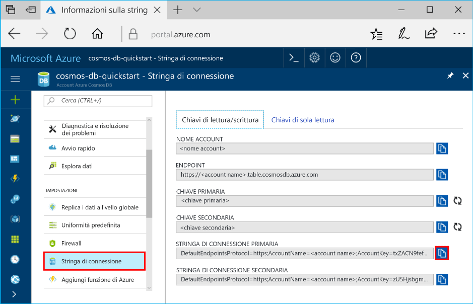

# <a name="azure-cosmos-db-develop-with-the-table-api-in-net"></a>Azure Cosmos DB: sviluppare con l'API Table in .NET

Azure Cosmos DB è il servizio di database di Microsoft multimodello distribuito a livello globale. È possibile creare ed eseguire rapidamente query su database di documenti, coppie chiave-valore e grafi, sfruttando in ognuno dei casi i vantaggi offerti dalle funzionalità di scalabilità orizzontale e distribuzione globale alla base di Azure Cosmos DB.

Questa esercitazione illustra le attività seguenti: 

> [!div class="checklist"] 
> * Creare un account Azure Cosmos DB 
> * Abilitare la funzionalità nel file app.config 
> * Creare una tabella tramite l'[API Table](table-introduction.md)
> * Aggiungere un'entità a una tabella 
> * Inserire un batch di entità 
> * Recuperare una singola entità 
> * Eseguire query su entità tramite indici secondari automatici 
> * Sostituire un'entità 
> * Eliminare un'entità 
> * Eliminare una tabella
 
## <a name="tables-in-azure-cosmos-db"></a>Tabelle in Azure Cosmos DB 

Azure Cosmos DB mette a disposizione l'[API Table](table-introduction.md) per le applicazioni che necessitano di un archivio di coppie chiave-valore con una struttura senza schema. Sia l'API Table di Azure Cosmos DB che l'[archiviazione tabelle di Azure](../storage/common/storage-introduction.md) supportano ora gli stessi SDK e le stesse API REST. È possibile usare Azure Cosmos DB per creare tabelle con requisiti di velocità effettiva elevata.

Questa esercitazione è rivolta agli sviluppatori che hanno acquisito familiarità con l'SDK di Archiviazione tabelle di Azure e che intendono usare le funzionalità Premium disponibili con Azure Cosmos DB. È basata su [Introduzione all'archiviazione tabelle di Azure con .NET](table-storage-how-to-use-dotnet.md) e illustra come sfruttare le funzionalità aggiuntive, come gli indici secondari, la velocità effettiva con provisioning e il multihosting. Questa esercitazione illustra come usare il portale di Azure per creare un account Azure Cosmos DB e quindi come compilare e distribuire un'applicazione API di tabella. Verranno esaminati anche esempi .NET per la creazione e l'eliminazione di una tabella, l'inserimento, l'aggiornamento, l'eliminazione e l'esecuzione di query per i dati delle tabelle. 

Se attualmente si usa l'archiviazione tabelle di Azure, passando all'API Table di Azure Cosmos DB è possibile ottenere i vantaggi seguenti:

- [Distribuzione globale](distribute-data-globally.md) chiavi in mano con multihosting e [failover automatici e manuali](regional-failover.md)
- Supporto per l'indicizzazione automatica indipendente dallo schema su tutte le proprietà ("indici secondari") e query rapide 
- Supporto per la [scalabilità indipendente di archiviazione e velocità effettiva](partition-data.md) in un numero qualsiasi di aree
- Supporto per la [velocità effettiva dedicata per ogni tabella](request-units.md) scalabile da centinaia a milioni di richieste al secondo
- Supporto per [cinque livelli di coerenza perfezionabili](consistency-levels.md) per ottenere un compromesso ottimale tra disponibilità, latenza e coerenza in base alle esigenze dell'applicazione
- Disponibilità al 99,99% all'interno di una singola area, possibilità di aggiungere altre aree per aumentare la disponibilità e [contratti di servizio completi leader nel settore](https://azure.microsoft.com/support/legal/sla/cosmos-db/?ref=microsoft.com&utm_source=microsoft.com&utm_medium=docs&utm_campaign=visualstudio) sulla disponibilità generale
- Usare la versione esistente di .NET SDK di Archiviazione di Azure senza apportare modifiche al codice dell'applicazione

Questa esercitazione illustra l'API Table di Azure Cosmos DB tramite .NET SDK. È possibile scaricare [Azure Storage Preview SDK](https://aka.ms/tableapinuget) da NuGet.

Per altre informazioni sulle attività complesse di archiviazione tabelle di Azure, vedere:

* [Introduzione ad Azure Cosmos DB: API Table](table-introduction.md)
* Per tutti i dettagli sulle API di [Azure Cosmos DB Table API .NET SDK](https://docs.microsoft.com/dotnet/api/overview/azure/cosmosdb/client?view=azure-dotnet) disponibili, vedere la documentazione di riferimento del servizio tabelle

### <a name="about-this-tutorial"></a>Informazioni sull'esercitazione
Questa esercitazione è rivolta agli sviluppatori con familiarità con l'SDK di archiviazione tabelle di Azure e che intendono usare le funzionalità Premium disponibili usando Azure Cosmos DB. È basata su [Introduzione all'archiviazione tabelle di Azure con .NET](table-storage-how-to-use-dotnet.md) e illustra come sfruttare le funzionalità aggiuntive, come gli indici secondari, la velocità effettiva con provisioning e il multihosting. Verrà illustrato come usare il portale di Azure per creare un account Azure Cosmos DB e quindi come compilare e distribuire un'applicazione di tabelle. Verranno esaminati anche esempi .NET per la creazione e l'eliminazione di una tabella, l'inserimento, l'aggiornamento, l'eliminazione e l'esecuzione di query per i dati delle tabelle. 

Se Visual Studio 2017 non è ancora installato, è possibile scaricare e usare la versione **gratuita** di [Visual Studio 2017 Community Edition](https://www.visualstudio.com/downloads/). Durante l'installazione di Visual Studio abilitare **Sviluppo di Azure**.

[!INCLUDE [quickstarts-free-trial-note](../../includes/quickstarts-free-trial-note.md)]

## <a name="create-a-database-account"></a>Creare un account di database

Si inizia creando un account Azure Cosmos DB nel portale di Azure.  
 
> [!IMPORTANT]  
> Per lavorare con gli SDK dell'API di tabella disponibili a livello generale, è necessario creare un nuovo account dell'API di tabella. Gli account dell'API di tabella creati durante l'anteprima non sono supportati dagli SDK disponibili a livello generale. 
>

[!INCLUDE [cosmosdb-create-dbaccount-table](../../includes/cosmos-db-create-dbaccount-table.md)] 

## <a name="clone-the-sample-application"></a>Clonare l'applicazione di esempio

A questo punto è possibile clonare un'app Table da GitHub, impostare la stringa di connessione ed eseguirla. Come si noterà, è facile usare i dati a livello di codice. 

1. Aprire una finestra del terminale Git, ad esempio git bash, ed eseguire il comando `cd` per passare a una cartella in cui installare l'app di esempio. 

    ```bash
    cd "C:\git-samples"
    ```

2. Eseguire il comando seguente per clonare l'archivio di esempio. Questo comando crea una copia dell'app di esempio nel computer in uso. 

    ```bash
    git clone https://github.com/Azure-Samples/storage-table-dotnet-getting-started.git
    ```

3. Aprire quindi il file della soluzione in Visual Studio. 

## <a name="update-your-connection-string"></a>Aggiornare la stringa di connessione

Tornare ora al portale di Azure per recuperare le informazioni sulla stringa di connessione e copiarle nell'app. Questo consente all'app di comunicare con il database ospitato. 

1. Nel [portale di Azure](http://portal.azure.com/) fare clic su **Stringa di connessione**. 

    Usare i pulsanti di copia sul lato destro della schermata per copiare la STRINGA DI CONNESSIONE PRIMARIA.

    

2. In Visual Studio aprire il file app.config. 

3. Rimuovere il commento di StorageConnectionString alla riga 8 e impostare come commento StorageConnectionString alla riga 7, in quanto questa esercitazione non usa l'emulatore di archiviazione. Ora le righe 7 e 8 dovrebbero essere simili a quanto segue:

    ```
    <!--key="StorageConnectionString" value="UseDevelopmentStorage=true;" />-->
    <add key="StorageConnectionString" value="DefaultEndpointsProtocol=https;AccountName=[AccountName];AccountKey=[AccountKey]" />
    ```

4. Incollare la STRINGA DI CONNESSIONE PRIMARIA dal portale nel valore StorageConnectionString alla riga 8. Incollare la stringa tra virgolette.
   
    > [!IMPORTANT]
    > Se l'endpoint usa documents.azure.com, ovvero si dispone di un account di anteprima, è necessario creare un [nuovo account dell'API di tabella](#create-a-database-account) per lavorare con l'SDK dell'API di tabella disponibile a livello generale. 
    >

    Ora la riga 8 dovrebbe essere simile a quanto segue:

    ```
    <add key="StorageConnectionString" value="DefaultEndpointsProtocol=https;AccountName=<account name>;AccountKey=txZACN9f...==;TableEndpoint=https://<account name>.table.cosmosdb.azure.com;" />
    ```

5. Salvare il file app.config.

L'app è stata aggiornata con tutte le informazioni necessarie per comunicare con Azure Cosmos DB. 

## <a name="azure-cosmos-db-capabilities"></a>Funzionalità di Azure Cosmos DB
Azure Cosmos DB supporta numerose funzionalità non disponibili nell'API di archiviazione tabelle di Azure. 

Alcune funzionalità sono accessibili tramite nuovi overload a CreateCloudTableClient, che consente di specificare criteri di connessione e livello di coerenza.

| Impostazioni di connessione tabella | Descrizione |
| --- | --- |
| Modalità di connessione  | Azure Cosmos DB supporta due modalità di connettività. Nella modalità `Gateway` le richieste vengono sempre eseguite al gateway di Azure Cosmos DB, che le inoltra alle partizioni di dati corrispondenti. Nella modalità di connettività `Direct` il client recupera il mapping delle tabelle alle partizioni e le richieste vengono eseguite direttamente nelle partizioni di dati. È consigliabile usare il valore predefinito `Direct`.  |
| Protocollo di connessione | Azure Cosmos DB supporta due protocolli di connessione: `Https` e `Tcp`. `Tcp` è il valore predefinito e consigliato perché si tratta di un protocollo più leggero. |
| Posizioni preferite | Elenco delimitato da virgole dei percorsi (multihosting) preferiti per le letture. Ogni account Azure Cosmos DB può essere associato a 1-30+ aree. Ogni istanza del client può specificare un sottoinsieme di queste aree nell'ordine preferito per le letture a bassa latenza. Le aree devono essere denominate usando i [nomi visualizzati](https://msdn.microsoft.com/library/azure/gg441293.aspx), ad esempio, `West US`. Vedere anche [API multihosting](tutorial-global-distribution-table.md). |
| Livello di coerenza | È possibile ottenere un compromesso ottimale tra disponibilità, coerenza e latenza scegliendo tra cinque livelli di coerenza ben definiti: `Strong`, `Session`, `Bounded-Staleness`, `ConsistentPrefix` ed `Eventual`. Il valore predefinito è `Session`. La scelta del livello di coerenza implica una differenza significativa a livello di prestazioni nelle installazioni con più aree. Per i dettagli, vedere [Livelli di coerenza](consistency-levels.md). |

L'altra funzionalità può essere abilitata tramite i valori di configurazione di `appSettings` seguenti.

| Chiave | Descrizione |
| --- | --- |
| TableThroughput | Velocità effettiva riservata per la tabella espressa in unità di richiesta (UR) al secondo. Le singole tabelle possono supportare centinaia di milioni di UR/s. Vedere [Unità richiesta](request-units.md). Il valore predefinito è `400` |
| TableIndexingPolicy | Conformazione delle stringhe JSON alla specifica dei criteri di indicizzazione. Vedere [Criteri di indicizzazione](indexing-policies.md) per informazioni su come modificare i criteri di indicizzazione in modo da includere o escludere colonne specifiche. |
| TableQueryMaxItemCount | Configurare il numero massimo di elementi restituiti per ogni query di tabella in un unico round trip. Il valore predefinito è `-1`, che consente ad Azure Cosmos DB di determinare in modo dinamico il valore in fase di runtime. |
| TableQueryEnableScan | Se la query non può usare l'indice per tutti i filtri, eseguirla comunque tramite un'analisi. Il valore predefinito è `false`.|
| TableQueryMaxDegreeOfParallelism | Il grado di parallelismo per l'esecuzione di una query tra partizioni. `0` è seriale senza prelettura, `1` è seriale con prelettura e valori più alti aumentano il grado di parallelismo. Il valore predefinito è `-1`, che consente ad Azure Cosmos DB di determinare in modo dinamico il valore in fase di runtime. |

Per cambiare il valore predefinito, aprire il file `app.config` da Esplora soluzioni in Visual Studio. Aggiungere il contenuto dell'elemento `<appSettings>` illustrato di seguito. Sostituire `account-name` con il nome dell'account di archiviazione e `account-key` con la chiave di accesso dell'account. 

```xml
<configuration>
    ...
    <appSettings>
      <!-- Client options -->
      <add key="CosmosDBStorageConnectionString" 
        value="DefaultEndpointsProtocol=https;AccountName=MYSTORAGEACCOUNT;AccountKey=AUTHKEY;TableEndpoint=https://account-name.table.cosmosdb.azure.com" />
      <add key="StorageConnectionString" value="DefaultEndpointsProtocol=https;AccountName=account-name;AccountKey=account-key; TableEndpoint=https://account-name.documents.azure.com" />

      <!--Table creation options -->
      <add key="TableThroughput" value="700"/>
      <add key="TableIndexingPolicy" value="{""indexingMode"": ""Consistent""}"/>

      <!-- Table query options -->
      <add key="TableQueryMaxItemCount" value="-1"/>
      <add key="TableQueryEnableScan" value="false"/>
      <add key="TableQueryMaxDegreeOfParallelism" value="-1"/>
      <add key="TableQueryContinuationTokenLimitInKb" value="16"/>
            
    </appSettings>
</configuration>
```

Ecco una breve analisi di ciò che accade nell'app. Aprire il file `Program.cs`. Come si noterà, queste righe di codice creano le risorse di tabella. 

## <a name="create-the-table-client"></a>Creare il client di tabella
Inizializzare `CloudTableClient` per connettersi all'account di tabella.

```csharp
CloudTableClient tableClient = storageAccount.CreateCloudTableClient();
```
Questo client viene inizializzato usando i valori di configurazione `TableConnectionMode`, `TableConnectionProtocol`, `TableConsistencyLevel` e `TablePreferredLocations`, se specificato nelle impostazioni dell'app.

## <a name="create-a-table"></a>Creare una tabella
Creare quindi una tabella usando `CloudTable`. La scalabilità delle tabelle in Azure Cosmos DB può essere indipendente in termini di archiviazione e velocità effettiva e il partizionamento viene gestito automaticamente dal servizio. Azure Cosmos DB supporta le tabelle sia senza limitazioni sia con dimensioni fisse. Vedere [Partizionamento in Azure Cosmos DB](partition-data.md) per informazioni dettagliate. 

```csharp
CloudTable table = tableClient.GetTableReference("people");

table.CreateIfNotExists();
```

Esiste una differenza importante nella creazione delle tabelle. Azure Cosmos DB riserva la velocità effettiva, a differenza del modello in base al consumo di Archiviazione di Azure per le transazioni. La velocità effettiva è dedicata/riservata. Non viene quindi mai limitata se la frequenza di richiesta è pari o inferiore alla velocità effettiva di provisioning.

È possibile configurare la velocità effettiva predefinita configurando l'impostazione per `TableThroughput` in termini di UR (unità di richiesta) al secondo. 

La lettura di un'entità di 1 KB viene normalizzata come 1 UR e le altre operazioni vengono normalizzate in una UR a valore fisso in base al consumo di CPU, memoria e IOPS. Altre informazioni sulle [unità richiesta in Azure Cosmos DB](request-units.md) e in particolare per gli [archivi di valori chiave](key-value-store-cost.md).

Verranno quindi illustrate le semplici operazioni di lettura e scrittura (CRUD) usando questo SDK. Questa esercitazione illustra le latenze pari a singole unità di millisecondi e le query rapide fornite da Azure Cosmos DB.

## <a name="add-an-entity-to-a-table"></a>Aggiungere un'entità a una tabella
Le entità in archiviazione tabelle di Azure si estendono dalla classe `TableEntity` e devono avere le proprietà `PartitionKey` e `RowKey`. Di seguito è riportata una definizione di esempio per un'entità cliente.

```csharp
public class CustomerEntity : TableEntity
{
    public CustomerEntity(string lastName, string firstName)
    {
        this.PartitionKey = lastName;
        this.RowKey = firstName;
    }

    public CustomerEntity() { }

    public string Email { get; set; }

    public string PhoneNumber { get; set; }
}
```

Il frammento di codice seguente illustra come inserire un'entità con l'SDK di Archiviazione di Azure. Azure Cosmos DB è progettato per garantire una latenza ridotta su qualsiasi unità di scala, in tutto il mondo.

Le scritture vengono completate in < 15 ms a p99 e ms ~ 6 a p50 per le applicazioni in esecuzione nella stessa area dell'account Azure Cosmos DB. Questa durata tiene conto del fatto che le scritture vengono confermate al client solo dopo la relativa replica sincrona, il commit permanente e l'indicizzazione di tutto il contenuto.


```csharp
// Create a new customer entity.
CustomerEntity customer1 = new CustomerEntity("Harp", "Walter");
customer1.Email = "Walter@contoso.com";
customer1.PhoneNumber = "425-555-0101";

// Create the TableOperation object that inserts the customer entity.
TableOperation insertOperation = TableOperation.Insert(customer1);

// Execute the insert operation.
table.Execute(insertOperation);
```

## <a name="insert-a-batch-of-entities"></a>Inserire un batch di entità
L'archiviazione tabelle di Azure supporta un'API di operazioni batch che consente di combinare gli aggiornamenti, le eliminazioni e gli inserimenti nella stessa operazione batch.

```csharp
// Create the batch operation.
TableBatchOperation batchOperation = new TableBatchOperation();

// Create a customer entity and add it to the table.
CustomerEntity customer1 = new CustomerEntity("Smith", "Jeff");
customer1.Email = "Jeff@contoso.com";
customer1.PhoneNumber = "425-555-0104";

// Create another customer entity and add it to the table.
CustomerEntity customer2 = new CustomerEntity("Smith", "Ben");
customer2.Email = "Ben@contoso.com";
customer2.PhoneNumber = "425-555-0102";

// Add both customer entities to the batch insert operation.
batchOperation.Insert(customer1);
batchOperation.Insert(customer2);

// Execute the batch operation.
table.ExecuteBatch(batchOperation);
```
## <a name="retrieve-a-single-entity"></a>Recuperare una singola entità
I recuperi (GET) in Azure Cosmos DB vengono completati in < 10 ms a p99 e ~ 1 ms a p50 nella stessa area di Azure. È possibile aggiungere il numero desiderato di aree al proprio account per le letture a bassa latenza e distribuire le applicazioni da leggere dall'area locale ("multihosting") impostando `TablePreferredLocations`. 

È possibile recuperare una singola entità tramite il frammento seguente:

```csharp
// Create a retrieve operation that takes a customer entity.
TableOperation retrieveOperation = TableOperation.Retrieve<CustomerEntity>("Smith", "Ben");

// Execute the retrieve operation.
TableResult retrievedResult = table.Execute(retrieveOperation);
```
> [!TIP]
> Informazioni sulle API multihosting in [Sviluppo con più aree](tutorial-global-distribution-table.md)
>

## <a name="query-entities-using-automatic-secondary-indexes"></a>Eseguire query su entità tramite indici secondari automatici
È possibile eseguire query sulle tabelle usando la classe `TableQuery`. Azure Cosmos DB dispone di un motore di database con ottimizzazione per la scrittura che indicizza automaticamente tutte le colonne all'interno della tabella. L'indicizzazione in Azure Cosmos DB è indipendente dallo schema. Anche se lo schema è diverso da una riga all'altra o se lo schema cambia nel tempo, l'indicizzazione viene eseguita automaticamente. Poiché Azure Cosmos DB supporta gli indici secondari automatici, le query su qualsiasi proprietà possono usare l'indice e possono essere gestite in modo efficiente.

```csharp
CloudTable table = tableClient.GetTableReference("people");

// Filter against a property that's not partition key or row key
TableQuery<CustomerEntity> emailQuery = new TableQuery<CustomerEntity>().Where(
    TableQuery.GenerateFilterCondition("Email", QueryComparisons.Equal, "Ben@contoso.com"));

foreach (CustomerEntity entity in table.ExecuteQuery(emailQuery))
{
    Console.WriteLine("{0}, {1}\t{2}\t{3}", entity.PartitionKey, entity.RowKey,
        entity.Email, entity.PhoneNumber);
}
```

Azure Cosmos DB supporta le stesse funzionalità relative alle query rispetto all'archiviazione tabelle di Azure per l'API Table. Azure Cosmos DB supporta anche l'ordinamento, le aggregazioni, le query geospaziali, la gerarchia e un'ampia gamma di funzioni predefinite. La funzionalità aggiuntiva verrà fornita nell'API Table in un aggiornamento futuro del servizio. Vedere [Query in Azure Cosmos DB](documentdb-sql-query.md) per una panoramica di queste funzionalità. 

## <a name="replace-an-entity"></a>Sostituire un'entità
Per aggiornare un'entità, recuperarla dal servizio tabelle, modificare l'oggetto entità e quindi salvare le modifiche nel servizio tabelle. Il codice seguente consente di modificare il numero di telefono di un cliente esistente. 

```csharp
TableOperation updateOperation = TableOperation.Replace(updateEntity);
table.Execute(updateOperation);
```
Analogamente, è possibile eseguire operazioni `InsertOrMerge` o `Merge`.  

## <a name="delete-an-entity"></a>Eliminare un'entità
Per eliminare facilmente un'entità dopo averla recuperata, è possibile usare lo stesso modello illustrato per aggiornare un'entità. Il codice seguente consente di recuperare ed eliminare un'entità customer.

```csharp
TableOperation deleteOperation = TableOperation.Delete(deleteEntity);
table.Execute(deleteOperation);
```

## <a name="delete-a-table"></a>Eliminare una tabella
L'esempio di codice seguente consente infine di eliminare una tabella dall'account di archiviazione. È possibile eliminare e ricreare una tabella immediatamente con Azure Cosmos DB.

```csharp
CloudTable table = tableClient.GetTableReference("people");
table.DeleteIfExists();
```

## <a name="clean-up-resources"></a>Pulire le risorse

[!INCLUDE [cosmosdb-delete-resource-group](../../includes/cosmos-db-delete-resource-group.md)]

## <a name="next-steps"></a>Passaggi successivi

In questa esercitazione è stato illustrato come iniziare a usare Azure Cosmos DB con l'API Table e sono state eseguite le operazioni seguenti: 

> [!div class="checklist"] 
> * Creazione di un account Azure Cosmos DB 
> * Abilitazione della funzionalità nel file app.config 
> * Creazione di una tabella 
> * Aggiunta di un'entità a una tabella 
> * Inserimento di un batch di entità 
> * Recupero di una singola entità 
> * Esecuzione di query di entità tramite indici secondari automatici 
> * Sostituzione di un'entità 
> * Eliminazione di un'entità 
> * Eliminazione di una tabella  

È ora possibile passare all'esercitazione successiva per altre informazioni sull'esecuzione di query sui dati di tabelle. 

> [!div class="nextstepaction"]
> [Eseguire query con l'API Table](tutorial-query-table.md)
