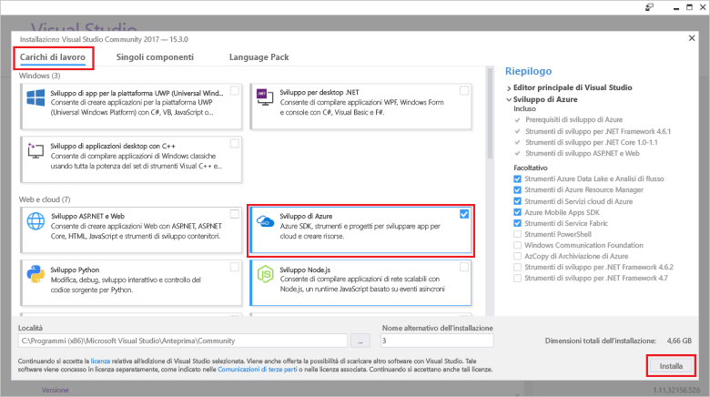

# <a name="create-an-azure-functions-http-trigger-with-an-azure-cosmos-db-input-binding"></a>Creare un trigger HTTP di Funzioni di Azure con un'associazione di input di Azure Cosmos DB

Azure Cosmos DB è un database multimodello Microsoft distribuito a livello globale, senza schema e senza server. Funzioni di Azure è un servizio di calcolo senza server che consente di eseguire codice su richiesta. Se si uniscono questi due servizi di Azure, si dispone della base per un'architettura senza server che consente di concentrarsi sulla compilazione di app eccezionali senza doversi preoccupare di eseguire il provisioning e mantenere i server necessari per le proprie esigenze di calcolo e database.

Questa esercitazione si basa sul codice creato nella [Guida introduttiva all'API Graph per .NET](create-graph-dotnet.md). Questa esercitazione aggiunge una funzione di Azure che contiene un [trigger HTTP](https://github.com/MicrosoftDocs/azure-docs-pr/azure-functions/functions-bindings-http-webhook.md#http-trigger). Il trigger HTTP usa un'[associazione di input](https://github.com/MicrosoftDocs/azure-docs-pr/azure-functions/functions-triggers-bindings.md) con un database Azure Cosmos DB per recuperare i dati dal database a grafi creato nella guida introduttiva. Questo particolare trigger HTTP esegue una query su Cosmos Azure DB per recuperare dati, ma le associazioni di input da Azure Cosmos DB possono essere usate per recuperare i valori di input dei dati per qualsiasi cosa la funzione richieda.

Questa esercitazione illustra le attività seguenti:

> [!div class="checklist"]
> * Creare un progetto di Funzioni di Azure 
> * Creare un trigger HTTP
> * Pubblicare la funzione di Azure
> * Connettere la funzione di Azure al database Azure Cosmos DB

## <a name="prerequisites"></a>prerequisiti

- [Visual Studio 2017 versione 15.3](https://www.visualstudio.com/vs/preview/), con il carico di lavoro di **sviluppo di Azure**.

    
    
- Dopo l'installazione o l'aggiornamento a Visual Studio 2017 versione 15.3, è necessario aggiornare manualmente gli strumenti di Visual Studio 2017 per Funzioni di Azure. È possibile aggiornare gli strumenti dal menu **Strumenti** scegliendo **Estensioni e aggiornamenti** > **Aggiornamenti** > **Visual Studio Marketplace** > **Azure Functions and Web Jobs Tools** (Strumenti per Funzioni di Azure e processi Web) > **Aggiorna**.

- Completare l'esercitazione [Creare un'applicazione .NET tramite l'API Graph](tutorial-develop-graph-dotnet.md) o prendere il codice di esempio del repository GitHub [azure-cosmos-db-graph-dotnet-getting-started](https://github.com/Azure-Samples/azure-cosmos-db-graph-dotnet-getting-started) e compilare il progetto.
 
## <a name="build-a-function-in-visual-studio"></a>Compilare una funzione in Visual Studio

1. Aggiungere un progetto **Funzioni di Azure** alla soluzione facendo clic con il pulsante destro del mouse sul nodo della soluzione in **Esplora soluzioni** e selezionando **Aggiungi** > **Nuovo progetto**. Scegliere **Funzioni di Azure** nella finestra di dialogo e assegnare il nome **PeopleDataFunctions**.

   

2. Dopo aver creato il progetto Funzioni di Azure, è necessario eseguire alcuni aggiornamenti e installazioni correlati a NuGet. 

    a. Per assicurarsi di avere il più recente SDK Functions, usare Gestione NuGet per aggiornare il pacchetto **Microsoft.NET.Sdk.Functions**. In **Esplora soluzioni** fare clic con il pulsante destro del mouse sul progetto e scegliere **Gestisci pacchetti NuGet**. Nella scheda **Installato** selezionare Microsoft.NET.Sdk.Functions e quindi fare clic su **Aggiorna**.

   

    b. Nella scheda **Sfoglia** immettere **azure.graphs** per trovare il pacchetto **Microsoft.Azure.Graphs** e quindi fare clic su **Installa**. Questo pacchetto contiene l'SDK client dell' API Graph .NET.

   

    c. Nella scheda **Sfoglia** immettere **mono.csharp** per trovare il pacchetto **Mono.CSharp** e quindi fare clic su **Installa**.

   

3. Esplora soluzioni dovrebbe ora includere i pacchetti installati, come illustrato qui. 
   
   Ora è necessario scrivere un po' di codice, quindi si aggiungerà un nuovo elemento **Funzioni di Azure** al progetto. 

    a. Fare clic con il pulsante destro del mouse sul nodo del progetto in **Esplora soluzioni** e quindi scegliere **Aggiungi** > **Nuovo elemento**.   
    b. Nella finestra di dialogo **Aggiungi nuovo elemento** selezionare **Elementi di Visual C#**, selezionare **Funzioni di Azure**, digitare **Search** come nome per il progetto e quindi fare clic su **Aggiungi**.  
 
   

4. La funzione di Azure risponderà alle richieste HTTP, pertanto in questo caso il modello Trigger HTTP è appropriato.
   
   Nella casella **Nuova funzione di Azure** selezionare **Trigger HTTP**. Si desidera anche che questa funzione di Azure sia "aperta", perciò è necessario impostare i **Diritti di accesso** su **Anonimo**, in modo da lasciar passare tutti gli utenti. Fare clic su **OK**.

   

5. Dopo aver aggiunto Search.cs al progetto Funzioni di Azure, copiare queste istruzioni **using** sopra le istruzioni using esistenti:

   ```csharp
   using Microsoft.Azure.Documents;
   using Microsoft.Azure.Documents.Client;
   using Microsoft.Azure.Documents.Linq;
   using Microsoft.Azure.Graphs;
   using Microsoft.Azure.WebJobs;
   using Microsoft.Azure.WebJobs.Extensions.Http;
   using Microsoft.Azure.WebJobs.Host;
   using System;
   using System.Collections.Generic;
   using System.Configuration;
   using System.Linq;
   using System.Net;
   using System.Net.Http;
   using System.Threading.Tasks;
   ```

6. Quindi sostituire il codice di classe della funzione di Azure con il codice seguente. Il codice cerca nel database Azure Cosmos DB mediante l'API Graph tutte le persone o la persona specifica identificata dal parametro della stringa di query `name`.

   ```csharp
   public static class Search
   {
       static string endpoint = ConfigurationManager.AppSettings["Endpoint"];
       static string authKey = ConfigurationManager.AppSettings["AuthKey"];

       [FunctionName("Search")]
       public static async Task<HttpResponseMessage> Run(
           [HttpTrigger(AuthorizationLevel.Anonymous, "get", "post", Route = null)]HttpRequestMessage req,
           TraceWriter log)
       {
           log.Info("C# HTTP trigger function processed a request.");

           // the person objects are free-form in structure
           List<dynamic> results = new List<dynamic>();

           // open the client's connection
           using (DocumentClient client = new DocumentClient(
               new Uri(endpoint),
               authKey,
               new ConnectionPolicy
               {
                   ConnectionMode = ConnectionMode.Direct,
                   ConnectionProtocol = Protocol.Tcp
               }))
           {
               // get a reference to the database the console app created
               Database database = await client.CreateDatabaseIfNotExistsAsync(
                   new Database
                   {
                       Id = "graphdb"
                   });

               // get an instance of the database's graph
               DocumentCollection graph = await client.CreateDocumentCollectionIfNotExistsAsync(
                   UriFactory.CreateDatabaseUri("graphdb"),
                   new DocumentCollection { Id = "graphcollz" },
                   new RequestOptions { OfferThroughput = 1000 });

               // build a gremlin query based on the existence of a name parameter
               string name = req.GetQueryNameValuePairs()
                   .FirstOrDefault(q => string.Compare(q.Key, "name", true) == 0)
                   .Value;

               IDocumentQuery<dynamic> query = (!String.IsNullOrEmpty(name))
                   ? client.CreateGremlinQuery<dynamic>(graph, string.Format("g.V('{0}')", name))
                   : client.CreateGremlinQuery<dynamic>(graph, "g.V()");

               // iterate over all the results and add them to the list
               while (query.HasMoreResults)
                   foreach (dynamic result in await query.ExecuteNextAsync())
                       results.Add(result);
           }

           // return the list with an OK response
           return req.CreateResponse<List<dynamic>>(HttpStatusCode.OK, results);
       }
   }
   ```

   Il codice usa fondamentalmente la stessa logica di connessione dell'applicazione console originale che effettuato il seeding del database, con una semplice query per recuperare i record corrispondenti.

## <a name="debug-the-azure-function-locally"></a>Eseguire il debug della funzione di Azure localmente

Ora che il codice è stato completato, è possibile usare gli strumenti di debug di Funzioni di Azure e l'emulatore locali per eseguire il codice localmente al fine di testarlo.

1. Perché il codice venga eseguito correttamente, è necessario configurarlo per l'esecuzione locale con le proprie informazioni di connessione del database Azure Cosmos DB. È possibile usare il file local.settings.json per configurare la funzione di Azure per l'esecuzione locale in modo molto simile a come si userebbe il file App.config per configurare l'applicazione console originale per l'esecuzione.

    A tale scopo, aggiungere le seguenti righe di codice a local.settings.json e quindi copiare l'Endpoint e l'AuthKey dal file App.Config nel progetto GraphGetStarted come illustrato nella figura seguente.

   ```json
    "Endpoint": "",
    "AuthKey": ""
    ```

   

2. Cambiare il progetto di avvio nella nuova app Funzioni. In **Esplora soluzioni** fare clic con il pulsante destro del mouse su **PeopleDataFunctions** e selezionare**Imposta come progetto di avvio**.

3. In **Esplora soluzioni** fare clic con il pulsante destro del mouse su **Dipendenze** nel progetto **PeopleDataFunctions** quindi fare clic su **Aggiungi riferimento**. Nell'elenco selezionare System.Configuration e quindi fare clic su **OK**.

3. Ora eseguire l'app. Premere F5 per avviare lo strumento di debug locale, func.exe, con il codice della funzione di Azure ospitato e pronto all'uso.

   Al termine dell'output iniziale di func.exe vediamo che la funzione di Azure è ospitata in localhost:7071. Ciò è utile per eseguire il test in un client.

   

4. Per testare la funzione di Azure, usare [Visual Studio Code](http://code.visualstudio.com/) con l'estensione di Huachao Mao, [REST Client](https://marketplace.visualstudio.com/items?itemName=humao.rest-client). REST Client offre la funzionalità di richiesta HTTP locale o remota mediante un singolo clic con il pulsante destro del mouse. 

    A tale scopo, creare un nuovo file denominato test-function-locally.http e aggiungere il codice seguente:

    ```http
    get http://localhost:7071/api/Search

    get http://localhost:7071/api/Search?name=ben
   ```

    Ora fare clic con il pulsante destro del mouse sulla prima riga del codice e selezionare **Invia richiesta** come illustrato nella figura seguente.

   

   Viene visualizzata la risposta HTTP non elaborata dalle intestazioni della funzione di Azure eseguita localmente, il contenuto del corpo JSON, tutti gli elementi.

   

5. Ora selezionare la seconda riga di codice e quindi scegliere **Invia richiesta**. Aggiungendo il parametro stringa di query `name` con un valore sicuramente presente nel database, è possibile filtrare i risultati restituiti dalla funzione di Azure.

   

Dopo che la funzione di Azure è stata convalidata e sembra funzionare correttamente, l'ultimo passaggio consiste nel pubblicarla in Servizio app di Azure e configurarla per l'esecuzione nel cloud.

## <a name="publish-the-azure-function"></a>Pubblicare la funzione di Azure

1. In **Esplora soluzioni** fare clic con il pulsante destro del mouse sul progetto e scegliere **Pubblica**.

   

2. Tutto è pronto per pubblicare il progetto nel cloud al fine di testarlo in uno scenario disponibile pubblicamente. Nella scheda **Pubblica** selezionare **App per le funzioni di Azure**, selezionare **Crea nuovo** per creare una funzione di Azure nella propria sottoscrizione di Azure e quindi fare clic su **Pubblica**.

   

3. Nella finestra di dialogo **Pubblica** eseguire le operazioni seguenti:
   
    a. In **Nome app** assegnare un nome univoco alla funzione.

    b. In **Sottoscrizione** selezionare la sottoscrizione di Azure da usare.
   
    c. In **Gruppo di risorse** creare un nuovo gruppo di risorse e usare lo stesso nome dell'app.
   
    d. Per **Piano di Servizio app** fare clic su **Nuovo** per creare un nuovo piano di servizio app a consumo in quanto si prevede di usare il metodo di fatturazione con pagamento in base all'utilizzo per la funzione di Azure senza server. Nella pagina **Configura piano di servizio app** usare le impostazioni predefinite e quindi fare clic su **OK**.
   
    e. Anche per **Account di archiviazione** fare clic su **Nuovo** per creare un nuovo account di archiviazione da usare con la funzione di Azure, nel caso sia necessario il supporto per BLOB, tabelle o code per attivare l'esecuzione di altre funzionalità. Nella pagina **Account di archiviazione** usare le impostazioni predefinite e quindi fare clic su **OK**.

    f. Fare clic sul pulsante **Crea** nella finestra di dialogo per creare tutte le risorse nella sottoscrizione di Azure. Visual Studio scarica un profilo di pubblicazione (un semplice file XML) che usa alla successiva pubblicazione del codice della funzione di Azure.

   

    Visual Studio mostra quindi una pagina di pubblicazione che è possibile usare se si apportano modifiche alla funzione ed è necessario ripubblicarla. Ora non occorre eseguire alcuna azione in questa pagina.

4. Dopo che la funzione di Azure è stata pubblicata, è possibile passare alla pagina del [portale di Azure](https://portal.azure.com/) per la funzione di Azure. Qui è possibile vedere un collegamento alle **Impostazioni dell'applicazione** per la funzione di Azure. Aprire questo collegamento per configurare la funzione di Azure in tempo reale per la connettività al database Azure Cosmos DB con i propri dati utente.

   

5. Come è stato fatto in precedenza nel file App.config dell'applicazione console e nel file local.settings.json dell'app per le funzioni di Azure, è necessario aggiungere l'Endpoint e l'AuthKey al database Cosmos Azure DB per la funzione pubblicata. In questo modo non sarà mai necessario archiviare il codice di configurazione che contiene le chiavi: è possibile configurarle nel portale, con la sicurezza che non sono archiviate nel controllo del codice sorgente. Per aggiungere ogni valore, fare clic sul pulsante **Aggiungi nuova impostazione**, aggiungere **Endpoint** e il valore da app.config, quindi fare clic di nuovo su **Aggiungi nuova impostazione** e aggiungere **AuthKey** e il valore personalizzato. Dopo aver aggiunto e salvato i valori, le impostazioni dovrebbero essere simili alle seguenti.

   

6. Dopo che la funzione di Azure è stata configurata correttamente nella sottoscrizione di Azure, è possibile usare nuovamente l'estensione REST Client di Visual Studio Code per eseguire una query sull'URL della funzione Azure disponibile pubblicamente. Aggiungere queste due righe di codice a test-function-locally.http, quindi eseguire ogni riga per testare questa funzione. Sostituire il nome della funzione nell'URL con il nome della propria funzione.

    ```json
    get https://peoplesearchfunction.azurewebsites.net/api/Search

    get https://peoplesearchfunction.azurewebsites.net/api/Search?name=thomas
    ```

    La funzione risponde con i dati recuperati dal database da Azure Cosmos DB.

    


## <a name="next-steps"></a>Passaggi successivi

In questa esercitazione sono state eseguite le operazioni seguenti:

> [!div class="checklist"]
> * Un progetto Funzioni di Azure è stato creato 
> * Un trigger HTTP è stato creato
> * La funzione di Azure è stata pubblicata
> * La funzione di Azure è stata connessa al database Azure Cosmos DB

È ora possibile passare alla sezione Concetti per altre informazioni su Cosmos DB.

> [!div class="nextstepaction"]
> [Distribuzione globale](distribute-data-globally.md) 

Questo articolo si basa su un blog della serie di blog [di Brady Gaster Schemaless & Serverless](http://www.bradygaster.com/category/%20Serverless%20&%20Schemaless) (Senza schema e senza server). Visitare il suo blog per altri post della serie.
