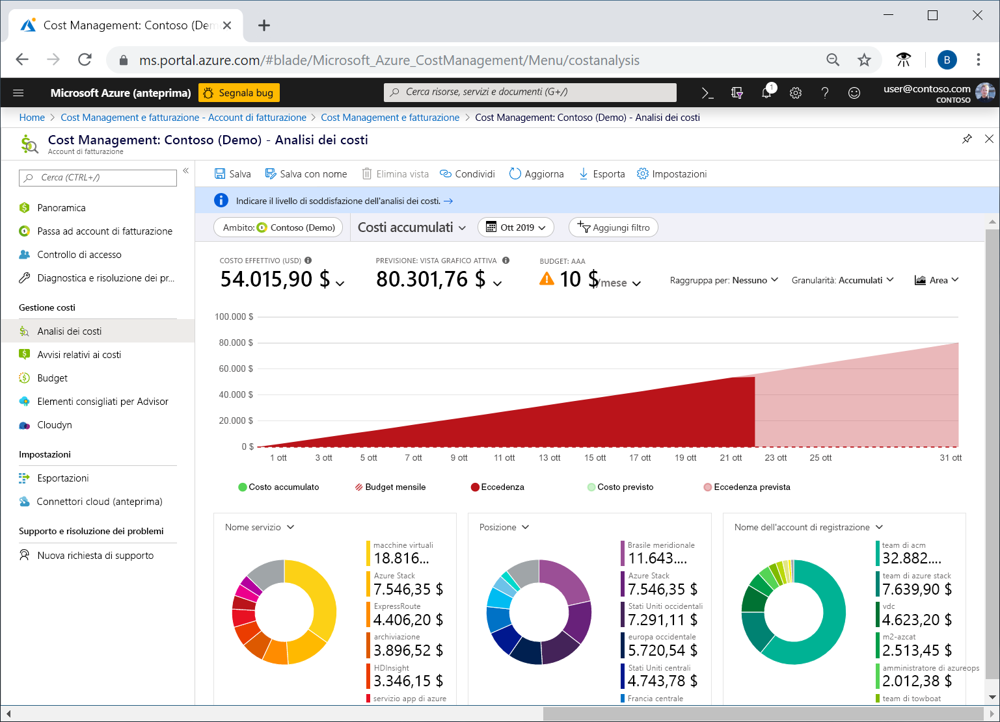
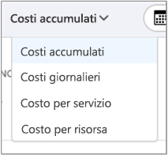
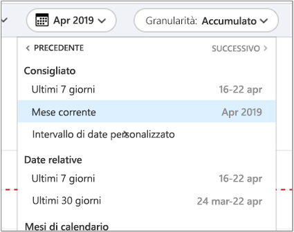
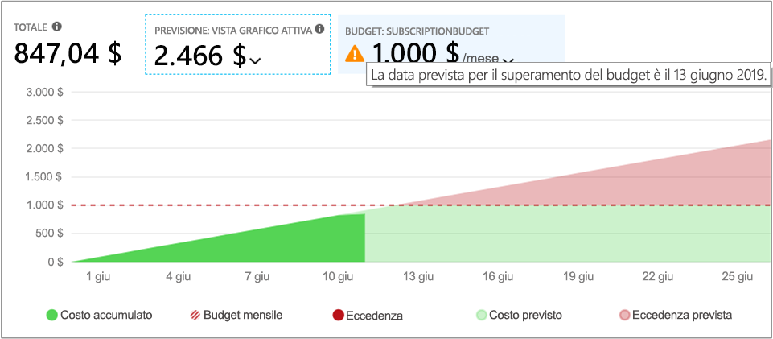
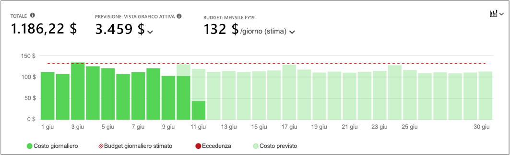
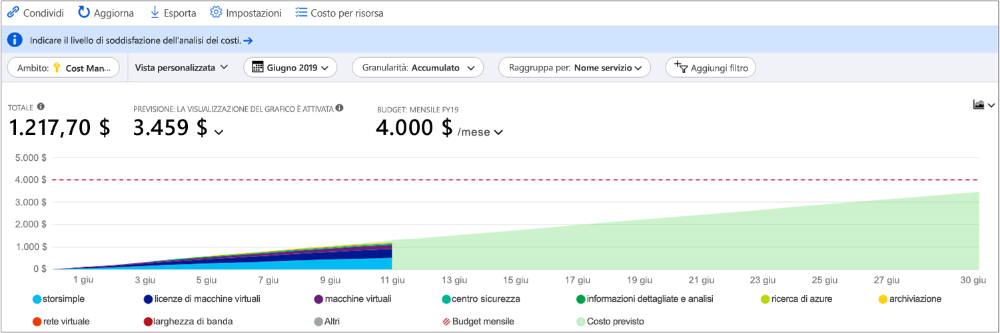
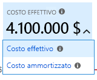
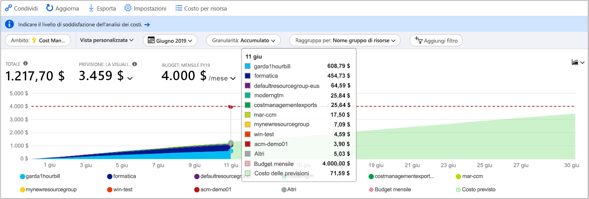
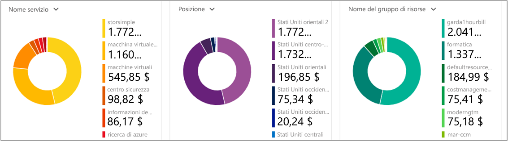
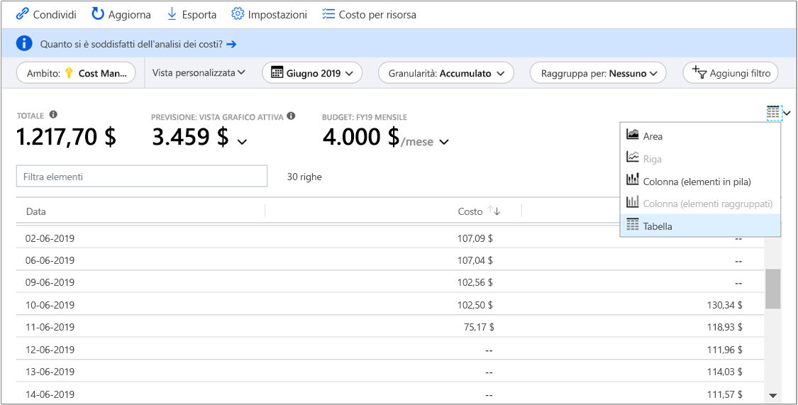

# <a name="quickstart-explore-and-analyze-costs-with-cost-analysis"></a>Avvio rapido: Esplorare e analizzare i costi con l'analisi dei costi

Per poter controllare al meglio e ottimizzare i costi di Azure, è necessario conoscere l'origine dei costi all'interno dell'organizzazione. È anche utile sapere quanto costano i servizi e quali ambienti e sistemi supportano. È fondamentale avere visibilità sul dettaglio dei costi per comprendere in modo approfondito i modelli di spesa aziendali, che possono essere usati per applicare meccanismi di controllo dei costi, ad esempio i budget.

In questa guida introduttiva si usa l'analisi dei costi per esplorare e analizzare i costi aziendali. È possibile visualizzare i costi aggregati per l'organizzazione per capire dove si accumulano i costi nel tempo e identificare le tendenze di spesa. È possibile visualizzare i costi accumulati nel corso del tempo per stimare le tendenze dei costi mensili, trimestrali o addirittura annuali rispetto a un budget. Un budget è utile per rispettare eventuali vincoli finanziari oppure per visualizzare i costi giornalieri o mensili per isolare le irregolarità di spesa. È anche possibile scaricare i dati del report corrente per un'ulteriore analisi o per usarli in un sistema esterno.

In questa guida introduttiva si apprende come:

- Esaminare i costi nell'analisi dei costi
- Personalizzare le visualizzazioni dei costi
- Scaricare i dati dell'analisi dei costi


## <a name="prerequisites"></a>Prerequisites

L'analisi dei costi supporta diversi tipi di account di Azure. Per visualizzare l'elenco completo dei tipi di account supportati, vedere [Understand Cost Management data](understand-cost-mgt-data.md) (Informazioni sui dati di Gestione costi). Per visualizzare i dati relativi ai costi, è necessario effettuare almeno l'accesso in lettura per l'account Azure.

Per informazioni sull'assegnazione dell'accesso ai dati di Gestione costi di Azure, vedere [Assegnare l'accesso ai dati](../../cost-management/assign-access-acm-data.md).

## <a name="sign-in-to-azure"></a>Accedere ad Azure

- Accedere al portale di Azure all'indirizzo https://portal.azure.com.

## <a name="review-costs-in-cost-analysis"></a>Esaminare i costi nell'analisi dei costi

Per esaminare i costi nell'analisi dei costi, aprire l'ambito nel portale di Azure e scegliere **Analisi dei costi** dal menu. Passare ad esempio a **Sottoscrizioni**, selezionare una sottoscrizione nell'elenco e quindi selezionare **Analisi dei costi** nel menu. Usare l'etichetta **Ambito** per passare a un ambito diverso nell'analisi dei costi. Per altre informazioni sugli ambiti, vedere [Informazioni e utilizzo degli ambiti](understand-work-scopes.md).

L'ambito selezionato viene usato in tutto il servizio Gestione costi per fornire il consolidamento dati e per controllare l'accesso alle informazioni sui costi. Quando si usano gli ambiti non vengono multi-selezionati. Si seleziona piuttosto un ambito più ampio, a cui fanno riferimento gli altri, quindi si applica il filtro fino agli ambiti annidati necessari. È importante comprendere questo approccio perché alcuni utenti potrebbero non avere accesso a un singolo ambito padre, che copre più ambiti annidati.

La visualizzazione dell'analisi dei costi iniziale include le aree seguenti.

**Visualizzazione Costi accumulati**: rappresenta la configurazione della visualizzazione predefinita dell'analisi dei costi. Ogni visualizzazione include le impostazioni relative a intervallo di date, granularità, tipo di raggruppamento e filtro. La visualizzazione predefinita mostra i costi accumulati per il periodo di fatturazione corrente, ma è possibile sostituirla con altre visualizzazioni incluse. Per altre informazioni, vedere [Personalizzare le visualizzazioni dei costi](#customize-cost-views).

**Costo effettivo**: mostra il totale dei costi di utilizzo e acquisto per il mese corrente, man mano che vengono accumulati, e che compariranno in fattura.

**Previsione**: mostra il totale dei costi previsti per il periodo di tempo scelto. (La previsione è in anteprima.)

**Budget**: visualizza il limite di spesa per l'ambito selezionato, se disponibile.

**Accumulated granularity** (Granularità accumulata): mostra il totale dei costi giornalieri accumulati, a partire dall'inizio del periodo di fatturazione. Dopo aver [creato un budget](tutorial-acm-create-budgets.md) per l'account di fatturazione o la sottoscrizione, è possibile visualizzare rapidamente la tendenza di spesa rispetto al budget. Passare il puntatore del mouse su una data per visualizzare il costo accumulato per quel giorno.

**Grafici pivot (ad anello)** : offrono pivot dinamici, suddividendo il costo totale in base a un set comune di proprietà standard. Mostrano i costi in ordine decrescente per il mese corrente. È possibile cambiare i grafici pivot in qualsiasi momento selezionando un pivot diverso. I costi vengono classificati in base a servizio (categoria del contatore), località (area) e ambito figlio per impostazione predefinita. Ad esempio, gli account di registrazione sotto gli account di fatturazione, i gruppi di risorse sotto le sottoscrizioni e le risorse sotto i gruppi di risorse.



### <a name="understand-forecast"></a>Informazioni sulle previsioni

La previsione dei costi mostra una proiezione dei costi stimati per il periodo di tempo selezionato. Il modello è basato su un modello di regressione della serie temporale. Richiede almeno 10 giorni di dati recenti relativi a costi e utilizzo per poter fare una previsione accurata dei costi. Per un dato periodo di tempo, il modello di previsione richiede le stesse parti dei dati di training per il periodo di previsione. Ad esempio, per una proiezione di tre mesi sono necessari almeno tre mesi di dati recenti relativi a costi e utilizzo. 

Il modello usa un massimo di sei mesi di dati di training per proiettare i costi per un anno. Ha bisogno di almeno sette giorni di dati di training per modificare la stima. La stima è basata su modifiche notevoli, come picchi e flessioni, nei modelli di costo e utilizzo. La previsione non genera singole proiezioni per ogni elemento nelle proprietà **Raggruppa per**. Fornisce solo una previsione per i costi totali accumulati. Se si usano più valute, il modello fornisce previsioni per i costi solo in USD. 


## <a name="customize-cost-views"></a>Personalizzare le visualizzazioni dei costi

Per l'analisi dei costi sono disponibili quattro visualizzazioni predefinite, ottimizzate per gli obiettivi più comuni:

Visualizza | Risponde a domande di questo tipo
--- | ---
Costi accumulati | Quali sono state finora le spese in questo mese? Il budget verrà rispettato?
Costi giornalieri | Si sono verificati aumenti dei costi giornalieri negli ultimi 30 giorni?
Costo per servizio | Come è cambiato l'utilizzo mensile nelle ultime tre fatture?
Costo per risorsa | Quali risorse sono costate maggiormente finora in questo mese?



Esistono tuttavia molti i casi in cui è necessaria un'analisi più approfondita. La personalizzazione inizia nella parte superiore della pagina, con la selezione della data.

Per impostazione predefinita, l'analisi dei costi mostra i dati per il mese corrente. Usare il selettore data per passare rapidamente a intervalli di date comuni, ad esempio gli ultimi sette giorni, l'ultimo mese, l'anno corrente o un intervallo di date personalizzato. Le sottoscrizioni con pagamento in base al consumo includono inoltre intervalli di date basati sul periodo di fatturazione, che non è associato al mese di calendario, ad esempio il periodo di fatturazione corrente o l'ultima fattura. Usare i collegamenti **< INDIETRO** e **AVANTI >** nella parte superiore del menu per passare rispettivamente al periodo precedente o successivo. Ad esempio, **< INDIETRO** consente di passare dagli **ultimi sette giorni** a **8-14 giorni fa** o **15-21 giorni fa**.



Per impostazione predefinita, l'analisi dei costi mostra i costi **accumulati**. I costi accumulati includono tutti i costi per ogni singolo giorno oltre a quelli dei giorni precedenti, con una visualizzazione in continua crescita dei costi giornalieri aggregati. Questa visualizzazione è ottimizzata per mostrare la tendenza rispetto a un budget per l'intervallo di tempo selezionato.

Usare la visualizzazione del grafico di previsione per identificare potenziali violazioni del budget. In caso di potenziale violazione del budget, l'eccesso di spesa previsto viene mostrato in rosso. Nel grafico viene anche visualizzato un indicatore. Passando con il mouse sul simbolo, viene visualizzata la data stimata della violazione del budget.



È disponibile anche una visualizzazione **giornaliera** che mostra i costi sostenuti ogni giorno. La visualizzazione giornaliera non visualizza una tendenza di incremento. La visualizzazione è progettata per mostrare eventuali irregolarità, ad esempio impennate o flessioni dei costi da un giorno all'altro. Se si seleziona un budget, la visualizzazione giornaliera mostra anche una stima del budget giornaliero.

Quando i costi giornalieri sono costantemente al di sopra del budget giornaliero stimato, è probabile che il budget mensile venga superato. Il budget stimato giornaliero è un mezzo per poter visualizzare il budget a un livello più basilare. Quando si verificano fluttuazioni nei costi giornalieri, il confronto tra il budget giornaliero stimato e il budget mensile è meno preciso.

Ecco una visualizzazione giornaliera delle spese recenti con la previsione di spesa attivata.


Se si disattiva la previsione di spesa, le spese previste per date future non vengono visualizzate. Inoltre, se si esaminano i costi relativi a periodi di tempo passati, la previsione dei costi non mostra i costi.

In genere, è possibile visualizzare dati o notifiche per le risorse utilizzate entro 8-12 ore.


Usare **Raggruppa per** per raggruppare proprietà comuni per suddividere i costi e identificare i gruppi che hanno contribuito maggiormente ai costi. Per eseguire il raggruppamento in base ai tag delle risorse, ad esempio, selezionare la chiave del tag da usare per il raggruppamento. I costi verranno suddivisi in base a ogni valore di tag, con un segmento extra per le risorse a cui non è applicato tale tag.

La maggior parte delle [risorse di Azure supporta l'assegnazione di tag](../../azure-resource-manager/management/tag-support.md). Alcuni tag, tuttavia, non sono disponibili per Gestione costi e la fatturazione. Inoltre, i tag del gruppo di risorse non sono supportati. Il supporto per i tag si applica all'uso segnalato *dopo* che il tag è stato applicato alla risorsa. I tag non vengono applicati retroattivamente per l'accumulo dei costi.

Guardare il video [How to review tag policies with Azure Cost Management](https://www.youtube.com/watch?v=nHQYcYGKuyw) (Come rivedere i criteri di tag con Gestione costi di Azure) per informazioni sull'uso dei criteri di tag di Azure per migliorare la visibilità dei dati di costo.

Ecco una visualizzazione dei costi dei servizi di Azure per il mese corrente.



Per impostazione predefinita, l'analisi dei costi mostra tutti i costi di utilizzo e di acquisto che vengono accumulati e che verranno visualizzati sulla fattura, anche detti **costi effettivi**. La visualizzazione dei costi effettivi è ideale per la riconciliazione della fattura. Tuttavia, i picchi di acquisti nei costi possono essere allarmanti quando si esaminano le anomalie di spesa e altre variazioni nei costi. Per appiattire i picchi causati dai costi degli acquisti di prenotazioni, passare a **Costo ammortizzato**.



I costi ammortizzati suddividono gli acquisti di prenotazioni in blocchi giornalieri e li distribuiscono per la durata del periodo di prenotazione. Ad esempio, invece di un acquisto di € 365 il 1° gennaio, verrà visualizzato un acquisto di € 1,00 ogni giorno dal 1° gennaio al 31 dicembre. Oltre all'ammortamento di base, questi costi vengono anche riallocati e associati usando le risorse specifiche che hanno usato la prenotazione. Ad esempio, se un addebito giornaliero di € 1,00 viene diviso tra due macchine virtuali, per quel giorno vengono visualizzati due addebiti di € 0,50. Se parte della prenotazione non viene utilizzata quel giorno, vengono visualizzati un solo addebito di € 0,50 associato alla macchina virtuale applicabile e un altro addebito di € 0,50 con tipo di addebito `UnusedReservation`. Si noti che i costi delle prenotazioni inutilizzate possono essere visualizzati solo tra i costi ammortizzati.

Poiché i costi vengono rappresentati diversamente, è importante notare che le visualizzazioni di costi effettivi e costi ammortizzati mostrano numeri totali differenti. In generale, il costo totale dei mesi con l'acquisto di una prenotazione diminuisce quando vengono visualizzati i costi ammortizzati e il costo dei mesi successivi all'acquisto di una prenotazione aumenta. L'ammortamento è disponibile solo per gli acquisti di prenotazioni e non si applica agli acquisti in Azure Marketplace in questo momento.

L'immagine seguente mostra i nomi dei gruppi di risorse. È possibile raggruppare per tag per visualizzare i costi totali per tag oppure usare la visualizzazione **Costo per risorsa** per vedere tutti i tag relativi a una specifica risorsa.



Quando si raggruppano i costi in base a un attributo specifico, vengono visualizzati in ordine decrescente i primi 10 gruppi di risorse che hanno contribuito maggiormente ai costi. Se sono presenti più di 10 gruppi, vengono visualizzati i primi nove gruppi che hanno contribuito, nonché un gruppo **Altri** che rappresenta tutti gli altri gruppi combinati. Quando si raggruppa in base ai tag, viene visualizzato un gruppo **Senza tag** per i costi a cui non è applicata la chiave del tag. **Senza tag** è sempre ultimo, anche se i costi senza tag sono superiori ai costi con tag. Se sono presenti 10 o più valori di tag, i costi senza tag faranno parte del gruppo **Altri**. Passare alla visualizzazione tabella e modificare la granularità in **Nessuna** per visualizzare tutti i valori classificati in base al costo, dal più alto al più basso.

Le macchine virtuali, le risorse di rete e le risorse di archiviazione classiche non condividono dati di fatturazione dettagliati. Tali risorse vengono unite nel gruppo **Classic services** (Servizi classici) quando si raggruppano i costi.

I grafici pivot nel grafico principale mostrano raggruppamenti diversi per offrire un quadro più ampio dei costi complessivi per il periodo di tempo e i filtri selezionati. Selezionare una proprietà o un tag per visualizzare i costi aggregati per qualsiasi dimensione.



È possibile visualizzare il set di dati completo per qualsiasi visualizzazione. Le selezioni effettuate o i filtri applicati influiscono sui dati presentati. Per visualizzare il set di dati completo, selezionare l'elenco del **tipo di grafico** e quindi selezionare la visualizzazione **Tabella**.




## <a name="understanding-grouping-and-filtering-options"></a>Informazioni sulle opzioni di raggruppamento e filtro

La tabella seguente contiene alcune delle opzioni di raggruppamento e filtro più comuni, oltre a indicazioni su quando usarle.

| Proprietà | Utilizzo | Note |
| --- | --- | --- |
| **Zone di disponibilità** | Suddivide i costi di AWS per zona di disponibilità. | Si applica solo agli ambiti e ai gruppi di gestione di AWS. I dati di Azure non includono la zona di disponibilità e vengono visualizzati come **Non applicabile**. |
| **Periodo di fatturazione** | Suddivide i costi del piano con pagamento in base al consumo in base al mese in cui sono stati (o saranno) fatturati. | Usare **Periodo di fatturazione** per ottenere una rappresentazione esatta degli addebiti del piano con pagamento in base al consumo fatturati. Includere due giorni aggiuntivi prima e dopo il periodo di fatturazione in caso di filtro in base a un intervallo di date personalizzato. Se ci si limita al periodo di fatturazione esatto non si ottiene una corrispondenza con la fattura. Vengono visualizzati i costi di tutte le fatture del periodo di fatturazione. Usare **ID fattura** per filtrare in base a una fattura specifica. Si applica solo alle sottoscrizioni con pagamento in base al consumo, in quanto le sottoscrizioni con contratto Enterprise o con contratto del cliente Microsoft vengono fatturate in base ai mesi del calendario. Gli account EA/MCA possono usare i mesi di calendario nello strumento di selezione data o la granularità mensile per raggiungere lo stesso obiettivo. |
| **Tipo di addebito** | Suddivide i costi di utilizzo, acquisto, rimborso e prenotazioni inutilizzate. | Gli acquisti di prenotazioni e i rimborsi sono disponibili solo quando si usano i costi effettivi e non i costi ammortizzati. I costi delle prenotazioni inutilizzate sono disponibili solo quando si esaminano i costi ammortizzati. |
| **Reparto** | Suddivide i costi per reparto EA. | Disponibile solo per i gruppi di gestione ed EA. Le sottoscrizioni con pagamento in base al consumo non hanno un reparto e vengono visualizzate come **Non applicabile** o **non assegnate**. |
| **Account di registrazione** | Suddivide i costi per proprietario di account EA. | Disponibile solo per gli account di fatturazione, i reparti e i gruppi di gestione EA. Le sottoscrizioni con pagamento in base al consumo non hanno account di registrazione EA e vengono visualizzate come **Non applicabile** o **non assegnate**. |
| **Frequenza** | Suddivide i costi in base all'utilizzo, una tantum e ricorrenti. | |
| **ID fattura** | Suddivide i costi per fattura emessa. | Gli addebiti non fatturati non hanno ancora un ID fattura e i costi EA non includono i dettagli della fattura e vengono visualizzati come **Non applicabile**.  |
| **Contatore** | Suddivide i costi per contatore dell'utilizzo. | Gli acquisti e l'utilizzo del Marketplace vengono visualizzati come **Non applicabile**. Vedere **Tipo di addebito** per identificare gli acquisti e **Tipo di autore** per identificare gli addebiti del Marketplace. |
| **operazione** | Suddivide i costi di AWS per operazione. | Si applica solo agli ambiti e ai gruppi di gestione di AWS. I dati di Azure non includono l'operazione e vengono visualizzati come **Non applicabile**. Usare **Contatore** al posto di Operazione. |
| **Modello di determinazione prezzi** | Suddivide i costi in base all'utilizzo su richiesta, su prenotazione o spot. | Gli acquisti vengono visualizzati come **OnDemand**. Se viene visualizzato **Non applicabile**, raggruppare per **Prenotazione** per determinare se l'utilizzo è su prenotazione o su richiesta e per **Tipo di addebito** per identificare gli acquisti.
| **Provider** | Suddivide i costi in base ad AWS e Azure. | Disponibile solo per i gruppi di gestione. |
| **Tipo di autore** | Suddivide i costi di AWS, Azure e Marketplace. |  |
| **Prenotazione** | Suddivide i costi per prenotazione. | Qualsiasi utilizzo o acquisto non associato a una prenotazione viene visualizzato come **Non applicabile**. Raggruppare per **Tipo di autore** per identificare altri acquisti di Azure, AWS o del Marketplace. |
| **Risorsa** | Suddivide i costi per risorsa. | Gli acquisti vengono visualizzati come **Non applicabile** perché vengono applicati a livello di account di fatturazione EA/con pagamento in base al consumo o a livello di profilo di fatturazione del contratto del cliente Microsoft e non sono associati a una risorsa specifica. Raggruppare per **Tipo di autore** per identificare altri acquisti di Azure, AWS o del Marketplace. |
| **Gruppo di risorse** | Suddivide i costi per gruppo di risorse. | Gli acquisti, le risorse tenant non associate a sottoscrizioni, le risorse di sottoscrizione non distribuite in un gruppo di risorse e le risorse classiche non hanno un gruppo di risorse e vengono visualizzate come **altri**, **servizi classici**, **$system**o **Non applicabile**. |
| **Tipo di risorsa** | Suddivide i costi per tipo di risorsa. | Gli acquisti e i servizi classici non hanno un tipo di risorsa Azure Resource Manager e vengono visualizzati come **altri**, **servizi classici** o **Non applicabile**. |
| **Posizione risorsa** | Suddivide i costi per località o area. | Gli acquisti e l'utilizzo del Marketplace possono essere visualizzati come **non assegnato**, **sconosciuto**, **non mappato** o **Non applicabile**. |
| **Nome del servizio** o **Categoria del contatore** | Suddivide i costi per servizio di Azure. | Gli acquisti e l'utilizzo del Marketplace vengono visualizzati come **Non applicabile** o **non assegnato**. |
| **Livello di servizio** o **Sottocategoria del contatore** | Suddivide i costi in base alla sottoclassificazione del contatore dell'utilizzo di Azure. | Gli acquisti e l'utilizzo del Marketplace vengono visualizzati come **Non applicabile** o **non assegnato**. |
| **Sottoscrizione** | Suddivide i costi per sottoscrizione di Azure e account AWS collegato. | Gli acquisti e le risorse tenant possono essere visualizzati come **Non applicabile**. |
| **Tag** | Suddivide i costi per valori di tag per una specifica chiave di tag. | I tag non sono disponibili per gli acquisti, le risorse tenant non associate a sottoscrizioni, le risorse di sottoscrizione non distribuite in un gruppo di risorse o le risorse classiche. Alcuni servizi non includono tag nei dati di utilizzo. Vedere altre informazioni sul [supporto dei tag per ogni tipo di risorsa](https://docs.microsoft.com/azure/azure-resource-manager/management/tag-support). |

Per altre informazioni sui termini, vedere [Informazioni sui termini usati nel file su utilizzo e addebiti di Azure](../understand/understand-usage.md).


## <a name="saving-and-sharing-customized-views"></a>Salvataggio e condivisione di visualizzazioni personalizzate

Salvare le visualizzazioni personalizzate e condividerle con altre persone aggiungendo l'analisi dei costi al dashboard del portale di Azure oppure copiando un collegamento all'analisi.

Per aggiungere l'analisi dei costi, selezionare l'icona Aggiungi nell'angolo in alto a destra. Aggiungendo l'analisi dei costi verrà salvata solo la visualizzazione grafico o tabella principale. Condividere il dashboard per concedere ad altre persone l'accesso al riquadro. Tenere presente che in questo modo si condivide solo la configurazione del dashboard e non si concede ad altre persone l'accesso ai dati sottostanti. Se non si ha accesso ai costi ma si ha accesso a un dashboard condiviso, verrà visualizzato un messaggio di accesso negato.

Per condividere un collegamento all'analisi dei costi, selezionare **Condividi** nella parte superiore del pannello. Verrà visualizzato un URL personalizzato, che apre questa specifica visualizzazione per questo specifico ambito. Se non si ha accesso ai costi e si ottiene questo URL, verrà visualizzato un messaggio di accesso negato.

Per altre informazioni su come concedere l'accesso ai costi per ogni ambito supportato, vedere [Informazioni e utilizzo degli ambiti](understand-work-scopes.md).

## <a name="automation-and-offline-analysis"></a>Automazione e analisi offline

A volte è necessario scaricare i dati per un'ulteriore analisi, unirli con dati personali o integrarli nei propri sistemi. Il servizio Gestione costi offre alcune opzioni diverse. Per iniziare, se è necessario un riepilogo ad hoc a livello generale, come quello che si ottiene nell'analisi dei costi, creare la visualizzazione necessaria. Scaricarla quindi selezionando **Esporta** e **Scarica i dati in un file CSV** o **Scarica i dati in Excel**. Il download in Excel offre informazioni di contesto aggiuntive per la visualizzazione usata per generarlo, come ambito, configurazione della query, totale e data di generazione.

Se è necessario il set di dati completo, non aggregato, scaricarlo dall'account di fatturazione. Dall'elenco dei servizi nel riquadro di spostamento a sinistra del portale passare quindi a **Gestione dei costi e fatturazione**. Selezionare l'account di fatturazione, se applicabile. Passare a **Utilizzo e addebiti** e quindi selezionare l'icona **Download** per il periodo di fatturazione desiderato.

Adottare un approccio simile per automatizzare la ricezione dei dati sui costi. Usare l'[API Query](/rest/api/cost-management/query) per un'analisi più completa con filtro dinamico, raggruppamento e aggregazione oppure l'[API UsageDetails](/rest/api/consumption/usageDetails) per il set di dati completo, non aggregato. La versione disponibile a livello generale (GA) di queste API è 2019-01-01. Usare **2019-04-01-preview** per ottenere l'accesso all'anteprima degli acquisti di prenotazioni e del Marketplace all'interno di queste API.

Ad esempio, di seguito è riportata una visualizzazione aggregata dei costi ammortizzati suddivisi per tipo di addebito (utilizzo, acquisto o rimborso), tipo di autore (Azure o Marketplace), gruppo di risorse (campo vuoto per gli acquisti) e prenotazione (campo vuoto se non applicabile).

```
POST https://management.azure.com/{scope}/providers/Microsoft.CostManagement/query?api-version=2019-04-01-preview
Content-Type: application/json

{
  "type": "AmortizedCost",
  "timeframe": "Custom",
  "timePeriod": { "from": "2019-04-01", "to": "2019-04-30" },
  "dataset": {
    "granularity": "None",
    "aggregation": {
      "totalCost": { "name": "PreTaxCost", "function": "Sum" }
    },
    "grouping": [
      { "type": "dimension", "name": "ChargeType" },
      { "type": "dimension", "name": "PublisherType" },
      { "type": "dimension", "name": "Frequency" },
      { "type": "dimension", "name": "ResourceGroup" },
      { "type": "dimension", "name": "SubscriptionName" },
      { "type": "dimension", "name": "SubscriptionId" },
      { "type": "dimension", "name": "ReservationName" },
      { "type": "dimension", "name": "ReservationId" },
    ]
  },
}
```

Se invece non è necessaria l'aggregazione e si preferisce il set di dati completo, non elaborato:

```
GET https://management.azure.com/{scope}/providers/Microsoft.Consumption/usageDetails?metric=AmortizedCost&$filter=properties/usageStart+ge+'2019-04-01'+AND+properties/usageEnd+le+'2019-04-30'&api-version=2019-04-01-preview
```

Se è necessario che i costi effettivi mostrino gli acquisti mentre vengono accumulati, impostare **type**/**metric** su **ActualCost**. Per altre informazioni su queste API, vedere la documentazione delle API [Query](/rest/api/cost-management/query) e [UsageDetails](/rest/api/consumption/usageDetails). Si noti che i documenti pubblicati si riferiscono alla versione disponibile a livello generale. Entrambi sono tuttavia applicabili alla versione delle API *2019-04-01-preview*, ad eccezione del nuovo attributo type/metric e dei nomi di proprietà cambiati. (Per altre informazioni sui nomi delle proprietà, vedere di seguito.)

Le API di Gestione costi funzionano in tutti gli ambiti per le risorse: gruppo di risorse, sottoscrizione e gruppo di gestione tramite controllo degli accessi in base al ruolo di Azure, account di fatturazione EA (registrazioni), reparti e account di registrazione tramite accesso al portale EA. Per altre informazioni sugli ambiti, tra cui come determinare l'ID ambito o gestire l'accesso, vedere [Informazioni e utilizzo degli ambiti](understand-work-scopes.md).

## <a name="next-steps"></a>Passaggi successivi

Passare alla prima esercitazione per apprendere come creare e gestire i budget.

> [!div class="nextstepaction"]
> [Creare e gestire i budget](tutorial-acm-create-budgets.md)
