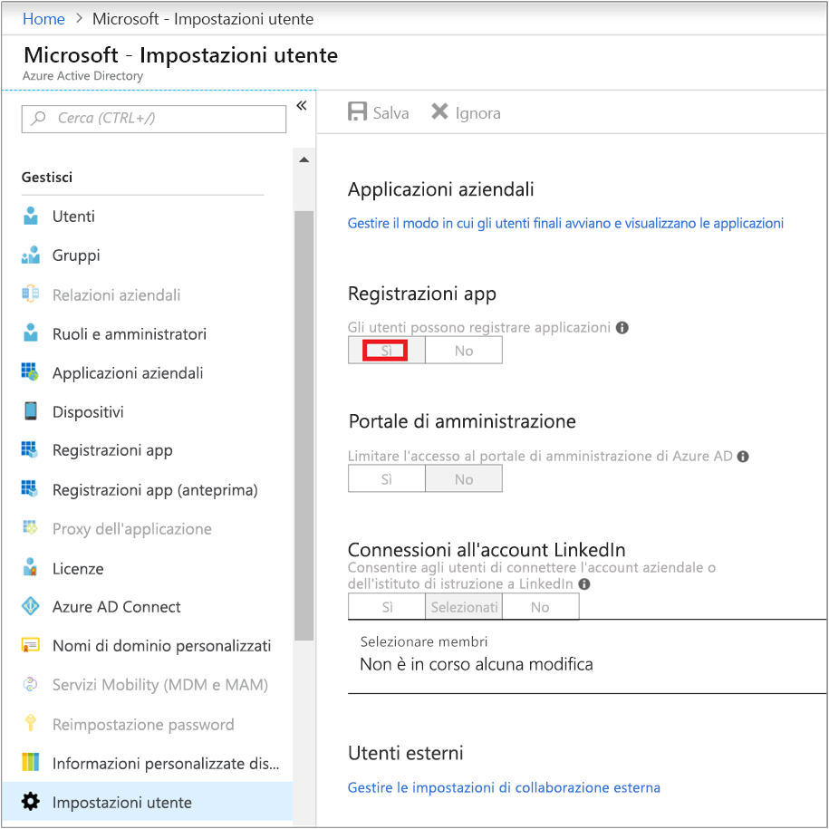
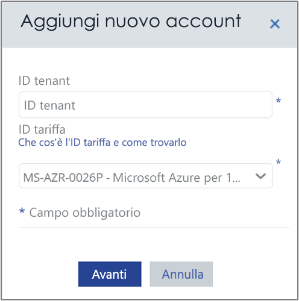
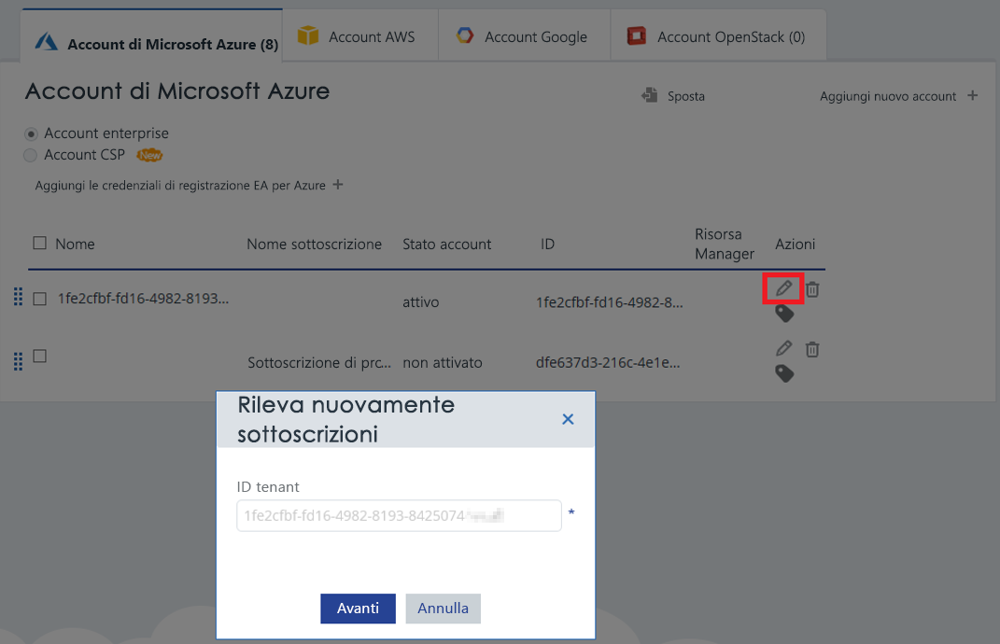

# <a name="activate-azure-subscriptions-and-accounts-with-cloudyn"></a>Attivare sottoscrizioni e account di Azure con Cloudyn

L'aggiunta o l'aggiornamento delle credenziali di Azure Resource Manager consente a Cloudyn di individuare tutti gli account e le sottoscrizioni nel tenant di Azure. Se nelle macchine virtuali è abilitata anche l'estensione Diagnostica di Azure, Cloudyn può raccogliere le metriche estese, come CPU e memoria. Questo articolo descrive come abilitare l'accesso con le API di Azure Resource Manager per gli account nuovi ed esistenti. Spiega anche come risolvere i problemi comuni relativi agli account.

Cloudyn non può accedere alla maggior parte dei dati della sottoscrizione di Azure quando la sottoscrizione è _non attivata_. È necessario modificare gli account _non attivati_ in modo che Cloudyn possa accedervi.

## <a name="required-azure-permissions"></a>Autorizzazioni di Azure obbligatorie

Per completare le procedure illustrate in questo articolo, sono necessarie autorizzazioni specifiche. L'utente o l'amministratore del tenant deve avere entrambe le autorizzazioni seguenti:

- Autorizzazione a registrare l'applicazione CloudynCollector con il tenant di Azure AD.
- Possibilità di assegnare l'applicazione a un ruolo nelle sottoscrizioni di Azure.

Nelle sottoscrizione di Azure gli account devono avere l'accesso `Microsoft.Authorization/*/Write` per assegnare l'applicazione CloudynCollector. Questa azione è concessa tramite il ruolo [Proprietario](../role-based-access-control/built-in-roles.md#owner) o [Amministratore accessi utente](../role-based-access-control/built-in-roles.md#user-access-administrator).

Se al proprio account è assegnato il ruolo **Collaboratore**, non è disponibile l'autorizzazione appropriata per assegnare l'applicazione. Quando si prova ad assegnare l'applicazione CloudynCollector alla sottoscrizione di Azure, viene visualizzato un errore.

### <a name="check-azure-active-directory-permissions"></a>Controllare le autorizzazioni di Azure Active Directory

1. Accedere al [Portale di Azure](https://portal.azure.com).
2. Nel portale di Azure selezionare **Azure Active Directory**.
3. In Azure Active Directory selezionare **Impostazioni utente**.
4. Controllare l'opzione **Registrazioni per l'app**.
    - Se è impostata su **Sì**, gli utenti non amministratori possono registrare le app AD. Questa impostazione indica che qualsiasi utente in Azure AD può registrare un'app.  
    
    - Se l'opzione **Registrazioni per l'app** è impostata su **No**, solo gli utenti amministratori del tenant possono registrare le app Azure Active Directory. L'amministratore del tenant deve registrare l'applicazione CloudynCollector.


## <a name="add-an-account-or-update-a-subscription"></a>Aggiungere un account o aggiornare una sottoscrizione

Quando si aggiunge una sottoscrizione a un aggiornamento dell'account, si concede a Cloudyn l'accesso ai dati di Azure.

### <a name="add-a-new-account-subscription"></a>Aggiungere un nuovo account (sottoscrizione)

1. Nel portale di Cloudyn, fare clic sul simbolo a forma di ingranaggio in alto a destra e selezionare **Account Cloud**.
2. Fare clic su **Aggiungi un nuovo account** per visualizzare la finestra di dialogo **Aggiungi un nuovo account**. Immettere le informazioni necessarie.  
    

### <a name="update-a-subscription"></a>Aggiornare una sottoscrizione

1. Per aggiornare una sottoscrizione esistente _non attivata_ in Cloudyn, fare clic sul simbolo di modifica a forma di matita, a destra del _GUID del tenant_ padre. Le sottoscrizioni vengono raggruppate in un tenant padre. Evitare pertanto di attivare le sottoscrizioni singolarmente.
    
2. Se necessario, immettere l'ID del tenant. Se non si conosce l'ID del tenant, seguire questa procedura per trovarlo:
    1. Accedere al [portale di Azure](https://portal.azure.com).
    2. Nel portale di Azure selezionare **Azure Active Directory**.
    3. Per ottenere l'ID tenant selezionare **Proprietà** per il tenanto di Azure AD.
    4. Copiare il GUID ID directory. Questo valore è l'ID tenant.
    Per altre informazioni, vedere [Ottenere l'ID tenant](../azure-resource-manager/resource-group-create-service-principal-portal.md#get-tenant-id).
3. Se necessario, selezionare l'ID della tariffa. Se non si conosce l'ID della tariffa, seguire questa procedura per trovarlo.
    1. In alto a destra nel portale di Azure fare clic sulle informazioni utente e quindi su **Visualizza fattura**.
    2. In **Account di fatturazione** fare clic su **Sottoscrizioni**.
    3. In **Sottoscrizioni personali** selezionare la sottoscrizione.
    4. L'ID della tariffa è indicato in **ID offerta**. Copiare l'ID offerta per la sottoscrizione.
4. Nella finestra di dialogo Aggiungi un nuovo account (o Modifica sottoscrizione) fare clic su **Salva** (o su **Avanti**). Si verrà reindirizzati al portale di Azure.
5. Accedere al portale. Fare clic su **Accetta** per autorizzare l'agente di raccolta Cloudyn ad accedere all'account Azure.

    Si verrà reindirizzati alla pagina di gestione degli account Cloudyn e la sottoscrizione verrà aggiornata con lo stato dell'account **attivo**. Nella colonna Resource Manager verrà visualizzato un simbolo di segno di spunta verde.

    Se non viene visualizzato un simbolo di segno di spunta verde per una o più sottoscrizioni, significa che non sono disponibili le autorizzazioni per creare l'applicazione lettore (CloudynCollector) per la sottoscrizione. Un utente con autorizzazioni più elevate per la sottoscrizione deve ripetere questo processo.

Guardare il video [Connessione ad Azure Resource Manager con Cloudyn](https://youtu.be/oCIwvfBB6kk), che descrive dettagliatamente il processo.

>[!VIDEO https://www.youtube.com/embed/oCIwvfBB6kk?ecver=1]

## <a name="resolve-common-indirect-enterprise-set-up-problems"></a>Risolvere i problemi di configurazione indiretta dell'organizzazione

Quando si usa per la prima volta il portale di Cloudyn, vengono visualizzati i messaggi seguenti se si ha un contratto Enterprise o Provider di soluzioni cloud (CSP):

- *La chiave API specificata non è una chiave di registrazione principale*, mostrato nella procedura guidata **Configurazione di Cloudyn**.
- *Direct Enrollment – No* (Registrazione diretta - No), nel portale per i contratti Enterprise.
- *No usage data was found for the last 30 days. Please contact your distributor to make sure markup was enabled for your Azure account* (Non sono stati trovati dati di utilizzo per gli ultimi 30 giorni. Contattare il distributore per verificare che per l'account Azure sia stato abilitato il markup), nel portale di Cloudyn.

I messaggi precedenti indicano che è stato acquistato un contratto Enterprise di Azure tramite un rivenditore o un CSP. Per poter visualizzare i dati in Cloudyn, è necessario che il rivenditore o il CSP abiliti il _markup_ per l'account Azure.

Ecco come risolvere i problemi:

1. Il rivenditore deve abilitare il _markup_ per l'account. Per le istruzioni, vedere la [guida introduttiva per i clienti indiretti](https://ea.azure.com/api/v3Help/v2IndirectCustomerOnboardingGuide).
2. Generare la chiave del contratto Enterprise di Azure da usare con Cloudyn. Per istruzioni, vedere [Registrare un Azure Enterprise Agreement e visualizzare i dati sui costi](https://docs.microsoft.com/azure/cost-management/quick-register-ea).

Per poter generare la chiave API del contratto Enterprise di Azure per la configurazione di Cloudyn, abilitare prima di tutto l'API di fatturazione di Azure seguendo queste istruzioni:

- [Panoramica delle API di creazione di report per i clienti Enterprise](../billing/billing-enterprise-api.md)
- Sezione **Enabling data access to the API** (Abilitazione dell'accesso ai dati nell'API) in [Microsoft Azure Enterprise Portal Reporting API](https://ea.azure.com/helpdocs/reportingAPI) (API di creazione report di Microsoft Azure Enterprise Portal)

Potrebbe anche essere necessario concedere ad amministratori di reparto, proprietari di account e amministratori dell'organizzazione le autorizzazioni per _visualizzare gli addebiti_ con l'API di fatturazione.

Cloudyn può essere abilitato solo da un amministratore del servizio Azure. Le autorizzazioni di coamministratore non sono sufficienti. È tuttavia possibile aggirare il requisito di amministratore. È possibile richiedere che l'amministratore di Azure Active Directory conceda l'autorizzazione per **CloudynAzureCollector** con uno script di PowerShell. Lo script seguente concede l'autorizzazione per registrare l'entità servizio di Azure Active Directory **CloudynAzureCollector**.


```
#THE SOFTWARE IS PROVIDED "AS IS", WITHOUT WARRANTY OF ANY KIND, EXPRESS OR IMPLIED, INCLUDING BUT NOT LIMITED TO THE WARRANTIES OF MERCHANTABILITY, FITNESS FOR A PARTICULAR PURPOSE AND NONINFRINGEMENT. IN NO EVENT SHALL THE AUTHORS OR COPYRIGHT HOLDERS BE LIABLE FOR ANY CLAIM, DAMAGES OR OTHER LIABILITY, WHETHER IN AN ACTION OF CONTRACT, TORT OR OTHERWISE, ARISING FROM, OUT OF OR IN CONNECTION WITH THE SOFTWARE OR THE USE OR OTHER DEALINGS IN THE SOFTWARE.

#Tenant - enter your tenant ID or Name
$tenant = "<ReplaceWithYourTenantID>"

#Cloudyn Collector application ID
$appId = "83e638ef-7885-479f-bbe8-9150acccdb3d"

#URL to activate the consent screen
$url = "https://login.windows.net/"+$tenant+"/oauth2/authorize?api-version=1&response_type=code&client_id="+$appId+"&redirect_uri=http%3A%2F%2Flocalhost%3A8080%2FCloudynJava&prompt=consent"

#Choose your browser, the default is Internet Explorer

#Chrome
#[System.Diagnostics.Process]::Start("chrome.exe", "--incognito $url")

#Firefox
#[System.Diagnostics.Process]::Start("firefox.exe","-private-window $url" )

#IExplorer
[System.Diagnostics.Process]::Start("iexplore.exe","$url -private" )

```

## <a name="next-steps"></a>Passaggi successivi

- Se non è stata ancora completata la prima esercitazione di Cloudyn, leggere le informazioni riportate in [Esaminare utilizzo e costi](tutorial-review-usage.md).
