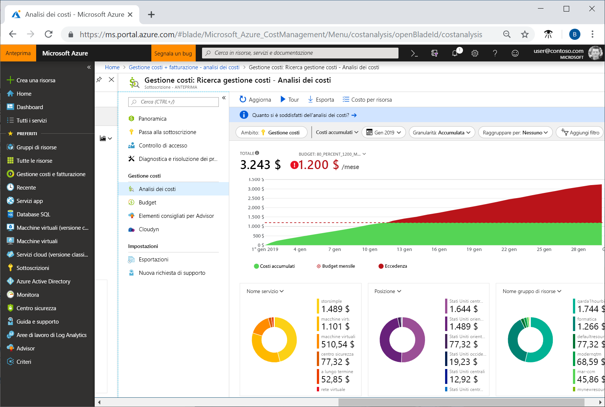
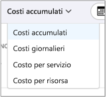
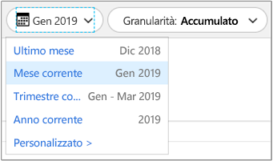
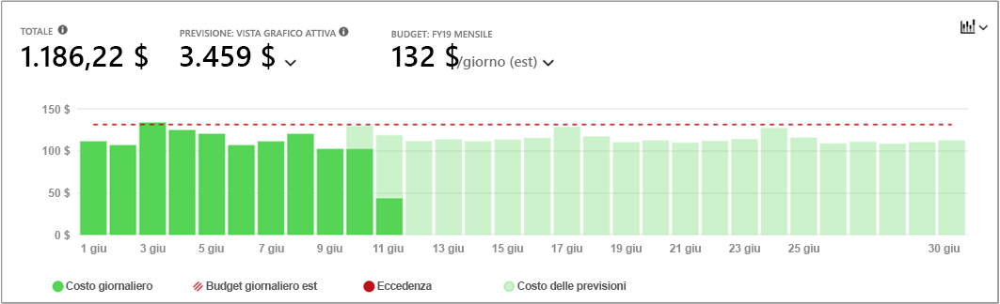
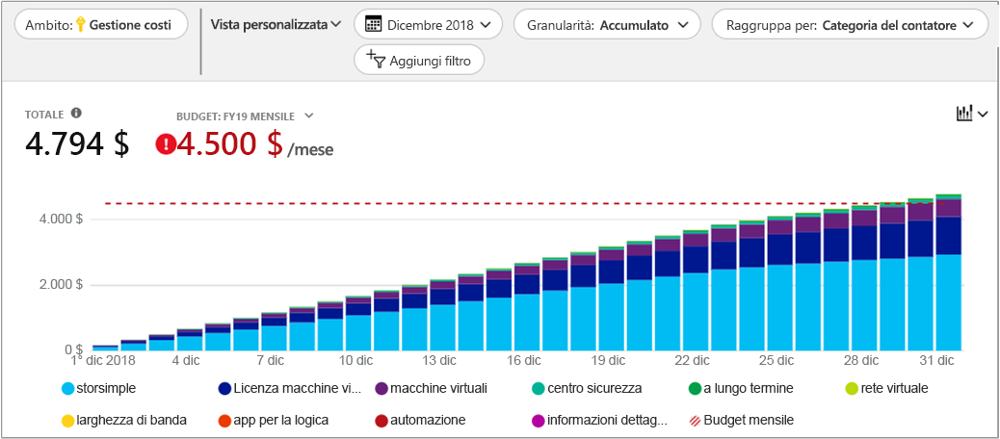
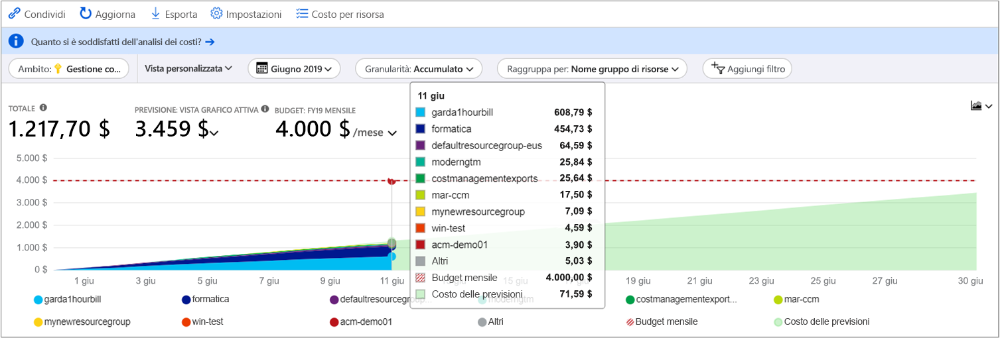
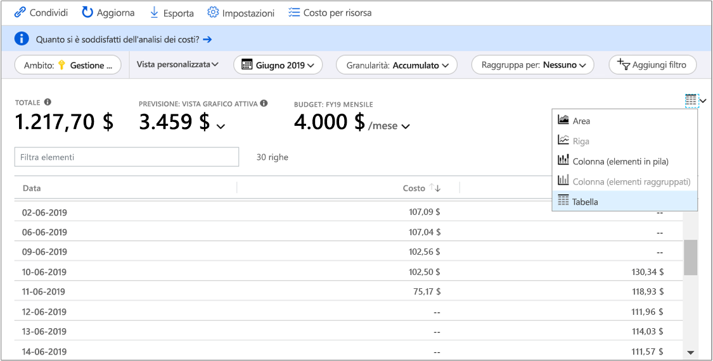

# Guida introduttiva: Esplorare e analizzare i costi con l'analisi dei costi

Per poter controllare al meglio e ottimizzare i costi di Azure, è necessario conoscere l'origine dei costi all'interno dell'organizzazione. È anche utile sapere quanto costano i servizi e quali ambienti e sistemi supportano. È fondamentale avere visibilità sul dettaglio dei costi per comprendere in modo approfondito i modelli di spesa aziendali, che possono essere usati per applicare meccanismi di controllo dei costi, ad esempio i budget.

In questa guida introduttiva si usa l'analisi dei costi per esplorare e analizzare i costi aziendali. È possibile visualizzare i costi aggregati per l'organizzazione per capire dove si accumulano i costi nel tempo e identificare le tendenze di spesa. È possibile visualizzare i costi accumulati nel corso del tempo per stimare le tendenze dei costi mensili, trimestrali o addirittura annuali rispetto a un budget. Un budget è utile per rispettare eventuali vincoli finanziari oppure per visualizzare i costi giornalieri o mensili per isolare le irregolarità di spesa. È anche possibile scaricare i dati del report corrente per un'ulteriore analisi o per usarli in un sistema esterno.

In questa guida introduttiva si apprende come:

- Esaminare i costi nell'analisi dei costi
- Personalizzare le visualizzazioni dei costi
- Scaricare i dati dell'analisi dei costi

## Prerequisiti

L'analisi dei costi supporta diversi tipi di account di Azure. Per visualizzare l'elenco completo dei tipi di account supportati, vedere [Understand Cost Management data](understand-cost-mgt-data.md) (Informazioni sui dati di Gestione costi). Per visualizzare i dati relativi ai costi, è necessario effettuare almeno l'accesso in lettura per l'account Azure.

I clienti con [Contratto Enterprise](https://azure.microsoft.com/pricing/enterprise-agreement/) devono avere l'accesso in lettura ad almeno uno degli ambiti seguenti per visualizzare i dati dei costi.

- Account di fatturazione
- department
- Account di registrazione
- Gruppo di gestione
- Sottoscrizione
- Gruppo di risorse

Per altre informazioni sull'assegnazione dell'accesso ai dati di Gestione costi, vedere [Assign access to data](assign-access-acm-data.md) (Assegnare l'accesso ai dati).

## Accedere ad Azure

- Accedere al portale di Azure all'indirizzo https://portal.azure.com.

## Esaminare i costi nell'analisi dei costi

Per esaminare i costi nell'analisi dei costi, aprire l'ambito nel portale di Azure e scegliere **Analisi dei costi** dal menu. Passare ad esempio a **Sottoscrizioni**, selezionare una sottoscrizione dall'elenco, quindi selezionare **Analisi dei costi** nel menu. Usare l'etichetta **Ambito** per passare a un ambito diverso nell'analisi dei costi. Per altre informazioni sugli ambiti, vedere [Informazioni e utilizzo degli ambiti](understand-work-scopes.md).

L'ambito selezionato viene usato attraverso Gestione costi per fornire il consolidamento dati e per controllare l'accesso alle informazioni sui costi. Quando si usano gli ambiti non vengono multi-selezionati. Si seleziona piuttosto un ambito più ampio di cui viene eseguito il rollup da altri utenti e quindi si applica il filtro fino agli ambiti desiderati. È importante comprendere questo approccio perché alcuni utenti potrebbero non avere accesso a un singolo ambito padre, che copre più ambiti annidati.

La visualizzazione dell'analisi dei costi iniziale include le aree seguenti:

**Totale**: visualizza i costi totali per il mese corrente.

**Budget**: visualizza il limite di spesa per l'ambito selezionato, se disponibile.

**Costi accumulati**: visualizza le spese giornaliere aggregate totali, a partire dall'inizio del mese. Dopo aver [creato un budget](tutorial-acm-create-budgets.md) per l'account di fatturazione o la sottoscrizione, è possibile visualizzare rapidamente la tendenza di spesa rispetto al budget. Passare il puntatore del mouse su una data per visualizzare il costo accumulato per quel giorno.

**Grafici pivot (ad anello)** - Offrono pivot dinamici, suddividendo il costo totale in base a un set comune di proprietà standard. Mostrano i costi per il mese corrente, in ordine decrescente. È possibile cambiare i grafici pivot in qualsiasi momento selezionando un pivot diverso. I costi vengono classificati in base a servizio (categoria del contatore), località (area) e ambito figlio per impostazione predefinita. Ad esempio, gli account di registrazione sotto gli account di fatturazione, i gruppi di risorse sotto le sottoscrizioni e le risorse sotto i gruppi di risorse.

## Personalizzare le visualizzazioni dei costi

Per l'analisi dei costi sono disponibili quattro visualizzazioni predefinite, ottimizzate per gli obiettivi più comuni:

Visualizza | Risponde a domande di questo tipo...
--- | ---
Costi accumulati | Quali sono state finora le spese in questo mese? Il budget verrà rispettato?
Costi giornalieri | Si sono verificati aumenti dei costi giornalieri negli ultimi 30 giorni?
Costo per servizio | Come è cambiato l'utilizzo mensile nelle ultime tre fatture?
Costo per risorsa | Quali risorse sono costate maggiormente finora in questo mese?

Esistono tuttavia molti i casi in cui è necessaria un'analisi più approfondita. La personalizzazione inizia nella parte superiore della pagina, con la selezione della data.

Per impostazione predefinita, l'analisi dei costi mostra i dati per il mese corrente. Usare il selettore data per passare rapidamente a intervalli di date comuni, ad esempio gli ultimi sette giorni, l'ultimo mese, l'anno corrente o un intervallo di date personalizzato. Le sottoscrizioni con pagamento in base al consumo includono inoltre intervalli di date basati sul periodo di fatturazione, che non è associato al mese di calendario, ad esempio il periodo di fatturazione corrente o l'ultima fattura. Usare i collegamenti **< INDIETRO** e **AVANTI >** nella parte superiore del menu per passare rispettivamente al periodo precedente o successivo. Ad esempio, **< INDIETRO** consente di passare dagli ultimi sette giorni agli ultimi 8-14 giorni fino agli ultimi 15-21 giorni.

Per impostazione predefinita, l'analisi dei costi mostra i costi **accumulati**. I costi accumulati includono tutti i costi per ogni singolo giorno oltre a quelli dei giorni precedenti, con una visualizzazione in continua crescita dei costi giornalieri aggregati. Questa visualizzazione è ottimizzata per mostrare la tendenza rispetto a un budget per l'intervallo di tempo selezionato.

È disponibile anche una visualizzazione **giornaliera** che mostra i costi sostenuti ogni giorno. La visualizzazione giornaliera non visualizza una tendenza di incremento. La visualizzazione è progettata per mostrare eventuali irregolarità, ad esempio impennate o flessioni dei costi da un giorno all'altro. Se si seleziona un budget, la visualizzazione giornaliera mostra anche una stima del budget giornaliero. Quando i costi giornalieri sono costantemente al di sopra del budget giornaliero stimato, è probabile che il budget mensile venga superato. Il budget stimato giornaliero è semplicemente un mezzo per poter visualizzare il budget a un livello più basilare. Quando si verificano fluttuazioni nei costi giornalieri, il confronto tra il budget giornaliero stimato e il budget mensile è meno preciso.

In genere, è possibile visualizzare dati o notifiche per le risorse utilizzate entro 8-12 ore.

Usare **Raggruppa per** per raggruppare proprietà comuni per suddividere i costi e identificare i gruppi che hanno contribuito maggiormente ai costi. Per raggruppare ad esempio in base alle risorse, selezionare la chiave del tag in base alla quale si vuole eseguire il raggruppamento. I costi verranno suddivisi in base a ogni valore di tag, con un segmento extra per le risorse a cui non è applicato tale tag.

La maggior parte delle [risorse di Azure supporta l'assegnazione di tag](../azure-resource-manager/tag-support.md), tuttavia alcuni tag non sono disponibili in Gestione costi e fatturazione. Inoltre, i tag del gruppo di risorse non sono supportati. Gestione costi supporta solo i tag delle risorse a partire dalla data in cui i tag vengono applicati direttamente alla risorsa. Guardare il video [How to review tag policies with Azure Cost Management](https://www.youtube.com/watch?v=nHQYcYGKuyw) (Come rivedere i criteri di tag con Gestione costi di Azure) per informazioni sull'uso dei criteri di tag di Azure per migliorare la visibilità dei dati di costo.

Ecco una visualizzazione dei costi dei servizi di Azure nell'ultimo mese.

I grafici pivot nel grafico principale mostrano diversi raggruppamenti per offrire un quadro più ampio dei costi complessivi per il periodo di tempi e i filtri selezionati. Selezionare una proprietà o un tag per visualizzare i costi aggregati per qualsiasi dimensione.

L'immagine precedente mostra i nomi dei gruppi di risorse. Anche se è possibile raggruppare in base a tag per visualizzare i costi totali per ogni tag, la visualizzazione di tutti i tag per risorsa o gruppo di risorse non è disponibile in nessuna delle visualizzazioni di analisi dei costi.

Quando si raggruppano i costi in base a un attributo specifico, vengono visualizzati in ordine decrescente i primi 10 gruppi di risorse che hanno contribuito maggiormente ai costi. Se sono presenti più di 10 gruppi, vengono visualizzati i primi nove gruppi che hanno contribuito, nonché un gruppo **Altri**, che riunisce tutti gli altri gruppi. Quando si raggruppa in base ai tag, è anche possibile visualizzare un gruppo **Senza tag** a cui non è applicata la chiave del tag. **Senza tag** è sempre ultimo, anche se i costi senza tag sono superiori ai costi con tag. Se sono presenti 10 o più valori di tag, i costi senza tag faranno parte del gruppo **Altri**.

Le macchine virtuali, le risorse di rete e le risorse di archiviazione *classiche* non condividono dati di fatturazione dettagliati. Tali risorse vengono unite nel gruppo **Classic services** (Servizi classici) quando si raggruppano i costi.

È possibile visualizzare il set di dati completo per tutte le viste. Le selezioni effettuate o i filtri applicati influiscono sui dati presentati. Per visualizzare il set di dati completo, fare clic sull'elenco del **tipo di grafico** e quindi fare clic sulla vista **Tabella**.

## Scaricare i dati dell'analisi dei costi

È possibile **scaricare** informazioni dall'analisi dei costi per generare un file CSV per tutti i dati attualmente visualizzati nel portale di Azure. Eventuali filtri o raggruppamenti applicati vengono inclusi nel file. Nel file CSV vengono inclusi anche i dati sottostanti per il grafico del totale della parte superiore, che non sono visualizzati attivamente.

## Passaggi successivi

Passare alla prima esercitazione per apprendere come creare e gestire i budget.

> [!div class="nextstepaction"]
> [Creare e gestire i budget](tutorial-acm-create-budgets.md)
