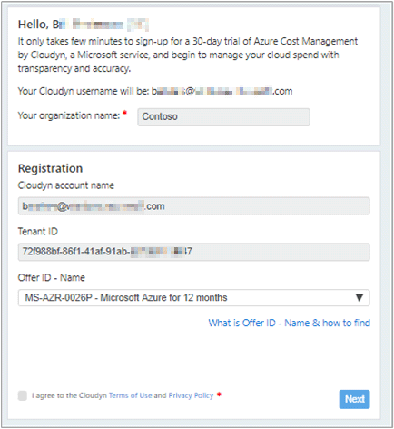
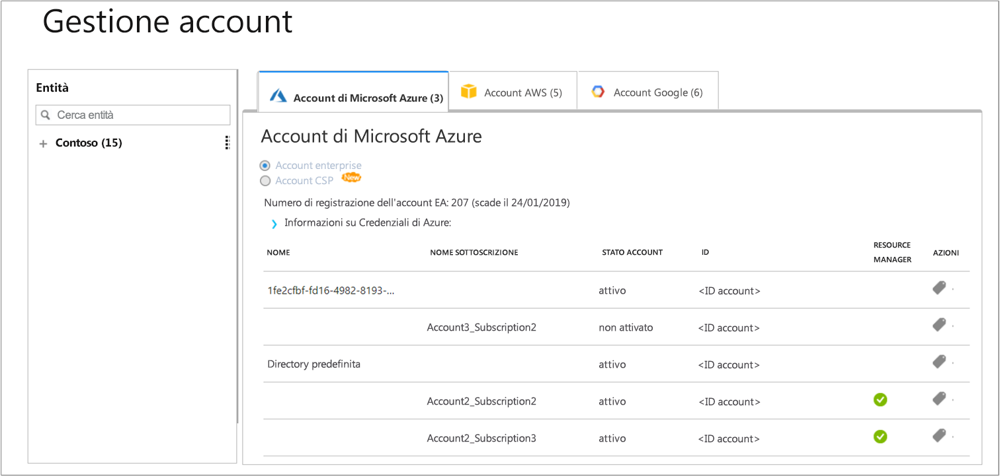

# Registrare una singola sottoscrizione di Azure e visualizzare i dati sui costi

Usare la sottoscrizione di Azure per effettuare la registrazione in Gestione costi di Azure. La registrazione consente di accedere al portale di Cloudyn. Questa guida introduttiva illustra nei dettagli il processo di registrazione necessario per creare una sottoscrizione di valutazione di Cloudyn e accedere al suo portale. Descrive anche come iniziare a visualizzare da subito i dati sui costi.

## Accedere ad Azure

- Accedere al portale di Azure all'indirizzo http://portal.azure.com.

## Creare una registrazione di valutazione

1. Nel portale di Azure fare clic su **Gestione dei costi e fatturazione** nell'elenco dei servizi.
2. In **Panoramica** fare clic su **Gestione dei costi**  
    
3. Nella pagina **Gestione dei costi**  fare clic su **Go to Cost Management** (Vai a Gestione dei costi) per aprire la pagina di registrazione di Cloudyn in una nuova finestra.
4. Nella pagina della registrazione di valutazione del portale di Cloudyn digitare il nome della società e selezionare **Azure Individual Subscription Owner** (Proprietario della singola sottoscrizione di Azure) e fare clic su **Avanti**. Il nome account e l'ID tenant vengono compilati automaticamente.  
    
5. Selezionare **Offer ID - Name** (ID offerta - Nome) associato alla sottoscrizione. In caso di dubbi sull'ID tariffa per la sottoscrizione, è possibile cercare l'**ID offerta** nella fattura di Azure.
6. Accettare le condizioni per l'utilizzo, convalidare le informazioni e fare clic su **Avanti**.
7. Nella pagina **Gather additional data** (Raccogli dati aggiuntivi) fare clic su **Avanti** per autorizzare Cloudyn a raccogliere i dati delle risorse di Azure. Dalla sottoscrizione vengono raccolti dati riguardanti l'uso, le prestazioni, la fatturazione e dati dei tag.  
    
8. Nel browser si apre la pagina di accesso a Cloudyn. Accedere con le credenziali della sottoscrizione di Azure.
9. Fare clic su **Go to Cloudyn** (Passa a Cloudyn) per aprire il portale di Cloudyn. Nella pagina **Accounts Management** (Gestione account) saranno visualizzate le informazioni sugli account della sottoscrizione di Azure.  
    

Per un video di esercitazione su come eseguire la registrazione della sottoscrizione di Azure, vedere [Finding your Directory GUID and Rate ID for use in Azure Cost Management](https://youtu.be/PaRjnyaNGMI) (Individuare il GUID della directory e l'ID della tariffa da usare in Gestione costi di Azure).

[!INCLUDE [cost-management-create-account-view-data](../../includes/cost-management-create-account-view-data.md)]

## Passaggi successivi

In questa guida introduttiva sono state usate le informazioni della sottoscrizione di Azure per registrarsi in Gestione dei costi. È stato anche eseguito l'accesso al portale di Cloudyn ed è stata avviata la visualizzazione dei dati sui costi. Per altre informazioni su Gestione costi di Azure, continuare l'esercitazione su Gestione costi.

> [!div class="nextstepaction"]
> [Esaminare l'utilizzo e i costi](./tutorial-review-usage.md)
