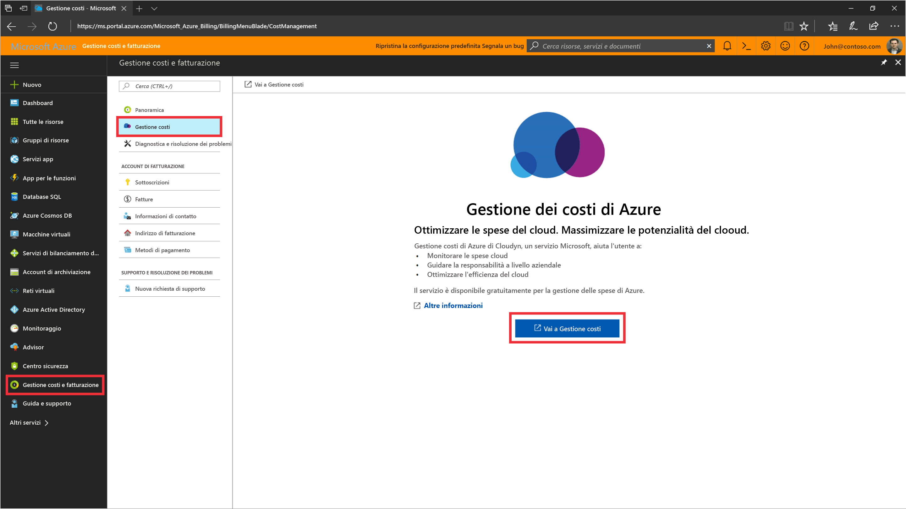
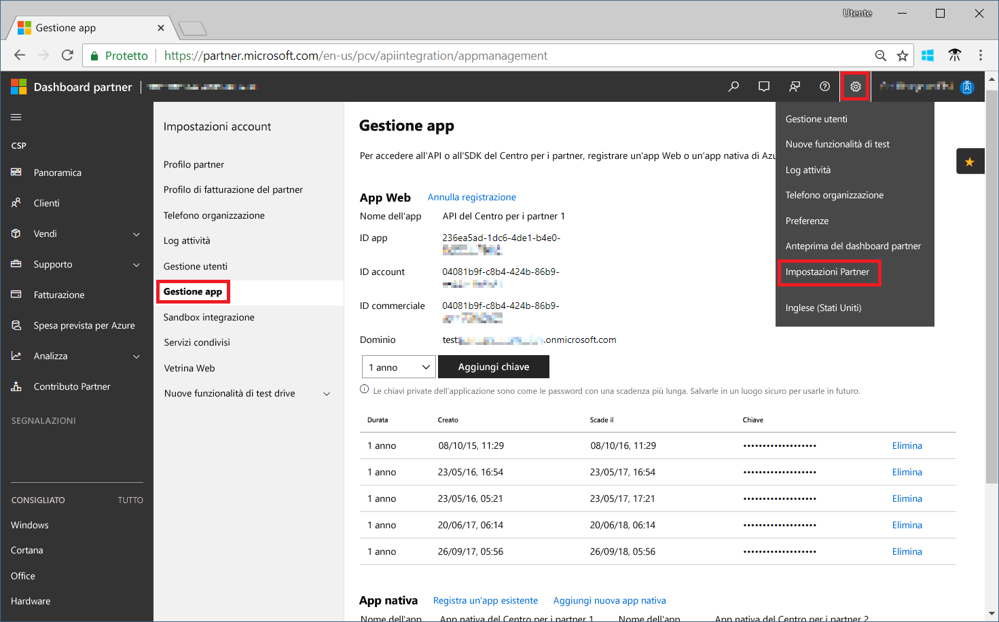
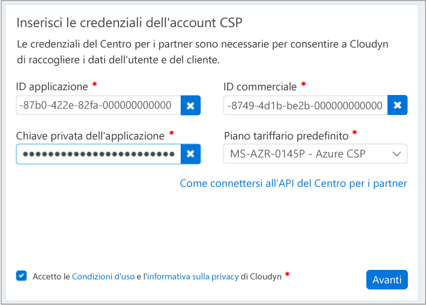

# Eseguire la registrazione al programma per i partner CSP e visualizzare i dati sui costi

I partner CSP possono eseguire la registrazione in Gestione costi di Azure di Cloudyn. La registrazione consente di accedere al portale di Cloudyn. Questa guida introduttiva illustra nei dettagli il processo di registrazione necessario per creare una sottoscrizione di valutazione di Cloudyn e accedere al suo portale. Descrive anche come iniziare a visualizzare da subito i dati sui costi.

Per completare la registrazione, è necessario essere un amministratore del programma per i partner con accesso all'API del Centro per i partner. Per l'autenticazione e l'accesso ai dati è necessario configurare l'API del Centro per i partner. Per altre informazioni, vedere Connect to the Partner Center API (Connettersi all'API del Centro per i partner).

## Accedere ad Azure

- Accedere al portale di Azure all'indirizzo http://portal.azure.com.

## Creare una registrazione di valutazione

1. Nel portale di Azure fare clic su **Gestione dei costi e fatturazione** nell'elenco dei servizi.
2. In **Panoramica** fare clic su **Gestione dei costi**  
    
3. Nella pagina **Gestione dei costi**  fare clic su **Go to Cost Management** (Vai a Gestione dei costi) per aprire la pagina di registrazione di Cloudyn in una nuova finestra.
4. Nella pagina di registrazione di valutazione del portale di Cloudyn digitare il nome della società, selezionare **Microsoft CSP Partner Program Administrator** (Amministratore del programma per i partner CSP di Microsoft) e fare clic su **Next** (Avanti).  
5. Immettere un **ID applicazione**, un **ID commercio**, una **chiave privata dell'applicazione**e selezionare il **piano tariffario predefinito**. Se le informazioni necessarie non sono disponibili, accedere al portale del Centro per i partner all'indirizzo [https://partnercenter.microsoft.com](https://partnercenter.microsoft.com) usando l'account amministratore principale e seguire questa procedura:
  1. Passare a **Dashboard** > **Impostazioni Account** > **Gestione app**.
  2. Se è già stata creata un'app Web, ignorare questo passaggio. In caso contrario, fare clic su **Add new web app** (Aggiungi nuova app Web) nella sezione **App Web**.
  3. Copiare il GUID dell'**ID app** dall'applicazione Web.
  4. Copiare il GUID dell'**ID Commerce** dall'applicazione Web.
  5. Selezionare il periodo di validità delle chiavi, uno o due anni in base alle necessità. Selezionare **Aggiungi chiave**, copiare e salvare il valore della chiave privata.  
    
  6. Tornare alla pagina di registrazione e inserire le informazioni.  
      
6. Accettare le condizioni per l'utilizzo e convalidare le informazioni. Fare clic su **Next** (Avanti) per autorizzare Cloudyn a raccogliere i dati sulle risorse di Azure. Dalla sottoscrizione vengono raccolti dati riguardanti l'uso, le prestazioni, la fatturazione e dati dei tag.  
7. In **Invite other stakeholder** (Invita altri stakeholder) è possibile aggiungere utenti digitando i loro indirizzi di posta elettronica. Al termine, fare clic su **Avanti**. I dati di fatturazione saranno aggiunti a Cloudyn in circa due ore.
8. Fare clic su **Go to Cloudyn** (Passa a Cloudyn) per aprire il portale di Cloudyn. Nella pagina **Cloud Accounts Management** (Gestione account cloud), saranno visualizzate le informazioni sugli account CSP registrati.

[!INCLUDE [cost-management-create-account-view-data](../../includes/cost-management-create-account-view-data.md)]

## Passaggi successivi

In questa guida introduttiva sono state usate le informazioni CSP per eseguire la registrazione in Gestione dei costi. È stato anche eseguito l'accesso al portale di Cloudyn e avviata la visualizzazione dei dati di costo. Per altre informazioni su Gestione costi di Azure di Cloudyn, continuare l'esercitazione su Gestione dei costi.

> [!div class="nextstepaction"]
> [Visualizzare i dati sui costi](./tutorial-review-usage.md)
