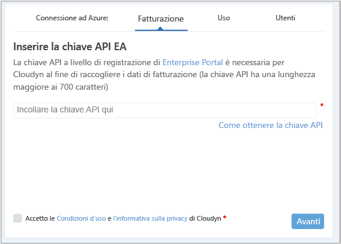
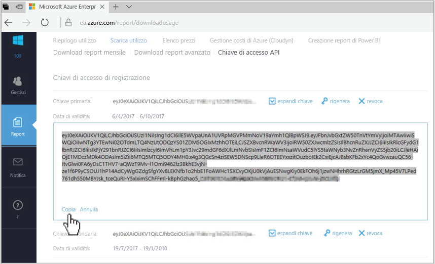
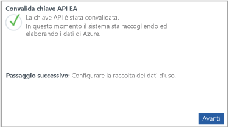

# Registrare un Azure Enterprise Agreement e visualizzare i dati sui costi

Usare Azure Enterprise Agreement per registrarsi in Gestione costi di Azure di Cloudyn. La registrazione consente di accedere al portale di Cloudyn. Questa guida introduttiva illustra nei dettagli il processo di registrazione necessario per creare una sottoscrizione di valutazione di Cloudyn e accedere al suo portale. Descrive anche come iniziare a visualizzare da subito i dati sui costi.

## Accedere ad Azure

- Accedere al portale di Azure all'indirizzo http://portal.azure.com.

## Creare una registrazione di valutazione

1. Nel portale di Azure fare clic su **Gestione dei costi e fatturazione** nell'elenco dei servizi.
2. In **Panoramica** fare clic su **Gestione dei costi**  
    
3. Nella pagina **Gestione dei costi** fare clic su **Go to Cost Management** (Vai a Gestione costi) per aprire la pagina di registrazione di Cloudyn in una nuova finestra.
4. Nella pagina della registrazione di valutazione del portale Cloudyn digitare il nome della società e quindi selezionare **Azure Enterprise Enrollment Administrator** (Amministratore delle registrazioni di Azure Enterprise).  
    
5. Immettere la chiave API di registrazione di Enterprise Portal. Se non si dispone della chiave necessaria fare clic sul link [Enterprise Portal](https://ea.azure.com) ed eseguire i passaggi seguenti:
  1. Accedere al sito Web di Azure Enterprise e fare clic su **Report**, quindi su **API Access Key** (Chiave di accesso dell'API) e copiare la chiave primaria.  
    
  3. Tornare alla pagina di registrazione e copiare la chiave API.
6. Accettare le condizioni d'uso e convalidare la chiave. Fare clic su **Avanti** per autorizzare Cloudyn a raccogliere i dati sulle risorse di Azure. Dalla sottoscrizione vengono raccolti dati riguardanti l'uso, le prestazioni, la fatturazione e dati dei tag.  
    
7. In **Invite other stakeholder** (Invita altri stakeholder) è possibile aggiungere utenti digitando i loro indirizzi di posta elettronica. Al termine, fare clic su **Avanti**. I dati di fatturazione saranno aggiunti a Cloudyn in circa due ore.
8. Fare clic su **Go to Cloudyn** (Passa a Cloudyn) per aprire il portale di Cloudyn. Nella pagina **Cloud Accounts Management** (Gestione account cloud) saranno visualizzate le informazioni sugli account EA registrati.

Per guardare un video di esercitazione su come eseguire la registrazione di un contratto Enterprise Agreement, vedere [How to Find Your EA Enrollment ID and API Key for use in Azure Cost Management by Cloudyn](https://youtu.be/u_phLs_udig) (Come individuare l'ID di registrazione EA e la chiave API da usare in Gestione costi di Azure di Cloudyn).

[!INCLUDE [cost-management-create-account-view-data](../../includes/cost-management-create-account-view-data.md)]

## Passaggi successivi

In questa guida rapida sono state usate le informazioni su Azure Enterprise Agreement per registrarsi in Gestione costi. È stato anche eseguito l'accesso al portale di Cloudyn e avviata la visualizzazione dei dati sui costo. Per altre informazioni su Gestione costi di Azure di Cloudyn, continuare l'esercitazione su Gestione dei costi.

> [!div class="nextstepaction"]
> [Esaminare l'utilizzo e i costi](./tutorial-review-usage.md)
