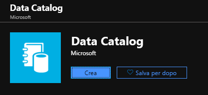
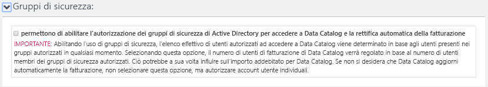
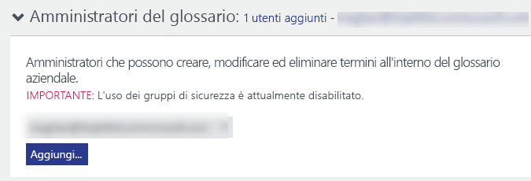
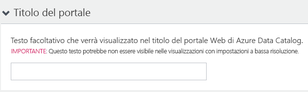

# Guida introduttiva: Creare un'istanza di Azure Data Catalog

Azure Data Catalog è un servizio cloud completamente gestito che funge da sistema di registrazione e di individuazione per asset di dati aziendali. Per una panoramica dettagliata, vedere [Definizione di Azure Data Catalog](overview.md).

Questa guida di avvio rapido illustra come creare un'istanza di Azure Data Catalog.

Se non si ha una sottoscrizione di Azure, creare un [account gratuito](https://azure.microsoft.com/free/?WT.mc_id=A261C142F) prima di iniziare.

## Prerequisiti

Per iniziare è necessario:

* Una sottoscrizione di [Microsoft Azure](https://azure.microsoft.com/).
* È necessario avere il proprio [tenant di Azure Active Directory](../active-directory/fundamentals/active-directory-access-create-new-tenant.md).

Per configurare Data Catalog, l'utente deve essere proprietario o comproprietario di una sottoscrizione di Azure.

## Creare un catalogo dati

È possibile effettuare il provisioning di un solo catalogo dati per organizzazione (dominio di Azure Active Directory). Se quindi il proprietario o il comproprietario di una sottoscrizione di Azure che appartiene a questo dominio di Azure Active Directory ha già creato un catalogo, non potrà crearne un altro anche se ha più sottoscrizioni di Azure. Per testare se un utente ha creato un catalogo dati nel dominio di Azure Active Directory, passare alla [home page di Azure Data Catalog](http://azuredatacatalog.com) e verificare se il catalogo è visualizzato. Se è già stato creato un catalogo, ignorare la procedura seguente e passare alla sezione successiva.

1. Passare al [portale di Azure](https://portal.azure.com) > **Crea una risorsa** e selezionare **Data Catalog**.

    

2. Specificare un **nome** per il catalogo, la **sottoscrizione** che si vuole usare, la **posizione** del catalogo e il **piano tariffario**. Selezionare quindi **Crea**.

3. Passare alla [home page di Azure Data Catalog](http://azuredatacatalog.com) e fare clic su **Pubblica dati**.

   

   È anche possibile accedere alla home page di Data Catalog dalla [pagina del servizio Data Catalog](https://azure.microsoft.com/services/data-catalog) selezionando **Introduzione**.

   

4. Passare alla pagina **Impostazioni**.

    

5. Espandere **Prezzi** e selezionare l'**edizione** di Azure Data Catalog (Gratuito o Standard).

    

6. Se si sceglie *Standard* come piano tariffario, è possibile espandere **Gruppi di sicurezza** e abilitare l'autorizzazione dei gruppi di sicurezza di Active Directory per accedere a Data Catalog e abilitare l'adeguamento automatico della fatturazione.

    

7. Espandere **Utenti del catalogo** e fare clic su **Aggiungi** per aggiungere utenti per il catalogo dati. L'utente verrà aggiunto automaticamente a questo gruppo.

    

8. Se si sceglie *Standard* come piano tariffario, è possibile espandere **Amministratori del glossario** e fare clic su **Aggiungi** per aggiungere utenti amministratori del glossario. L'utente verrà aggiunto automaticamente a questo gruppo.

    

9. Espandere **Amministratori del catalogo** e fare clic su **Aggiungi** per aggiungere altri amministratori per il catalogo dati. L'utente verrà aggiunto automaticamente a questo gruppo.

    

10. Espandere **Titolo del portale** e aggiungere ulteriore testo che verrà visualizzato nel titolo del portale.

    

11. Dopo aver completato la pagina **Impostazioni**, passare alla pagina **Pubblica**.

    

## Trovare un catalogo dati nel portale di Azure

1. In una scheda o una finestra separata del Web browser passare al [portale di Azure](https://portal.azure.com) e accedere con lo stesso account usato per creare il catalogo dati nel passaggio precedente.

2. Selezionare **Tutti i servizi** e quindi fare clic su **Data Catalog**.

    

    Verrà visualizzato il catalogo dati creato.

    

3. Fare clic sul catalogo creato. Nel portale verrà visualizzato il pannello **Catalogo dati** .

   

4. È possibile visualizzare le proprietà del catalogo dati e aggiornarle. Fare ad esempio clic su **Piano tariffario** e modificare l'edizione.

    

## Passaggi successivi

In questa guida di avvio rapido si è appreso come creare un'istanza di Azure Data Catalog per l'organizzazione. È ora possibile registrare le origini dati nel catalogo dati.

> [!div class="nextstepaction"]
> [Registrare le origini dati in Azure Data Catalog](data-catalog-how-to-register.md)
