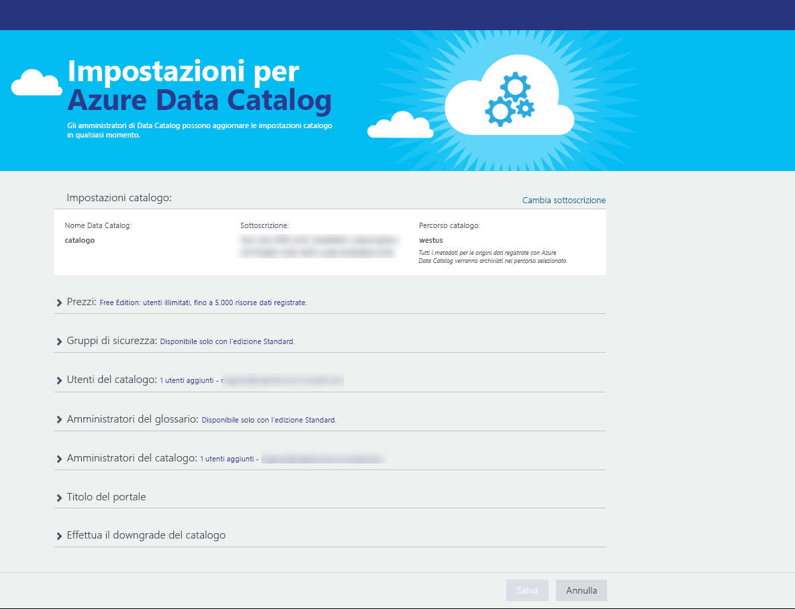
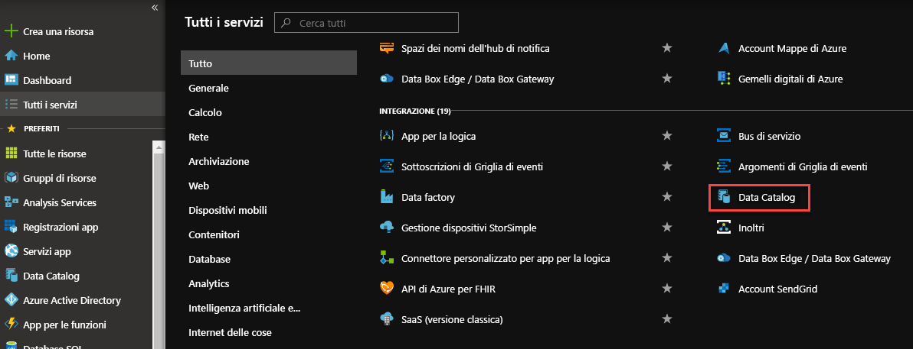
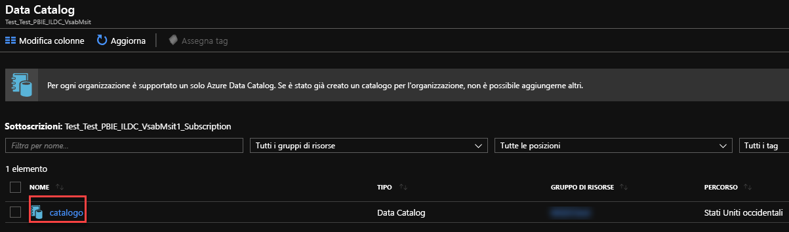
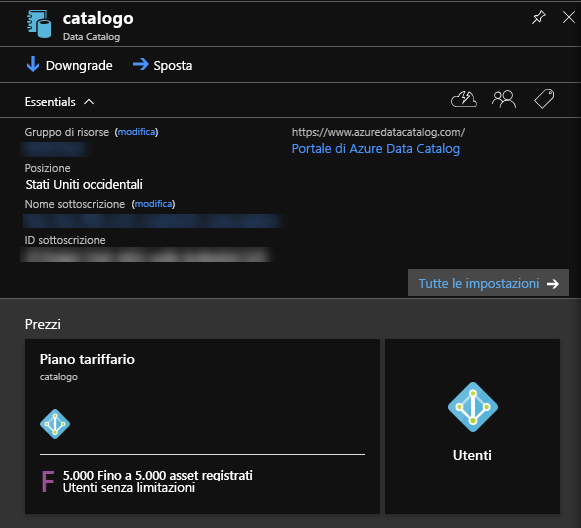
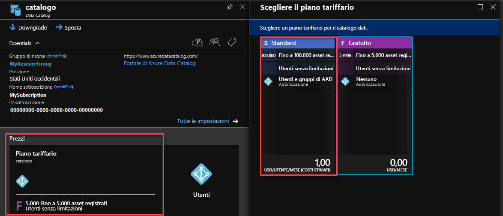

# Introduzione ad Azure Data Catalog
Azure Data Catalog è un servizio cloud completamente gestito che funge da sistema di registrazione e di individuazione per asset di dati aziendali. Per una panoramica dettagliata, vedere [Definizione di Azure Data Catalog](data-catalog-what-is-data-catalog.md).

Questa esercitazione consente di iniziare a usare Azure Data Catalog. In questa esercitazione verranno eseguite le procedure seguenti:

| Procedura | Descrizione |
|:--- |:--- |
| [Effettuare il provisioning del catalogo dati](#provision-data-catalog) |In questa procedura si effettuerà il provisioning o la configurazione di Azure Data Catalog. Questo passaggio viene eseguito solo se il catalogo non è stato configurato in precedenza. È possibile avere solo un catalogo dati per ogni organizzazione (dominio di Microsoft Azure Active Directory), anche se all'account di Azure sono associate più sottoscrizioni. |
| [Registrare gli asset di dati](#register-data-assets) |In questa procedura si registreranno gli asset di dati del database di esempio AdventureWorks2014 nel catalogo dati. La registrazione è il processo di estrazione dei metadati strutturali chiave, quali nomi, tipi e percorsi, dall'origine dati e di copia dei metadati nel catalogo. Le origini dati e gli asset di dati rimangono dove sono, ma i metadati vengono usati dal catalogo per renderli più facilmente individuabili e comprensibili. |
| [Individuare gli asset di dati](#discover-data-assets) |In questa procedura si userà il portale di Azure Data Catalog per individuare gli asset di dati registrati nel passaggio precedente. Dopo aver registrato un'origine dati con Azure Data Catalog, i relativi metadati vengono indicizzati dal servizio, in modo che gli utenti possano eseguire facilmente ricerche per individuare i dati necessari. |
| [Annotare gli asset di dati](#annotate-data-assets) |In questa procedura si specificheranno annotazioni (informazioni come descrizioni, tag, documentazione o esperti) per gli asset di dati. Queste informazioni integrano i metadati estratti dall'origine dati e rendono l'origine dati più comprensibile a un maggior numero di persone. |
| [Connettersi agli asset di dati](#connect-to-data-assets) |In questa procedura, gli asset di dati verranno aperti in strumenti client integrati (come Excel e SQL Server Data Tools) e in uno strumento non integrato (SQL Server Management Studio). |
| [Gestire gli asset di dati](#manage-data-assets) |In questa procedura verrà configurata la sicurezza per gli asset di dati. Azure Data Catalog non consente agli utenti di accedere ai dati stessi. Il proprietario dell'origine dati controlla l'accesso ai dati.    Azure Data Catalog consente di trovare le origini dati e di visualizzare i **metadati** correlati alle origini registrate nel catalogo. In alcune situazioni, tuttavia, le origini dati devono essere visibili solo a utenti specifici o ai membri di gruppi specifici. Per questi scenari, è possibile usare Azure Data Catalog per acquisire la proprietà di asset di dati registrati all'interno del catalogo e controllare la visibilità degli asset di cui si è proprietari. |
| [Rimuovere gli asset di dati](#remove-data-assets) |In questa procedura verrà illustrato come rimuovere gli asset di dati dal catalogo dati. |

## Prerequisiti per l'esercitazione
### Sottoscrizione di Azure
Per configurare Azure Data Catalog l'utente deve essere proprietario o comproprietario di una sottoscrizione di Azure.

Le sottoscrizioni di Azure consentono di organizzare l'accesso alle risorse del servizio cloud, come Catalogo dati di Azure. Consentono inoltre di controllare come l'utilizzo delle risorse viene segnalato, fatturato e pagato. Ogni sottoscrizione può disporre di un’impostazione di fatturazione e pagamento diversa, in modo da poter avere sottoscrizioni e piani diversi per reparto, progetto, ufficio regionale e così via. Ogni servizio cloud appartiene a una sottoscrizione ed è necessario che la sottoscrizione sia disponibile prima di impostare il Catalogo dati di Azure. Per altre informazioni, vedere l'articolo su come [gestire gli account, le sottoscrizioni e i ruoli amministrativi](../active-directory/active-directory-how-subscriptions-associated-directory.md).

Se non è disponibile una sottoscrizione, è possibile creare un account di valutazione gratuita in pochi minuti. Per informazioni dettagliate, vedere la [versione di valutazione gratuita](https://azure.microsoft.com/pricing/free-trial/) .

### Azure Active Directory
Per configurare Azure Data Catalog, è necessario accedere con un account utente di Azure Active Directory (Azure AD). L'utente deve essere proprietario o comproprietario di una sottoscrizione di Azure.  

Azure AD è un servizio che offre semplici e pratiche funzionalità di gestione delle identità e degli accessi, sia nel cloud sia in locale. È possibile usare un singolo account aziendale o dell'istituto di istruzione per accedere a qualsiasi applicazione Web cloud o locale. Azure Data Catalog usa Azure AD per autenticare l'accesso. Per altre informazioni, vedere [Informazioni su Azure Active Directory](../active-directory/active-directory-whatis.md).

### Configurazione dei criteri di Azure Active Directory
In alcune situazioni è possibile accedere al portale di Azure Data Catalog, ma quando si prova ad accedere allo strumento di registrazione dell'origine dati viene visualizzato un messaggio di errore che impedisce l'accesso. È possibile che questo problema si verifichi quando si usa la rete aziendale o quando ci si connette dall'esterno della rete aziendale.

Lo strumento di registrazione usa l' *autenticazione basata su form* per convalidare l'accesso utente in Azure Active Directory. Per completare l'accesso, un amministratore di Azure Active Directory deve abilitare l'autenticazione basata su form nei *criteri di autenticazione globali*.

I criteri di autenticazione globali consentono di abilitare l'autenticazione separatamente per connessioni Intranet ed Extranet, come illustrato nell'immagine seguente. Se l'autenticazione basata su form non è abilitata per la rete da cui ci si connette, è possibile che si verifichino errori di accesso.

 

Per altre informazioni, vedere [Configurazione dei criteri di autenticazione](https://technet.microsoft.com/library/dn486781.aspx).

## Effettuare il provisioning del catalogo dati
È possibile effettuare il provisioning di un solo catalogo dati per organizzazione (dominio di Azure Active Directory). Quindi se il proprietario o il comproprietario di una sottoscrizione di Azure che appartiene a questo dominio di Azure Active Directory ha già creato un catalogo, non potrà crearne un altro anche se ha più sottoscrizioni di Azure. Per testare se un utente ha creato un catalogo dati nel dominio di Azure Active Directory, passare alla [home page di Azure Data Catalog](http://azuredatacatalog.com) e verificare se il catalogo è visualizzato. Se è già stato creato un catalogo, ignorare la procedura seguente e passare alla sezione successiva.    

1. Passare alla [pagina del servizio Data Catalog](https://azure.microsoft.com/services/data-catalog) e fare clic su **Introduzione**.
   
    
2. Accedere usando un account utente proprietario o comproprietario di una sottoscrizione di Azure. Dopo l'accesso verrà visualizzata la pagina seguente.
   
    
3. Specificare un **nome** per il catalogo dati, la **sottoscrizione** da usare e la **località** del catalogo.
4. Espandere **Prezzi** e selezionare un'**edizione** di Azure Data Catalog (Gratuito o Standard).
    
5. Espandere **Utenti del catalogo** e fare clic su **Aggiungi** per aggiungere utenti per il catalogo dati. L'utente verrà aggiunto automaticamente a questo gruppo.
    
6. Espandere **Amministratori del catalogo** e fare clic su **Aggiungi** per aggiungere altri amministratori per il catalogo dati. L'utente verrà aggiunto automaticamente a questo gruppo.
    
7. Fare clic su **Crea catalogo** per creare il catalogo dati per l'organizzazione. Dopo la creazione, verrà visualizzata la home page per il catalogo dati.
        

### Trovare un catalogo dati nel portale di Azure
1. In una scheda o una finestra separata del Web browser passare al [portale di Azure](https://portal.azure.com) e accedere con lo stesso account usato per creare il catalogo dati nel passaggio precedente.
2. Selezionare **Esplora** e quindi fare clic su **Catalogo dati**.
   
     Viene visualizzato il catalogo dati creato.
   
    
3. Fare clic sul catalogo creato. Nel portale verrà visualizzato il pannello **Catalogo dati** .
   
   
4. È possibile visualizzare le proprietà del catalogo dati e aggiornarle. Fare ad esempio clic su **Piano tariffario** e modificare l'edizione.
   
    

### Database di esempio Adventure Works
In questa esercitazione si registreranno gli asset di dati (tabelle) del database di esempio AdventureWorks2014 per il motore di database di SQL Server, ma è possibile usare qualsiasi origine dati supportata se si preferisce lavorare con dati familiari e più attinenti al proprio ruolo. Per un elenco di origini dati supportate, vedere [Origini dati supportate](data-catalog-dsr.md).

### Installare il database OLTP Adventure Works 2014
Il database Adventure Works supporta gli scenari di elaborazione delle transazioni online standard per un produttore di biciclette fittizio (Adventure Works Cycles) che include i settori prodotti, vendite e acquisti. In questa esercitazione si registreranno le informazioni sui prodotti in Azure Data Catalog.

Per installare il database di esempio Adventure Works:

1. Scaricare [Adventure Works 2014 Full Database Backup.zip](https://msftdbprodsamples.codeplex.com/downloads/get/880661) in CodePlex.
2. Per ripristinare il database nel computer, seguire le istruzioni disponibili in [Ripristinare un backup del database tramite SQL Server Management Studio](http://msdn.microsoft.com/library/ms177429.aspx)oppure seguire questa procedura:
   1. Aprire SQL Server Management Studio e connettersi al motore di database di SQL Server.
   2. Fare clic con il pulsante destro del mouse su **Database** e scegliere **Ripristina database**.
   3. In **Ripristina database** selezionare l'opzione **Dispositivo** per **Origine** e fare clic su **Esplora**.
   4. In **Seleziona dispositivi di backup** fare clic su **Aggiungi**.
   5. Passare alla cartella in cui si trova il file **AdventureWorks2014.bak**, selezionare il file e fare clic su **OK** per chiudere la finestra di dialogo **Individua file di backup**.
   6. Fare clic su **OK** per chiudere la finestra di dialogo **Seleziona dispositivi di backup**.    
   7. Fare clic su **OK** per chiudere la finestra di dialogo **Ripristina database**.

È ora possibile registrare gli asset di dati dal database di esempio Adventure Works usando Azure Data Catalog.

## Registrare gli asset di dati
In questo esercizio si userà lo strumento di registrazione per registrare gli asset di dati del database Adventure Works nel catalogo. La registrazione è il processo di estrazione dei metadati strutturali chiave, quali nomi, tipi e percorsi, dall'origine dati e dagli asset che contiene e di copia dei metadati nel catalogo. Le origini dati e gli asset di dati rimangono dove sono, ma i metadati vengono usati dal catalogo per renderli più facilmente individuabili e comprensibili.

### Registrazione di un'origine dati
1. Passare alla [home page di Azure Data Catalog](https://azuredatacatalog.com) e fare clic su **Pubblica dati**.
   
   
2. Fare clic su **Avvia applicazione** per scaricare, installare ed eseguire lo strumento di registrazione nel computer.
   
   
3. Nella **pagina iniziale** fare clic su **Accedi** e immettere le credenziali.     
   
    
4. Nella pagina **Microsoft Azure Data Catalog** fare clic su **SQL Server** e **Avanti**.
   
    
5. Immettere le proprietà della connessione a SQL Server per **AdventureWorks2014** (vedere l'esempio seguente) e fare clic su **CONNETTI**.
   
   
6. Registrare i metadati degli asset di dati. In questo esempio si registreranno gli oggetti **Production/Product** dallo spazio dei nomi Production di AdventureWorks:
   
   1. Nell'albero **Gerarchia server** espandere **AdventureWorks2014** e fare clic su**Production**.
   2. Selezionare **Product**, **ProductCategory**, **ProductDescription** e **ProductPhoto** usando CTRL+clic.
   3. Fare clic sulla **freccia verso destra** (**>**). Questa azione sposta tutti gli oggetti selezionati nell'elenco **Oggetti da registrare** .
      
      
   4. Selezionare **Includi anteprima** per includere un'anteprima sotto forma di snapshot dei dati. Lo snapshot include fino a 20 record da ogni tabella e viene copiato nel catalogo.
   5. Selezionare **Includi profilo dati** per includere uno snapshot delle statistiche per il profilo dei dati, ad esempio valori minimi, massimi e medi per una colonna e il numero di righe.
   6. Nel campo **Aggiungi tag** immettere **adventure works, cycles**. Questa azione aggiunge i tag di ricerca per gli asset di dati. I tag sono un modo eccezionale per consentire agli utenti di trovare un'origine dati registrata.
   7. Specificare il nome di un **esperto** per i dati (facoltativo).
      
      
   8. Fare clic su **REGISTRA**. Nel Catalogo dati di Azure vengono registrati gli oggetti selezionati. In questo esercizio, vengono registrati gli oggetti selezionati di Adventure Works. Lo strumento di registrazione estrae i metadati dall'asset di dati e li copia nel servizio Azure Data Catalog. I dati rimangono nella posizione in cui risiedono attualmente e sotto il controllo degli amministratori e dei criteri del sistema corrente.
      
      
   9. Per visualizzare gli oggetti origine dati registrati, fare clic su **Visualizza portale**. Nel portale di Azure Data Catalog verificare che tutte le quattro tabelle e il database siano visualizzati nella griglia.
      
      

In questo esercizio sono stati registrati gli oggetti dal database di esempio Adventure Works in modo che possano essere facilmente individuati dagli utenti dell'organizzazione. Nel prossimo esercizio verrà illustrato come individuare gli asset di dati registrati.

## Individuare gli asset di dati
L'individuazione in Azure Data Catalog usa due meccanismi principali: ricerca e filtri.

La ricerca è stata progettata in modo da essere intuitiva ed efficiente. Per impostazione predefinita, i termini di ricerca vengono confrontati con qualsiasi proprietà del catalogo, tra cui le annotazioni indicate dall'utente.

I filtri sono progettati per completare la ricerca. Gli utenti possono selezionare caratteristiche specifiche, ad esempio esperti, tipo di origine dati, tipo di oggetto e tag, per visualizzare gli asset di dati corrispondenti e per limitare i risultati della ricerca agli asset corrispondenti.

Usando una combinazione di ricerca e filtri, gli utenti possono spostarsi rapidamente tra le origini dati registrate con Azure Data Catalog per individuare gli asset di dati di proprio interesse.

In questo esercizio si userà il portale di Azure Data Catalog per individuare gli asset di dati registrati nell'esercizio precedente. Per informazioni dettagliate sulla sintassi di ricerca, vedere [Riferimento alla sintassi di ricerca in Data Catalog](https://msdn.microsoft.com/library/azure/mt267594.aspx) .

Ecco alcuni esempi di individuazione degli asset di dati nel catalogo.  

### Individuare gli asset di dati con la ricerca di base
La ricerca di base consente di eseguire ricerche nel catalogo con uno o più termini di ricerca. I risultati sono gli asset che corrispondono alle proprietà di uno o più  termini specificati.

1. Fare clic su **Home** nel portale di Azure Data Catalog. Se il Web browser è stato chiuso, passare alla [home page di Azure Data Catalog](https://www.azuredatacatalog.com).
2. Nella casella di ricerca immettere `cycles` e premere **INVIO**.
   
    
3. Verificare che tutte le quattro tabelle e il database, AdventureWorks2014, siano visualizzati nei risultati. È possibile passare dalla **visualizzazione griglia** alla **visualizzazione elenco** e viceversa facendo clic sui pulsanti sulla barra degli strumenti, come illustrato nell'immagine seguente. Si noti che la parola chiave di ricerca è evidenziata nei risultati della ricerca perché l'opzione **Evidenzia** è **ATTIVATA**. È anche possibile specificare il numero di **risultati per pagina** nei risultati della ricerca.
   
    
   
    Il pannello **Ricerche** è visualizzato a sinistra e il pannello **Proprietà** a destra. Il pannello **Ricerche** consente di modificare i criteri di ricerca e filtrare i risultati. Il pannello **Proprietà** visualizza le proprietà di un oggetto selezionato nella griglia o nell'elenco.
4. Fare clic su **Product** nei risultati della ricerca. Fare clic sulle schede **Anteprima**, **Colonne**, **Profilo dati** e **Documentazione** oppure usare la freccia per espandere il riquadro in basso.  
   
    
   
    Nella scheda **Anteprima** viene visualizzata un'anteprima dei dati nella tabella **Product**.  
5. Fare clic sulla scheda **Colonne** per informazioni dettagliate sulle colonne dell'asset di dati, ad esempio **nome** e **tipo di dati**.
6. Fare clic sulla scheda **Profilo dati** per visualizzare la profilatura dei dati dell'asset di dati, ad esempio numero di righe, dimensioni dei dati o valore minimo in una colonna.
7. Filtrare i risultati usando **Filtri** a sinistra. Fare ad esempio clic su **Tabella** per **Tipo oggetto** per visualizzare solo le quattro tabelle e non il database.
   
    

### Individuare gli asset di dati con la ricerca dell'ambito della proprietà
L'ambito della proprietà consente di individuare gli asset di dati in cui il termine di ricerca corrisponde alla proprietà specificata.

1. Deselezionare il filtro **Tabella** in **Tipo oggetto** in **Filtri**.  
2. Nella casella di ricerca immettere `tags:cycles` e premere **INVIO**. Per informazioni su tutte le proprietà che possono essere usate per le ricerche nel catalogo dati, vedere [Riferimento alla sintassi di ricerca in Data Catalog](https://msdn.microsoft.com/library/azure/mt267594.aspx) .
3. Verificare che tutte le quattro tabelle e il database, AdventureWorks2014, siano visualizzati nei risultati.  
   
    

### Salvare la ricerca
1. Nella sezione **Ricerca corrente** del riquadro **Ricerche** immettere un nome per la ricerca e fare clic su **Salva**.
   
    
2. Verificare che la ricerca salvata venga visualizzata in **Ricerche salvate**.
   
    
3. Selezionare una delle azioni che possono essere eseguite sulla ricerca salvata, ovvero **Rinomina**, **Elimina** o **Salva come predefinita**.
   
    

### Operatori booleani
È possibile ampliare o limitare la ricerca con operatori booleani.

1. Nella casella di ricerca immettere `tags:cycles AND objectType:table`e premere **INVIO**.
2. Verificare che nei risultati vengano visualizzate solo le tabelle, non il database.  
   
    

### Raggruppamento con parentesi
Il raggruppamento con parentesi consente di raggruppare parti della query per ottenere l'isolamento logico, in particolare con operatori booleani.

1. Nella casella di ricerca immettere `name:product AND (tags:cycles AND objectType:table)` e premere **INVIO**.
2. Verificare che nei risultati della ricerca venga visualizzata solo la tabella **Product** .
   
       

### Operatori di confronto
Gli operatori di confronto consentono di usare confronti diversi dall'uguaglianza per le proprietà che hanno dati di tipo numero e data.

1. Nella casella di ricerca immettere `lastRegisteredTime:>"06/09/2016"`.
2. Deselezionare il filtro **Tabella** in **Tipo oggetto**.
3. Premere **INVIO**.
4. Verificare che nei risultati della ricerca vengano visualizzati le tabelle **Product**, **ProductCategory**, **ProductDescription** e **ProductPhoto** e il database AdventureWorks2014 registrato.
   
    

Vedere [Come individuare gli asset di dati](data-catalog-how-to-discover.md) per informazioni dettagliate sull'individuazione degli asset di dati e [Riferimento alla sintassi di ricerca in Data Catalog](https://msdn.microsoft.com/library/azure/mt267594.aspx) per la sintassi di ricerca.

## Annotare gli asset di dati
In questo esercizio verrà usato il portale di Azure Data Catalog per annotare con descrizioni, tag o esperti, gli asset di dati registrati in precedenza nel catalogo. Le annotazioni integrano e migliorano i metadati strutturali estratti dall'origine dati durante la registrazione e facilitano notevolmente l'individuazione e la comprensione degli asset di dati.

In questo esercizio verrà annotato un singolo asset di dati (ProductPhoto). Verranno aggiunti un nome descrittivo e una descrizione all'asset di dati ProductPhoto.  

1. Passare alla [home page di Azure Data Catalog](https://www.azuredatacatalog.com) ed eseguire una ricerca con `tags:cycles` per trovare gli asset di dati registrati.  
2. Fare clic su **ProductPhoto** nei risultati della ricerca.  
3. Immettere **Product images** nel campo **Nome descrittivo** e **Product photos for marketing materials** nel campo **Descrizione**.
   
    
   
    Il contenuto del campo **Descrizione** consente ad altri utenti di individuare l'asset di dati selezionato e di comprendere perché e come usarlo. È anche possibile aggiungere altri tag e visualizzare le colonne. Ora è possibile provare a usare la ricerca e il filtro per individuare gli asset di dati mediante i metadati descrittivi aggiunti al catalogo.

In questa pagina è anche possibile eseguire queste operazioni:

* Aggiungere esperti per l'asset di dati. Fare clic su **Aggiungi** in the **Esperti** .
* Aggiungere tag a livello di set di dati. Fare clic su **Aggiungi** in the **Tag** . Un tag può essere un tag utente o un tag di glossario. L'edizione Standard di Azure Data Catalog include un glossario aziendale che consente agli amministratori del catalogo di definire una tassonomia aziendale centrale. Gli utenti del catalogo possono quindi annotare gli asset di dati con i termini di glossario. Per altre informazioni, vedere [Come configurare il glossario aziendale per l'assegnazione di tag regolamentata](data-catalog-how-to-business-glossary.md)
* Aggiungere tag a livello di colonna. Fare clic su **Aggiungi** under **Tag** per la colonna da annotare.
* Aggiungere una descrizione a livello di colonna. Immettere una **Descrizione** per una colonna. È anche possibile visualizzare i metadati di descrizione estratti dall'origine dati.
* In **Richiedi accesso** specificare in che modo gli utenti devono richiedere l'accesso all'asset di dati.
  
    
* Fare clic sulla scheda **Documentazione** e specificare la documentazione per l'asset di dati. La documentazione di Azure Data Catalog consente di usare il catalogo dati come repository di contenuti per creare un testo descrittivo completo degli asset di dati.
  
    

È anche possibile aggiungere un'annotazione a più asset di dati. È ad esempio possibile selezionare tutti gli asset di dati registrati e specificare un esperto per gli asset.

Azure Data Catalog supporta un approccio di tipo crowdsourcing alle annotazioni. Qualsiasi utente di Azure Data Catalog può aggiungere tag (utente o glossario), descrizioni e altri metadati, in modo che qualsiasi utente con una prospettiva su un asset di dati e sul suo uso possa acquisire tale prospettiva e renderla disponibile agli altri utenti.

Per informazioni dettagliate sull'annotazione di asset di dati, vedere [Come annotare gli asset di dati](data-catalog-how-to-annotate.md) .

## Connettersi agli asset di dati
In questo esercizio, gli asset di dati verranno aperti in uno strumento client integrato (Excel) e in uno strumento non integrato (SQL Server Management Studio) usando le informazioni di connessione.

> [!NOTE]
> È importante ricordare che Azure Data Catalog non consente di accedere all'origine dati effettiva, ma ne semplifica l'individuazione e la comprensione. Quando ci si connette a un'origine dati, l'applicazione client scelta usa le credenziali di Windows oppure richiede le credenziali in base alla necessità. Se all'utente non è stato concesso in precedenza l'accesso all'origine dati, dovrà essere concesso per consentirne la connessione.
> 
> 

### Connettersi a un asset di dati da Excel
1. Selezionare **Product** nei risultati della ricerca. Fare clic su **Apri in** sulla barra degli strumenti e quindi su **Excel**.
   
    
2. Fare clic su **Apri** nella finestra popup di download. Questa esperienza può variare in base al browser.
   
    
3. Nella finestra **Avviso di sicurezza di Microsoft Excel** fare clic su **Abilita**.
   
    
4. Mantenere i valori predefiniti nella finestra di dialogo **Importa dati** e fare clic su **OK**.
   
    
5. Visualizzare l'origine dati in Excel.
   
    

In questo esercizio ci si connetterà agli asset di dati individuati usando Azure Data Catalog. Il portale di Azure Data Catalog consente di connettersi direttamente usando le applicazioni client integrate nel menu **Apri in** . È anche possibile connettersi con qualsiasi applicazione scelta usando le informazioni sulla località della connessione incluse nei metadati dell'asset. È ad esempio possibile usare SQL Server Management Studio per connettersi al database AdventureWorks2014 per accedere ai dati degli asset di dati registrati in questa esercitazione.

1. Aprire **SQL Server Management Studio**.
2. Nella finestra di dialogo **Connetti al server** immettere il nome del server presente nel riquadro **Proprietà** del portale di Azure Data Catalog.
3. Usare l'autenticazione e le credenziali appropriate per accedere agli asset di dati. Se non è possibile accedere, usare le informazioni nel campo **Richiedi accesso** per ottenere l'accesso.
   
    

Fare clic su **Visualizza stringhe di connessione** per visualizzare e copiare negli Appunti le stringhe di connessione ADF.NET, ODBC e OLEDB da usare nell'applicazione.

## Gestire gli asset di dati
In questo passaggio verrà illustrato come configurare la sicurezza per gli asset di dati. Azure Data Catalog non consente agli utenti di accedere ai dati stessi. Il proprietario dell'origine dati controlla l'accesso ai dati.

È possibile usare Azure Data Catalog per trovare le origini dati e di visualizzare i metadati correlati alle origini registrate nel catalogo. In alcune situazioni, tuttavia, le origini dati devono essere visibili solo a utenti specifici o ai membri di gruppi specifici. Per questi scenari, è possibile usare Azure Data Catalog per acquisire la proprietà di asset di dati registrati all'interno del catalogo e controllare quindi la visibilità degli asset di cui si è proprietari.

> [!NOTE]
> Le funzionalità di gestione descritte in questo esercizio sono disponibili solo nell'Edizione Standard di Azure Data Catalog e non nell'Edizione gratuita.
> In Azure Data Catalog è possibile assumere la proprietà di asset di dati, aggiungere comproprietari ad asset di dati e impostare la visibilità degli asset di dati.
> 
> 

### Assumere la proprietà di asset di dati e limitarne la visibilità
1. Passare alla [home page di Azure Data Catalog](https://www.azuredatacatalog.com). Nella casella di testo di **ricerca** immettere `tags:cycles` e premere **INVIO**.
2. Fare clic su un elemento nell'elenco dei risultati e quindi su **Diventa proprietario** sulla barra degli strumenti.
3. Nella sezione **Gestione** del pannello **Proprietà** fare clic su **Diventa proprietario**.
   
    
4. Per limitare la visibilità, scegliere **Proprietario e questi utenti** nella sezione **Visibilità** e fare clic su **Aggiungi**. Immettere gli indirizzi di posta elettronica degli utenti nella casella di testo e premere **INVIO**.
   
    

## Rimuovere gli asset di dati
In questo esercizio si userà il portale di Azure Data Catalog per rimuovere i dati di anteprima dagli asset di dati registrati ed eliminare gli asset di dati dal catalogo.

In Azure Data Catalog è possibile eliminare un singolo asset o più asset contemporaneamente.

1. Passare alla [home page di Azure Data Catalog](https://www.azuredatacatalog.com).
2. Nella casella di testo di **ricerca** immettere `tags:cycles` e premere **INVIO**.
3. Selezionare un elemento nell'elenco dei risultati e fare clic su **Elimina** sulla barra degli strumenti, come illustrato nell'immagine seguente:
   
    
   
    Se si usa la visualizzazione elenco, la casella di controllo è a sinistra dell'elemento come illustrato nell'immagine seguente:
   
    
   
    È anche possibile selezionare più asset di dati ed eliminarli come illustrato nell'immagine seguente:
   
    

> [!NOTE]
> Il comportamento predefinito del catalogo consente a tutti gli utenti di registrare qualsiasi origine dati e consente a qualsiasi utente di eliminare qualsiasi asset di dati registrato. Le funzionalità di gestione incluse nell'Edizione Standard di Azure Data Catalog forniscono opzioni aggiuntive per acquisire la proprietà degli asset, limitando gli utenti che possono individuare ed eliminare gli asset.
> 
> 

## Riepilogo
In questa esercitazione sono state analizzate le funzionalità di base di Azure Data Catalog, compresa la registrazione, l'annotazione, l'individuazione e la gestione di asset di dati aziendali. Ora che è stata completata l'esercitazione, è possibile iniziare. È possibile iniziare subito registrando le origini dati usate personalmente o dal team e invitando i colleghi a usare il catalogo.

## Riferimenti
* [How to register data assets (Come registrare gli asset di dati)](data-catalog-how-to-register.md)
* [How to discover data assets (Come individuare gli asset di dati)](data-catalog-how-to-discover.md)
* [How to annotate data assets (Come annotare gli asset di dati)](data-catalog-how-to-annotate.md)
* [How to document data assets (Come documentare gli asset di dati)](data-catalog-how-to-documentation.md)
* [How to connect to data assets (Come connettersi agli asset di dati)](data-catalog-how-to-connect.md)
* [Come gestire gli asset di dati](data-catalog-how-to-manage.md)

<!--HONumber=Nov16_HO2-->

