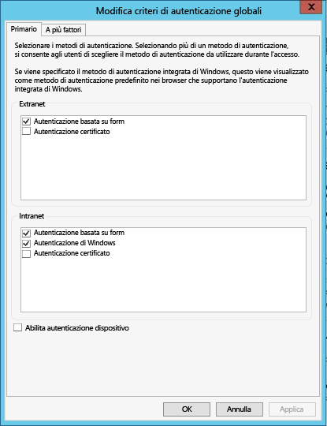

# Prerequisiti del Catalogo dati di Azure

Prima di poter configurare Azure Data Catalog, sono necessarie alcune operazioni preliminari che però non richiedono molto tempo.

## Sottoscrizione di Azure
Per configurare Data Catalog, l'utente deve essere proprietario o comproprietario di una sottoscrizione di Azure.

Le sottoscrizioni di Azure consentono di organizzare l'accesso alle risorse del servizio cloud, ad esempio Data Catalog. Le sottoscrizioni consentono anche di controllare come l'utilizzo delle risorse viene segnalato, fatturato e pagato. Ogni sottoscrizione può avere un metodo di fatturazione e pagamento distinto e avere così sottoscrizioni e piani diversi per reparto, progetto, ufficio locale e così via. Ogni servizio cloud appartiene a una sottoscrizione ed è necessario che la sottoscrizione sia disponibile prima di configurare Data Catalog. Per altre informazioni, vedere l'articolo su come [gestire gli account, le sottoscrizioni e i ruoli amministrativi](../active-directory/active-directory-assign-admin-roles.md).

## Azure Active Directory
Per configurare Data Catalog, è necessario accedere con un account utente di Azure Active Directory (Azure AD).

Azure AD è un servizio che offre semplici e pratiche funzionalità di gestione delle identità e degli accessi, sia nel cloud sia in locale. Gli utenti possono usare un singolo account aziendale o dell'istituto di istruzione per eseguire l'accesso Single Sign-On a qualsiasi applicazione Web locale o nel cloud. Data Catalog usa Azure AD per autenticare l'accesso. Per altre informazioni, vedere [Informazioni su Azure Active Directory](../active-directory/active-directory-whatis.md).

> [!NOTE]
> Usando il [portale di Azure](http://portal.azure.com/) è possibile eseguire l'accesso con un account Microsoft personale oppure con un account aziendale o dell'istituto di istruzione di Azure Active Directory. Per configurare Data Catalog usando il portale di Azure o il [portale di Data Catalog](http://www.azuredatacatalog.com), è necessario eseguire l'accesso con un account di Azure Active Directory, non con un account personale.
>
>

## Configurazione dei criteri di Azure Active Directory
In alcune situazioni è possibile accedere al portale di Data Catalog, ma, quando si prova ad accedere allo strumento di registrazione dell'origine dati, viene visualizzato un messaggio di errore che impedisce l'accesso. Questo errore si verifica solo quando si è nella rete aziendale o ci si connette dall'esterno della rete aziendale.

Lo strumento di registrazione dell'origine dati usa l'autenticazione basata su form per convalidare le credenziali degli utenti in Active Directory. Per eseguire correttamente l'accesso, un amministratore di Azure Active Directory deve abilitare l'autenticazione basata su form nei criteri di autenticazione globali.

Nei criteri di autenticazione globali possono essere abilitati metodi di autenticazione separati per connessioni Intranet ed Extranet, come illustrato nello screenshot seguente. Se l'autenticazione basata su form non è abilitata per la rete da cui ci si connette, è possibile che si verifichino errori di accesso.

 

## Passaggi successivi
Per altre informazioni, vedere [Configurare i criteri di autenticazione](https://technet.microsoft.com/library/dn486781.aspx).
