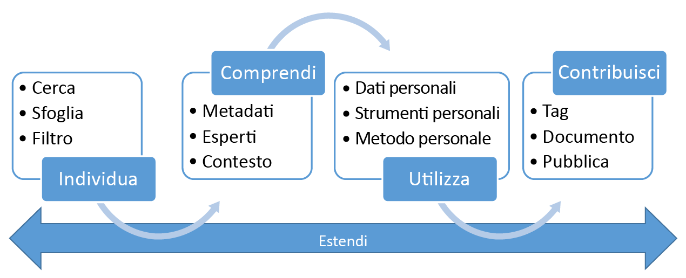

# Che cos'è il Catalogo dei dati di Azure?
Azure Data Catalog è un servizio cloud completamente gestito che consente agli utenti di individuare le origini dati necessarie e comprenderle. Data Catalog aiuta inoltre le organizzazioni a sfruttare al meglio gli investimenti esistenti. 

Con Data Catalog qualsiasi utente, dagli analisti ai data scientist fino agli sviluppatori, può individuare, comprendere e utilizzare le origini dati. Data Catalog include un modello crowdsourcing di metadati e annotazioni. Si tratta si un'unica posizione centrale in cui tutti gli utenti dell'organizzazione possono contribuire con le proprie conoscenze per creare una community e una cultura dei dati.

## Difficoltà di individuazione per i consumer di dati
Tradizionalmente, l'individuazione di origini dati aziendali è stato un processo organico basato su conoscenze specifiche. Per le aziende che vogliono sfruttare al meglio gli asset di informazioni, questo approccio pone numerose sfide:

* Gli utenti potrebbero non sapere dell'esistenza di un'origine dati, a meno che non la individuino nel corso di un altro processo. Non c'è una posizione centrale in cui le origini dati vengono registrate.
* Se gli utenti non conoscono la posizione di un'origine dati, non possono connettersi ai dati usando un'applicazione client. Per poter utilizzare i dati, gli utenti devono conoscere la stringa di connessione o il percorso.
* Se gli utenti non conoscono la posizione della documentazione relativa a un'origine dati, non possono comprendere le modalità d'uso previste per i dati. Documentazione e origini dati possono trovarsi in varie posizioni e ed essere utilizzate in diversi modi.
* Se gli utenti hanno domande su un asset di informazioni, devono trovare l'esperto o il team responsabile dei dati e interagire offline. Non c'è alcuna connessione esplicita tra dati e persone esperte del loro uso.
* Se gli utenti non conoscono il processo per richiedere l'accesso all'origine dati, l'individuazione dell'origine dati e della relativa documentazione non consente comunque di accedere ai dati.

## Difficoltà di individuazione per i produttori di dati
Mentre chi utilizza i dati si trova ad affrontare le difficoltà descritte in precedenza, anche gli utenti responsabili della produzione e della gestione degli asset di informazioni affrontano difficoltà specifiche:

* L'annotazione delle origini dati con metadati descrittivi è spesso una fatica inutile. Le applicazioni client in genere ignorano le descrizioni che vengono archiviate nell'origine dati.
* La creazione di documentazione per le origini dati è spesso una fatica inutile. La sincronizzazione della documentazione con le origini dati è un lavoro continuativo e gli utenti potrebbero non fidarsi della documentazione, ritenuta obsoleta.
* La creazione e la manutenzione della documentazione per le origini dati sono operazioni lunghe e complesse. Lo stesso vale per il lavoro necessario per rendere la documentazione disponibile per tutti coloro che usano l'origine dati.
* Limitare l'accesso alle origini dati e fare in modo che chi le utilizza sappia come richiedere l'accesso è una sfida costante.

Queste sfide, in combinazione, rappresentano un ostacolo significativo per le aziende che vogliono incoraggiare e promuovere l'uso e la comprensione dei dati aziendali.

## Utilità di Azure Data Catalog
Data Catalog è progettato per risolvere questi problemi e aiutare le aziende a sfruttare al meglio gli asset di informazioni esistenti. Data Catalog rende le origini dati facilmente individuabili e comprensibili per gli utenti che gestiscono i dati.

Data Catalog fornisce un servizio basato sul cloud in cui le origini dati possono essere registrate. I dati rimangono nella posizione esistente, ma una copia dei relativi metadati viene aggiunta a Data Catalog, insieme a un riferimento alla posizione dell'origine dati. I metadati vengono anche indicizzati per semplificare l'individuazione di ogni origine dati tramite una ricerca e per rendere l'origine dati comprensibile per gli utenti che la individuano.

Dopo la registrazione di un'origine dati, i metadati possono essere arricchiti, dall'utente che ha eseguito la registrazione o da altri utenti nell'organizzazione. Tutti gli utenti possono annotare un'origine dati, fornendo descrizioni, tag o altri metadati, come ad esempio la documentazione e i processi per richiedere l’accesso all’origine dati. Questi metadati descrittivi integrano i metadati strutturali, ad esempio i nomi delle colonne e i tipi di dati, registrati dall'origine dati.

Individuazione e informazioni sulle origini dati e il relativo utilizzo è lo scopo principale di registrazione delle origini. Gli utenti aziendali possono aver bisogno dei dati per scopi di business intelligence, sviluppo di applicazioni, data science o qualsiasi altra attività in cui sono necessari dati appropriati. Possono usare la funzione di individuazione di Data Catalog per trovare rapidamente i dati necessari, comprenderli per valutare la loro idoneità allo scopo e utilizzarli aprendo l'origine dati nello strumento che preferiscono. 

Allo stesso tempo, gli utenti possono contribuire al catalogo documentando e annotando le origini dati già registrate, oltre che aggiungendo tag. Possono anche registrare nuove origini dati, che possono quindi essere individuate, comprese e utilizzate dalla community di utenti del catalogo.

## Altre informazioni su Data Catalog
Per altre informazioni sulle funzionalità di Data Catalog, vedere:

* [Come registrare le origini dati](data-catalog-how-to-register.md)
* [Come individuare le origini dati](data-catalog-how-to-discover.md)
* [Come annotare le origini dati](data-catalog-how-to-annotate.md)
* [Come documentare le origini dati](data-catalog-how-to-documentation.md)
* [Come connettersi a origini dati](data-catalog-how-to-connect.md)
* [Come usare Big Data](data-catalog-how-to-big-data.md)
* [Come gestire gli asset di dati](data-catalog-how-to-manage.md)
* [Come configurare il glossario aziendale](data-catalog-how-to-business-glossary.md)
* [Domande frequenti](data-catalog-frequently-asked-questions.md)

## Passaggi successivi
Per iniziare a usare Data Catalog, vedere:
* [Microsoft Azure Data Catalog](https://www.azuredatacatalog.com)
* [Introduzione al Catalogo dati di Azure](data-catalog-get-started.md)
