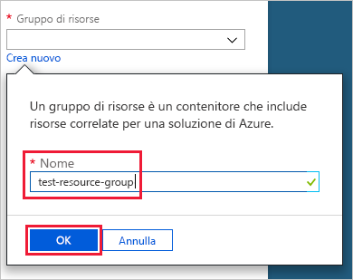
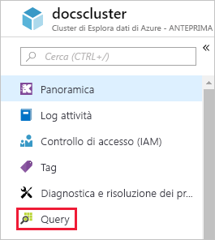
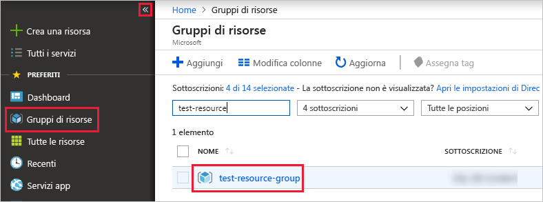

# Guida introduttiva: Creare un database e un cluster di Esplora dati di Azure

Esplora dati di Azure è un servizio di esplorazione dati rapido e a scalabilità elevata per dati di log e di telemetria. Per usare Esplora dati di Azure, è prima necessario creare un *cluster* e quindi creare uno o più *database* nel cluster. *Inserire* (caricare) quindi i dati in un database per poter eseguire query. In questa guida introduttiva vengono creati un cluster e un database. Negli articoli successivi viene illustrato come inserire i dati.

Se non si ha una sottoscrizione di Azure, creare un [account Azure gratuito](https://azure.microsoft.com/free/) prima di iniziare.

## Accedere al portale di Azure

Accedere al [portale di Azure](https://portal.azure.com/).

## Creare un cluster

Creare un cluster di Esplora dati di Azure in un gruppo di risorse di Azure, con un set definito di risorse di calcolo e archiviazione.

1. Selezionare il pulsante **Crea una risorsa** (+) nell'angolo superiore sinistro del portale.

1. Cercare *Esplora dati di Azure*.

   

1. In **Esplora dati di Azure** selezionare **Crea** nella parte inferiore della schermata.

1. Immettere un nome univoco per il cluster, selezionare la sottoscrizione e creare un gruppo di risorse denominato *test-resource-group*.

    

1. Compilare il modulo con le informazioni seguenti.

   

    **Impostazione** | **Valore consigliato** | **Descrizione campo**
    |---|---|---|
    | Nome del cluster | Nome univoco del cluster | Scegliere un nome univoco che identifica il cluster. Ad esempio, *mytestcluster*. Il nome di dominio *[area].kusto.windows.net* viene accodato al nome del cluster specificato. Il nome può contenere solo lettere minuscole e numeri. Deve avere una lunghezza compresa tra 3 e 22 caratteri.
    | Sottoscrizione | Sottoscrizione in uso | Selezionare la sottoscrizione di Azure da usare per il cluster.|
    | Gruppo di risorse | *test-resource-group* | Creare un nuovo gruppo di risorse. |
    | Località | *Stati Uniti occidentali* | Per questa guida introduttiva selezionare *Stati Uniti occidentali*. Per un sistema di produzione, selezionare l'area più appropriata in base alle esigenze.
    | Specifiche dell'ambiente di calcolo | *D13_v2* | Per questa guida introduttiva, selezionare la specifica con il prezzo più basso. Per un sistema di produzione, selezionare la specifica più appropriata in base alle esigenze.
    | | |

1. Selezionare **Crea** per effettuare il provisioning del cluster. Per il provisioning sono in genere necessari circa dieci minuti. Selezionare **Notifiche** nella barra degli strumenti per monitorare il processo di provisioning.

    

1. Al termine del processo, selezionare **Notifiche** e quindi **Vai alla risorsa**.

    

## Creare un database

A questo punto si è pronti per il secondo passaggio del processo: la creazione del database.

1. Nella scheda **Panoramica** selezionare **Crea database**.

    

1. Compilare il modulo con le informazioni seguenti.

    

    **Impostazione** | **Valore consigliato** | **Descrizione campo**
    |---|---|---|
    | Nome database | *TestDatabase* | Il nome del database deve essere univoco all'interno del cluster.
    | Periodo di conservazione | *3650* | Intervallo di tempo per cui è garantito che i dati rimangano disponibili per le query. L'intervallo di tempo viene misurato dal momento in cui i dati vengono inseriti.
    | Cache period (Periodo cache) | *31* | Intervallo di tempo per cui mantenere i dati sottoposti frequentemente a query disponibili nell'archiviazione su unità SSD o nella RAM, invece che nell'archiviazione a lungo termine.
    | | | |

1. Selezionare **Salva** per creare il database. Per la creazione è in genere necessario meno di un minuto. Una volta completato il processo, si torna alla scheda **Panoramica** del cluster.

## Eseguire i comandi di base nel database

Dopo aver creato un cluster e un database, è possibile eseguire query e comandi. Nel database non sono ancora presenti dati, ma è comunque possibile vedere come funzionano gli strumenti.

1. Nel cluster selezionare **Query**.

    

1. Incollare il comando seguente nella finestra di query: `.show databases` e quindi selezionare **Esegui**.

    

    Nel set di risultati è presente **TestDatabase**, l'unico database nel cluster.

1. Incollare il comando seguente nella finestra di query: `.show tables` e quindi selezionare il comando nella finestra. Selezionare **Run** (Esegui).

    Questo comando restituisce un set di risultati vuoto perché ancora non sono presenti tabelle. Verrà aggiunta una tabella nel prossimo articolo di questa serie.

## Arrestare e riavviare il cluster

È possibile arrestare e riavviare un cluster in base alle esigenze aziendali.

1. Per arrestare il cluster, nella parte superiore della scheda **Panoramica** selezionare **Arresta**.

    Quando il cluster viene arrestato, i dati non sono disponibili per le query e non è possibile inserire nuovi dati.

1. Per riavviare il cluster, nella parte superiore della scheda **Panoramica** selezionare **Avvia**.

    Quando il cluster viene riavviato, sono necessari circa dieci minuti affinché diventi disponibile, come quando ne è stato effettuato il provisioning per la prima volta. È necessario altro tempo per caricare i dati nella cache ad accesso frequente.  

## Pulire le risorse

Se si prevede di seguire altre guide introduttive ed esercitazioni, non eliminare le risorse create. In caso contrario, pulire **test-resource-group** per evitare l'addebito di costi.

1. Nel portale di Azure selezionare **Gruppi di risorse** all'estrema sinistra e quindi selezionare il gruppo di risorse creato.  

    Se il menu a sinistra è compresso, selezionare  per espanderlo.

   

1. In **test-resource-group** selezionare **Elimina gruppo di risorse**.

1. Nella nuova finestra digitare il nome del gruppo di risorse da eliminare (*test-resource-group*) e quindi selezionare **Elimina**.

## Passaggi successivi

> [!div class="nextstepaction"]
> [Guida introduttiva: Inserire dati dall'hub eventi in Esplora dati di Azure](ingest-data-event-hub.md)

