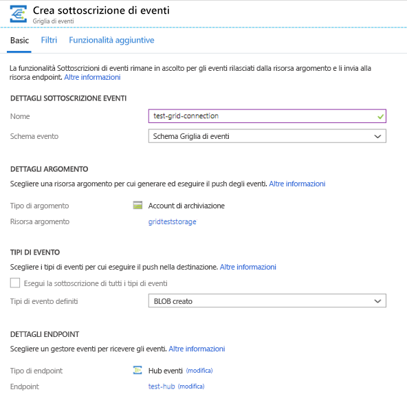
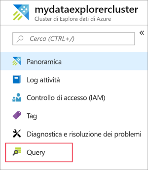
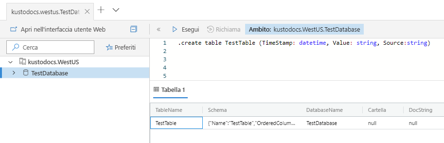
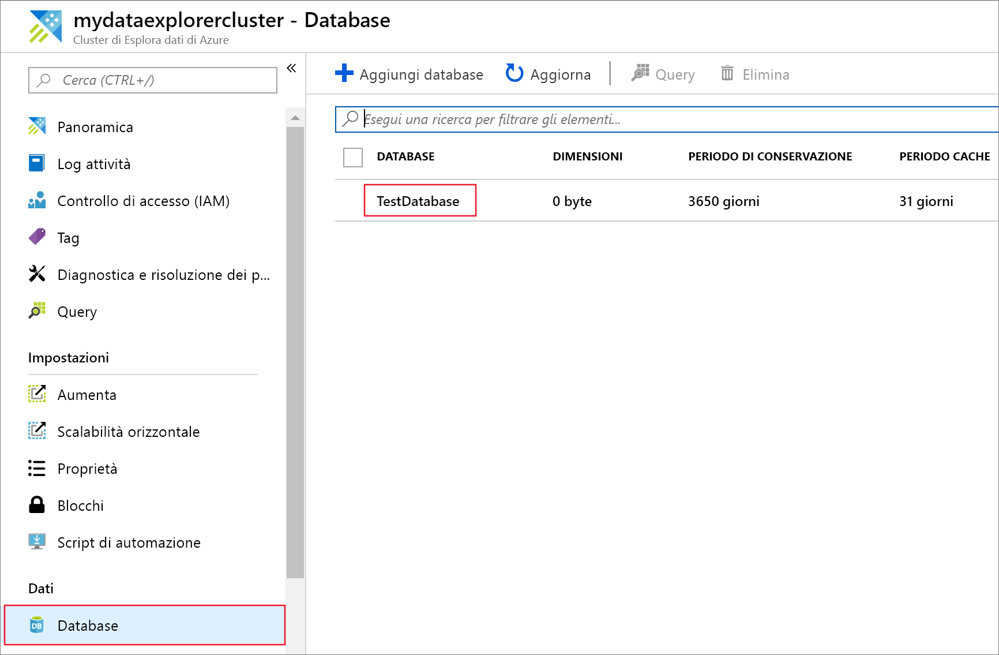
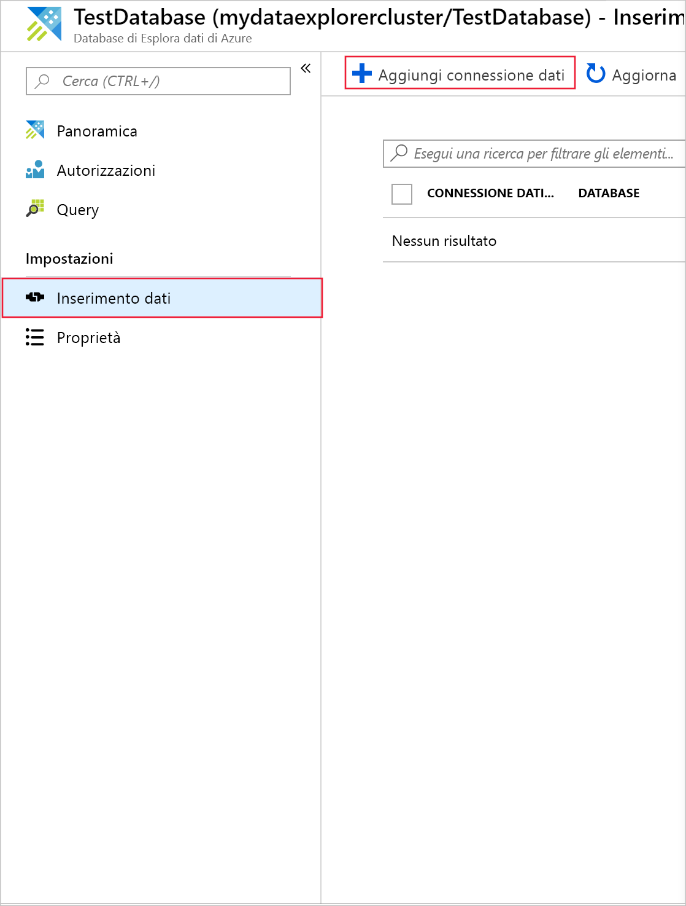
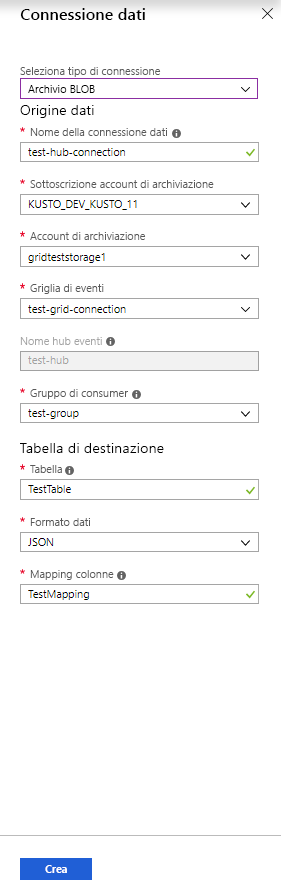
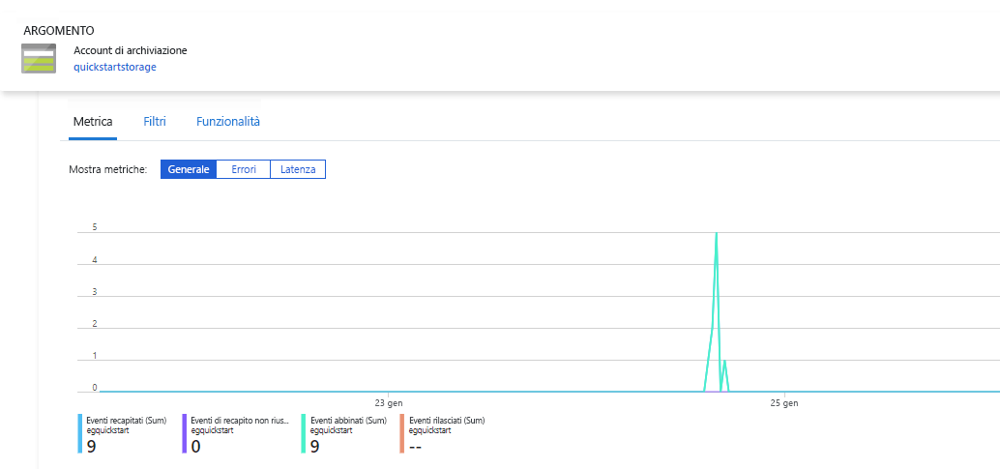
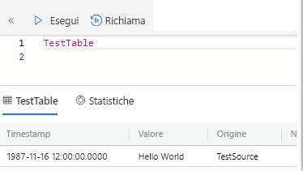
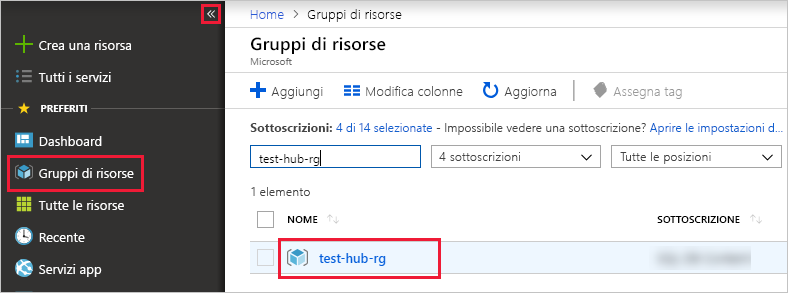

# <a name="quickstart-ingest-blobs-into-azure-data-explorer-by-subscribing-to-event-grid-notifications"></a>Avvio rapido: Inserire BLOB in Esplora dati di Azure tramite la sottoscrizione delle notifiche di Griglia di eventi

Esplora dati di Azure è un servizio di esplorazione dati rapido e scalabile per dati di log e di telemetria. Consente l'inserimento continuo (caricamento di dati) dai BLOB scritti nei contenitori di BLOB. 

Questo argomento di avvio rapido descrive come impostare una sottoscrizione di [Griglia di eventi di Azure](/azure/event-grid/overview) e instradare gli eventi a Esplora dati di Azure tramite un hub eventi. Per iniziare, è necessario avere un account di archiviazione con una sottoscrizione di Griglia di eventi che invia notifiche a Hub eventi di Azure. Si creerà quindi una connessione dati a Griglia di eventi e si esaminerà il flusso di dati attraverso l'intero sistema.

## <a name="prerequisites"></a>Prerequisiti

* Una sottoscrizione di Azure. Creare un [account Azure gratuito](https://azure.microsoft.com/free/).
* [Un cluster e un database](create-cluster-database-portal.md).
* [Un account di archiviazione](https://docs.microsoft.com/azure/storage/common/storage-quickstart-create-account?tabs=azure-portal).
* [Un hub eventi](https://docs.microsoft.com/azure/event-hubs/event-hubs-create).

## <a name="create-an-event-grid-subscription-in-your-storage-account"></a>Creare una sottoscrizione di Griglia di eventi nell'account di archiviazione

1. Nel portale di Azure trovare l'account di archiviazione.
1. Selezionare **Eventi** > **Sottoscrizione di eventi**.

    

1. Nella scheda **Di base** della finestra **Crea sottoscrizione di eventi** specificare i valori seguenti:

    **Impostazione** | **Valore consigliato** | **Descrizione campo**
    |---|---|---|
    | NOME | *test-grid-connection* | Il nome della griglia di eventi da creare.|
    | Schema di eventi | *Schema griglia di eventi* | Lo schema da usare per la griglia di eventi. |
    | Tipo di argomento | *Account di archiviazione* | Il tipo di argomento della griglia di eventi. |
    | Risorsa argomento | *gridteststorage* | nome dell'account di archiviazione. |
    | Esegui la sottoscrizione di tutti i tipi di eventi | *deselezionare* | Non si ricevono notifiche per tutti gli eventi. |
    | Tipi di evento definiti | *Blob created* (BLOB creato) | Gli eventi specifici per cui ricevere notifiche. |
    | Tipo di endpoint | *Hub eventi* | Il tipo di endpoint a cui vengono inviati gli eventi. |
    | Endpoint | *test-hub* | Hub eventi creato. |
    | | |

1. Se si vuole tenere traccia dei file di uno specifico contenitore, selezionare la scheda **Funzionalità aggiuntive**. Impostare i filtri per le notifiche come segue:
    * Il campo **L'oggetto inizia con** è il prefisso *letterale* del contenitore di BLOB. Poiché il criterio applicato è *startswith*, può interessare più contenitori. I caratteri jolly non sono consentiti.
     È *necessario* impostarlo come segue: *`/blobServices/default/containers/`*[prefisso contenitore]
    * Il campo **L'oggetto termina con** è il suffisso di tipo *letterale* del BLOB. I caratteri jolly non sono consentiti.

## <a name="create-a-target-table-in-azure-data-explorer"></a>Creare una tabella di destinazione in Esplora dati di Azure

Creare una tabella in Esplora dati di Azure a cui verranno inviati i dati da Hub eventi. Creare la tabella nel cluster e nel database preparati nei prerequisiti.

1. Nel portale di Azure, in corrispondenza del cluster selezionare **Query**.

    

1. Copiare il comando seguente nella finestra e selezionare **Esegui** per creare la tabella (TestTable) che riceverà i dati inseriti.

    ```Kusto
    .create table TestTable (TimeStamp: datetime, Value: string, Source:string)
    ```

    

1. Copiare il comando seguente nella finestra e selezionare **Esegui** per eseguire il mapping dei dati JSON in ingresso ai nomi di colonna e ai tipi di dati della tabella (TestTable).

    ```Kusto
    .create table TestTable ingestion json mapping 'TestMapping' '[{"column":"TimeStamp","path":"$.TimeStamp"},{"column":"Value","path":"$.Value"},{"column":"Source","path":"$.Source"}]'
    ```

## <a name="create-an-event-grid-data-connection-in-azure-data-explorer"></a>Creare una connessione dati di Griglia di eventi in Esplora dati di Azure

A questo punto, connettersi alla griglia di eventi da Esplora dati di Azure per consentire il passaggio del flusso di dati dal contenitore di BLOB alla tabella di test.

1. Selezionare **Notifiche** sulla barra degli strumenti per verificare che la distribuzione dell'hub eventi abbia avuto esito positivo.

1. Nel cluster creato selezionare **Database** > **TestDatabase**.

    

1. Selezionare **Inserimento dati** > **Aggiungi connessione dati**.

    

1.  Selezionare il tipo di connessione: **Archiviazione BLOB**.

1. Compilare il modulo con le informazioni seguenti e quindi selezionare **Crea**.

    

     Origine dati:

    **Impostazione** | **Valore consigliato** | **Descrizione campo**
    |---|---|---|
    | Data connection name (Nome connessione dati) | *test-hub-connection* | Il nome della connessione da creare in Esplora dati di Azure.|
    | Sottoscrizione dell'account di archiviazione | ID sottoscrizione | L'ID sottoscrizione in cui risiede l'account di archiviazione.|
    | Account di archiviazione | *gridteststorage* | Il nome dell'account di archiviazione creato in precedenza.|
    | Griglia di eventi | *test-grid-connection* | Il nome della griglia di eventi creata. |
    | Nome dell'hub eventi | *test-hub* | L'hub eventi creato. Questo campo viene compilato automaticamente quando si seleziona una griglia di eventi. |
    | Gruppo di consumer | *test-group* | Il gruppo di consumer definito nell'hub eventi creato. |
    | | |

    Tabella di destinazione:

     **Impostazione** | **Valore consigliato** | **Descrizione campo**
    |---|---|---|
    | Tabella | *TestTable* | Tabella creata in **TestDatabase**. |
    | Formato dati | *JSON* | I formati supportati sono Avro, CSV, JSON, MULTILINE JSON, PSV, SOH, SCSV, TSV e TXT. |
    | Mapping di colonne | *TestMapping* | Mapping creato in **TestDatabase** che esegue il mapping dei dati JSON in ingresso ai nomi di colonna e ai tipi di dati di **TestTable**.|
    | | |

## <a name="generate-sample-data"></a>Generare i dati di esempio

Dopo aver connesso Esplora dati di Azure e l'account di archiviazione, è possibile creare i dati di esempio e caricarli nella risorsa di archiviazione BLOB.

Verrà usato un piccolo script della shell che invia alcuni semplici comandi dell'interfaccia della riga di comando di Azure per interagire con le risorse di Archiviazione di Azure. Questo script crea un nuovo contenitore nell'account di archiviazione, carica un file esistente (come BLOB) in tale contenitore e quindi elenca gli oggetti BLOB nel contenitore. È possibile usare [Azure Cloud Shell](https://docs.microsoft.com/azure/cloud-shell/overview) per eseguire lo script direttamente nel portale.

Salvare i dati in un file e caricarlo con questo script:

```Json
{"TimeStamp": "1987-11-16 12:00","Value": "Hello World","Source": "TestSource"}
```

```bash
#!/bin/bash
### A simple Azure Storage example script

    export AZURE_STORAGE_ACCOUNT=<storage_account_name>
    export AZURE_STORAGE_KEY=<storage_account_key>

    export container_name=<container_name>
    export blob_name=<blob_name>
    export file_to_upload=<file_to_upload>
    export destination_file=<destination_file>

    echo "Creating the container..."
    az storage container create --name $container_name

    echo "Uploading the file..."
    az storage blob upload --container-name $container_name --file $file_to_upload --name $blob_name

    echo "Listing the blobs..."
    az storage blob list --container-name $container_name --output table

    echo "Done"
```

## <a name="review-the-data-flow"></a>Esaminare il flusso di dati

> [!NOTE]
> Esplora dati di Azure prevede un criterio di aggregazione (invio in batch) per l'inserimento di dati in modo da ottimizzare il processo di inserimento.
Per impostazione predefinita, il criterio viene impostato su 5 minuti.
Sarà possibile modificarlo in un secondo momento, se necessario. In questa guida introduttiva si può prevedere una latenza di alcuni minuti.

1. Nella griglia di eventi del portale di Azure si noterà un picco di attività durante l'esecuzione dell'app.

    

1. Per verificare il numero di messaggi arrivati al database fino a questo momento, eseguire la query seguente nel database di test.

    ```Kusto
    TestTable
    | count
    ```

1. Per visualizzare il contenuto dei messaggi, eseguire la query seguente nel database di test.

    ```Kusto
    TestTable
    ```

    Il set di risultati dovrebbe essere simile al seguente.

    

## <a name="clean-up-resources"></a>Pulire le risorse

Se non si prevede di usare nuovamente la griglia di eventi, eliminare **test-hub-rg**, per evitare l'addebito di costi.

1. Nel portale di Azure selezionare **Gruppi di risorse** all'estrema sinistra e quindi selezionare il gruppo di risorse creato.  

    Se il menu a sinistra è compresso, selezionare  per espanderlo.

   

1. In **test-resource-group** selezionare **Elimina gruppo di risorse**.

1. Nella nuova finestra immettere il nome del gruppo di risorse da eliminare (*test-hub-rg*) e quindi selezionare **Elimina**.

## <a name="next-steps"></a>Passaggi successivi

> [!div class="nextstepaction"]
> [Guida introduttiva: Eseguire query sui dati in Esplora dati di Azure](web-query-data.md)
