# <a name="quickstart-ingest-data-from-event-hub-into-azure-data-explorer"></a>Guida introduttiva: Inserire dati dall'hub eventi in Esplora dati di Azure

Esplora dati di Azure è un servizio di esplorazione dati rapido e a scalabilità elevata per dati di log e di telemetria. Esplora dati di Azure consente l'inserimento (caricamento dei dati) da Hub eventi, una piattaforma di Big Data streaming e un servizio di inserimento di eventi. [Hub eventi](/azure/event-hubs/event-hubs-about) riesce a elaborare milioni di eventi al secondo quasi in tempo reale. In questa guida introduttiva verrà creato un hub eventi, a cui ci si connetterà da Esplora dati di Azure per visualizzare il flusso di dati attraverso il sistema.

## <a name="prerequisites"></a>Prerequisiti

* Se non si ha una sottoscrizione di Azure, creare un [account Azure gratuito](https://azure.microsoft.com/free/) prima di iniziare.

* [Un cluster e un database di test](create-cluster-database-portal.md)

* [Un'app di esempio](https://github.com/Azure-Samples/event-hubs-dotnet-ingest) che genera i dati e li invia a un hub eventi. Scaricare l'app di esempio nel sistema.

* [Visual Studio 2017 versione 15.3.2 o successiva](https://www.visualstudio.com/vs/) per eseguire l'app di esempio

## <a name="sign-in-to-the-azure-portal"></a>Accedere al portale di Azure

Accedere al [portale di Azure](https://portal.azure.com/).

## <a name="create-an-event-hub"></a>Creare un hub eventi

In questa guida introduttiva vengono generati dati di esempio che sono inviati a un hub eventi. Il primo passaggio consiste nel creare un hub eventi. A tale scopo, usare un modello di Azure Resource Manager nel portale di Azure.

1. Per creare un hub eventi, usare il pulsante seguente per avviare la distribuzione. Fare clic con il pulsante destro del mouse e selezionare **Apri in una nuova finestra** per poter seguire il resto dei passaggi di questo articolo.

    [](https://portal.azure.com/#create/Microsoft.Template/uri/https%3A%2F%2Fraw.githubusercontent.com%2FAzure%2Fazure-quickstart-templates%2Fmaster%2F201-event-hubs-create-event-hub-and-consumer-group%2Fazuredeploy.json)

    Il pulsante **Distribuzione in Azure** consente di passare al portale di Azure per compilare un modulo di distribuzione.

    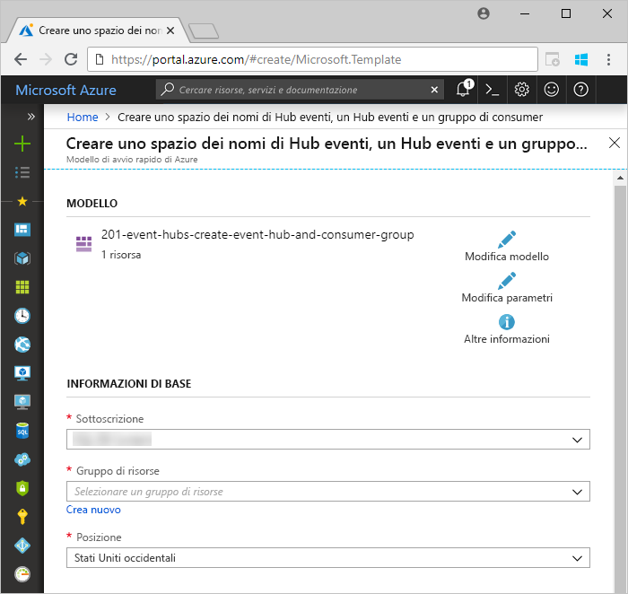

1. Selezionare la sottoscrizione in cui si vuole creare l'hub eventi e creare un gruppo di risorse denominato *test-hub-rg*.

    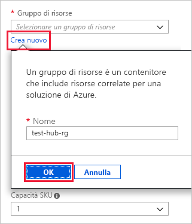

1. Compilare il modulo con le informazioni seguenti.

    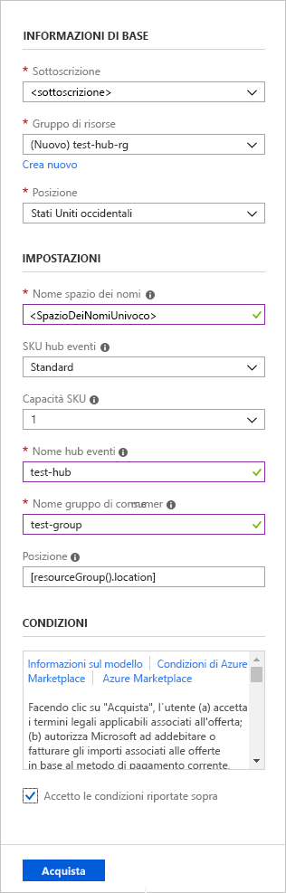

    Usare i valori predefiniti per tutte le impostazioni non elencate nella tabella seguente.

    **Impostazione** | **Valore consigliato** | **Descrizione campo**
    |---|---|---|
    | Sottoscrizione | Sottoscrizione in uso | Selezionare la sottoscrizione di Azure da usare per l'hub eventi.|
    | Gruppo di risorse | *test-hub-rg* | Creare un nuovo gruppo di risorse. |
    | Località | *Stati Uniti occidentali* | Per questa guida introduttiva selezionare *Stati Uniti occidentali*. Per un sistema di produzione, selezionare l'area più appropriata in base alle esigenze. Per prestazioni ottimali creare lo spazio dei nomi dell'hub eventi nella stessa località del cluster Kusto (più importante per spazi dei nomi dell'hub eventi con velocità effettiva elevata).
    | Nome spazio dei nomi | Nome dello spazio dei nomi univoco | Scegliere un nome univoco per identificare lo spazio dei nomi. Ad esempio, *spazionomitest*. Il nome di dominio *servicebus.windows.net* viene accodato al nome specificato. Il nome può contenere solo lettere, numeri e trattini. Il nome deve iniziare con una lettera e deve terminare con una lettera o un numero. La lunghezza del valore deve essere compresa tra 6 e 50 caratteri.
    | Nome hub eventi | *test-hub* | L'hub eventi si trova nello spazio dei nomi, che fornisce un contenitore di ambito univoco. Il nome dell'hub eventi deve essere univoco all'interno dello spazio dei nomi. |
    | Consumer group name (Nome gruppo di consumer) | *test-group* | I gruppi di consumer consentono a più applicazioni di avere ognuna una visualizzazione distinta del flusso di eventi. |
    | | |

1. Selezionare **Acquisto** per indicare che si stanno creando risorse nella sottoscrizione.

1. Selezionare **Notifiche** nella barra degli strumenti per monitorare il processo di provisioning. Il completamento della distribuzione potrebbe richiedere diversi minuti. Al termine, è possibile procedere con il passaggio successivo.

    

## <a name="create-a-target-table-in-azure-data-explorer"></a>Creare una tabella di destinazione in Esplora dati di Azure

Verrà ora creata una tabella in Esplora dati di Azure a cui saranno inviati i dati da Hub eventi. La tabella viene creata nel cluster e nel database di cui è stato effettuato il provisioning in **Prerequisiti**.

1. Nel portale di Azure passare al cluster, quindi selezionare **Query**.

    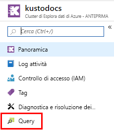

1. Copiare il comando seguente nella finestra e selezionare **Esegui** per creare la tabella (TestTable) che riceverà i dati inseriti.

    ```Kusto
    .create table TestTable (TimeStamp: datetime, Name: string, Metric: int, Source:string)
    ```

    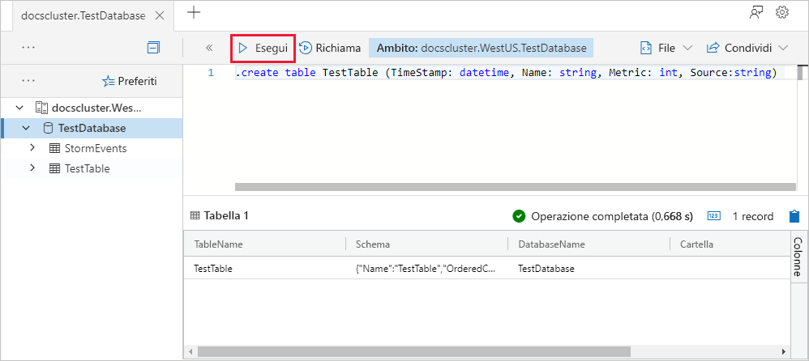

1. Copiare il comando seguente nella finestra e selezionare **Esegui** per eseguire il mapping dei dati JSON in ingresso ai nomi di colonna e ai tipi di dati della tabella (TestTable).

    ```Kusto
    .create table TestTable ingestion json mapping 'TestMapping' '[{"column":"TimeStamp","path":"$.timeStamp","datatype":"datetime"},{"column":"Name","path":"$.name","datatype":"string"},{"column":"Metric","path":"$.metric","datatype":"int"},{"column":"Source","path":"$.source","datatype":"string"}]'
    ```

## <a name="connect-to-the-event-hub"></a>Connettersi all'hub eventi

A questo punto è possibile connettersi all'hub eventi da Esplora dati di Azure. Quando questa connessione è attiva, i dati che confluiscono nell'hub eventi confluiscono nella tabella di test creata in precedenza in questo articolo.

1. Selezionare **Notifiche** sulla barra degli strumenti per verificare che la distribuzione dell'hub eventi abbia avuto esito positivo.

1. Nel cluster creato selezionare **Database** e quindi **TestDatabase**.

    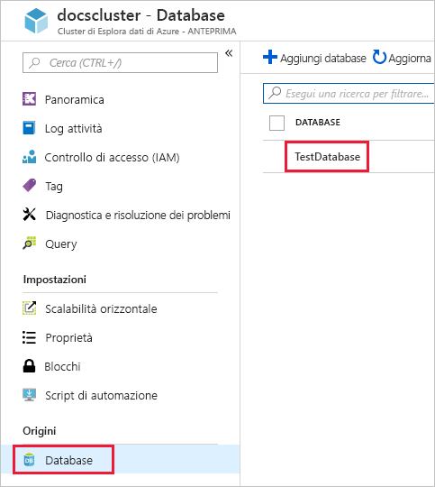

1. Selezionare **Inserimento dati** e quindi **Aggiungi connessione dati**.

    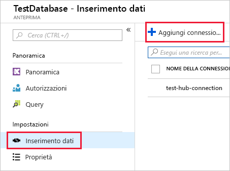

1. Compilare il modulo con le informazioni seguenti e quindi selezionare **Crea**.

    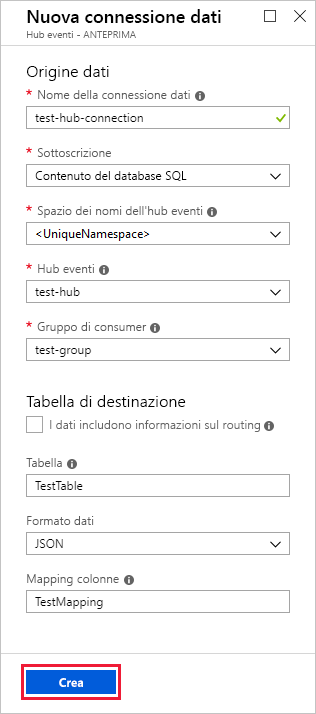

    Origine dati:

    **Impostazione** | **Valore consigliato** | **Descrizione campo**
    |---|---|---|
    | Data connection name (Nome connessione dati) | *test-hub-connection* | Nome della connessione da creare in Esplora dati di Azure.|
    | Spazio dei nomi dell'hub eventi | Nome dello spazio dei nomi univoco | Nome scelto in precedenza che identifica lo spazio dei nomi. |
    | Hub eventi | *test-hub* | Hub eventi creato. |
    | Gruppo di consumer | *test-group* | Gruppo di consumer definito nell'hub eventi creato. |
    | | |

    Tabella di destinazione:

    Sono disponibili due opzioni per il routing: *statico* e *dinamico*. Per questa guida introduttiva viene usato il routing statico (impostazione predefinita), in cui vengono specificati il nome della tabella, il formato di file e il mapping. Lasciare deselezionato **My data includes routing info** (I miei dati includono le informazioni di routing).
    È anche possibile usare il routing dinamico, in cui i dati includono le informazioni di routing necessarie.

     **Impostazione** | **Valore consigliato** | **Descrizione campo**
    |---|---|---|
    | Tabella | *TestTable* | Tabella creata in **TestDatabase**. |
    | Formato dati | *JSON* | I formati supportati sono Avro, CSV, JSON, MULTILINE JSON, PSV, SOH, SCSV, TSV e TXT. |
    | Mapping di colonne | *TestMapping* | Mapping creato in **TestDatabase** che esegue il mapping dei dati JSON in ingresso ai nomi di colonna e ai tipi di dati di **TestTable**.|
    | | |

## <a name="copy-the-connection-string"></a>Copia della stringa di connessione

Quando si esegue l'[app di esempio](https://github.com/Azure-Samples/event-hubs-dotnet-ingest) elencata in Prerequisiti, è necessaria la stringa di connessione per lo spazio dei nomi dell'hub eventi.

1. Nello spazio dei nomi dell'hub eventi creato selezionare **Criteri di accesso condiviso** e quindi **RootManageSharedAccessKey**.

    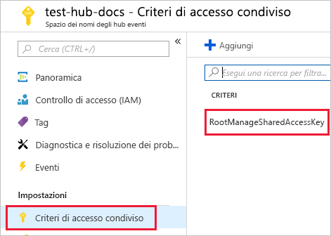

1. Copiare **Stringa di connessione - Chiave primaria**. Verrà incollata nella sezione successiva.

    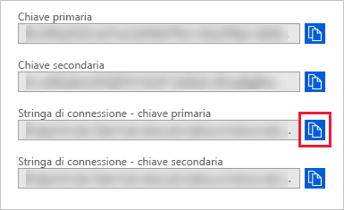

## <a name="generate-sample-data"></a>Generare i dati di esempio

Usare l'[app di esempio](https://github.com/Azure-Samples/event-hubs-dotnet-ingest) scaricata per generare dati.

1. Aprire la soluzione dell'app di esempio in Visual Studio.

1. Nel file *program.cs* aggiornare la costante `connectionString` con la stringa di connessione copiata dallo spazio dei nomi dell'hub eventi.

    ```csharp
    const string eventHubName = "test-hub";
    // Copy the connection string ("Connection string-primary key") from your Event Hub namespace.
    const string connectionString = @"<YourConnectionString>";
    ```

1. Compilare ed eseguire l'app. L'app invia messaggi all'hub eventi e visualizza lo stato ogni dieci secondi.

1. Dopo che l'app ha inviato alcuni messaggi, andare al passaggio successivo: esaminare il flusso di dati nell'hub eventi e nella tabella di test.

## <a name="review-the-data-flow"></a>Esaminare il flusso di dati

Con i dati generati dall'app, è ora possibile vedere il flusso di tali dati dall'hub eventi alla tabella del cluster.

1. Nel portale di Azure, in corrispondenza dell'hub eventi si noterà un picco nell'attività durante l'esecuzione dell'app.

    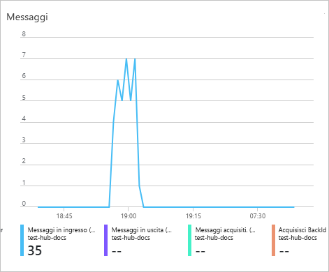

1. Per verificare il numero di messaggi arrivati al database fino a questo momento, eseguire la query seguente nel database di test.

    ```Kusto
    TestTable
    | count
    ```

1. Per visualizzare il contenuto dei messaggi, eseguire la query seguente:

    ```Kusto
    TestTable
    ```

    Il set di risultati dovrebbe essere simile al seguente:

    

    > [!NOTE]
    > Esplora dati di Azure prevede un criterio di aggregazione (invio in batch) per l'inserimento di dati, progettato per ottimizzare il processo di inserimento. Il criterio è configurato su 5 minuti, perciò potrebbe verificarsi una latenza.

## <a name="clean-up-resources"></a>Pulire le risorse

Se non si prevede di usare nuovamente l'hub eventi, eliminare **test-hub-rg**, per evitare l'addebito di costi.

1. Nel portale di Azure selezionare **Gruppi di risorse** all'estrema sinistra e quindi selezionare il gruppo di risorse creato.  

    Se il menu a sinistra è compresso, selezionare  per espanderlo.

   

1. In **test-resource-group** selezionare **Elimina gruppo di risorse**.

1. Nella nuova finestra digitare il nome del gruppo di risorse da eliminare (*test-hub-rg*) e quindi selezionare **Elimina**.

## <a name="next-steps"></a>Passaggi successivi

> [!div class="nextstepaction"]
> [Guida introduttiva: Eseguire query sui dati in Esplora dati di Azure](web-query-data.md)
