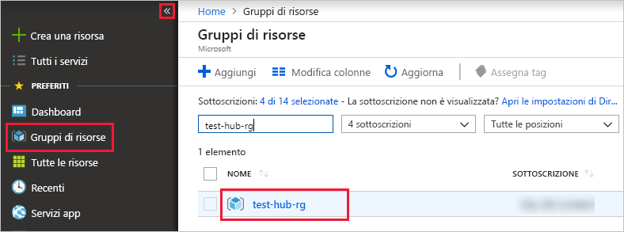

# <a name="ingest-data-from-iot-hub-into-azure-data-explorer-preview"></a>Inserire i dati dall'hub Internet in Esplora dati di Azure (anteprima)

> [!div class="op_single_selector"]
> * [di Microsoft Azure](ingest-data-iot-hub.md)
> * [C#](data-connection-iot-hub-csharp.md)
> * [Python](data-connection-iot-hub-python.md)
> * [Modello di Azure Resource Manager](data-connection-iot-hub-resource-manager.md)

Esplora dati di Azure è un servizio di esplorazione dati rapido e a scalabilità elevata per dati di log e di telemetria. Azure Esplora dati offre l'inserimento (caricamento dei dati) dall'hub Internet, una piattaforma di streaming Big Data e un servizio di inserimento di Internet.

## <a name="prerequisites"></a>Prerequisiti

* Se non si ha una sottoscrizione di Azure, prima di iniziare creare un [account Azure gratuito](https://azure.microsoft.com/free/).
* Creare [un cluster e un database di test con il](create-cluster-database-portal.md) nome del database *TestDB*.
* [App di esempio](https://github.com/Azure-Samples/azure-iot-samples-csharp) e documentazione per la simulazione di un dispositivo.
* [Visual Studio 2019](https://visualstudio.microsoft.com/vs/) per eseguire l'app di esempio.

## <a name="create-an-iot-hub"></a>Creare un hub Internet delle cose

[!INCLUDE [iot-hub-include-create-hub](../../includes/iot-hub-include-create-hub.md)]

## <a name="register-a-device-to-the-iot-hub"></a>Registrare un dispositivo nell'hub Internet delle cose

[!INCLUDE [iot-hub-get-started-create-device-identity](../../includes/iot-hub-get-started-create-device-identity.md)]

## <a name="create-a-target-table-in-azure-data-explorer"></a>Creare una tabella di destinazione in Esplora dati di Azure

A questo punto si crea una tabella in Azure Esplora dati a cui gli hub Internet invieranno i dati. Si crea la tabella nel cluster e il database sottoposti a provisioning in [**prerequisiti**](#prerequisites).

1. Nel portale di Azure passare al cluster e selezionare **Query**.

    

1. Copiare il comando seguente nella finestra e selezionare **Esegui** per creare la tabella (TestTable) che riceverà i dati inseriti.

    ```Kusto
    .create table TestTable (temperature: real, humidity: real)
    ```
    
    

1. Copiare il comando seguente nella finestra e selezionare **Esegui** per eseguire il mapping dei dati JSON in ingresso ai nomi di colonna e ai tipi di dati della tabella (TestTable).

    ```Kusto
    .create table TestTable ingestion json mapping 'TestMapping' '[{"column":"humidity","path":"$.humidity","datatype":"real"},{"column":"temperature","path":"$.temperature","datatype":"real"}]'
    ```

## <a name="connect-azure-data-explorer-table-to-iot-hub"></a>Connettere la tabella Esplora dati di Azure all'hub Internet

A questo punto è possibile connettersi all'hub Internet delle cose da Azure Esplora dati. Al termine della connessione, i dati che passano nell'hub degli indirizzi Internet alla [tabella di destinazione creata](#create-a-target-table-in-azure-data-explorer).

1. Selezionare **notifiche** sulla barra degli strumenti per verificare che la distribuzione dell'hub Internet sia stata completata correttamente.

1. Nel cluster creato selezionare **database** e quindi selezionare il database creato **TestDB**.
    
    

1. Selezionare **Inserimento dati** e **Aggiungi connessione dati**. Compilare quindi il modulo con le informazioni seguenti. Al termine, fare clic su **Crea** .

    

    **Origine dati**:

    **Impostazione** | **Descrizione campo**
    |---|---|
    | Data connection name (Nome connessione dati) | Nome della connessione che si vuole creare in Azure Esplora dati
    | Hub IoT | Nome dell'hub IoT |
    | Criteri di accesso condiviso | Nome dei criteri di accesso condiviso. Deve disporre delle autorizzazioni di lettura |
    | Gruppo di consumer |  Il gruppo di consumer definito nell'endpoint predefinito dell'hub Internet |
    | Proprietà del sistema eventi | [Proprietà del sistema di eventi dell'hub](/azure/iot-hub/iot-hub-devguide-messages-construct#system-properties-of-d2c-iot-hub-messages)Internet. Quando si aggiungono le proprietà di sistema, [creare](/azure/kusto/management/tables#create-table) o [aggiornare](/azure/kusto/management/tables#alter-table-and-alter-merge-table) lo schema e il [mapping](/azure/kusto/management/mappings) della tabella per includere le proprietà selezionate. | | | 

    > [!NOTE]
    > In caso di [failover manuale](/azure/iot-hub/iot-hub-ha-dr#manual-failover), è necessario ricreare la connessione dati.

    **Tabella di destinazione**:

    Sono disponibili due opzioni per il routing dei dati inseriti: *statico* e *dinamico*. 
    Per questo articolo viene usato il routing statico, in cui vengono specificati il nome della tabella, il formato dati e il mapping. Lasciare deselezionato **My data includes routing info** (I miei dati includono le informazioni di routing).

     **Impostazione** | **Valore consigliato** | **Descrizione campo**
    |---|---|---|
    | Table | *TestTable* | Tabella creata in **TestDB**. |
    | Formato dati | *JSON* | I formati supportati sono Avro, CSV, JSON, multiriga JSON, PSV, SOHSV, SCSV, TSV, TSVE e TXT. |
    | Mapping di colonne | *TestMapping* | Il [mapping](/azure/kusto/management/mappings) creato in **TestDB**, che esegue il mapping dei dati JSON in ingresso ai nomi di colonna e ai tipi di dati di **TestDB**. Obbligatorio per JSON, multiriga JSON e AVRO e facoltativo per altri formati.|
    | | |

    > [!NOTE]
    > * Selezionare **My data includes routing info** (I miei dati includono le informazioni di routing) per usare il routing dinamico, in cui i dati includono le informazioni di routing necessarie come illustrato nei commenti dell'[app di esempio](https://github.com/Azure-Samples/event-hubs-dotnet-ingest). Se vengono impostate proprietà sia statiche che dinamiche, le proprietà dinamiche eseguono l'override di quelle statiche. 
    > * Vengono inseriti solo gli eventi accodati dopo la creazione della connessione dati.

## <a name="generate-sample-data-for-testing"></a>Genera dati di esempio per il test

L'applicazione del dispositivo simulato si connette a un endpoint specifico del dispositivo nell'hub IoT e invia dati di telemetria simulati di temperatura e umidità.

1. Scaricare il progetto C# di esempio da https://github.com/Azure-Samples/azure-iot-samples-csharp/archive/master.zip ed estrarre l'archivio ZIP.

1. In una finestra del terminale locale passare alla cartella radice del progetto C# di esempio. Passare quindi alla cartella **iot-hub\Quickstarts\simulated-device**.

1. Aprire il file **SimulatedDevice.cs** in un editor di testo di propria scelta.

    Sostituire il valore della variabile `s_connectionString` con la stringa di connessione del dispositivo da [registrare un dispositivo nell'hub](#register-a-device-to-the-iot-hub)Internet. Salvare quindi le modifiche nel file **SimulatedDevice.cs**.

1. Nella finestra del terminale locale eseguire i comandi seguenti per installare i pacchetti necessari per l'applicazione del dispositivo simulato:

    ```cmd/sh
    dotnet restore
    ```

1. Nella finestra del terminale eseguire il comando seguente per compilare ed eseguire l'applicazione del dispositivo simulato:

    ```cmd/sh
    dotnet run
    ```

    La schermata seguente mostra l'output mentre l'applicazione del dispositivo simulato invia i dati di telemetria all'hub IoT:

    

## <a name="review-the-data-flow"></a>Esaminare il flusso di dati

Con l'app che genera i dati, ora è possibile visualizzare il flusso di dati dall'hub Internet alla tabella del cluster.

1. Nel portale di Azure, sotto l'hub Internet delle cose, viene visualizzato il picco di attività mentre l'app è in esecuzione.

    

1. Per verificare il numero di messaggi arrivati al database fino a questo momento, eseguire la query seguente nel database di test.

    ```Kusto
    TestTable
    | count
    ```

1. Per visualizzare il contenuto dei messaggi, eseguire la query seguente:

    ```Kusto
    TestTable
    ```

    Il set di risultati:
    
    

    > [!NOTE]
    > * Esplora dati di Azure prevede un criterio di aggregazione (invio in batch) per l'inserimento di dati, progettato per ottimizzare il processo di inserimento. Per impostazione predefinita, i criteri sono configurati su 5 minuti o 500 MB di dati, pertanto è possibile che si verifichi una latenza. Vedere [criteri](/azure/kusto/concepts/batchingpolicy) di suddivisione in batch per le opzioni di aggregazione. 
    > * Configurare la tabella in modo da supportare il flusso e rimuovere il ritardo nel tempo di risposta. Vedere i [criteri di streaming](/azure/kusto/concepts/streamingingestionpolicy). 

## <a name="clean-up-resources"></a>Pulire le risorse

Se non si prevede di usare di nuovo l'hub delle cose, pulire **test-Hub-RG**, per evitare di incorrere in costi.

1. Nel portale di Azure selezionare **Gruppi di risorse** all'estrema sinistra e quindi selezionare il gruppo di risorse creato.  

    Se il menu a sinistra è compresso, selezionare  per espanderlo.

   

1. In **test-resource-group** selezionare **Elimina gruppo di risorse**.

1. Nella nuova finestra digitare il nome del gruppo di risorse da eliminare (*test-hub-rg*) e quindi selezionare **Elimina**.

## <a name="next-steps"></a>Passaggi successivi

* [Eseguire query sui dati in Azure Esplora dati](web-query-data.md)
