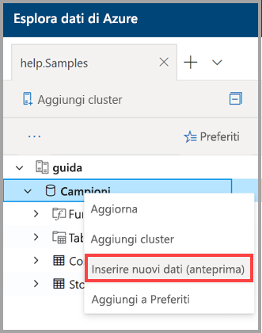

# Usare l'inserimento con un clic per inserire i dati in Azure Esplora dati

Questo articolo illustra come usare l'inserimento con un clic per l'inserimento rapido di una nuova tabella nei formati JSON o CSV dall'archiviazione in Azure Esplora dati. Una volta inseriti i dati, è possibile modificare la tabella ed eseguire query usando l'interfaccia utente Web.

## Prerequisiti

* Se non si ha una sottoscrizione di Azure, prima di iniziare creare un [account Azure gratuito](https://azure.microsoft.com/free/).
* Accedere all'[applicazione](https://dataexplorer.azure.com/).
* Creare [un cluster e un database di Azure Esplora dati](create-cluster-database-portal.md)
* Accedere all' [interfaccia utente Web](https://dataexplorer.azure.com/) e [aggiungere una connessione al cluster](/azure/data-explorer/web-query-data#add-clusters)
* Origine dei dati in archiviazione di Azure.

## Inserire nuovi dati

1. Fare clic con il pulsante destro del mouse sul *database* o sulla riga della *tabella* nel menu a sinistra dell'interfaccia utente Web e selezionare Inserisci **nuovi dati (anteprima)**

       
 
1. Nella finestra Inserisci **nuovi dati (anteprima)** , nella scheda **origine** , completare i **Dettagli del progetto**:

    * **Tabella**: selezionare nome tabella esistente dall'elenco a discesa oppure selezionare **Crea nuovo** per creare una nuova tabella.
    * Selezionare il **tipo** di inserimento > **dall'archiviazione** o **dal file**.
        * Se è stata selezionata l'opzione **da archiviazione**, immettere il **collegamento alla** risorsa di archiviazione per aggiungere l'URL alla risorsa di archiviazione. Usare l' [URL SAS BLOB](/azure/vs-azure-tools-storage-explorer-blobs#get-the-sas-for-a-blob-container) per gli account di archiviazione privati. 
        * Se è stata selezionata l'opzione **da file**, selezionare **Sfoglia** e trascinare il file nella casella.
    * Selezionare **Modifica schema** per visualizzare e modificare la configurazione della colonna della tabella.
 
     

    > [!TIP]
    > Se si seleziona inserire **nuovi dati (anteprima)** in una riga di *tabella* , il nome della tabella selezionata verrà visualizzato nei **Dettagli del progetto**.

1. Se è stata selezionata una tabella esistente, viene visualizzata la finestra **mappa colonne** per eseguire il mapping delle colonne di dati di origine alle colonne della tabella di destinazione. 
    * Utilizzare **omette colonna** per rimuovere una colonna di destinazione dalla tabella. 
    * Utilizzare **nuova colonna** per aggiungere una nuova colonna alla tabella. 

    

1. Nella scheda **schema** :

    * Selezionare **tipo di compressione** dall'elenco a discesa > **decompresso** o **gzip**.
    * Selezionare **formato dati** dall'elenco a discesa > **JSON**, **CSV**, **TSV**, **SCSV**, **SOHSV**, **tsve**o **PSV**. 
        * Quando si seleziona formato **JSON** , selezionare i **livelli JSON**: 1-10. I livelli influiscono sulla rappresentazione dei dati della colonna della tabella. 
        * Se si seleziona un formato diverso da JSON: selezionare la casella di controllo **Includi nomi di colonna** per ignorare la riga dell'intestazione del file.    
    * Il **nome del mapping** viene impostato automaticamente, ma può essere modificato.
    * Se è stata selezionata una tabella esistente, è possibile selezionare il pulsante **mappa colonne** per aprire la finestra **colonne mappa** .

    

1. Nell' **Editor**selezionare **V** a destra per aprire l'editor. Nell'editor è possibile visualizzare e copiare le query automatiche generate dagli input. 

1.  Nella tabella: 
    * Fare clic con il pulsante destro del mouse su nuove intestazioni di colonna per **modificare il tipo di dati**, **rinominare**la colonna, **eliminare colonne**, **ordinamento crescente**o **ordinamento decrescente**. Nelle colonne esistenti è disponibile solo l'ordinamento dei dati. 
    * Fare doppio clic sul nome della nuova colonna da modificare.

1. Selezionare **Avvia** inserimento per creare la tabella, creare il mapping e inserire i dati.

     
 
## Eseguire query sui dati

1. Nella finestra inserimento **dati completata** , tutti e tre i passaggi verranno contrassegnati con segni di spunta verdi, se l'inserimento dei dati è stato completato correttamente. 
 
    

1. Selezionare **V** per aprire la query. Copiare nell'interfaccia utente Web per modificare la query.

1. Il menu a destra contiene query e **strumenti** **rapidi** . 

    * Le **query rapide** includono collegamenti all'interfaccia utente Web con query di esempio.
    * **Gli strumenti** includono il collegamento all'interfaccia utente Web con **comandi drop** che consentono di risolvere i problemi eseguendo il comando `.drop` pertinente.

    > [!TIP]
    > È possibile che i dati vadano persi utilizzando `.drop` comandi. Usarle attentamente.

## Passaggi successivi

* [Eseguire query sui dati in Azure Esplora dati interfaccia utente Web](web-query-data.md)
* [Scrivere query per Esplora dati di Azure usando il linguaggio di query kusto](write-queries.md)
