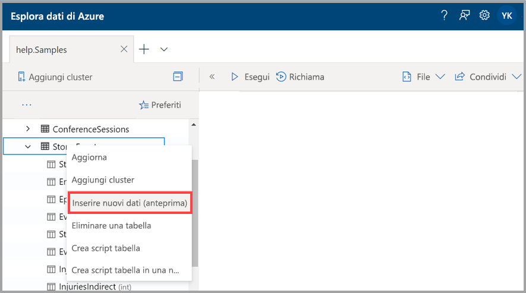
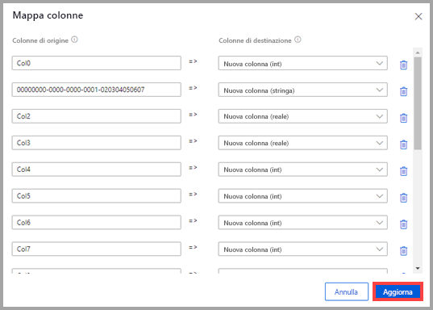
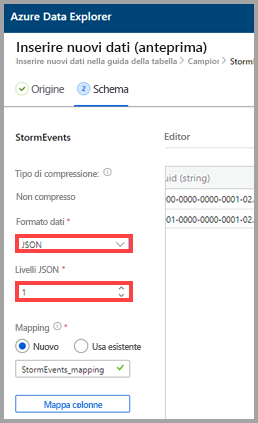
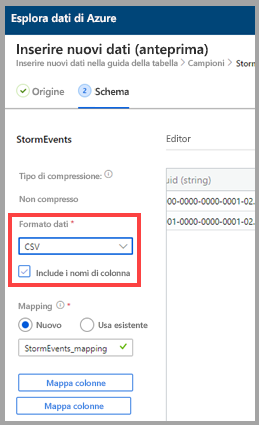
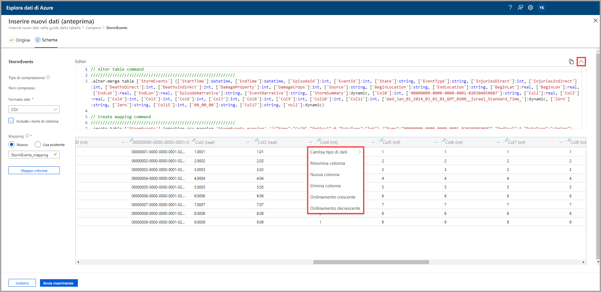
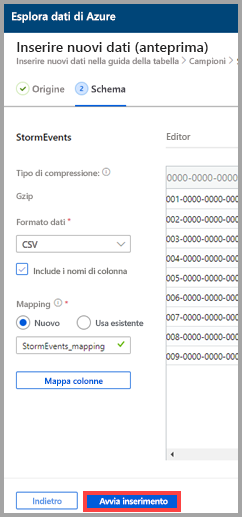
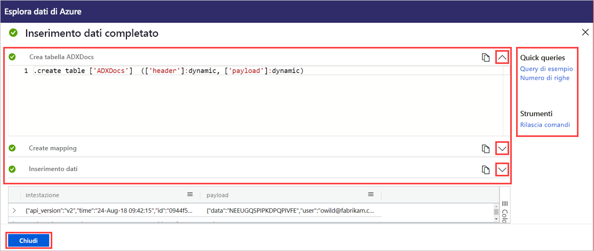

# Usare l'inserimento con un clic per inserire dati in una tabella esistente di Esplora dati di Azure

L'inserimento con un clic consente di inserire rapidamente i dati in formato JSON, CSV e altri in una tabella. Usando l'interfaccia utente Web di Esplora dati di Azure, è possibile inserire i dati dallo spazio di archiviazione, da un file locale o da un contenitore. 

Questo documento descrive l'uso della procedura guidata intuitiva per l'inserimento con un clic dei dati JSON da un file in una tabella esistente. È quindi possibile modificare la tabella ed eseguire query con l'interfaccia utente Web di Esplora dati di Azure.

L'inserimento con un clic è particolarmente utile quando si inseriscono i dati per la prima volta o quando non si ha familiarità con lo schema dei dati. 

Per una panoramica dell'inserimento con un clic e un elenco dei prerequisiti, vedere [Inserimento con un clic](ingest-data-one-click.md).
Per informazioni sull'inserimento di dati in una nuova tabella di Esplora dati di Azure, vedere [Inserimento con un clic in una nuova tabella](one-click-ingestion-new-table.md)

## Inserire nuovi dati

1. Nel menu sinistro dell'interfaccia utente Web fare clic con il pulsante destro del mouse su un *database* o su una *tabella*, quindi scegliere **Ingest new data (Preview)** (Inserisci nuovi dati (anteprima)).

       
 
1. Nella finestra **Ingest new data (Preview)** (Inserisci nuovi dati (anteprima)) viene automaticamente selezionata la scheda **Origine**.

1. Se il campo **Tabella** non viene compilato automaticamente, scegliere un nome di tabella esistente dal menu a discesa.
    > [!TIP]
    > Se si seleziona **Ingest new data (Preview)** (Inserisci nuovi dati (anteprima)) in una riga di *tabella*, il nome della tabella selezionata verrà visualizzato nel campo **Dettagli del progetto**.

[!INCLUDE [data-explorer-one-click-ingestion-types](../../includes/data-explorer-one-click-ingestion-types.md)]
    
Selezionare **Modifica schema** per visualizzare e modificare la configurazione delle colonne della tabella.

## Modificare lo schema

1. Verrà visualizzata la finestra di dialogo **Mapping colonne** ed è possibile mappare le colonne di dati di origine alle colonne della tabella di destinazione. 
    * Nei campi **Colonne di origine** immettere i nomi delle colonne da mappare alle **Colonne di destinazione**.
    * Per eliminare un mapping, selezionare l'icona del cestino.

    

1. Selezionare **Aggiorna**.
1. Nella scheda **Schema**:
    1. Selezionare **Tipo di compressione**, quindi selezionare **Non compresso** o **GZip**.

        [!INCLUDE [data-explorer-one-click-ingestion-edit-schema](../../includes/data-explorer-one-click-ingestion-edit-schema.md)]
        
    1. Se si seleziona **JSON**, è necessario selezionare anche i **livelli JSON**, da 1 a 10. I livelli influiscono sulla rappresentazione dei dati nelle colonne della tabella.

    

    * Se si seleziona un formato diverso da JSON, è possibile selezionare la casella di controllo **Include column names** (Includi nomi di colonna) per ignorare la riga di intestazione del file.
        
    

    > [!Note]
    > I formati tabulari consentono di inserire i dati in una sola colonna di una tabella di Esplora dati di Azure. 

    * I nuovi mapping vengono impostati automaticamente, ma è possibile cambiarli per usarne uno esistente. 
    * È possibile selezionare **Mapping colonne** per aprire la finestra **Mapping colonne**.

## Copiare e incollare query

1. Sopra il riquadro **Editor** selezionare il pulsante **v** per aprire l'editor. Nell'editor è possibile visualizzare e copiare i comandi automatici generati dagli input. 
1. Nella tabella: 
    * Selezionare nuove intestazioni di colonna per specificare le opzioni **Nuova colonna**, **Elimina colonna**, **Ordinamento crescente** o **Ordinamento decrescente**. Nelle colonne esistenti è disponibile solo l'ordinamento dei dati.

    > [!Note]
    > * Non è possibile aggiornare il nome e il tipo di dati delle tabelle esistenti.
    > * I comandi di rimozione ripristinano solo le modifiche apportate dal flusso di inserimento (nuove estensioni e colonne). Non verrà rimosso niente altro.

 

## Avviare l'inserimento

Selezionare **Start ingestion** (Avvia inserimento) per creare una tabella e un mapping e iniziare l'inserimento dei dati.

## Inserimento dei dati completato

Se l'inserimento dei dati viene completato correttamente, nella finestra **Data ingestion completed** (Inserimento dati completato) tutti e tre i passaggi saranno contrassegnati da segni di spunta verdi.
 

[!INCLUDE [data-explorer-one-click-ingestion-query-data](../../includes/data-explorer-one-click-ingestion-query-data.md)]

## Passaggi successivi

* [Eseguire query sui dati nell'interfaccia utente Web di Esplora dati di Azure](/azure/data-explorer/web-query-data)
* [Scrivere query per Esplora dati di Azure con il linguaggio di query Kusto](/azure/data-explorer/write-queries)
