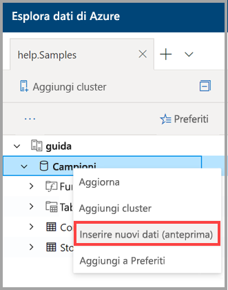
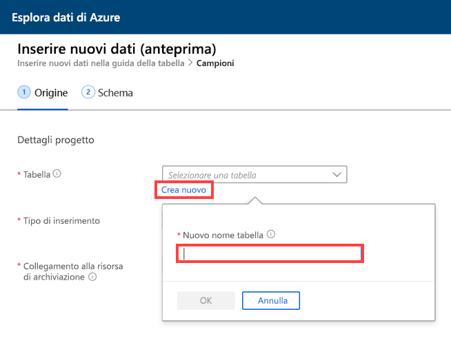
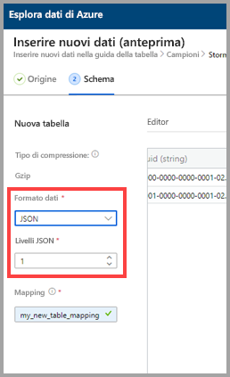
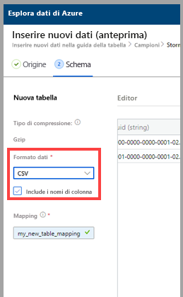
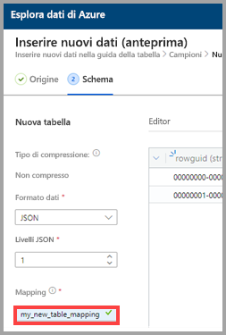
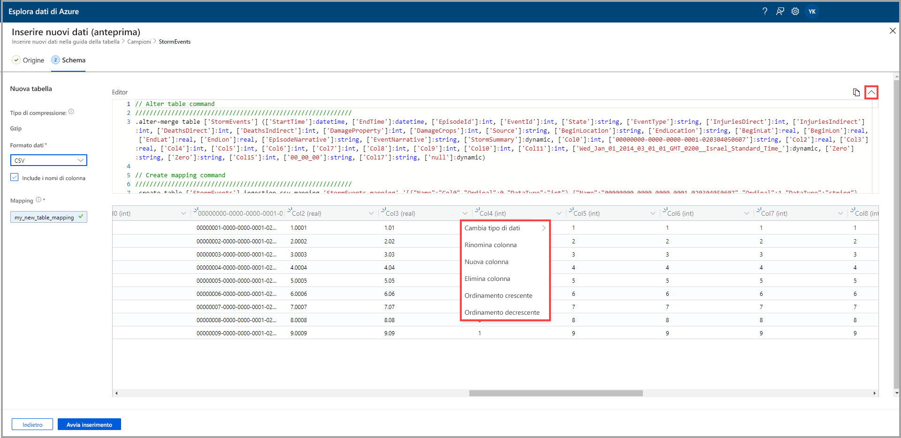
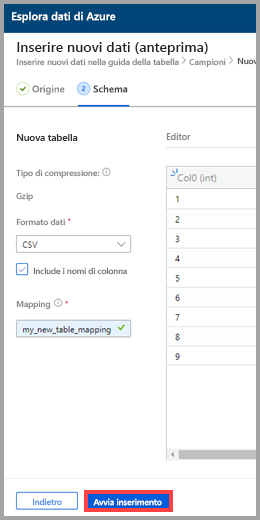
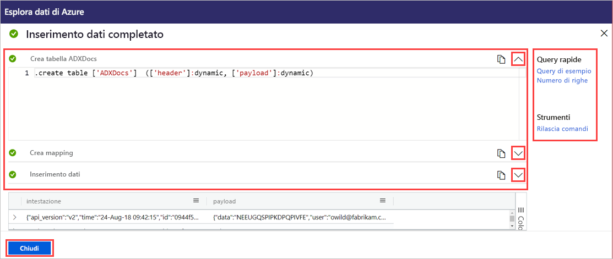

# Usare l'inserimento con un clic per inserire dati in una nuova tabella di Esplora dati di Azure

L'inserimento con un clic consente di inserire rapidamente i dati in formato JSON, CSV e altri in una tabella. Usando l'interfaccia utente Web di Esplora dati di Azure, è possibile inserire i dati dallo spazio di archiviazione, da un file locale o da un contenitore. 

Questo documento descrive l'uso della procedura guidata intuitiva per l'inserimento con un clic dei dati CSV da un contenitore in una nuova tabella. È quindi possibile modificare la tabella ed eseguire query con l'interfaccia utente Web di Esplora dati di Azure. È anche possibile impostare l'inserimento continuo per inserire automaticamente i dati nella tabella quando vengono aggiornati i dati di origine.

L'inserimento con un clic è particolarmente utile quando si inseriscono i dati per la prima volta o quando non si ha familiarità con lo schema dei dati. 

Per una panoramica dell'inserimento con un clic e un elenco dei prerequisiti, vedere [Inserimento con un clic](ingest-data-one-click.md).
Per informazioni sull'inserimento di dati in una tabella esistente di Esplora dati di Azure, vedere [Inserimento con un clic in una tabella esistente](one-click-ingestion-existing-table.md)

## Inserire nuovi dati

1. Nel menu sinistro dell'interfaccia utente Web fare clic con il pulsante destro del mouse su un *database*, quindi scegliere **Ingest new data (Preview)** (Inserisci nuovi dati (anteprima)).

       
 
1. Nella finestra **Ingest new data (Preview)** (Inserisci nuovi dati (anteprima)) viene automaticamente selezionata la scheda **Origine**. 

1. Selezionare **Crea nuova tabella** e immettere un nome per la nuova tabella. È possibile usare caratteri alfanumerici, trattini e caratteri di sottolineatura. I caratteri speciali non sono supportati.

 

[!INCLUDE [data-explorer-one-click-ingestion-types](../../includes/data-explorer-one-click-ingestion-types.md)]

Selezionare **Modifica schema** per visualizzare e modificare la configurazione delle colonne della tabella. Il sistema selezionerà in modo casuale uno dei BLOB, in base al quale verrà generato lo schema. Esaminando il nome dell'origine, il servizio identifica automaticamente se è compresso o meno.

## Modificare lo schema

1. Nella scheda **Schema**:

    1. Selezionare **Formato dati**:

        [!INCLUDE [data-explorer-one-click-ingestion-edit-schema](../../includes/data-explorer-one-click-ingestion-edit-schema.md)]

    1. Se si seleziona **JSON**, è necessario selezionare anche i **livelli JSON**, da 1 a 10. I livelli influiscono sulla rappresentazione dei dati nelle colonne della tabella. 

    

    * Se si seleziona un formato diverso da JSON, è possibile selezionare la casella di controllo **Include column names** (Includi nomi di colonna) per ignorare la riga di intestazione del file.

        
        
1. Nel campo **Mapping name** (Nome mapping) immettere un nome di mapping. È possibile usare caratteri alfanumerici e trattini. Gli spazi, i caratteri speciali e i trattini non sono supportati.
    
    

## Copiare e incollare query

1. Sopra il riquadro **Editor** selezionare il pulsante **v** per aprire l'editor. Nell'editor è possibile visualizzare e copiare le query automatiche generate dagli input. 
1. Nella tabella: 
    * Fare doppio clic sul nome della nuova colonna da modificare.
    * Selezionare le intestazioni della nuova colonna ed eseguire una delle operazioni seguenti:
    
|Azione         |Descrizione                                  |
|-----------------|-------------------------------------------|
|Cambia tipo di dati |Cambia il tipo di dati selezionato automaticamente dal servizio impostandolo su uno degli altri [tipi di dati supportati](#edit-the-schema)|
|Rinomina colonna    |Cambia il nome della colonna |
|Nuova colonna       |Aggiunge una nuova colonna|
|Elimina colonna    |Elimina la colonna selezionata|
|Ordinamento crescente   |Ordina la tabella in ordine crescente in base alla colonna selezionata (solo colonne esistenti)|
|Ordinamento decrescente  |Ordina la tabella in ordine decrescente in base alla colonna selezionata (solo colonne esistenti) |

> [!Note]
> Per i formati tabulari, ogni colonna può essere inserita in una colonna di Esplora dati di Azure.
> È possibile creare nuove colonne da diversi livelli JSON.

 

## Avviare l'inserimento

Selezionare **Start ingestion** (Avvia inserimento) per creare una tabella e un mapping e iniziare l'inserimento dei dati.

## Inserimento dei dati completato

Se l'inserimento dei dati viene completato correttamente, nella finestra **Data ingestion completed** (Inserimento dati completato) tutti e tre i passaggi saranno contrassegnati da segni di spunta verdi.
 

[!INCLUDE [data-explorer-one-click-ingestion-query-data](../../includes/data-explorer-one-click-ingestion-query-data.md)]

**Inserimento continuo**

L'inserimento continuo consente di creare una griglia di eventi che resta in ascolto del contenitore di origine. Nella tabella di destinazione verrà automaticamente inserito qualsiasi nuovo BLOB che soddisfa i criteri dei parametri predefiniti (prefisso, suffisso e così via).

> [!Note]
> L'inserimento continuo si applica solo per l'inserimento da un contenitore.

1. Selezionare **Continuous ingestion** (Inserimento continuo) per aprire il portale di Azure. Viene visualizzata la pagina di connessione dati con il connettore di dati della griglia di eventi aperto e con i parametri di origine e destinazione già immessi (contenitore di origine, tabelle e mapping).

1. Selezionare **Crea** per creare una connessione dati che resterà in ascolto delle eventuali modifiche apportate al contenitore. 

## Passaggi successivi

* [Eseguire query sui dati nell'interfaccia utente Web di Esplora dati di Azure](/azure/data-explorer/web-query-data)
* [Scrivere query per Esplora dati di Azure con il linguaggio di query Kusto](/azure/data-explorer/write-queries)
