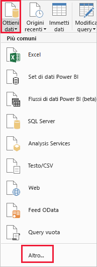
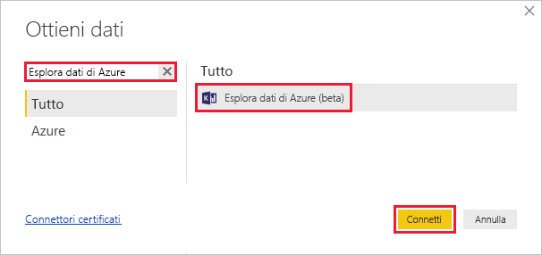
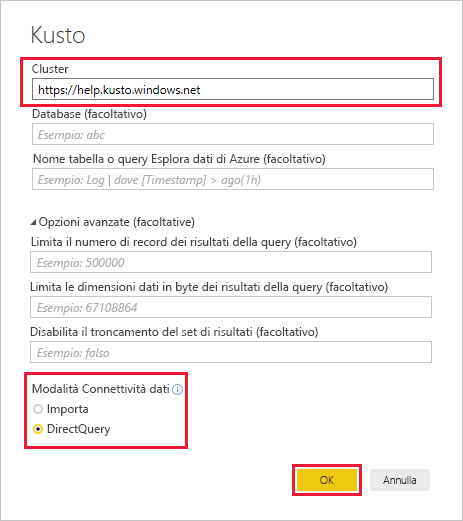
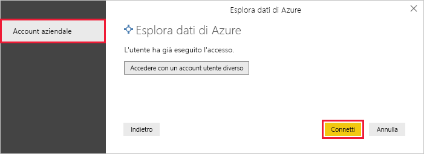
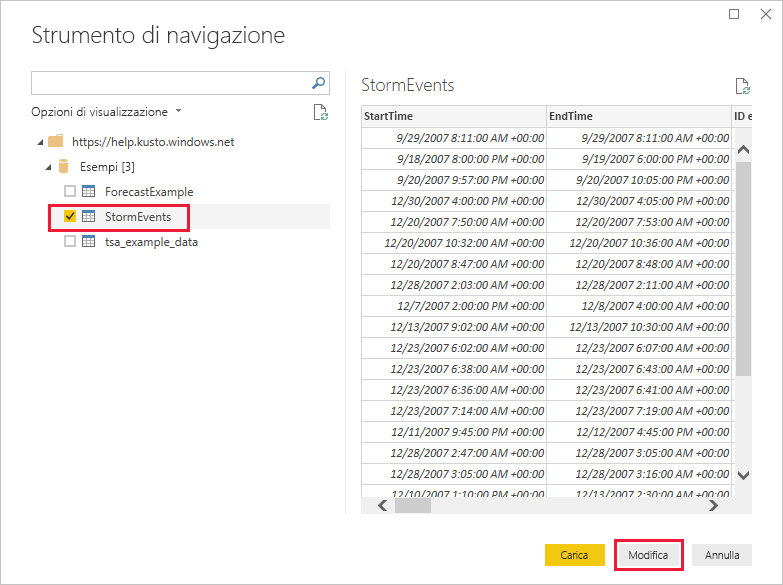
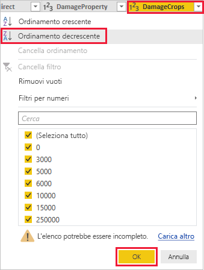
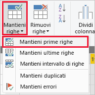
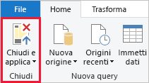

# Guida introduttiva: Visualizzare i dati con il connettore Esplora dati di Azure per Power BI

Esplora dati di Azure è un servizio di esplorazione dati rapido e a scalabilità elevata per dati di log e di telemetria. Power BI è una soluzione di analisi aziendale che consente di visualizzare i dati e condividere i risultati all'interno dell'organizzazione.

Esplora dati di Azure fornisce tre opzioni per la connessione ai dati in Power BI: usare il connettore predefinito, importare una query da Esplora dati di Azure o usare una query SQL. Questa Guida introduttiva illustra come usare il connettore predefinito per ottenere dati e visualizzarli in un report di Power BI.

Se non si ha una sottoscrizione di Azure, creare un [account Azure gratuito](https://azure.microsoft.com/free/) prima di iniziare.

## Prerequisiti

Per completare questa guida introduttiva è necessario quanto segue:

* Un account di posta elettronica dell'organizzazione membro di Azure Active Directory, in modo da potersi connettere al [cluster della guida di Esplora dati di Azure](https://dataexplorer.azure.com/clusters/help/databases/samples).

* [Power BI Desktop](https://powerbi.microsoft.com/get-started/) (selezionare **SCARICA GRATUITAMENTE**)

## Ottenere dati da Esplora dati di Azure

In primo luogo si effettua la connessione al cluster della guida di Esplora dati di Azure e quindi si importa un subset dei dati dalla tabella *StormEvents*. [!INCLUDE [data-explorer-storm-events](../../includes/data-explorer-storm-events.md)]

1. Nella scheda **Home** di Power BI Desktop selezionare **Recupera dati** e quindi **Altro**.

    

1. Cercare *Esplora dati di Azure*, selezionare **Esplora dati di Azure (beta)** e quindi **Connetti**.

    

1. Nella schermata **Anteprima connettore** selezionare **Continua**.

1. Nella schermata seguente compilare il modulo con le informazioni seguenti.

    

    **Impostazione** | **Valore** | **Descrizione campo**
    |---|---|---|
    | HDInsight | *https://help.kusto.windows.net* | L'URL del cluster della guida. Per altri cluster, l'URL è nel formato *https://\<ClusterName\>.\<Area\>.kusto.windows.net*. |
    | Database | Lasciare vuoto | Un database ospitato nel cluster con cui si effettua la connessione. Questo verrà selezionato in un passaggio successivo. |
    | Nome tabella | Lasciare vuoto | Una delle tabelle nel database o una query come <code>StormEvents \| take 1000</code>. Questo verrà selezionato in un passaggio successivo. |
    | Advanced Options | Lasciare vuoto | Opzioni per le query, ad esempio dimensioni del set di risultati. |
    | Modalità connettività dati | *DirectQuery* | Determina se Power BI Importa i dati o si connette direttamente all'origine dati. È possibile usare l'una o l'altra opzione con questo connettore. |
    | | | |

1. Se non si ha già una connessione al cluster della guida, accedere. Accedere con un account aziendale e quindi selezionare **Connetti**.

    

1. Nella schermata **Strumento di navigazione** espandere il database **Samples**, selezionare **StormEvents** e quindi **Modifica**.

    

    La tabella verrà aperta nell'Editor di Power Query, in cui è possibile modificare righe e colonne prima di importare i dati.

1. Nell'Editor di Power Query selezionare la freccia accanto alla colonna **DamageCrops** e quindi selezionare **Ordinamento decrescente**.

    

1. Nella scheda **Home** selezionare **Mantieni righe** e quindi **Mantieni prime righe**. Immettere il valore *1000* per recuperare le prime 1000 righe della tabella ordinata.

    

1. Nella scheda **Home** selezionare **Chiudi e applica**.

    

## Visualizzare i dati in un report

[!INCLUDE [data-explorer-power-bi-visualize-basic](../../includes/data-explorer-power-bi-visualize-basic.md)]

## Pulire le risorse

Se il report creato per questa Guida introduttiva non è più necessario, eliminare il file di Power BI Desktop (pbix).

## Passaggi successivi

> [!div class="nextstepaction"]
> [Guida introduttiva: Visualizzare i dati tramite una query importata in Power BI](power-bi-imported-query.md)
