# <a name="quickstart-query-data-in-azure-data-explorer-web-ui"></a>Guida introduttiva: Eseguire query sui dati nell'interfaccia utente Web di Esplora dati di Azure

Esplora dati di Azure è un servizio di esplorazione dati rapido e a scalabilità elevata per dati di log e di telemetria. Offre un'applicazione Web che consente di eseguire e condividere le query. L'applicazione è disponibile nel portale di Azure e come applicazione Web autonoma. In questo articolo viene usata la versione autonoma, che consente di connettersi a più cluster e di condividere collegamenti diretti alle query.

Se non si ha una sottoscrizione di Azure, creare un [account Azure gratuito](https://azure.microsoft.com/free/) prima di iniziare.

## <a name="prerequisites"></a>Prerequisiti

Oltre a una sottoscrizione di Azure, sono necessari [un cluster di prova e un database](create-cluster-database-portal.md) per completare questo avvio rapido.

## <a name="sign-in-to-the-application"></a>Accedere all'applicazione

Accedere all'[applicazione](https://dataexplorer.azure.com/).

## <a name="add-clusters"></a>Aggiungere cluster

Alla prima apertura dell'applicazione non sono presenti connessioni.


Prima di avviare l'esecuzione di query, è necessario aggiungere almeno una connessione a un cluster. In questa sezione vengono aggiunte le connessioni al *cluster help* di Esplora dati di Azure, configurato per facilitare l'apprendimento, e al cluster di prova creato in un avvio rapido precedente.

1. In alto a sinistra nell'applicazione selezionare **Add cluster** (Aggiungi cluster).

1. Nella finestra di dialogo **Add cluster** (Aggiungi cluster) immettere l'URI, quindi selezionare **Add** (Aggiungi).

   È possibile usare l'URI del cluster della guida `https://help.kusto.windows.net`. Se si ha un proprio cluster, specificare l'URI del cluster. Ad esempio, `https://mydataexplorercluster.westus.kusto.windows.net` come mostrato nell'immagine seguente:

    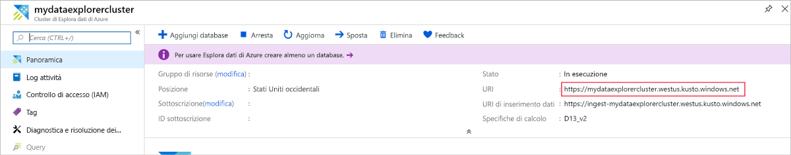

1. Nel riquadro a sinistra viene visualizzato il cluster **help**. Espandere il database **Samples** in modo da visualizzare le tabelle di esempio a cui l'utente può accedere.

    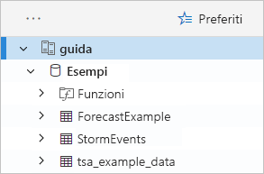

    La tabella **StormEvents** verrà usata più avanti in questo avvio rapido e in altri articoli relativi a Esplora dati di Azure.

Aggiungere quindi il cluster di prova creato.

1. Selezionare **Add cluster**  (Aggiungi cluster).

1. Nella finestra di dialogo **Add cluster** (Aggiungi cluster) immettere l'URL del cluster di prova nel formato `https://<ClusterName>.<Region>.kusto.windows.net/`, quindi selezionare **Add** (Aggiungi).

    Nell'esempio seguente vengono visualizzati il cluster **help** e il nuovo cluster **docscluster.westus**, il cui URL completo è `https://docscluster.westus.kusto.windows.net/`.

    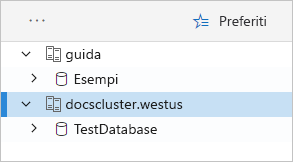

## <a name="run-queries"></a>Eseguire le query

A questo punto è possibile eseguire query su entrambi i cluster a cui si è connessi, presupponendo che nel cluster di prova siano presenti dati. Verrà esaminato il cluster **help**.

1. Nel riquadro a sinistra, nel cluster **help**, selezionare il database **Samples**.

1. Copiare e incollare la query seguente nella relativa finestra. Nella parte superiore della finestra selezionare **Run** (Esegui).

    ```Kusto
    StormEvents
    | sort by StartTime desc
    | take 10
    ```
    Questa query restituisce i dieci record più recenti della tabella **StormEvents**. Il lato sinistro del risultato dovrebbe essere simile alla tabella seguente.

    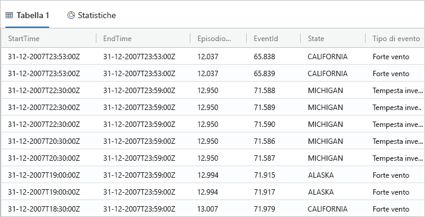

    L'immagine seguente mostra lo stato in cui si trova ora l'applicazione, con i cluster aggiunti e una query con i risultati.

    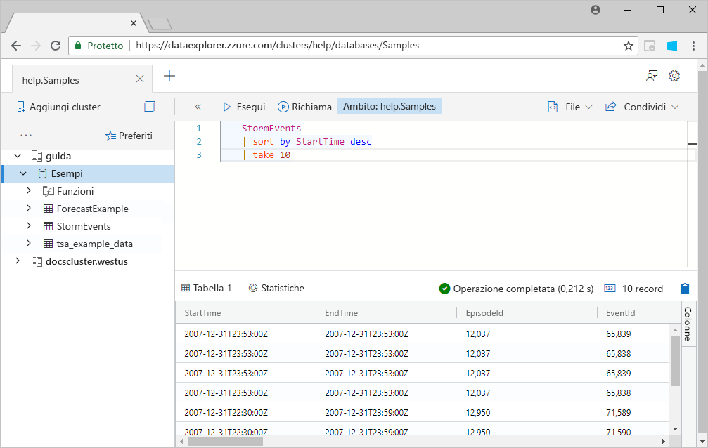

1. Copiare e incollare la query seguente nella relativa finestra, sotto alla query precedente. Si noti come la query non sia formattata su righe separate come la prima query.

    ```Kusto
    StormEvents | sort by StartTime desc | project StartTime, EndTime, State, EventType, DamageProperty, EpisodeNarrative | take 10
    ```

1. Nella finestra fare clic sulla nuova query selezionandola. Premere MAIUSC+ALT+F per formattare la query in modo che risulti simile a quanto segue.

    

1. Premere Maiusc + Invio, la combinazione di tasti che esegue la query.

   Questa query restituisce gli stessi record della prima, ma include solo le colonne specificate nell'istruzione `project`. Il risultato dovrebbe essere simile alla tabella seguente.

    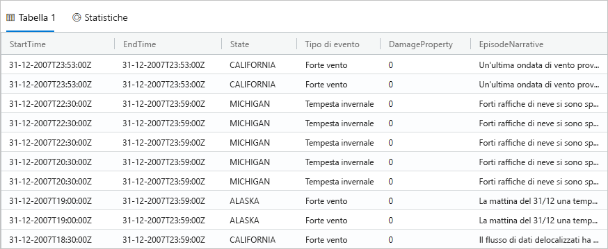

1. Nella parte superiore della finestra selezionare **Recall** (Richiama).

    La finestra della query mostra ora il set di risultati dalla prima query senza doverla eseguire nuovamente. Durante l'analisi si eseguono spesso più query e la voce **Recall** (Richiama) consente di rivedere i risultati delle query precedenti.

1. Per visualizzare un altro tipo di output eseguire un'altra query.

    ```Kusto
    StormEvents
    | summarize event_count=count(), mid = avg(BeginLat) by State
    | sort by mid
    | where event_count > 1800
    | project State, event_count
    | render columnchart
    ```
    Il risultato dovrebbe essere simile al grafico seguente.

    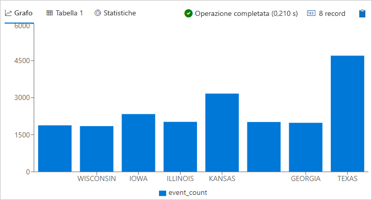

## <a name="work-with-the-table-grid"></a>Usare la griglia della tabella

Dopo aver approfondito il funzionamento di base delle query, viene illustrato l'utilizzo della griglia della tabella per personalizzare i risultati ed eseguire altre analisi.

1. Eseguire di nuovo la prima query. Far passare il puntatore del mouse sulla colonna **State** (Stato), selezionare il menu e quindi **Group by State** (Raggruppa per stato).

    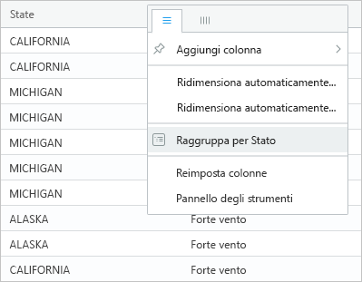

1. Nella griglia espandere **California** per visualizzare i record di questo stato.

    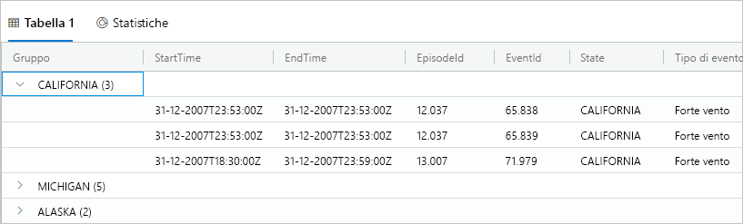

    Questo tipo di raggruppamento è utile quando si esegue l'analisi esplorativa.

1. Far passare il puntatore del mouse sulla colonna **Group** (Gruppo), quindi selezionare **Reset columns** (Reimposta colonne).

    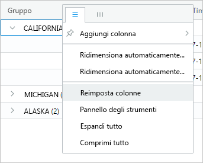

    La griglia viene reimpostata allo stato originale.

1. Eseguire la query seguente.

    ```Kusto
    StormEvents
    | sort by StartTime desc
    | where DamageProperty > 5000
    | project StartTime, State, EventType, DamageProperty, Source
    | take 10
    ```

1. Sul lato destro della griglia, selezionare **Columns** (Colonne) per vedere il riquadro degli strumenti.

    

    Il riquadro funziona in modo analogo all'elenco dei campi della tabella pivot in Excel, e consente di eseguire ulteriori analisi nella griglia.

1. Selezionare **Modalità Pivot**, quindi trascinare le colonne come segue: **State** in **Row groups**; **DamageProperty** in **Values**; **EventType** su **Column labels**.  

    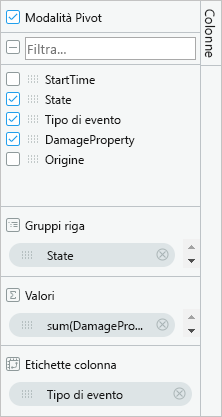

    Il risultato dovrebbe essere simile alla tabella pivot seguente.

    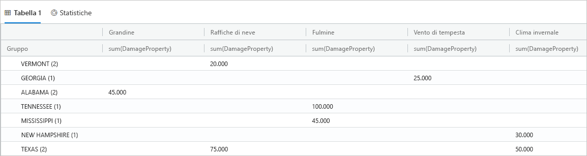

    Notare che Vermont e Alabama hanno due eventi nella stessa categoria, mentre Texas ha due eventi in categorie diverse. Le tabelle pivot consentono di individuare rapidamente questo genere di cose: sono un ottimo strumento per l'analisi rapida.

## <a name="share-queries"></a>Condivisione di query

In molti casi le query create vengono condivise. Affinché altri utenti con accesso al cluster possano eseguire le query è possibile fornire un collegamento diretto.

1. Selezionare la prima query copiata nella finestra della query.

1. Nella parte superiore della finestra selezionare **Share** (Condividi).

1. Selezionare **Link, query to clipboard** (Collegamento, Copia query negli Appunti).

1. Copiare il collegamento e la query in un file di testo.

1. Incollare il collegamento in una nuova finestra del browser. Il risultato dopo l'esecuzione della query dovrebbe essere simile al seguente.

    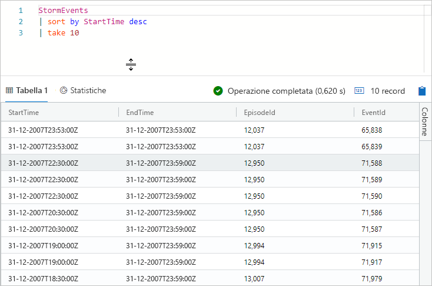

## <a name="provide-feedback"></a>Fornire commenti e suggerimenti

Esplora dati è attualmente in fase di anteprima e saremo lieti di ricevere commenti e suggerimenti sull'esperienza dell'utente. È possibile inviare un commento adesso o successivamente, dopo aver familiarizzato con il prodotto.

1. Nell'angolo in alto a destra dell'applicazione, selezionare l'icona dei commenti e suggerimenti: .

1. Immettere il commento, quindi selezionare **Submit** (Invia).

## <a name="clean-up-resources"></a>Pulire le risorse

In questo avvio rapido non sono state create risorse, ma se si vuole rimuovere uno o entrambi i cluster dall'applicazione, fare clic con il pulsante destro del mouse sul cluster e scegliere **Remove connection** (Rimuovi connessione).

## <a name="next-steps"></a>Passaggi successivi

[Scrivere query per Esplora dati di Azure](write-queries.md)
