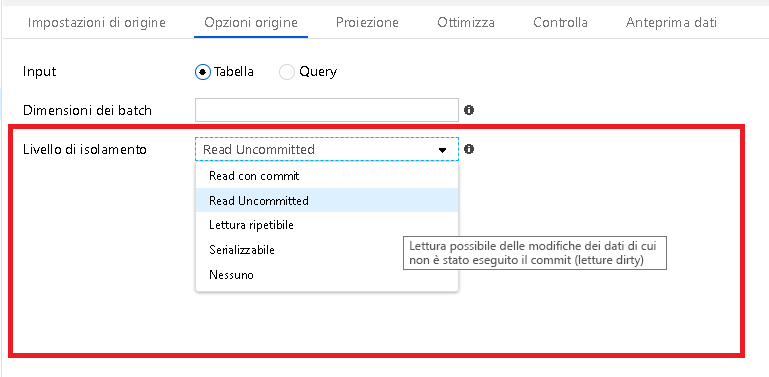

# <a name="mapping-data-flows-performance-and-tuning-guide"></a>Guida alle prestazioni e all'ottimizzazione del flusso di dati

[!INCLUDE [notes](../../includes/data-factory-data-flow-preview.md)]

Azure Data Factory i flussi di dati di mapping forniscono un'interfaccia browser senza codice per progettare, distribuire e orchestrare le trasformazioni dei dati su larga scala.

> [!NOTE]
> Se non si ha familiarità con i flussi di dati di mapping di ADF in generale, vedere [Cenni preliminari sui flussi di dati](concepts-data-flow-overview.md) prima di leggere questo articolo.
>

> [!NOTE]
> Quando si progettano e si testano i flussi di dati dall'interfaccia utente di ADF, assicurarsi di attivare l'opzione di debug in modo che sia possibile eseguire i flussi di dati in tempo reale senza attendere il riscaldamento di un cluster.
>


## <a name="monitor-data-flow-performance"></a>Monitorare le prestazioni del flusso di dati

Quando si progettano i flussi di dati di mapping nel browser, è possibile unit test ogni singola trasformazione facendo clic sulla scheda Anteprima dati nel riquadro impostazioni in basso per ogni trasformazione. Il passaggio successivo da eseguire consiste nel testare il flusso di dati end-to-end in Progettazione pipeline. Aggiungere un'attività Esegui flusso di dati e utilizzare il pulsante debug per testare le prestazioni del flusso di dati. Nel riquadro inferiore della finestra della pipeline viene visualizzata l'icona di un monocolo in "azioni":


Se si fa clic su tale icona, viene visualizzato il piano di esecuzione e il profilo delle prestazioni successivo del flusso di dati. È possibile usare queste informazioni per stimare le prestazioni del flusso di dati in base a origini dati di dimensioni diverse. Si noti che è possibile ipotizzare un minuto di tempo di configurazione dell'esecuzione del processo del cluster nei calcoli generali delle prestazioni e se si usa il Azure Integration Runtime predefinito, potrebbe essere necessario aggiungere 5 minuti di tempo per l'avvio del cluster.


## <a name="optimizing-for-azure-sql-database-and-azure-sql-data-warehouse"></a>Ottimizzazione per database SQL di Azure e Azure SQL Data Warehouse


### <a name="partition-your-source-data"></a>Partizionare i dati di origine

* Passare a "optimize" e selezionare "Source". Impostare una colonna della tabella specifica o un tipo in una query.
* Se si sceglie "colonna", selezionare la colonna partizione.
* Inoltre, impostare il numero massimo di connessioni al database SQL di Azure. È possibile provare un'impostazione superiore per ottenere connessioni parallele al database. Tuttavia, alcuni casi possono comportare prestazioni più rapide con un numero limitato di connessioni.
* Non è necessario partizionare le tabelle del database di origine.
* L'impostazione di una query nella trasformazione origine che corrisponde allo schema di partizionamento della tabella di database consentirà al motore di database di origine di utilizzare l'eliminazione della partizione.
* Se l'origine non è ancora partizionata, ADF continuerà a usare il partizionamento dei dati nell'ambiente di trasformazione Spark in base alla chiave selezionata nella trasformazione di origine.

### <a name="set-batch-size-and-query-on-source"></a>Imposta le dimensioni del batch e la query sull'origine

 dati

* Impostando dimensioni batch si indicherà ad ADF di archiviare i dati in set in memoria anziché riga per riga. Si tratta di un'impostazione facoltativa che può esaurire le risorse nei nodi di calcolo, se non sono dimensionate correttamente.
* L'impostazione di una query consente di filtrare le righe direttamente nell'origine prima che arrivino per il flusso di dati per l'elaborazione, operazione che consente di velocizzare l'acquisizione iniziale dei dati.
* Se si usa una query, è possibile aggiungere hint di query facoltativi per il database SQL di Azure, ovvero READ UNCOMMITTED

### <a name="set-isolation-level-on-source-transformation-settings-for-sql-datasets"></a>Impostazione del livello di isolamento nelle impostazioni della trasformazione origine per i set di dati SQL

* Read uncommitted fornirà risultati più veloci per le query sulla trasformazione origine



### <a name="set-sink-batch-size"></a>Imposta dimensioni batch sink


* Per evitare l'elaborazione riga per riga dei flussi di dati, impostare "dimensioni batch" nelle impostazioni del sink per il database SQL di Azure. In questo modo verrà indicato ad ADF di elaborare le Scritture del database in batch in base alle dimensioni specificate.

### <a name="set-partitioning-options-on-your-sink"></a>Impostare le opzioni di partizionamento nel sink

* Anche se i dati non sono partizionati nelle tabelle di database SQL di Azure di destinazione, passare alla scheda Ottimizza e impostare il partizionamento.
* Molto spesso, la semplice connessione di ADF per l'uso del partizionamento Round Robin nei cluster di esecuzione Spark comporta un caricamento più rapido dei dati anziché forzare tutte le connessioni da un singolo nodo o partizione.

### <a name="increase-size-of-your-compute-engine-in-azure-integration-runtime"></a>Aumentare le dimensioni del motore di calcolo in Azure Integration Runtime


* Aumentare il numero di core, che aumenteranno il numero di nodi e fornire una maggiore potenza di elaborazione per eseguire query e scrivere nel database SQL di Azure.
* Provare le opzioni "calcolo ottimizzato" e "con ottimizzazione per la memoria" per applicare più risorse ai nodi di calcolo.

### <a name="unit-test-and-performance-test-with-debug"></a>Unit test e test delle prestazioni con debug

* Quando si esegue lo unit test dei flussi di dati, impostare il pulsante "debug flusso di dati" su ON.
* All'interno della finestra di progettazione del flusso di dati, utilizzare la scheda Anteprima dati sulle trasformazioni per visualizzare i risultati della logica di trasformazione.
* Eseguire unit test dei flussi di dati da Progettazione pipeline inserendo un'attività flusso di dati nell'area di disegno della progettazione della pipeline e usare il pulsante "debug" per eseguire il test.
* I test in modalità di debug funzioneranno in un ambiente cluster attivo, senza dover attendere l'avvio di un cluster JIT.

### <a name="disable-indexes-on-write"></a>Disabilita indici durante la scrittura
* Utilizzare una pipeline ADF stored procedure attività prima dell'attività flusso di dati che disabilita gli indici nelle tabelle di destinazione in cui viene eseguita la scrittura dal sink.
* Dopo l'attività flusso di dati, aggiungere un'altra attività stored procedure che Abilita questi indici.

### <a name="increase-the-size-of-your-azure-sql-db"></a>Aumentare le dimensioni del database SQL di Azure
* Pianificare un ridimensionamento del database SQL di Azure di origine e sink prima di eseguire la pipeline per aumentare la velocità effettiva e ridurre al minimo la limitazione di Azure quando si raggiungono i limiti di DTU.
* Al termine dell'esecuzione della pipeline, è possibile ridimensionare nuovamente i database alla frequenza di esecuzione normale.

## <a name="optimizing-for-azure-sql-data-warehouse"></a>Ottimizzazione per Azure SQL Data Warehouse

### <a name="use-staging-to-load-data-in-bulk-via-polybase"></a>Usare la gestione temporanea per caricare i dati in blocco tramite polibase

* Per evitare l'elaborazione riga per riga dei flussi di dati, impostare l'opzione "Staging" nelle impostazioni del sink in modo che ADF possa sfruttare la polibase per evitare inserimenti riga per riga in DW. In questo modo si indicherà ad ADF di usare la polibase in modo che i dati possano essere caricati in blocco.
* Quando si esegue l'attività flusso di dati da una pipeline, con la gestione temporanea attivata, è necessario selezionare il percorso dell'archivio BLOB dei dati di staging per il caricamento bulk.

### <a name="increase-the-size-of-your-azure-sql-dw"></a>Aumentare le dimensioni di Azure SQL DW

* Pianificare un ridimensionamento dell'origine e del sink di Azure SQL DW prima di eseguire la pipeline per aumentare la velocità effettiva e ridurre al minimo la limitazione di Azure quando si raggiungono i limiti di DWU.

* Al termine dell'esecuzione della pipeline, è possibile ridimensionare nuovamente i database alla frequenza di esecuzione normale.

## <a name="optimize-for-files"></a>Ottimizza per file

* È possibile controllare il numero di partizioni che vengono utilizzate da ADF. In ogni origine & trasformazione sink, oltre a ogni singola trasformazione, è possibile impostare uno schema di partizionamento. Per i file di dimensioni ridotte, è possibile che la selezione di "partizione singola" funzioni a volte migliore e più rapida rispetto alla richiesta a Spark di partizionare i file piccoli.
* Se non si dispone di informazioni sufficienti sui dati di origine, è possibile scegliere il partizionamento "Round Robin" e impostare il numero di partizioni.
* Se si esplorano i dati e si individuano colonne che possono essere chiavi hash valide, usare l'opzione di partizionamento hash.

### <a name="file-naming-options"></a>Opzioni di denominazione dei file

* La natura predefinita della scrittura di dati trasformati nei flussi di dati di mapping di ADF è la scrittura in un set di dati che dispone di un servizio collegato BLOB o ADLS. È necessario impostare il set di dati in modo che punti a una cartella o a un contenitore, non a un file denominato.
* I flussi di dati usano Azure Databricks Spark per l'esecuzione, il che significa che l'output verrà suddiviso in più file in base al partizionamento predefinito di Spark o allo schema di partizionamento scelto in modo esplicito.
* Un'operazione molto comune nei flussi di dati di ADF è la scelta di "output in un singolo file" in modo che tutti i file della parte di output siano uniti in un unico file di output.
* Questa operazione richiede tuttavia che l'output venga ridotto a una singola partizione in un singolo nodo del cluster.
* Tenere presente questo aspetto quando si sceglie questa opzione popolare. È possibile esaurire le risorse del nodo del cluster se si combinano molti file di origine di grandi dimensioni in un'unica partizione di file di output.
* Per evitare di esaurire le risorse del nodo di calcolo, è possibile usare lo schema di partizionamento predefinito o esplicito in ADF, che consente di ottimizzare le prestazioni e quindi aggiungere un'attività di copia successiva nella pipeline che unisce tutti i file di parte della cartella di output in un nuovo singolo file. In pratica, questa tecnica separa l'azione di trasformazione dall'Unione di file e ottiene lo stesso risultato dell'impostazione di "output su singolo file".

### <a name="looping-through-file-lists"></a>Ripetizione di loop negli elenchi di file

Nella maggior parte dei casi, i flussi di dati in ADF vengono eseguiti meglio da una pipeline che consente alla trasformazione origine flusso di dati di eseguire l'iterazione su più file. In altre parole, è preferibile usare i caratteri jolly o gli elenchi di file all'interno dell'origine nel flusso di dati anziché scorrere un elenco di file di grandi dimensioni usando ForEach nella pipeline, chiamando un flusso di dati Execute per ogni iterazione. Il processo del flusso di dati verrà eseguito più velocemente consentendo il ciclo all'interno del flusso di dati.

Se, ad esempio, si dispone di un elenco di file di dati da luglio 2019 che si desidera elaborare in una cartella nell'archivio BLOB, sarebbe più efficiente chiamare un'attività Esegui flusso di dati una volta dalla pipeline e utilizzare un carattere jolly nell'origine come questa :

```DateFiles/*_201907*.txt```

Ciò consente di ottenere prestazioni migliori rispetto a una ricerca nell'archivio BLOB in una pipeline che quindi scorre tutti i file corrispondenti utilizzando ForEach con un'attività Esegui flusso di dati all'interno di.

## <a name="next-steps"></a>Passaggi successivi

Vedere gli altri articoli relativi al flusso di dati correlati alle prestazioni:

- [Scheda di ottimizzazione del flusso di dati](concepts-data-flow-optimize-tab.md)
- [Attività flusso di dati](control-flow-execute-data-flow-activity.md)
- [Monitorare le prestazioni del flusso di dati](concepts-data-flow-monitoring.md)
