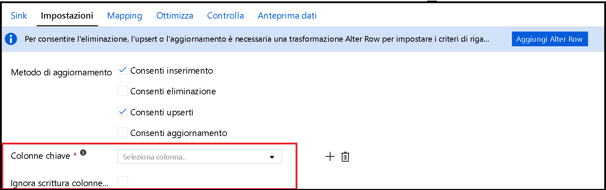

# <a name="copy-and-transform-data-in-azure-sql-database-by-using-azure-data-factory"></a>Copiare e trasformare i dati nel database SQL di Azure usando Azure Data Factory

> [!div class="op_single_selector" title1="Selezionare la versione di Azure Data Factory in uso:"]
>
> - [Versione 1](v1/data-factory-azure-sql-connector.md)
> - [Versione corrente](connector-azure-sql-database.md)

[!INCLUDE[appliesto-adf-asa-md](includes/appliesto-adf-asa-md.md)]

Questo articolo illustra come usare l'attività di copia in Azure Data Factory per copiare dati da e nel database SQL di Azure e usare il flusso di dati per trasformare i dati nel database SQL di Azure. Per altre informazioni su Azure Data Factory, vedere l'[articolo introduttivo](introduction.md).

## <a name="supported-capabilities"></a>Funzionalità supportate

Questo connettore del database SQL di Azure è supportato per le attività seguenti:

- [Attività di copia](copy-activity-overview.md) con la tabella della [matrice di origine/sink supportati](copy-activity-overview.md)
- [Flusso di dati per mapping](concepts-data-flow-overview.md)
- [Attività Lookup](control-flow-lookup-activity.md)
- [Attività GetMetadata](control-flow-get-metadata-activity.md)

Per l'attività di copia, questo connettore del database SQL di Azure supporta le funzioni seguenti:

- Copia dei dati usando l'autenticazione SQL e l'autenticazione del token dell'applicazione Azure Active Directory (Azure AD) con un'entità servizio o identità gestite per le risorse di Azure.
- Come origine, il recupero dei dati tramite una query SQL o un stored procedure. È anche possibile scegliere di eseguire la copia parallela da un'origine del database SQL di Azure. per informazioni dettagliate, vedere la sezione [copia parallela dal database SQL](#parallel-copy-from-sql-database) .
- Come sink, creazione automatica della tabella di destinazione se non esiste in base allo schema di origine. l'aggiunta di dati a una tabella o la chiamata di un stored procedure con la logica personalizzata durante la copia.

Se si usa il livello senza [Server](../azure-sql/database/serverless-tier-overview.md)del database SQL di Azure, tenere presente che quando il server è sospeso, l'esecuzione dell'attività non riesce invece di attendere che il riavvio automatico sia pronto. È possibile aggiungere attività aggiuntive o concatenare ulteriori attività per assicurarsi che il server sia attivo in base all'effettiva esecuzione.

>[!NOTE]
> Il [Always Encrypted](/sql/relational-databases/security/encryption/always-encrypted-database-engine) del database SQL di Azure non è attualmente supportato da questo connettore. Per aggirare il contenuto, è possibile usare un [connettore ODBC generico](connector-odbc.md) e un driver ODBC SQL Server tramite un runtime di integrazione self-hosted. Per altre informazioni, vedere l'articolo relativo all' [uso always Encrypted](#using-always-encrypted) . 

> [!IMPORTANT]
> Se si copiano dati tramite il runtime di integrazione di Azure, configurare una [regola del firewall a livello di server](../azure-sql/database/firewall-configure.md) in modo che i servizi di Azure possano accedere al server.
> Se si copiano i dati usando un runtime di integrazione self-hosted, configurare il firewall in modo da consentire l'intervallo di indirizzi IP appropriato. Questo intervallo include l'IP del computer usato per connettersi al database SQL di Azure.

## <a name="get-started"></a>Introduzione

[!INCLUDE [data-factory-v2-connector-get-started](../../includes/data-factory-v2-connector-get-started.md)]

Le sezioni seguenti riportano informazioni dettagliate sulle proprietà che vengono usate per definire Azure Data Factory entità specifiche di un connettore del database SQL di Azure.

## <a name="linked-service-properties"></a>Proprietà del servizio collegato

Per un servizio collegato al database SQL di Azure sono supportate queste proprietà:

| Proprietà | Descrizione | Obbligatoria |
|:--- |:--- |:--- |
| type | La proprietà **type** deve essere impostata su **AzureSqlDatabase**. | Sì |
| connectionString | Specificare le informazioni necessarie per connettersi all'istanza del database SQL di Azure per la proprietà **ConnectionString** . <br/>È anche possibile inserire una password o una chiave dell'entità servizio in Azure Key Vault. Se si tratta dell'autenticazione SQL, estrarre la `password` configurazione dalla stringa di connessione. Per ulteriori informazioni, vedere l'esempio JSON che segue la tabella e [archivia le credenziali in Azure Key Vault](store-credentials-in-key-vault.md). | Sì |
| servicePrincipalId | Specificare l'ID client dell'applicazione. | Sì, quando si usa l'autenticazione Azure AD con un'entità servizio |
| servicePrincipalKey | Specificare la chiave dell'applicazione. Contrassegnare questo campo come **SecureString** per archiviarlo in modo sicuro in Azure Data Factory o [fare riferimento a un segreto archiviato nel Azure Key Vault](store-credentials-in-key-vault.md). | Sì, quando si usa l'autenticazione Azure AD con un'entità servizio |
| tenant | Specificare le informazioni sul tenant, ad esempio il nome di dominio o l'ID tenant, in cui risiede l'applicazione. Recuperarlo passando il cursore del mouse sull'angolo superiore destro del portale di Azure. | Sì, quando si usa l'autenticazione Azure AD con un'entità servizio |
| azureCloudType | Per l'autenticazione dell'entità servizio, specificare il tipo di ambiente cloud di Azure in cui è registrata l'applicazione Azure AD. <br/> I valori consentiti sono **AzurePublic**, **AzureChina**, **AzureUsGovernment** e **AzureGermany**. Per impostazione predefinita, viene usato l'ambiente cloud del data factory. | No |
| connectVia | Questo [runtime di integrazione](concepts-integration-runtime.md) viene usato per connettersi all'archivio dati. È possibile usare Azure Integration Runtime o un runtime di integrazione self-hosted (se l'archivio dati si trova in una rete privata). Se non specificato, viene usato il runtime di integrazione di Azure predefinito. | No |

Per altri tipi di autenticazione, fare riferimento alle sezioni seguenti relative, rispettivamente, ai prerequisiti e agli esempi JSON:

- [Autenticazione SQL](#sql-authentication)
- [Autenticazione del token dell'applicazione Azure AD: entità servizio](#service-principal-authentication)
- [Autenticazione del token dell'applicazione Azure AD: identità gestite per le risorse di Azure](#managed-identity)

>[!TIP]
>Se viene raggiunto un errore con il codice di errore "UserErrorFailedToConnectToSqlServer" e un messaggio simile a "il limite della sessione per il database è XXX ed è stato raggiunto", aggiungere `Pooling=false` alla stringa di connessione e riprovare.

### <a name="sql-authentication"></a>Autenticazione SQL

**Esempio: uso dell'autenticazione SQL**

```json
{
    "name": "AzureSqlDbLinkedService",
    "properties": {
        "type": "AzureSqlDatabase",
        "typeProperties": {
            "connectionString": "Data Source=tcp:<servername>.database.windows.net,1433;Initial Catalog=<databasename>;User ID=<username>@<servername>;Password=<password>;Trusted_Connection=False;Encrypt=True;Connection Timeout=30"
        },
        "connectVia": {
            "referenceName": "<name of Integration Runtime>",
            "type": "IntegrationRuntimeReference"
        }
    }
}
```

**Esempio: password in Azure Key Vault**

```json
{
    "name": "AzureSqlDbLinkedService",
    "properties": {
        "type": "AzureSqlDatabase",
        "typeProperties": {
            "connectionString": "Data Source=tcp:<servername>.database.windows.net,1433;Initial Catalog=<databasename>;User ID=<username>@<servername>;Trusted_Connection=False;Encrypt=True;Connection Timeout=30",
            "password": {
                "type": "AzureKeyVaultSecret",
                "store": {
                    "referenceName": "<Azure Key Vault linked service name>",
                    "type": "LinkedServiceReference"
                },
                "secretName": "<secretName>"
            }
        },
        "connectVia": {
            "referenceName": "<name of Integration Runtime>",
            "type": "IntegrationRuntimeReference"
        }
    }
}
```

### <a name="service-principal-authentication"></a>Autenticazione di un'entità servizio

Per usare l'autenticazione token dell'applicazione di Azure AD basata sull'entità servizio, seguire questa procedura:

1. [Creare un'applicazione Azure Active Directory](../active-directory/develop/howto-create-service-principal-portal.md#register-an-application-with-azure-ad-and-create-a-service-principal) nel portale di Azure. Prendere nota del nome dell'applicazione e dei valori seguenti che definiscono il servizio collegato:

    - ID applicazione
    - Chiave applicazione
    - ID tenant

2. Eseguire il [provisioning di un amministratore Azure Active Directory](../azure-sql/database/authentication-aad-configure.md#provision-azure-ad-admin-sql-database) per il server nel portale di Azure, se non è già stato fatto. L'amministratore di Azure AD deve essere un utente o un gruppo di Azure AD, ma non può essere un'entità servizio. Questo passaggio viene eseguito in modo che, nel passaggio successivo, sia possibile usare un'identità di Azure AD per creare un utente di database indipendente per l'entità servizio.

3. [Creare utenti del database indipendente](../azure-sql/database/authentication-aad-configure.md#create-contained-users-mapped-to-azure-ad-identities) per l'entità servizio. Connettersi al database da o a cui si vogliono copiare i dati usando strumenti come SQL Server Management Studio, con un'identità Azure AD con almeno l'autorizzazione ALTER ANY USER. Eseguire il codice T-SQL seguente:
  
    ```sql
    CREATE USER [your application name] FROM EXTERNAL PROVIDER;
    ```

4. Concedere all'entità servizio le autorizzazioni necessarie, come si fa di norma per gli utenti SQL o altri utenti. Eseguire il codice seguente. Per altre opzioni, vedere [questo documento](/sql/relational-databases/system-stored-procedures/sp-addrolemember-transact-sql).

    ```sql
    ALTER ROLE [role name] ADD MEMBER [your application name];
    ```

5. Configurare un servizio collegato al database SQL di Azure in Azure Data Factory.

#### <a name="linked-service-example-that-uses-service-principal-authentication"></a>Esempio di servizio collegato tramite l'autenticazione basata su entità servizio

```json
{
    "name": "AzureSqlDbLinkedService",
    "properties": {
        "type": "AzureSqlDatabase",
        "typeProperties": {
            "connectionString": "Data Source=tcp:<servername>.database.windows.net,1433;Initial Catalog=<databasename>;Connection Timeout=30",
            "servicePrincipalId": "<service principal id>",
            "servicePrincipalKey": {
                "type": "SecureString",
                "value": "<service principal key>"
            },
            "tenant": "<tenant info, e.g. microsoft.onmicrosoft.com>"
        },
        "connectVia": {
            "referenceName": "<name of Integration Runtime>",
            "type": "IntegrationRuntimeReference"
        }
    }
}
```

### <a name="managed-identities-for-azure-resources-authentication"></a><a name="managed-identity"></a>Autenticazione di identità gestite per le risorse di Azure

Una data factory può essere associata a un'[identità gestita per le risorse di Azure](data-factory-service-identity.md), che rappresenta la data factory specifica. È possibile usare questa identità gestita per l'autenticazione del database SQL di Azure. La factory specificata può accedere e copiare i dati dal database o nel database usando questa identità.

Per utilizzare l'autenticazione di identità gestita, attenersi alla seguente procedura.

1. Eseguire il [provisioning di un amministratore Azure Active Directory](../azure-sql/database/authentication-aad-configure.md#provision-azure-ad-admin-sql-database) per il server nel portale di Azure, se non è già stato fatto. L'amministratore Azure AD può essere un utente Azure AD o un gruppo di Azure AD. Se si concede al gruppo con identità gestita un ruolo di amministratore, ignorare i passaggi 3 e 4. L'amministratore dispone di accesso completo al database.

2. [Creare utenti di database indipendente](../azure-sql/database/authentication-aad-configure.md#create-contained-users-mapped-to-azure-ad-identities) per l'identità gestita del Azure Data Factory. Connettersi al database da o a cui si vogliono copiare i dati usando strumenti come SQL Server Management Studio, con un'identità Azure AD con almeno l'autorizzazione ALTER ANY USER. Eseguire il codice T-SQL seguente:
  
    ```sql
    CREATE USER [your Data Factory name] FROM EXTERNAL PROVIDER;
    ```

3. Concedere le autorizzazioni necessarie per la Data Factory identità gestita come si fa normalmente per gli utenti SQL e altri. Eseguire il codice seguente. Per altre opzioni, vedere [questo documento](/sql/relational-databases/system-stored-procedures/sp-addrolemember-transact-sql).

    ```sql
    ALTER ROLE [role name] ADD MEMBER [your Data Factory name];
    ```

4. Configurare un servizio collegato al database SQL di Azure in Azure Data Factory.

**Esempio**

```json
{
    "name": "AzureSqlDbLinkedService",
    "properties": {
        "type": "AzureSqlDatabase",
        "typeProperties": {
            "connectionString": "Data Source=tcp:<servername>.database.windows.net,1433;Initial Catalog=<databasename>;Connection Timeout=30"
        },
        "connectVia": {
            "referenceName": "<name of Integration Runtime>",
            "type": "IntegrationRuntimeReference"
        }
    }
}
```

## <a name="dataset-properties"></a>Proprietà del set di dati

Per un elenco completo delle sezioni e delle proprietà disponibili per la definizione dei set di impostazioni, vedere [DataSets](./concepts-datasets-linked-services.md).

Per il set di dati del database SQL di Azure sono supportate le proprietà seguenti:

| Proprietà | Descrizione | Obbligatoria |
|:--- |:--- |:--- |
| type | La proprietà **Type** del set di dati deve essere impostata su **AzureSqlTable**. | Sì |
| schema | Nome dello schema. |No per l'origine, Sì per il sink  |
| tabella | Nome della tabella/vista. |No per l'origine, Sì per il sink  |
| tableName | Nome della tabella/vista con schema. Questa proprietà è supportata per garantire la compatibilità con le versioni precedenti. Per i nuovi carichi di lavoro, usare `schema` e `table`. | No per l'origine, Sì per il sink |

### <a name="dataset-properties-example"></a>Esempio di proprietà dei set di dati

```json
{
    "name": "AzureSQLDbDataset",
    "properties":
    {
        "type": "AzureSqlTable",
        "linkedServiceName": {
            "referenceName": "<Azure SQL Database linked service name>",
            "type": "LinkedServiceReference"
        },
        "schema": [ < physical schema, optional, retrievable during authoring > ],
        "typeProperties": {
            "schema": "<schema_name>",
            "table": "<table_name>"
        }
    }
}
```

## <a name="copy-activity-properties"></a>Proprietà dell'attività di copia

Per un elenco completo delle sezioni e delle proprietà disponibili per la definizione delle attività, vedere l'articolo sulle [pipeline](concepts-pipelines-activities.md). Questa sezione presenta un elenco delle proprietà supportate dall'origine e dal sink del database SQL di Azure.

### <a name="azure-sql-database-as-the-source"></a>Database SQL di Azure come origine

>[!TIP]
>Per caricare in modo efficiente i dati dal database SQL di Azure usando il partizionamento dei dati, vedere la [copia parallela dal database SQL](#parallel-copy-from-sql-database).

Per copiare dati dal database SQL di Azure, nella sezione **origine** dell'attività di copia sono supportate le proprietà seguenti:

| Proprietà | Descrizione | Obbligatoria |
|:--- |:--- |:--- |
| type | La proprietà **Type** dell'origine dell'attività di copia deve essere impostata su **AzureSqlSource**. Il tipo "sqlSource" è ancora supportato per la compatibilità con le versioni precedenti. | Sì |
| sqlReaderQuery | Questa proprietà usa la query SQL personalizzata per leggere i dati. Un esempio è `select * from MyTable`. | No |
| sqlReaderStoredProcedureName | Nome della stored procedure che legge i dati dalla tabella di origine. L'ultima istruzione SQL deve essere un'istruzione SELECT nella stored procedure. | No |
| storedProcedureParameters | Parametri per la stored procedure.<br/>I valori consentiti sono coppie nome-valore. I nomi e le maiuscole e minuscole dei parametri devono corrispondere ai nomi e alle maiuscole e minuscole dei parametri stored procedure. | No |
| isolationLevel | Specifica il comportamento di blocco della transazione per l'origine SQL. I valori consentiti sono: **ReadCommitted**, **READUNCOMMITTED**, **RepeatableRead**, **Serializable**, **snapshot**. Se non specificato, viene usato il livello di isolamento predefinito del database. Per altre informazioni dettagliate, vedere [questo documento](/dotnet/api/system.data.isolationlevel). | No |
| partitionOptions | Specifica le opzioni di partizionamento dei dati usate per caricare dati dal database SQL di Azure. <br>I valori consentiti sono: **None** (impostazione predefinita), **PhysicalPartitionsOfTable** e **DynamicRange**.<br>Quando è abilitata un'opzione di partizione (ovvero non `None` ), il grado di parallelismo per caricare simultaneamente i dati da un database SQL di Azure è controllato dall' [`parallelCopies`](copy-activity-performance-features.md#parallel-copy) impostazione dell'attività di copia. | No |
| partitionSettings | Specifica il gruppo di impostazioni per il partizionamento dei dati. <br>Applicare quando l'opzione partition non è `None` . | No |
| **_In `partitionSettings` :_* _ | | |
| partitionColumnName | Specificare il nome della colonna di origine _ *nel tipo Integer o date/DateTime** ( `int` , `smallint` , `bigint` , `date` , `smalldatetime` , `datetime` , `datetime2` o `datetimeoffset` ) che verrà utilizzato dal partizionamento dell'intervallo per la copia parallela. Se non è specificato, l'indice o la chiave primaria della tabella vengono rilevati automaticamente e utilizzati come colonna della partizione.<br>Si applica quando l'opzione di partizione è `DynamicRange`. Se si utilizza una query per recuperare i dati di origine, associare  `?AdfDynamicRangePartitionCondition ` la clausola WHERE. Per un esempio, vedere la sezione [copia parallela da database SQL](#parallel-copy-from-sql-database) . | No |
| partitionUpperBound | Valore massimo della colonna di partizione per la suddivisione dell'intervallo di partizioni. Questo valore viene usato per decidere lo stride della partizione, non per filtrare le righe nella tabella. Tutte le righe della tabella o del risultato della query verranno partizionate e copiate. Se non è specificato, l'attività di copia rileva automaticamente il valore.  <br>Si applica quando l'opzione di partizione è `DynamicRange`. Per un esempio, vedere la sezione [copia parallela da database SQL](#parallel-copy-from-sql-database) . | No |
| partitionLowerBound | Valore minimo della colonna di partizione per la suddivisione dell'intervallo di partizioni. Questo valore viene usato per decidere lo stride della partizione, non per filtrare le righe nella tabella. Tutte le righe della tabella o del risultato della query verranno partizionate e copiate. Se non è specificato, l'attività di copia rileva automaticamente il valore.<br>Si applica quando l'opzione di partizione è `DynamicRange`. Per un esempio, vedere la sezione [copia parallela da database SQL](#parallel-copy-from-sql-database) . | No |

**Punti da notare:**

- Se viene specificato **sqlReaderQuery** per **AzureSqlSource**, l'attività di copia esegue questa query nell'origine del database SQL di Azure per ottenere i dati. In alternativa, è possibile specificare una stored procedure indicando i parametri **sqlReaderStoredProcedureName** e **storedProcedureParameters**, se la stored procedure accetta parametri.
- Se non si specifica **sqlReaderQuery** o **sqlReaderStoredProcedureName**, le colonne definite nella sezione "Structure" del set di dati JSON vengono usate per creare una query. La query `select column1, column2 from mytable` viene eseguita nel database SQL di Azure. Se la definizione del set di dati non include "structure", vengono selezionate tutte le colonne della tabella.

#### <a name="sql-query-example"></a>Esempio di query SQL

```json
"activities":[
    {
        "name": "CopyFromAzureSQLDatabase",
        "type": "Copy",
        "inputs": [
            {
                "referenceName": "<Azure SQL Database input dataset name>",
                "type": "DatasetReference"
            }
        ],
        "outputs": [
            {
                "referenceName": "<output dataset name>",
                "type": "DatasetReference"
            }
        ],
        "typeProperties": {
            "source": {
                "type": "AzureSqlSource",
                "sqlReaderQuery": "SELECT * FROM MyTable"
            },
            "sink": {
                "type": "<sink type>"
            }
        }
    }
]
```

#### <a name="stored-procedure-example"></a>Esempio di stored procedure

```json
"activities":[
    {
        "name": "CopyFromAzureSQLDatabase",
        "type": "Copy",
        "inputs": [
            {
                "referenceName": "<Azure SQL Database input dataset name>",
                "type": "DatasetReference"
            }
        ],
        "outputs": [
            {
                "referenceName": "<output dataset name>",
                "type": "DatasetReference"
            }
        ],
        "typeProperties": {
            "source": {
                "type": "AzureSqlSource",
                "sqlReaderStoredProcedureName": "CopyTestSrcStoredProcedureWithParameters",
                "storedProcedureParameters": {
                    "stringData": { "value": "str3" },
                    "identifier": { "value": "$$Text.Format('{0:yyyy}', <datetime parameter>)", "type": "Int"}
                }
            },
            "sink": {
                "type": "<sink type>"
            }
        }
    }
]
```

### <a name="stored-procedure-definition"></a>Definizione della stored procedure

```sql
CREATE PROCEDURE CopyTestSrcStoredProcedureWithParameters
(
    @stringData varchar(20),
    @identifier int
)
AS
SET NOCOUNT ON;
BEGIN
     select *
     from dbo.UnitTestSrcTable
     where dbo.UnitTestSrcTable.stringData != stringData
    and dbo.UnitTestSrcTable.identifier != identifier
END
GO
```

### <a name="azure-sql-database-as-the-sink"></a>Database SQL di Azure come sink

> [!TIP]
> Scopri di più sui comportamenti di scrittura supportati, sulle configurazioni e sulle procedure consigliate, dalla [procedura consigliata per il caricamento dei dati nel database SQL di Azure](#best-practice-for-loading-data-into-azure-sql-database).

Per copiare i dati nel database SQL di Azure, nella sezione **sink** dell'attività di copia sono supportate le proprietà seguenti:

| Proprietà | Descrizione | Obbligatoria |
|:--- |:--- |:--- |
| type | La proprietà **Type** del sink dell'attività di copia deve essere impostata su **AzureSqlSink**. Il tipo "sqlsink" è ancora supportato per la compatibilità con le versioni precedenti. | Sì |
| preCopyScript | Specificare una query SQL per l'attività di copia da eseguire prima di scrivere i dati nel database SQL di Azure. Viene richiamata solo una volta per ogni esecuzione della copia. Usare questa proprietà per pulire i dati precaricati. | No |
| tableOption | Specifica se [creare automaticamente la tabella di sink](copy-activity-overview.md#auto-create-sink-tables) se non esiste in base allo schema di origine. <br>La creazione automatica della tabella non è supportata quando il sink specifica stored procedure. <br>I valori consentiti sono: `none` (impostazione predefinita), `autoCreate`. | No |
| sqlWriterStoredProcedureName | Il nome della stored procedure che definisce come applicare i dati di origine in una tabella di destinazione. <br/>Questa stored procedure viene *richiamata per batch*. Per le operazioni che vengono eseguite una sola volta e non hanno nulla a che fare con i dati di origine, ad esempio DELETE o TRUNCATE, usare la `preCopyScript` Proprietà.<br>Vedere l'esempio da [richiamare un stored procedure da un sink SQL](#invoke-a-stored-procedure-from-a-sql-sink). | No |
| storedProcedureTableTypeParameterName |Nome del parametro del tipo di tabella specificato nell'stored procedure.  |No |
| sqlWriterTableType |Nome del tipo di tabella da utilizzare nel stored procedure. Nel corso dell'attività di copia, i dati spostati vengono resi disponibili in una tabella temporanea di questo tipo. Il codice della stored procedure può quindi unire i dati di cui è in corso la copia con i dati esistenti. |No |
| storedProcedureParameters |Parametri per la stored procedure.<br/>I valori consentiti sono coppie nome-valore. I nomi e le maiuscole e minuscole dei parametri devono corrispondere ai nomi e alle maiuscole e minuscole dei parametri della stored procedure. | No |
| writeBatchSize | Numero di righe da inserire nella tabella SQL *per batch*.<br/> Il valore consentito è **integer** (numero di righe). Per impostazione predefinita, Azure Data Factory determina in modo dinamico le dimensioni del batch appropriate in base alle dimensioni della riga. | No |
| writeBatchTimeout | Tempo di attesa per il completamento dell'operazione di inserimento batch prima del timeout.<br/> Il valore consentito è **timespan**. Un esempio è "00:30:00" (30 minuti). | No |
| disableMetricsCollection | Data Factory raccoglie le metriche, ad esempio il database SQL di Azure DTU per l'ottimizzazione delle prestazioni di copia e le raccomandazioni. Se questo comportamento non è desiderato, specificare `true` per disattivarlo. | No (il valore predefinito è `false`) |

**Esempio 1: accodare i dati**

```json
"activities":[
    {
        "name": "CopyToAzureSQLDatabase",
        "type": "Copy",
        "inputs": [
            {
                "referenceName": "<input dataset name>",
                "type": "DatasetReference"
            }
        ],
        "outputs": [
            {
                "referenceName": "<Azure SQL Database output dataset name>",
                "type": "DatasetReference"
            }
        ],
        "typeProperties": {
            "source": {
                "type": "<source type>"
            },
            "sink": {
                "type": "AzureSqlSink",
                "tableOption": "autoCreate",
                "writeBatchSize": 100000
            }
        }
    }
]
```

**Esempio 2: richiamare un stored procedure durante la copia**

Per altre informazioni, vedere [Richiamare una stored procedure da un sink SQL](#invoke-a-stored-procedure-from-a-sql-sink).

```json
"activities":[
    {
        "name": "CopyToAzureSQLDatabase",
        "type": "Copy",
        "inputs": [
            {
                "referenceName": "<input dataset name>",
                "type": "DatasetReference"
            }
        ],
        "outputs": [
            {
                "referenceName": "<Azure SQL Database output dataset name>",
                "type": "DatasetReference"
            }
        ],
        "typeProperties": {
            "source": {
                "type": "<source type>"
            },
            "sink": {
                "type": "AzureSqlSink",
                "sqlWriterStoredProcedureName": "CopyTestStoredProcedureWithParameters",
                "storedProcedureTableTypeParameterName": "MyTable",
                "sqlWriterTableType": "MyTableType",
                "storedProcedureParameters": {
                    "identifier": { "value": "1", "type": "Int" },
                    "stringData": { "value": "str1" }
                }
            }
        }
    }
]
```

## <a name="parallel-copy-from-sql-database"></a>Copia parallela dal database SQL

Il connettore del database SQL di Azure nell'attività di copia fornisce il partizionamento dei dati predefinito per copiare i dati in parallelo. È possibile trovare le opzioni di partizionamento dei dati nella scheda **origine** dell'attività di copia.


Quando si Abilita la copia partizionata, l'attività di copia esegue query parallele sull'origine del database SQL di Azure per caricare i dati in base alle partizioni. Il grado di parallelismo è controllato dall'impostazione [`parallelCopies`](copy-activity-performance-features.md#parallel-copy) sull'attività di copia. Se, ad esempio, si imposta `parallelCopies` su quattro, data factory genera ed esegue contemporaneamente quattro query in base all'opzione di partizione specificata e alle impostazioni e ogni query recupera una porzione di dati dal database SQL di Azure.

Si consiglia di abilitare la copia parallela con il partizionamento dei dati, specialmente quando si caricano grandi quantità di dati dal database SQL di Azure. Di seguito sono riportate le configurazioni consigliate per i diversi scenari: Quando si copiano dati in un archivio dati basato su file, è consigliabile scrivere in una cartella come più file (specificare solo il nome della cartella), nel qual caso le prestazioni sono migliori rispetto alla scrittura in un singolo file.

| Scenario                                                     | Impostazioni consigliate                                           |
| ------------------------------------------------------------ | ------------------------------------------------------------ |
| Caricamento completo da tabelle di grandi dimensioni, con partizioni fisiche.        | **Opzione partition**: partizioni fisiche della tabella. <br><br/>Durante l'esecuzione, Data Factory rileva automaticamente le partizioni fisiche e copia i dati in base alle partizioni. <br><br/>Per verificare se la tabella contiene o meno una partizione fisica, è possibile fare riferimento a [questa query](#sample-query-to-check-physical-partition). |
| Caricamento completo da tabelle di grandi dimensioni, senza partizioni fisiche, con una colonna integer o DateTime per il partizionamento dei dati. | **Opzioni di partizione**: Partizione a intervalli dinamici.<br>**Colonna partizione** (facoltativo): specificare la colonna utilizzata per partizionare i dati. Se non è specificato, viene utilizzata la colonna di chiave primaria o di indice.<br/>Limite **superiore** della partizione e **limite inferiore della partizione** (facoltativo): specificare se si vuole determinare lo stride della partizione. Questa operazione non è relativa al filtraggio delle righe nella tabella. tutte le righe della tabella verranno partizionate e copiate. Se non è specificato, l'attività di copia rileva automaticamente i valori.<br><br>Se, ad esempio, la colonna di partizione "ID" ha valori compresi tra 1 e 100 e si imposta il limite inferiore su 20 e il limite superiore come 80, con la copia parallela 4, Data Factory recupera i dati di 4 partizioni-ID nell'intervallo <= 20, [21, 50], [51, 80] e >= 81 rispettivamente. |
| Caricare una grande quantità di dati tramite una query personalizzata, senza partizioni fisiche, con una colonna integer o date/DateTime per il partizionamento dei dati. | **Opzioni di partizione**: Partizione a intervalli dinamici.<br>**Query**: `SELECT * FROM <TableName> WHERE ?AdfDynamicRangePartitionCondition AND <your_additional_where_clause>`.<br>**Colonna di partizione**: Specificare la colonna usata per partizionare i dati.<br>Limite **superiore** della partizione e **limite inferiore della partizione** (facoltativo): specificare se si vuole determinare lo stride della partizione. Non per filtrare le righe nella tabella, tutte le righe nel risultato della query verranno partizionate e copiate. Se non è specificato, l'attività di copia rileva automaticamente il valore.<br><br>Durante l'esecuzione, Data Factory sostituisce `?AdfRangePartitionColumnName` con il nome della colonna e gli intervalli di valori effettivi per ogni partizione e li invia al database SQL di Azure. <br>Se, ad esempio, la colonna di partizione "ID" ha valori compresi tra 1 e 100 e si imposta il limite inferiore su 20 e il limite superiore come 80, con la copia parallela 4, Data Factory recupera i dati di 4 partizioni-ID nell'intervallo <= 20, [21, 50], [51, 80] e >= 81 rispettivamente. <br><br>Di seguito sono riportate altre query di esempio per scenari diversi:<br> 1. eseguire una query sull'intera tabella: <br>`SELECT * FROM <TableName> WHERE ?AdfDynamicRangePartitionCondition`<br> 2. eseguire una query da una tabella con la selezione delle colonne e i filtri aggiuntivi della clausola WHERE: <br>`SELECT <column_list> FROM <TableName> WHERE ?AdfDynamicRangePartitionCondition AND <your_additional_where_clause>`<br> 3. eseguire una query con sottoquery: <br>`SELECT <column_list> FROM (<your_sub_query>) AS T WHERE ?AdfDynamicRangePartitionCondition AND <your_additional_where_clause>`<br> 4. query con partizione in sottoquery: <br>`SELECT <column_list> FROM (SELECT <your_sub_query_column_list> FROM <TableName> WHERE ?AdfDynamicRangePartitionCondition) AS T`
|

Procedure consigliate per caricare i dati con l'opzione di partizione:

1. Scegliere una colonna distinta come colonna di partizione, ad esempio chiave primaria o chiave univoca, per evitare l'asimmetria dei dati. 
2. Se la tabella include una partizione predefinita, usare l'opzione di partizione "partizioni fisiche della tabella" per ottenere prestazioni migliori.    
3. Se si usa Azure Integration Runtime per copiare i dati, è possibile impostare "[Data Integration Unit (DIU)](copy-activity-performance-features.md#data-integration-units)" di dimensioni maggiori (>4) per usare più risorse di elaborazione. Controllare gli scenari applicabili.
4. "[Degree of copy parallelism](copy-activity-performance-features.md#parallel-copy)" controlla i numeri di partizione, impostando questo numero su un valore troppo grande a volte, è consigliabile impostare questo numero come (Diu o numero di nodi IR self-hosted) * (da 2 a 4).

**Esempio: caricamento completo da tabelle di grandi dimensioni con partizioni fisiche**

```json
"source": {
    "type": "AzureSqlSource",
    "partitionOption": "PhysicalPartitionsOfTable"
}
```

**Esempio: query con partizione a intervalli dinamici**

```json
"source": {
    "type": "AzureSqlSource",
    "query": "SELECT * FROM <TableName> WHERE ?AdfDynamicRangePartitionCondition AND <your_additional_where_clause>",
    "partitionOption": "DynamicRange",
    "partitionSettings": {
        "partitionColumnName": "<partition_column_name>",
        "partitionUpperBound": "<upper_value_of_partition_column (optional) to decide the partition stride, not as data filter>",
        "partitionLowerBound": "<lower_value_of_partition_column (optional) to decide the partition stride, not as data filter>"
    }
}
```

### <a name="sample-query-to-check-physical-partition"></a>Query di esempio per controllare la partizione fisica

```sql
SELECT DISTINCT s.name AS SchemaName, t.name AS TableName, pf.name AS PartitionFunctionName, c.name AS ColumnName, iif(pf.name is null, 'no', 'yes') AS HasPartition
FROM sys.tables AS t
LEFT JOIN sys.objects AS o ON t.object_id = o.object_id
LEFT JOIN sys.schemas AS s ON o.schema_id = s.schema_id
LEFT JOIN sys.indexes AS i ON t.object_id = i.object_id 
LEFT JOIN sys.index_columns AS ic ON ic.partition_ordinal > 0 AND ic.index_id = i.index_id AND ic.object_id = t.object_id 
LEFT JOIN sys.columns AS c ON c.object_id = ic.object_id AND c.column_id = ic.column_id 
LEFT JOIN sys.partition_schemes ps ON i.data_space_id = ps.data_space_id 
LEFT JOIN sys.partition_functions pf ON pf.function_id = ps.function_id 
WHERE s.name='[your schema]' AND t.name = '[your table name]'
```

Se la tabella contiene una partizione fisica, verrà visualizzato "HasPartition" come "Yes" come indicato di seguito.


## <a name="best-practice-for-loading-data-into-azure-sql-database"></a>Procedura consigliata per il caricamento dei dati nel database SQL di Azure

Quando si copiano dati nel database SQL di Azure, potrebbe essere necessario un comportamento di scrittura diverso:

- [Accoda](#append-data): i dati di origine hanno solo i nuovi record.
- [Upsert](#upsert-data): i dati di origine sono inserimenti e aggiornamenti.
- [Overwrite](#overwrite-the-entire-table): si desidera ricaricare ogni volta un'intera tabella delle dimensioni.
- [Scrivi con logica personalizzata](#write-data-with-custom-logic): ho bisogno di ulteriore elaborazione prima dell'inserimento finale nella tabella di destinazione.

Vedere le rispettive sezioni sulla configurazione di in Azure Data Factory e procedure consigliate.

### <a name="append-data"></a>Accodare dati

L'accodamento dei dati è il comportamento predefinito del connettore di sink del database SQL di Azure. Azure Data Factory esegue un inserimento bulk per scrivere in modo efficiente nella tabella. È possibile configurare l'origine e il sink di conseguenza nell'attività di copia.

### <a name="upsert-data"></a>Eseguire l'upsert dei dati

**Opzione 1:** Quando si dispone di una grande quantità di dati da copiare, è possibile eseguire il caricamento bulk di tutti i record in una tabella di staging usando l'attività di copia, quindi eseguire un'attività stored procedure per applicare un'istruzione [merge](/sql/t-sql/statements/merge-transact-sql) o Insert/Update in un'unica immagine. 

L'attività di copia attualmente non supporta in modo nativo il caricamento dei dati in una tabella temporanea di database. Esiste una modalità avanzata per configurarla con una combinazione di più attività. vedere ottimizzare gli [scenari di Upsert bulk del database SQL di Azure](https://github.com/scoriani/azuresqlbulkupsert). Di seguito viene illustrato un esempio di utilizzo di una tabella permanente come gestione temporanea.

In Azure Data Factory, ad esempio, è possibile creare una pipeline con un' **attività di copia** concatenata a un' **attività di stored procedure**. Il primo copia i dati dall'archivio di origine in una tabella di staging del database SQL di Azure, ad esempio **UpsertStagingTable**, come nome della tabella nel set di dati. Il secondo richiama quindi un stored procedure per unire i dati di origine dalla tabella di staging alla tabella di destinazione e pulire la tabella di staging.


Nel database definire un stored procedure con la logica di MERGE, come nell'esempio seguente, a cui fa riferimento l'attività stored procedure precedente. Si supponga che la destinazione sia la tabella **Marketing** con tre colonne: **profileid**, **stato** e **categoria**. Eseguire Upsert in base alla colonna **profileid** .

```sql
CREATE PROCEDURE [dbo].[spMergeData]
AS
BEGIN
   MERGE TargetTable AS target
   USING UpsertStagingTable AS source
   ON (target.[ProfileID] = source.[ProfileID])
   WHEN MATCHED THEN
      UPDATE SET State = source.State
    WHEN NOT matched THEN
       INSERT ([ProfileID], [State], [Category])
      VALUES (source.ProfileID, source.State, source.Category);
    TRUNCATE TABLE UpsertStagingTable
END
```

**Opzione 2:** È possibile scegliere di [richiamare un stored procedure all'interno dell'attività di copia](#invoke-a-stored-procedure-from-a-sql-sink). Questo approccio esegue ogni batch, come regolato dalla `writeBatchSize` proprietà, nella tabella di origine anziché utilizzare BULK INSERT come approccio predefinito nell'attività di copia.

**Opzione 3:** È possibile utilizzare il [flusso di dati di mapping](#sink-transformation) che offre metodi incorporati Insert/Upsert/Update.

### <a name="overwrite-the-entire-table"></a>Sovrascrivi l'intera tabella

È possibile configurare la proprietà **preCopyScript** nel sink dell'attività di copia. In questo caso, per ogni attività di copia eseguita, Azure Data Factory esegue prima lo script. Esegue quindi la copia per inserire i dati. Per sovrascrivere l'intera tabella con i dati più recenti, ad esempio, specificare uno script per eliminare prima tutti i record prima di eseguire il caricamento bulk dei nuovi dati dall'origine.

### <a name="write-data-with-custom-logic"></a>Scrivere dati con logica personalizzata

I passaggi per scrivere i dati con la logica personalizzata sono simili a quelli descritti nella sezione relativa ai [dati di Upsert](#upsert-data) . Quando è necessario applicare un'elaborazione aggiuntiva prima dell'inserimento finale dei dati di origine nella tabella di destinazione, è possibile caricare in una tabella di staging, quindi richiamare stored procedure attività o richiamare una stored procedure nel sink dell'attività di copia per applicare i dati oppure utilizzare il flusso di dati di mapping.

## <a name="invoke-a-stored-procedure-from-a-sql-sink"></a><a name="invoke-a-stored-procedure-from-a-sql-sink"></a> Richiamare una stored procedure da un sink SQL

Quando si copiano dati nel database SQL di Azure, è anche possibile configurare e richiamare un stored procedure specificato dall'utente con parametri aggiuntivi in ogni batch della tabella di origine. La funzionalità stored procedure sfrutta i [parametri con valori di tabella](/dotnet/framework/data/adonet/sql/table-valued-parameters).

È possibile usare una stored procedure quando non si possono usare i meccanismi di copia predefiniti. Un esempio è quando si desidera applicare un'ulteriore elaborazione prima dell'inserimento finale dei dati di origine nella tabella di destinazione. Alcuni esempi di elaborazione aggiuntivi sono quando si desidera unire le colonne, cercare valori aggiuntivi e inserirli in più di una tabella.

L'esempio seguente illustra come usare una stored procedure per eseguire un'operazione di upsert in una tabella del database SQL di Azure. Si supponga che i dati di input e la tabella di **Marketing** sink includano tre colonne: **profileid**, **state** e **Category**. Eseguire Upsert in base alla colonna **profileid** e applicarla solo a una categoria specifica denominata "producta".

1. Nel database definire il tipo di tabella con lo stesso nome di **sqlWriterTableType**. Lo schema del tipo di tabella è identico allo schema restituito dai dati di input.

    ```sql
    CREATE TYPE [dbo].[MarketingType] AS TABLE(
        [ProfileID] [varchar](256) NOT NULL,
        [State] [varchar](256) NOT NULL,
        [Category] [varchar](256) NOT NULL
    )
    ```

2. Nel database definire il stored procedure con lo stesso nome di **sqlWriterStoredProcedureName**. che gestisce i dati di input dell'origine specificata e li unisce nella tabella di output. Il nome del parametro del tipo di tabella nella stored procedure corrisponde a **TableName** definito nel set di dati.

    ```sql
    CREATE PROCEDURE spOverwriteMarketing @Marketing [dbo].[MarketingType] READONLY, @category varchar(256)
    AS
    BEGIN
    MERGE [dbo].[Marketing] AS target
    USING @Marketing AS source
    ON (target.ProfileID = source.ProfileID and target.Category = @category)
    WHEN MATCHED THEN
        UPDATE SET State = source.State
    WHEN NOT MATCHED THEN
        INSERT (ProfileID, State, Category)
        VALUES (source.ProfileID, source.State, source.Category);
    END
    ```

3. In Azure Data Factory definire la sezione del **sink SQL** nell'attività di copia come indicato di seguito:

    ```json
    "sink": {
        "type": "AzureSqlSink",
        "sqlWriterStoredProcedureName": "spOverwriteMarketing",
        "storedProcedureTableTypeParameterName": "Marketing",
        "sqlWriterTableType": "MarketingType",
        "storedProcedureParameters": {
            "category": {
                "value": "ProductA"
            }
        }
    }
    ```

## <a name="mapping-data-flow-properties"></a>Proprietà del flusso di dati per mapping

Quando si trasformano i dati nel flusso di dati di mapping, è possibile leggere e scrivere nelle tabelle del database SQL di Azure. Per altre informazioni, vedere la [trasformazione origine](data-flow-source.md) e la [trasformazione sink](data-flow-sink.md) nei flussi di dati per mapping.

### <a name="source-transformation"></a>Trasformazione origine

Le impostazioni specifiche del database SQL di Azure sono disponibili nella scheda **Opzioni di origine** della trasformazione origine.

**Input:** specificare se l'origine deve puntare a una tabella (equivalente di ```Select * from <table-name>```) oppure immettere una query SQL personalizzata.

**Query**: se si seleziona Query nel campo di input, immettere una query SQL per l'origine. Questa impostazione esegue l'override di qualsiasi tabella scelta nel set di dati. Le clausole **Order By** non sono supportate, ma è possibile impostare un'istruzione SELECT FROM completa. È possibile usare anche funzioni di tabella definite dall'utente. **select * from udfGetData()** è un UDF in SQL che restituisce una tabella. Questa query produrrà una tabella di origine che può essere usata nel flusso di dati. L'uso di query è anche un ottimo modo per ridurre le righe per i test o le ricerche.

- Esempio SQL: ```Select * from MyTable where customerId > 1000 and customerId < 2000```

**Dimensioni batch**: Immettere una dimensione batch per suddividere dati di grandi dimensioni in letture.

**Livello di isolamento**: Il valore predefinito per le origini SQL nel flusso di dati per mapping è Read Uncommitted. È possibile cambiare il livello di isolamento in uno dei valori seguenti:

- Read Committed
- Read Uncommitted
- Repeatable Read
- Serializable
- None (ignora il livello di isolamento)


### <a name="sink-transformation"></a>Trasformazione sink

Le impostazioni specifiche del database SQL di Azure sono disponibili nella scheda **Impostazioni** della trasformazione sink.

**Update method** (Metodo di aggiornamento): determina le operazioni consentite nella destinazione del database. Per impostazione predefinita, sono consentiti solo gli inserimenti. Per eseguire operazioni di aggiornamento, upsert o eliminazione di righe, è necessaria una trasformazione alter-row che applichi alle righe i tag corrispondenti alle azioni. Per le operazioni di aggiornamento, upsert ed eliminazione è necessario impostare una o più colonne chiave per determinare quale riga modificare.



Il nome della colonna scelto come chiave verrà usato da ADF come parte del successivo aggiornamento, Upsert, DELETE. Pertanto, è necessario selezionare una colonna esistente nel mapping del sink. Se non si desidera scrivere il valore in questa colonna chiave, fare clic su "Ignora scrittura colonne chiave".

È possibile parametrizzare la colonna chiave usata qui per aggiornare la tabella di database SQL di Azure di destinazione. Se sono presenti più colonne per una chiave composta, fare clic su "espressione personalizzata" e sarà possibile aggiungere contenuto dinamico usando il linguaggio dell'espressione del flusso di dati ADF, che può includere una matrice di stringhe con i nomi di colonna per una chiave composta.

**Table action** (Azione tabella): determina se ricreare o rimuovere tutte le righe dalla tabella di destinazione prima della scrittura.

- None (Nessuna): non verrà eseguita alcuna azione sulla tabella.
- Recreate table (Ricrea tabella): la tabella verrà eliminata e ricreata. Questa opzione è obbligatoria se si crea una nuova tabella in modo dinamico.
- Truncate table (Tronca tabella): verranno rimosse tutte le righe della tabella di destinazione.

**Dimensioni batch**: controlla il numero di righe scritte in ogni bucket. Dimensioni batch più grandi migliorano l'ottimizzazione della compressione e della memoria, ma rischiano di causare eccezioni di memoria insufficiente durante la memorizzazione nella cache dei dati.

**USA tempdb:** Per impostazione predefinita, Data Factory utilizzerà una tabella temporanea globale per archiviare i dati come parte del processo di caricamento. In alternativa, è possibile deselezionare l'opzione "USA TempDB" e invece chiedere Data Factory di archiviare la tabella temporanea in un database utente che si trova nel database usato per il sink.


**Pre and Post SQL scripts** (Pre-script e post-script SQL): immettere script SQL a più righe che verranno eseguiti prima (pre-elaborazione) e dopo (post-elaborazione) la scrittura dei dati nel database sink.


### <a name="error-row-handling"></a>Gestione delle righe con errori

Quando si scrive nel database SQL di Azure, alcune righe di dati possono avere esito negativo a causa dei vincoli impostati dalla destinazione. Alcuni errori comuni includono:

*    I dati stringa o binari verrebbero troncati nella tabella
*    Impossibile inserire il valore NULL nella colonna
*    L'istruzione INSERT è in conflitto con il vincolo CHECK

Per impostazione predefinita, l'esecuzione di un flusso di dati avrà esito negativo al primo errore ottenuto. È possibile scegliere di **continuare in** caso di errore che consente il completamento del flusso di dati anche se si verificano errori nelle singole righe. Azure Data Factory offre diverse opzioni per la gestione di queste righe di errore.

**Commit transazione:** Scegliere se i dati vengono scritti in una singola transazione o in batch. Una singola transazione fornirà prestazioni peggiori, ma i dati scritti non saranno visibili ad altri fino al completamento della transazione.  

**Dati rifiutati di output:** Se abilitata, è possibile restituire le righe di errore in un file CSV in archiviazione BLOB di Azure o in un account Azure Data Lake Storage Gen2 a scelta. In questo modo, le righe di errore vengono scritte con tre colonne aggiuntive: l'operazione SQL, ad esempio INSERT o UPDATE, il codice di errore del flusso di dati e il messaggio di errore nella riga.

**Segnala esito positivo in seguito a errore:** Se abilitata, il flusso di dati verrà contrassegnato come esito positivo anche se vengono rilevate righe di errore. 


## <a name="data-type-mapping-for-azure-sql-database"></a>Mapping dei tipi di dati per il database SQL di Azure

Quando i dati vengono copiati da o nel database SQL di Azure, i mapping seguenti vengono usati dai tipi di dati del database SQL di Azure per Azure Data Factory tipi di dati provvisori. Vedere [Mapping dello schema e del tipo di dati](copy-activity-schema-and-type-mapping.md) per informazioni su come l'attività di copia esegue il mapping dello schema di origine e del tipo di dati al sink.

| Tipi di dati del database SQL di Azure | Tipo di dati provvisorio di Azure Data Factory |
|:--- |:--- |
| bigint |Int64 |
| BINARY |Byte[] |
| bit |Boolean |
| char |String, Char[] |
| Data |Datetime |
| Datetime |Datetime |
| datetime2 |Datetime |
| Datetimeoffset |DateTimeOffset |
| Decimal |Decimal |
| FILESTREAM attribute (varbinary(max)) |Byte[] |
| Float |Double |
| image |Byte[] |
| INT |Int32 |
| money |Decimal |
| NCHAR |String, Char[] |
| ntext |String, Char[] |
| NUMERIC |Decimal |
| NVARCHAR |String, Char[] |
| real |Single |
| rowversion |Byte[] |
| smalldatetime |Datetime |
| SMALLINT |Int16 |
| SMALLMONEY |Decimal |
| sql_variant |Oggetto |
| text |String, Char[] |
| time |TimeSpan |
| timestamp |Byte[] |
| TINYINT |Byte |
| UNIQUEIDENTIFIER |Guid |
| varbinary |Byte[] |
| varchar |String, Char[] |
| xml |string |

>[!NOTE]
> Per i tipi di dati che vengono mappati al tipo provvisorio decimale, attualmente l'attività di copia supporta la precisione fino a 28. Se i dati hanno una precisione maggiore di 28, provare a eseguire la conversione in una stringa nella query SQL.

## <a name="lookup-activity-properties"></a>Proprietà dell'attività Lookup

Per altre informazioni sulle proprietà, vedere [Attività Lookup](control-flow-lookup-activity.md).

## <a name="getmetadata-activity-properties"></a>Proprietà dell'attività GetMetadata

Per altre informazioni sulle proprietà, vedere [Attività GetMetadata](control-flow-get-metadata-activity.md)

## <a name="using-always-encrypted"></a>Uso di Always Encrypted

Quando si copiano dati da/in un database SQL di Azure con [Always Encrypted](/sql/relational-databases/security/encryption/always-encrypted-database-engine), usare il [connettore odbc generico](connector-odbc.md) e SQL Server driver ODBC tramite Integration Runtime self-hosted. Il connettore del database SQL di Azure attualmente non supporta Always Encrypted. 

Più in particolare:

1. Configurare un Integration Runtime self-hosted se non è disponibile. Per informazioni dettagliate, vedere l'articolo relativo alla [Integration Runtime self-hosted](create-self-hosted-integration-runtime.md) .

2. Scaricare il driver ODBC a 64 bit per SQL Server da [qui](/sql/connect/odbc/download-odbc-driver-for-sql-server)e installarlo nel computer Integration Runtime. Per ulteriori informazioni sul funzionamento di questo driver, [utilizzare always Encrypted con ODBC driver for SQL Server](/sql/connect/odbc/using-always-encrypted-with-the-odbc-driver#using-the-azure-key-vault-provider).

3. Creare un servizio collegato con tipo ODBC per connettersi al database SQL, fare riferimento agli esempi seguenti:

    - Per utilizzare **l'autenticazione SQL**: specificare la stringa di connessione ODBC come indicato di seguito e selezionare autenticazione di **base** per impostare il nome utente e la password.

        ```
        Driver={ODBC Driver 17 for SQL Server};Server=<serverName>;Database=<databaseName>;ColumnEncryption=Enabled;KeyStoreAuthentication=KeyVaultClientSecret;KeyStorePrincipalId=<servicePrincipalKey>;KeyStoreSecret=<servicePrincipalKey>
        ```

    - Per usare **l'autenticazione Data Factory identità gestita**: 

        1. Seguire gli stessi [prerequisiti](#managed-identity) per creare l'utente del database per l'identità gestita e concedere il ruolo appropriato nel database.
        2. In servizio collegato specificare la stringa di connessione ODBC come indicato di seguito e selezionare autenticazione **anonima** come indicato nella stringa di connessione stessa `Authentication=ActiveDirectoryMsi` .

        ```
        Driver={ODBC Driver 17 for SQL Server};Server=<serverName>;Database=<databaseName>;ColumnEncryption=Enabled;KeyStoreAuthentication=KeyVaultClientSecret;KeyStorePrincipalId=<servicePrincipalKey>;KeyStoreSecret=<servicePrincipalKey>; Authentication=ActiveDirectoryMsi;
        ```

4. Creare il set di dati e l'attività di copia con il tipo ODBC di conseguenza. Per altre informazioni, vedere [connettore ODBC](connector-odbc.md) .

## <a name="next-steps"></a>Passaggi successivi

Per un elenco di archivi dati supportati come origini e sink dall'attività di copia in Azure Data Factory, vedere [archivi dati e formati supportati](copy-activity-overview.md#supported-data-stores-and-formats).