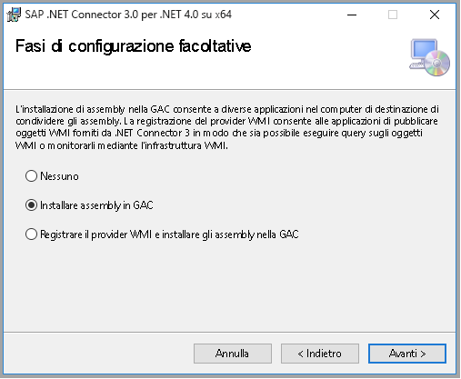

# <a name="copy-data-from-sap-business-warehouse-via-open-hub-using-azure-data-factory"></a>Copiare dati da SAP Business Warehouse tramite Open Hub usando Azure Data Factory

Questo articolo illustra come usare l'attività di copia in Azure Data Factory per copiare dati da SAP Business Warehouse (BW) tramite Open Hub. Si basa sull'articolo di [panoramica dell'attività di copia](copy-activity-overview.md) che presenta una panoramica generale sull'attività di copia.

## <a name="supported-capabilities"></a>Funzionalità supportate

È possibile copiare dati da SAP Business Warehouse tramite Open Hub in qualsiasi archivio dati sink supportato. Per un elenco degli archivi dati supportati come origini/sink dall'attività di copia, vedere la tabella relativa agli [archivi dati supportati](copy-activity-overview.md#supported-data-stores-and-formats).

In particolare, il connettore SAP Business Warehouse Open Hub supporta:

- SAP Business Warehouse **7.01 o versioni successive (in un recente SAP supporto pacchetto Stack rilasciato dopo il 2015)** .
- Copia dei dati tramite tabella locale Open Hub Destination che può essere DSO, InfoCube, MultiProvider, DataSource e così via.
- La copia di dati usando l'autenticazione di base.
- Connessione al server applicazioni.

## <a name="sap-bw-open-hub-integration"></a>Integrazione SAP BW Open Hub 

Il [servizio SAP BW Open Hub](https://wiki.scn.sap.com/wiki/display/BI/Overview+of+Open+Hub+Service) consente di estrarre in modo efficiente dati da SAP BW. Il diagramma seguente mostra uno dei flussi tipici che i clienti possono osservare nel proprio sistema SAP, con flusso di dati da SAP ECC -> PSA -> DSO -> Cubo.

SAP BW Open Hub Destination (OHD) definisce la destinazione di inoltro dei dati SAP. Qualsiasi oggetto supportato da SAP dati Trasferisci processo (DTP) possa essere utilizzati come origini di dati hub aperto, ad esempio DSO InfoCube, origine dati, e così via. Il tipo di Open Hub Destination, ovvero la posizione in cui vengono archiviati i dati inoltrati, può essere costituito da tabelle di database (locali o remote) e da file flat. Questo connettore SAP BW Open Hub supporta la copia dei dati dalla tabella locale OHD in BW. Se si usano altri tipi, è possibile connettersi direttamente al database o al file system usando altri connettori.


## <a name="delta-extraction-flow"></a>Flusso di estrazione delta

Il connettore Hub aperto di Azure Data factory SAP BW offre due proprietà facoltative: `excludeLastRequest` e `baseRequestId` che può essere usato per gestire il carico differenziali dall'Hub aperto. 

- **excludeLastRequestId**: Se escludere i record dell'ultima richiesta. Valore predefinito è true. 
- **baseRequestId**: L'ID della richiesta per il caricamento differenziale. Una volta che viene impostata, verranno recuperati solo i dati con requestId maggiore del valore di questa proprietà. 

In generale, l'estrazione dal InfoProviders SAP per Azure Data Factory (ADF) è costituito da 2 passaggi: 

1. **SAP BW dati Trasferisci processo (DTP)** questo passaggio copia i dati da un InfoProvider di SAP BW in una tabella di Hub aperto di SAP BW 

1. **Copia dei dati di Azure Data factory** In questo passaggio, la tabella di Hub aperto viene letto dal connettore Azure Data factory 


Nel primo passaggio, viene eseguito un DTP. Ogni esecuzione crea un nuovo ID richiesta SAP. L'ID richiesta viene archiviato nella tabella di Hub aperto e viene quindi usato dal connettore Azure Data factory per identificare il delta. I due passaggi eseguiti in modo asincrono: il DTP viene attivato da SAP e la copia dei dati di Azure Data factory viene attivata tramite Azure Data factory. 

Per impostazione predefinita, Azure Data factory non leggendo il delta più recente dalla tabella di Hub aperto (opzione "exclude ultima richiesta" è true). Con il presente documento, i dati in Azure Data factory non sono aggiornata con i dati nella tabella di Hub aperto (il valore delta ultimo manca) al 100%. In cambio, questa procedura garantisce che nessuna riga perdersi causato dall'estrazione asincrona. Tutto funziona correttamente anche se Azure Data factory sta leggendo la tabella di Hub aperto mentre il DTP esegue ancora la scrittura nella stessa tabella. 

In genere archiviano l'ID richiesta copiato max nell'ultima esecuzione da Azure Data factory in un archivio dati di staging (ad esempio Blob di Azure in precedenza diagramma). Pertanto, la stessa richiesta non viene letto una seconda volta da Azure Data Factory nell'esecuzione della successiva. Nel frattempo, i dati non viene eliminato automaticamente dalla tabella di Hub aperto.

Delta appropriate gestirla, non è consentito in modo che gli ID da DTPs diversi di richiesta nella stessa tabella di Hub aperto. Pertanto, è necessario non creare più DTP per ogni destinazione di Hub aperto (OHD). Quando è necessaria un'estrazione completa e differenziale da InfoProvider la stessa, è necessario creare due OHDs per la stessa InfoProvider. 

## <a name="prerequisites"></a>Prerequisiti

Per usare il connettore SAP Business Warehouse Open Hub, è necessario:

- Configurare un runtime di integrazione self-hosted con la versione 3.13 o successive. Per i dettagli, vedere l'articolo [Runtime di integrazione self-hosted](create-self-hosted-integration-runtime.md).

- Scaricare il **[connettore SAP .NET 3.0](https://support.sap.com/en/product/connectors/msnet.html) a 64 bit** dal sito Web di SAP e installarlo nel computer di runtime di integrazione self-hosted. Durante l'installazione, nella finestra della procedura di configurazione facoltativa verificare che sia selezionata l'opzione **Install Assemblies to GAC** (Installa assembly nella Global Assembly Cache) come illustrato nell'immagine seguente. 

    

- L'utente SAP nel connettore BW di Data Factory deve disporre delle autorizzazioni seguenti: 

    - Autorizzazione per RFC e SAP BW. 
    - Autorizzazioni per l'attività "Execute" dell'oggetto di autorizzazione "S_SDSAUTH".

- Creare il tipo SAP Open Hub Destination come **Database Table** (Tabella di database) con l'opzione "Technical Key" (Chiave tecnica) selezionata.  È inoltre consigliabile lasciare deselezionata l'opzione di eliminazione dei dati dalla tabella, anche se questa impostazione non è obbligatoria. Sfruttare DTP (esecuzione diretta o integrazione nella catena di processo esistente) per il trasferimento dei dati dall'oggetto di origine scelto (ad esempio il cubo) nella tabella di destinazione dell'hub aperto.

## <a name="getting-started"></a>Introduzione

> [!TIP]
>
> Per una procedura dettagliata dell'utilizzo di connettore di Hub aperto di SAP BW, vedere [caricare dati da SAP Business Warehouse (BW) usando Azure Data Factory](load-sap-bw-data.md).

[!INCLUDE [data-factory-v2-connector-get-started](../../includes/data-factory-v2-connector-get-started.md)]

Le sezioni seguenti riportano informazioni dettagliate sulle proprietà che vengono usate per definire entità di Data Factory specifiche per il connettore SAP Business Warehouse Open Hub.

## <a name="linked-service-properties"></a>Proprietà del servizio collegato

Per il servizio collegato di SAP Business Warehouse Open Hub sono supportate le proprietà seguenti:

| Proprietà | Descrizione | Obbligatoria |
|:--- |:--- |:--- |
| type | La proprietà type deve essere impostata su: **SapOpenHub** | Sì |
| server | Nome del server in cui si trova l'istanza di SAP BW. | Sì |
| systemNumber | Numero del sistema SAP BW.<br/>Valore consentito: numero decimale a due cifre rappresentato come stringa. | Sì |
| clientId | ID del client nel sistema SAP BW.<br/>Valore consentito: numero decimale a tre cifre rappresentato come stringa. | Sì |
| language | Lingua usata dal sistema SAP. | No (valore predefinito: **EN**)|
| userName | Nome dell'utente che ha accesso al server SAP. | Sì |
| password | Password per l'utente. Contrassegnare questo campo come SecureString per archiviarlo in modo sicuro in Azure Data Factory oppure [fare riferimento a un segreto archiviato in Azure Key Vault](store-credentials-in-key-vault.md). | Sì |
| connectVia | Il [runtime di integrazione](concepts-integration-runtime.md) da usare per la connessione all'archivio dati. È necessario un runtime di integrazione self-hosted come indicato in [Prerequisiti](#prerequisites). |Sì |

**Esempio:**

```json
{
    "name": "SapBwOpenHubLinkedService",
    "properties": {
        "type": "SapOpenHub",
        "typeProperties": {
            "server": "<server name>",
            "systemNumber": "<system number>",
            "clientId": "<client id>",
            "userName": "<SAP user>",
            "password": {
                "type": "SecureString",
                "value": "<Password for SAP user>"
            }
        },
        "connectVia": {
            "referenceName": "<name of Integration Runtime>",
            "type": "IntegrationRuntimeReference"
        }
    }
}
```

## <a name="dataset-properties"></a>Proprietà del set di dati

Per un elenco completo delle sezioni e delle proprietà disponibili per la definizione dei set di dati, vedere l'articolo [Set di dati](concepts-datasets-linked-services.md). Questa sezione presenta un elenco delle proprietà supportate dal set di dati SAP BW Open Hub.

Per copiare dati da e in SAP BW Open Hub, impostare la proprietà type del set di dati su **SapOpenHubTable**. Sono supportate le proprietà seguenti.

| Proprietà | Descrizione | Obbligatoria |
|:--- |:--- |:--- |
| type | La proprietà type deve essere impostata su **SapOpenHubTable**.  | Sì |
| openHubDestinationName | Il nome di Open Hub Destination da cui copiare i dati. | Sì |
| excludeLastRequest | Se escludere i record dell'ultima richiesta. | No (il valore predefinito è **true**) |
| baseRequestId | L'ID della richiesta per il caricamento differenziale. Una volta impostata questa proprietà, verranno recuperati solo i dati con requestId **maggiore** del valore di questa proprietà.  | No |

>[!TIP]
>Se ad esempio la tabella Open Hub contiene solo dati generati in base a ID di richiesta singola, si esegue sempre il caricamento completo e si sovrascrivono i dati esistenti nella tabella oppure si esegue DTP una sola volta per il test, ricordarsi di deselezionare l'opzione "excludeLastRequest" per la copia dei dati.

**Esempio:**

```json
{
    "name": "SAPBWOpenHubDataset",
    "properties": {
        "type": "SapOpenHubTable",
        "linkedServiceName": {
            "referenceName": "<SAP BW Open Hub linked service name>",
            "type": "LinkedServiceReference"
        },
        "typeProperties": {
            "openHubDestinationName": "<open hub destination name>"
        }
    }
}
```

## <a name="copy-activity-properties"></a>Proprietà dell'attività di copia

Per un elenco completo delle sezioni e delle proprietà disponibili per la definizione delle attività, vedere l'articolo sulle [pipeline](concepts-pipelines-activities.md). Questa sezione presenta un elenco delle proprietà supportate dall'origine SAP BW Open Hub.

### <a name="sap-bw-open-hub-as-source"></a>SAP BW Open Hub come origine

Per copiare dati da SAP BW Open Hub, impostare il tipo di origine nell'attività di copia su **SapOpenHubSource**. Non esistono proprietà aggiuntive specifiche del tipo necessaria nell'attività di copia **origine** sezione.

**Esempio:**

```json
"activities":[
    {
        "name": "CopyFromSAPBWOpenHub",
        "type": "Copy",
        "inputs": [
            {
                "referenceName": "<SAP BW Open Hub input dataset name>",
                "type": "DatasetReference"
            }
        ],
        "outputs": [
            {
                "referenceName": "<output dataset name>",
                "type": "DatasetReference"
            }
        ],
        "typeProperties": {
            "source": {
                "type": "SapOpenHubSource"
            },
            "sink": {
                "type": "<sink type>"
            }
        }
    }
]
```

## <a name="data-type-mapping-for-sap-bw-open-hub"></a>Mapping dei tipi di dati per SAP BW Open Hub

Quando si copiano dati da SAP BW Open Hub, vengono usati i mapping seguenti tra i tipi di dati di SAP BW e i tipi di dati provvisori di Azure Data Factory. Vedere [Mapping dello schema e del tipo di dati](copy-activity-schema-and-type-mapping.md) per informazioni su come l'attività di copia esegue il mapping dello schema di origine e del tipo di dati al sink.

| Tipo SAP ABAP | Tipo di dati provvisori di Data Factory |
|:--- |:--- |
| C (String) | String |
| I (integer) | Int32 |
| F (Float) | Double |
| D (Date) | String |
| T (Time) | String |
| P (BCD Packed, Currency, Decimal, Qty) | Decimal |
| N (Numc) | String |
| X (Binary e Raw) | String |

## <a name="next-steps"></a>Passaggi successivi
Per un elenco degli archivi dati supportati come origini o sink dall'attività di copia in Azure Data Factory, vedere gli [archivi dati supportati](copy-activity-overview.md#supported-data-stores-and-formats).
