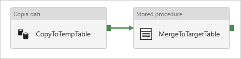

# <a name="copy-data-to-and-from-sql-server-using-azure-data-factory"></a>Copiare dati da e in SQL Server usando Azure Data Factory
> [!div class="op_single_selector" title1="Selezionare la versione del servizio Data Factory in uso:"]
> * [Versione 1](v1/data-factory-sqlserver-connector.md)
> * [Versione corrente](connector-sql-server.md)

Questo articolo illustra come usare l'attività di copia in Azure Data Factory per copiare dati da e in un database SQL Server. Si basa sull'articolo di [panoramica dell'attività di copia](copy-activity-overview.md) che presenta una panoramica generale sull'attività di copia.

## <a name="supported-capabilities"></a>Funzionalità supportate

È possibile copiare dati da un database SQL Server in qualsiasi archivio dati di sink supportato oppure copiare dati da qualsiasi archivio dati di origine supportato in un database SQL Server. Per un elenco degli archivi dati supportati come origini/sink dall'attività di copia, vedere la tabella relativa agli [archivi dati supportati](copy-activity-overview.md#supported-data-stores-and-formats).

In particolare, il connettore SQL Server supporta:

- SQL Server versione 2016, 2014, 2012, 2008 R2, 2008 e 2005
- La copia dei dati usando l'autenticazione **SQL** o **Windows**.
- Come origine, il recupero di dati tramite query SQL o stored procedure.
- Come sink, l'aggiunta di dati alla tabella di destinazione o la chiamata a una stored procedure con logica personalizzata durante la copia.

>[!NOTE]
>SQL Server **[Always Encrypted](https://docs.microsoft.com/sql/relational-databases/security/encryption/always-encrypted-database-engine?view=sql-server-2017)** non è supportato da questo connettore ora. Soluzione alternativa, è possibile usare [connettore ODBC generico](connector-odbc.md) e il driver ODBC di SQL Server. Seguire [questo materiale sussidiario](https://docs.microsoft.com/sql/connect/odbc/using-always-encrypted-with-the-odbc-driver?view=sql-server-2017) con configurazioni stringa download e connessione ODBC driver.

## <a name="prerequisites"></a>Prerequisiti

Per usare la copia di dati da un database SQL Server non accessibile pubblicamente, è necessario configurare un runtime di integrazione self-hosted. Per i dettagli, vedere l'articolo [Runtime di integrazione self-hosted](create-self-hosted-integration-runtime.md). Il runtime di integrazione offre un driver per database SQL Server integrato e non è quindi necessario installare manualmente alcun driver quando si copiano dati da/in un database SQL Server.

## <a name="getting-started"></a>Introduzione

[!INCLUDE [data-factory-v2-connector-get-started](../../includes/data-factory-v2-connector-get-started.md)]

Le sezioni seguenti riportano informazioni dettagliate sulle proprietà usate per definire entità di Data Factory specifiche per un connettore di database SQL Server.

## <a name="linked-service-properties"></a>Proprietà del servizio collegato

Per il servizio collegato di SQL Server sono supportate le proprietà seguenti:

| Proprietà | Descrizione | Obbligatoria |
|:--- |:--- |:--- |
| type | La proprietà type deve essere impostata su: **SqlServer** | Sì |
| connectionString |Specificare le informazioni di connectionString necessarie per connettersi al database SQL Server usando l'autenticazione di SQL o Windows. Vedere gli esempi seguenti.<br/>Contrassegnare questo campo come SecureString per archiviare la chiave in modo sicuro in Data Factory. È anche possibile inserire la password in Azure Key Vault e, se si tratta dell'autenticazione SQL, eseguire il pull della configurazione `password` dalla stringa di connessione. Vedere l'esempio JSON sotto la tabella e l'articolo [Store credentials in Azure Key Vault](store-credentials-in-key-vault.md) (Archiviare le credenziali in Azure Key Vault) per altri dettagli. |Sì |
| userName |Specificare il nome utente se si usa l'autenticazione Windows. Esempio: **nomedominio\\nomeutente**. |No |
| password |Specificare la password per l'account utente specificato per userName. Contrassegnare questo campo come SecureString per archiviarlo in modo sicuro in Azure Data Factory oppure [fare riferimento a un segreto archiviato in Azure Key Vault](store-credentials-in-key-vault.md). |No |
| connectVia | Il [runtime di integrazione](concepts-integration-runtime.md) da usare per la connessione all'archivio dati. È possibile usare il runtime di integrazione self-hosted o il runtime di integrazione di Azure (se l'archivio dati è accessibile pubblicamente). Se non specificato, viene usato il runtime di integrazione di Azure predefinito. |No |

>[!TIP]
>Se viene restituito l'errore con codice "UserErrorFailedToConnectToSqlServer" e un messaggio quale "Il limite di sessioni per il database è XXX ed è stato raggiunto.", aggiungere `Pooling=false` alla stringa di connessione e riprovare.

**Esempio 1: uso dell'autenticazione di SQL**

```json
{
    "name": "SqlServerLinkedService",
    "properties": {
        "type": "SqlServer",
        "typeProperties": {
            "connectionString": {
                "type": "SecureString",
                "value": "Data Source=<servername>\\<instance name if using named instance>;Initial Catalog=<databasename>;Integrated Security=False;User ID=<username>;Password=<password>;"
            }
        },
        "connectVia": {
            "referenceName": "<name of Integration Runtime>",
            "type": "IntegrationRuntimeReference"
        }
    }
}
```

**Esempio 2: uso dell'autenticazione di SQL con la password in Azure Key Vault**

```json
{
    "name": "SqlServerLinkedService",
    "properties": {
        "type": "SqlServer",
        "typeProperties": {
            "connectionString": {
                "type": "SecureString",
                "value": "Data Source=<servername>\\<instance name if using named instance>;Initial Catalog=<databasename>;Integrated Security=False;User ID=<username>;"
            },
            "password": { 
                "type": "AzureKeyVaultSecret", 
                "store": { 
                    "referenceName": "<Azure Key Vault linked service name>", 
                    "type": "LinkedServiceReference" 
                }, 
                "secretName": "<secretName>" 
            }
        },
        "connectVia": {
            "referenceName": "<name of Integration Runtime>",
            "type": "IntegrationRuntimeReference"
        }
    }
}
```

**Esempio 3: uso dell'autenticazione di Windows**

```json
{
    "name": "SqlServerLinkedService",
    "properties": {
        "type": "SqlServer",
        "typeProperties": {
            "connectionString": {
                "type": "SecureString",
                "value": "Data Source=<servername>\\<instance name if using named instance>;Initial Catalog=<databasename>;Integrated Security=True;"
            },
            "userName": "<domain\\username>",
            "password": {
                "type": "SecureString",
                "value": "<password>"
            }
        },
        "connectVia": {
            "referenceName": "<name of Integration Runtime>",
            "type": "IntegrationRuntimeReference"
        }
     }
}
```

## <a name="dataset-properties"></a>Proprietà del set di dati

Per un elenco completo delle sezioni e delle proprietà disponibili per la definizione di set di dati, vedere l'articolo sui set di dati. Questa sezione presenta un elenco delle proprietà supportate dal set di dati SQL Server.

Per copiare dati da e verso database SQL Server, sono supportate le proprietà seguenti:

| Proprietà | Descrizione | Obbligatoria |
|:--- |:--- |:--- |
| type | La proprietà type del set di dati deve essere impostata su: **SqlServerTable** | Sì |
| tableName |Nome della tabella o vista nell'istanza del database SQL Server a cui fa riferimento il servizio collegato. | No per l'origine, Sì per il sink |

**Esempio:**

```json
{
    "name": "SQLServerDataset",
    "properties":
    {
        "type": "SqlServerTable",
        "linkedServiceName": {
            "referenceName": "<SQL Server linked service name>",
            "type": "LinkedServiceReference"
        },
        "schema": [ < physical schema, optional, retrievable during authoring > ],
        "typeProperties": {
            "tableName": "MyTable"
        }
    }
}
```

## <a name="copy-activity-properties"></a>Proprietà dell'attività di copia

Per un elenco completo delle sezioni e delle proprietà disponibili per la definizione delle attività, vedere l'articolo sulle [pipeline](concepts-pipelines-activities.md). Questa sezione presenta un elenco delle proprietà supportate dall'origine e dal sink SQL Server.

### <a name="sql-server-as-source"></a>SQL Server come origine

Per copiare dati da un database SQL Server, impostare il tipo di origine nell'attività di copia su **SqlSource**. Nella sezione **origine** dell'attività di copia sono supportate le proprietà seguenti:

| Proprietà | Descrizione | Obbligatoria |
|:--- |:--- |:--- |
| type | La proprietà type dell'origine di attività di copia deve essere impostata su: **SqlSource** | Sì |
| sqlReaderQuery |Usare la query SQL personalizzata per leggere i dati. Esempio: `select * from MyTable`. |No |
| sqlReaderStoredProcedureName |Nome della stored procedure che legge i dati dalla tabella di origine. L'ultima istruzione SQL deve essere un'istruzione SELECT nella stored procedure. |No |
| storedProcedureParameters |Parametri per la stored procedure.<br/>I valori consentiti sono: coppie nome/valore. I nomi e le maiuscole e minuscole dei parametri devono corrispondere ai nomi e alle maiuscole e minuscole dei parametri della stored procedure. |No |

**Punti da notare:**

- Se per SqlSource è specificata la proprietà **sqlReaderQuery**, l'attività di copia esegue questa query nell'origine SQL Server per ottenere i dati. In alternativa, è possibile specificare una stored procedure indicando i parametri **sqlReaderStoredProcedureName** e **storedProcedureParameters** (se la stored procedure accetta parametri).
- Se non si specifica né "sqlReaderQuery" né "sqlReaderStoredProcedureName", le colonne definite nella sezione "struttura" del set di dati JSON vengono usate per creare una query, `select column1, column2 from mytable`, da eseguire in SQL Server. Se nella definizione del set di dati non è inclusa la "struttura", vengono selezionate tutte le colonne della tabella.

**Esempio: uso della query SQL**

```json
"activities":[
    {
        "name": "CopyFromSQLServer",
        "type": "Copy",
        "inputs": [
            {
                "referenceName": "<SQL Server input dataset name>",
                "type": "DatasetReference"
            }
        ],
        "outputs": [
            {
                "referenceName": "<output dataset name>",
                "type": "DatasetReference"
            }
        ],
        "typeProperties": {
            "source": {
                "type": "SqlSource",
                "sqlReaderQuery": "SELECT * FROM MyTable"
            },
            "sink": {
                "type": "<sink type>"
            }
        }
    }
]
```

**Esempio: uso della stored procedure**

```json
"activities":[
    {
        "name": "CopyFromSQLServer",
        "type": "Copy",
        "inputs": [
            {
                "referenceName": "<SQL Server input dataset name>",
                "type": "DatasetReference"
            }
        ],
        "outputs": [
            {
                "referenceName": "<output dataset name>",
                "type": "DatasetReference"
            }
        ],
        "typeProperties": {
            "source": {
                "type": "SqlSource",
                "sqlReaderStoredProcedureName": "CopyTestSrcStoredProcedureWithParameters",
                "storedProcedureParameters": {
                    "stringData": { "value": "str3" },
                    "identifier": { "value": "$$Text.Format('{0:yyyy}', <datetime parameter>)", "type": "Int"}
                }
            },
            "sink": {
                "type": "<sink type>"
            }
        }
    }
]
```

**Definizione della stored procedure:**

```sql
CREATE PROCEDURE CopyTestSrcStoredProcedureWithParameters
(
    @stringData varchar(20),
    @identifier int
)
AS
SET NOCOUNT ON;
BEGIN
    select *
    from dbo.UnitTestSrcTable
    where dbo.UnitTestSrcTable.stringData != stringData
    and dbo.UnitTestSrcTable.identifier != identifier
END
GO
```

### <a name="sql-server-as-sink"></a>SQL Server come sink

> [!TIP]
> Altre informazioni sui comportamenti di scrittura supportati, configurazioni e consigliata da [procedure consigliate per il caricamento dei dati in SQL Server](#best-practice-for-loading-data-into-sql-server).

Per copiare dati da SQL Server, impostare il tipo di sink nell'attività di copia su **SqlSink**. Nella sezione **sink** dell'attività di copia sono supportate le proprietà seguenti:

| Proprietà | Descrizione | Obbligatoria |
|:--- |:--- |:--- |
| type | La proprietà type del sink dell'attività di copia deve essere impostata su: **SqlSink** | Sì |
| writeBatchSize |Numero di righe nella tabella SQL inserimenti **per ogni batch**.<br/>I valori consentiti sono integer, ovvero il numero di righe. Per impostazione predefinita, Data Factory di determinare in modo dinamico le dimensioni del batch appropriato in base alla dimensione di riga. |No |
| writeBatchTimeout |Tempo di attesa per l'operazione di inserimento batch da completare prima del timeout.<br/>I valori consentiti sono: intervallo di tempo. Esempio: "00:30:00" (30 minuti). |No |
| preCopyScript |Specificare una query SQL per l'attività di copia da eseguire prima di scrivere i dati in SQL Server. Può essere richiamata solo una volta per esecuzione della copia. È possibile usare questa proprietà per pulire i dati precaricati. |No |
| sqlWriterStoredProcedureName |Nome della stored procedure che definisce come applicare i dati di origine nella tabella di destinazione.<br/>Si noti che questa stored procedure verrà **richiamata per batch**. Se si vuole eseguire una sola volta un'operazione che non ha nulla a che fare con i dati di origine, ad esempio un'eliminazione o un troncamento, usare la proprietà `preCopyScript`. |No |
| storedProcedureParameters |Parametri per la stored procedure.<br/>I valori consentiti sono: coppie nome/valore. I nomi e le maiuscole e minuscole dei parametri devono corrispondere ai nomi e alle maiuscole e minuscole dei parametri della stored procedure. |No |
| sqlWriterTableType |Specificare il nome di un tipo di tabella da usare nella stored procedure. L'attività di copia rende i dati spostati disponibili in una tabella temporanea con questo tipo di tabella. Il codice della stored procedure può quindi unire i dati copiati con i dati esistenti. |No |

**Esempio 1: aggiungere dati**

```json
"activities":[
    {
        "name": "CopyToSQLServer",
        "type": "Copy",
        "inputs": [
            {
                "referenceName": "<input dataset name>",
                "type": "DatasetReference"
            }
        ],
        "outputs": [
            {
                "referenceName": "<SQL Server output dataset name>",
                "type": "DatasetReference"
            }
        ],
        "typeProperties": {
            "source": {
                "type": "<source type>"
            },
            "sink": {
                "type": "SqlSink",
                "writeBatchSize": 100000
            }
        }
    }
]
```

**Esempio 2: richiamare una stored procedure durante la copia**

Altre informazioni sono contenute in [Richiamo delle stored procedure per SQL Sink](#invoking-stored-procedure-for-sql-sink).

```json
"activities":[
    {
        "name": "CopyToSQLServer",
        "type": "Copy",
        "inputs": [
            {
                "referenceName": "<input dataset name>",
                "type": "DatasetReference"
            }
        ],
        "outputs": [
            {
                "referenceName": "<SQL Server output dataset name>",
                "type": "DatasetReference"
            }
        ],
        "typeProperties": {
            "source": {
                "type": "<source type>"
            },
            "sink": {
                "type": "SqlSink",
                "sqlWriterStoredProcedureName": "CopyTestStoredProcedureWithParameters",
                "sqlWriterTableType": "CopyTestTableType",
                "storedProcedureParameters": {
                    "identifier": { "value": "1", "type": "Int" },
                    "stringData": { "value": "str1" }
                }
            }
        }
    }
]
```

## <a name="best-practice-for-loading-data-into-sql-server"></a>Procedure consigliate per il caricamento dei dati in SQL Server

Quando si copiano dati in SQL Server, potrebbe essere necessario il comportamento di scrittura diverse:

- **[Accodare](#append-data)** : i dati di origine contengono solo nuovi record;
- **[Upsert](#upsert-data)** : i dati di origine contengono sia istruzioni inserts e updates;
- **[Sovrascrivere](#overwrite-entire-table)** : Desidera ricaricare tabella intera dimensione ogni volta che;
- **[Scrivere con logica personalizzata](#write-data-with-custom-logic)** : Ho bisogno di ulteriore elaborazione prima dell'inserimento finale nella tabella di destinazione.

Vedere la sezioni rispettivamente su come configurare in Azure Data factory e le procedure consigliate.

### <a name="append-data"></a>Aggiungere i dati

Si tratta del comportamento predefinito di questo connettore di sink di SQL Server e si di ADF **bulk insert** per scrivere in modo efficiente alla tabella. È possibile semplicemente configurare l'origine e di conseguenza di sink nell'attività di copia.

### <a name="upsert-data"></a>Eseguire l'upsert dei dati

**Opzione ho** (consigliato soprattutto quando ci sono dati di grandi dimensioni da copiare): il **approccio ad alte prestazioni la maggior parte delle** eseguire upsert è il seguente: 

- In primo luogo, utilizzare un [tabella temporanea](https://docs.microsoft.com/sql/t-sql/statements/create-table-transact-sql?view=sql-server-2017#temporary-tables) per eseguire il caricamento bulk tutti i record usando l'attività di copia. Come operazioni su tabelle temporanee non sono connessi, è possibile caricare milioni di record in pochi secondi.
- Eseguire un'attività Stored Procedure in Azure Data factory per applicare una [MERGE](https://docs.microsoft.com/sql/t-sql/statements/merge-transact-sql?view=azuresqldb-current) (o inserimento/aggiornamento) istruzione e utilizzare temporanea di tabella come origine per eseguire tutte le aggiorna o inserisce come una singola transazione, riducendo la quantità di round trip e operazioni di log. Al termine dell'attività Stored Procedure, tabelle temporanee possono essere troncate per la preparazione per il successivo ciclo di upsert. 

Ad esempio, in Azure Data Factory, è possibile creare una pipeline con un' **attività di copia** concatenato con un **attività Stored Procedure** esito è positivo. La prima copia i dati dall'archivio di origine in una tabella temporanea di database, ad esempio " **##UpsertTempTable**" come nome della tabella nel set di dati, quindi quest'ultimo richiama una Stored Procedure per unire i dati di origine dalla stessa tabella in tabella di destinazione, e pulire la tabella temporanea.



Nel database, definire una Stored Procedure con logica di unione, simile alla seguente, che viene fatto riferimento dall'attività di Stored Procedure precedente. Supponendo che di destinazione **Marketing** tabella con tre colonne: **ProfileID**, **stato**, e **categoria**, e di eseguire l'operazione upsert in base il **ProfileID** colonna.

```sql
CREATE PROCEDURE [dbo].[spMergeData]
AS
BEGIN
    MERGE TargetTable AS target
    USING ##UpsertTempTable AS source
    ON (target.[ProfileID] = source.[ProfileID])
    WHEN MATCHED THEN
        UPDATE SET State = source.State
    WHEN NOT matched THEN
        INSERT ([ProfileID], [State], [Category])
      VALUES (source.ProfileID, source.State, source.Category);
    
    TRUNCATE TABLE ##UpsertTempTable
END
```

**Opzione II:** in alternativa, è possibile effettuare [chiamare una stored procedure all'interno di attività di copia](#invoking-stored-procedure-for-sql-sink), durante la nota di questo approccio viene eseguito per ogni riga nella tabella di origine invece di uso di bulk insert come l'approccio predefinito Nell'attività di copia, pertanto non può essere inclusa per l'operazione upsert su larga scala.

### <a name="overwrite-entire-table"></a>Sovrascrivere l'intera tabella

È possibile configurare **preCopyScript** sink proprietà nell'attività di copia, nel qual caso per ogni esecuzione attività di copia, Azure Data Factory esegue lo script prima di tutto, quindi eseguire la copia per inserire i dati. Ad esempio, per sovrascrivere l'intera tabella con i dati più recenti, è possibile specificare uno script per eliminare tutti i record prima del caricamento bulk dei nuovi dati dall'origine.

### <a name="write-data-with-custom-logic"></a>Scrivere i dati con logica personalizzata

Analogamente a come descritto in [Upsert dati](#upsert-data) sezione quando è necessario applicare ulteriori operazioni di elaborazione prima dell'inserimento finale dei dati di origine nella tabella di destinazione, è possibile un) su larga scala, caricare in una tabella temporanea e richiamare una stored procedure, o b) richiamare una stored procedure durante la copia.

## <a name="invoking-stored-procedure-for-sql-sink"></a> Chiamare una stored procedure da un sink SQL

Quando si copiano dati in database di SQL Server, è anche possibile configurare e richiamare una specificato dall'utente stored procedure con parametri aggiuntivi.

> [!TIP]
> Richiamo delle stored procedure elabora i dati row-by-row anziché operazione bulk, che non è consigliata per la copia su larga scala. Altre informazioni, vedere [procedure consigliate per il caricamento dei dati in SQL Server](#best-practice-for-loading-data-into-sql-server).

È possibile usare una stored procedure quando meccanismi di copia predefiniti non svolgono la funzione, ad esempio, applicare ulteriori operazioni di elaborazione prima dell'inserimento finale dei dati di origine nella tabella di destinazione. Alcuni esempi di elaborazione extra sono l'unione di colonne, la ricerca di altri valori e l'inserimento in più di una tabella.

Nell'esempio seguente viene illustrato come usare una stored procedure per eseguire un'operazione upsert in una tabella del database SQL Server. Si presuppone che i dati di input e la tabella **Marketing** del sink abbiano tre colonne: **ProfileID**, **State** e **Category**. Eseguire l'operazione di upsert nella colonna **ProfileID** e applicarla solo a una categoria specifica.

**Set di dati di output:** "tableName" deve essere lo stesso nome parametro di tipo tabella della stored procedure (vedere di seguito script di stored procedure).

```json
{
    "name": "SQLServerDataset",
    "properties":
    {
        "type": "SqlServerTable",
        "linkedServiceName": {
            "referenceName": "<SQL Server linked service name>",
            "type": "LinkedServiceReference"
        },
        "typeProperties": {
            "tableName": "Marketing"
        }
    }
}
```

Definire le **sink SQL** sezione nell'attività di copia come indicato di seguito.

```json
"sink": {
    "type": "SqlSink",
    "SqlWriterTableType": "MarketingType",
    "SqlWriterStoredProcedureName": "spOverwriteMarketing",
    "storedProcedureParameters": {
        "category": {
            "value": "ProductA"
        }
    }
}
```

Nel database definire la stored procedure con lo stesso nome di **SqlWriterStoredProcedureName**, che gestisce i dati di input dell'origine specificata e li unisce nella tabella di output. Il nome del parametro del tipo di tabella nella stored procedure deve essere identico al valore **tableName** definito nel set di dati.

```sql
CREATE PROCEDURE spOverwriteMarketing @Marketing [dbo].[MarketingType] READONLY, @category varchar(256)
AS
BEGIN
  MERGE [dbo].[Marketing] AS target
  USING @Marketing AS source
  ON (target.ProfileID = source.ProfileID and target.Category = @category)
  WHEN MATCHED THEN
      UPDATE SET State = source.State
  WHEN NOT MATCHED THEN
      INSERT (ProfileID, State, Category)
      VALUES (source.ProfileID, source.State, source.Category);
END
```

Nel database definire il tipo di tabella con lo stesso nome di sqlWriterTableType. Si noti che lo schema del tipo di tabella deve essere identico allo schema restituito dai dati di input.

```sql
CREATE TYPE [dbo].[MarketingType] AS TABLE(
    [ProfileID] [varchar](256) NOT NULL,
    [State] [varchar](256) NOT NULL，
    [Category] [varchar](256) NOT NULL
)
```

La funzionalità di stored procedure sfrutta i [parametri valutati a livello di tabella](https://msdn.microsoft.com/library/bb675163.aspx).

## <a name="data-type-mapping-for-sql-server"></a>Mapping dei tipi di dati per SQL Server

Quando si copiano dati da/in SQL Server, vengono usati i mapping seguenti tra i tipi di dati di SQL Server e i tipi di dati provvisori di Azure Data Factory. Vedere [Mapping dello schema e del tipo di dati](copy-activity-schema-and-type-mapping.md) per informazioni su come l'attività di copia esegue il mapping dello schema di origine e del tipo di dati al sink.

| Tipo di dati di SQL Server | Tipo di dati provvisori di Data Factory |
|:--- |:--- |
| bigint |Int64 |
| binary |Byte[] |
| bit |Boolean |
| char |String, Char[] |
| date |DateTime |
| Datetime |DateTime |
| datetime2 |DateTime |
| Datetimeoffset |DateTimeOffset |
| Decimal |Decimal |
| FILESTREAM attribute (varbinary(max)) |Byte[] |
| Float |Double |
| image |Byte[] |
| int |Int32 |
| money |Decimal |
| nchar |String, Char[] |
| ntext |String, Char[] |
| numeric |Decimal |
| nvarchar |String, Char[] |
| real |Single |
| rowversion |Byte[] |
| smalldatetime |DateTime |
| smallint |Int16 |
| smallmoney |Decimal |
| sql_variant |Object |
| text |String, Char[] |
| time |TimeSpan |
| timestamp |Byte[] |
| tinyint |Int16 |
| uniqueidentifier |Guid |
| varbinary |Byte[] |
| varchar |String, Char[] |
| xml |xml |

>[!NOTE]
> Per i tipi di dati associati al tipo provvisorio Decimal, Azure Data Factory supporta attualmente la precisione fino a 28. Se si hanno dati che richiedono una precisione maggiore di 28, è consigliabile convertirli in una stringa in una query SQL.

## <a name="troubleshooting-connection-issues"></a>Risoluzione dei problemi di connessione

1. Configurare SQL Server per accettare le connessioni remote. Avviare **SQL Server Management Studio**, fare clic con il pulsante destro del mouse su **server** e selezionare **Properties**. Scegliere **Connessioni** dall'elenco e selezionare **Consenti connessioni remote al server**.

    

    Per una procedura dettagliata, vedere [Configurare l'opzione di configurazione del server remote access](https://msdn.microsoft.com/library/ms191464.aspx) .

2. Avviare **Gestione configurazione SQL Server**. Espandere **Configurazione di rete SQL Server** per l'istanza prevista e selezionare **Protocolli per MSSQLSERVER**. I protocolli sono visualizzati nel riquadro di destra. Abilitare il protocollo TCP/IP facendo clic con il pulsante destro del mouse su **TCP/IP** e selezionando **Abilita**.

    

    Per informazioni dettagliate e modalità alternative di abilitazione del protocollo TCP/IP, vedere [Abilitare o disabilitare un protocollo di rete del server](https://msdn.microsoft.com/library/ms191294.aspx).

3. Nella stessa finestra fare doppio clic su **TCP/IP** per aprire la finestra **Proprietà TCP/IP**.
4. Passare alla scheda **Indirizzi IP** . Scorrere verso il basso per vedere la sezione **IPAll** . Annotare la **porta TCP** (il valore predefinito è **1433**).
5. Creare una **regola per Windows Firewall** nel computer per consentire il traffico in ingresso attraverso questa porta.  
6. **Verificare la connessione**: per connettersi al server SQL con un nome completo, usare SQL Server Management Studio da un altro computer. Ad esempio: `"<machine>.<domain>.corp.<company>.com,1433"`.

## <a name="next-steps"></a>Passaggi successivi
Per un elenco degli archivi dati supportati come origini o sink dall'attività di copia in Azure Data Factory, vedere gli [archivi dati supportati](copy-activity-overview.md##supported-data-stores-and-formats).
