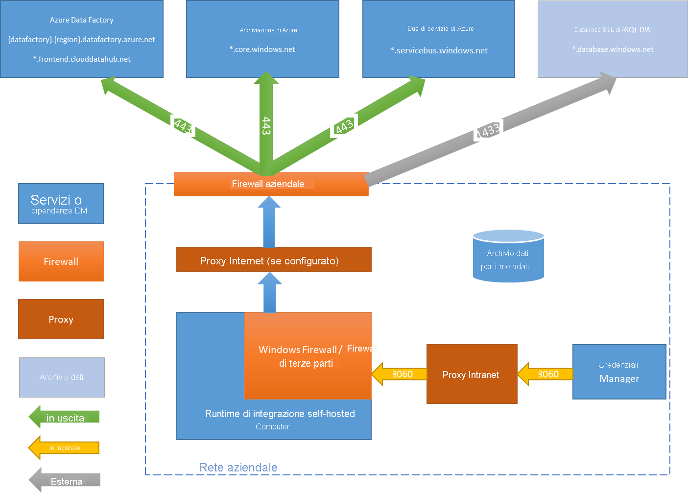

# <a name="create-and-configure-a-self-hosted-integration-runtime"></a>Creare e configurare un runtime di integrazione self-hosted
Il runtime di integrazione è l'infrastruttura di calcolo usata da Azure Data Factory per distribuire le funzionalità di integrazione di dati in ambienti di rete diversi. Per informazioni dettagliate sul runtime di integrazione, vedere [Runtime di integrazione in Azure Data Factory](concepts-integration-runtime.md).

Un runtime di integrazione self-hosted può eseguire attività di copia tra un archivio dati cloud e un archivio dati in una rete privata e inviare le attività di trasformazione sulle risorse di calcolo a una rete locale oppure a una rete virtuale di Azure. L'installazione del runtime di integrazione self-hosted è necessaria in un computer locale oppure in una macchina virtuale all'interno di una rete privata.  

Questo documento descrive come creare e configurare un runtime di integrazione self-hosted.

[!INCLUDE [updated-for-az](../../includes/updated-for-az.md)]

## <a name="high-level-steps-to-install-a-self-hosted-ir"></a>Procedura generale per installare un runtime di integrazione self-hosted
1. Creare un runtime di integrazione self-hosted. Per questa attività, è possibile usare l'interfaccia utente di Azure Data Factory. Di seguito è illustrato un esempio di PowerShell:

    ```powershell
    Set-AzDataFactoryV2IntegrationRuntime -ResourceGroupName $resourceGroupName -DataFactoryName $dataFactoryName -Name $selfHostedIntegrationRuntimeName -Type SelfHosted -Description "selfhosted IR description"
    ```
  
2. [Scaricare](https://www.microsoft.com/download/details.aspx?id=39717) e installare il runtime di integrazione self-hosted in un computer locale.

3. Recuperare la chiave di autenticazione e registrare il runtime di integrazione self-hosted con la chiave. Di seguito è illustrato un esempio di PowerShell:

    ```powershell
    Get-AzDataFactoryV2IntegrationRuntimeKey -ResourceGroupName $resourceGroupName -DataFactoryName $dataFactoryName -Name $selfHostedIntegrationRuntime.  
    ```

## <a name="setting-up-a-self-hosted-ir-on-an-azure-vm-by-using-an-azure-resource-manager-template-automation"></a>Configurazione di un runtime di integrazione self-hosted in una macchina virtuale di Azure usando un modello di Azure Resource Manager (automazione)
È possibile automatizzare l'installazione del runtime di integrazione self-hosted in una macchina virtuale di Azure usando [questo modello di Azure Resource Manager](https://github.com/Azure/azure-quickstart-templates/tree/master/101-vms-with-selfhost-integration-runtime). Tale modello consente di implementare in modo semplice un runtime di integrazione self-hosted completamente funzionante in una rete virtuale di Azure con funzionalità di disponibilità e scalabilità elevate (purché il numero di nodi sia impostato almeno su 2).

## <a name="command-flow-and-data-flow"></a>Flusso dei comandi e flusso di dati
Quando si spostano dati tra un ambiente locale e il cloud, l'attività usa un runtime di integrazione self-hosted per trasferirli dall'origine dati locale al cloud e viceversa.

Di seguito viene indicato un flusso di dati generale per il riepilogo dei passaggi per eseguire la copia con il runtime di integrazione self-hosted:


1. Lo sviluppatore di dati crea un runtime di integrazione self-hosted in un'istanza di Azure Data Factory tramite un cmdlet di PowerShell. Il portale di Azure attualmente non supporta questa funzionalità.
2. Lo sviluppatore di dati crea quindi un servizio collegato per un archivio dati locale specificando l'istanza del runtime di integrazione self-hosted da usare per la connessione agli archivi dati. Una parte della configurazione del servizio collegato è costituita dall'uso dell'applicazione Gestione credenziali (attualmente non supportata) per impostare i tipi di autenticazione e le credenziali. L'applicazione Gestione credenziali comunica con l'archivio dati per eseguire il test della connessione e con il runtime di integrazione self-hosted per salvare le credenziali.
3. Il nodo del runtime di integrazione self-hosted crittografa le credenziali con Data Protection API (DPAPI) e le salva in locale. Se più nodi vengono impostati per la disponibilità elevata, le credenziali vengono ulteriormente sincronizzate negli altri nodi. Ogni nodo crittografa le credenziali con DPAPI e le archivia in locale. La sincronizzazione delle credenziali è trasparente allo sviluppatore di dati e viene gestita dal runtime di integrazione self-hosted.    
4. Il servizio Data Factory comunica con il runtime di integrazione self-hosted per pianificare e gestire i processi tramite un *canale di controllo* che usa una coda condivisa del bus di servizio di Azure. Quando è necessario eseguire un processo di attività, Data Factory accoda la richiesta con le informazioni sulle credenziali (se le credenziali non sono già archiviate nel runtime di integrazione self-hosted). Il runtime di integrazione self-hosted avvia il processo dopo che è stato eseguito il polling della coda.
5. Il runtime di integrazione self-hosted copia quindi i dati dall'archivio locale in una risorsa di archiviazione cloud o viceversa in base alla configurazione dell'attività di copia nella pipeline di dati. Per eseguire questo passaggio, il runtime di integrazione self-hosted comunica direttamente con i servizi di archiviazione basati sul cloud, ad esempio Archiviazione BLOB di Azure, su un canale protetto (HTTPS).

## <a name="considerations-for-using-a-self-hosted-ir"></a>Considerazioni sull'uso del runtime di integrazione self-hosted

- Un singolo runtime di integrazione self-hosted può essere usato per più origini dati locali. e può essere condiviso con un'altra data factory nello stesso tenant di Azure Active Directory. Per altre informazioni, vedere [Condivisione di un runtime di integrazione self-hosted](#sharing-the-self-hosted-integration-runtime-with-multiple-data-factories).
- In un computer può essere installata una sola istanza di un runtime di integrazione self-hosted. Se si dispone di due data factory che devono accedere alle origini dati locali, è necessario installare il runtime di integrazione self-hosted in due computer locali ogni da entrambe le data factory oppure usare il [self-hosted IRfunzionalitàdicondivisione](#sharing-the-self-hosted-integration-runtime-with-multiple-data-factories)condividere un runtime di integrazione self-hosted con un'altra Data Factory.  
- Il runtime di integrazione self-hosted non deve trovarsi nello stesso computer dell'origine dati. Se tuttavia il runtime di integrazione self-hosted è più vicino all'origine dati, il tempo di connessione a quest'ultima è minore. Si consiglia di installare il runtime di integrazione self-hosted in un computer diverso da quello che ospita l'origine dati locale. Quando il runtime di integrazione self-hosted e l'origine dati si trovano in computer diversi, non competono per accedere alle risorse.
- È possibile che più runtime di integrazione self-hosted siano presenti in computer diversi che si connettono alla stessa origine dati locale. Potrebbero essere disponibili, ad esempio, due runtime di integrazione self-hosted che servono due data factory per cui è registrata la stessa origine dati locale.
- Se nel computer è già installato un gateway per uno scenario Power BI, installare un runtime di integrazione self-hosted separato per Azure Data Factory in un altro computer.
- Il runtime di integrazione self-hosted deve essere usato per supportare l'integrazione dei dati in una rete virtuale di Azure.
- Considerare l'origine dati come un'origine dati locale protetta da firewall anche quando si usa Azure ExpressRoute. Usare il runtime di integrazione self-hosted per stabilire la connettività tra il servizio e l'origine dati.
- È necessario usare il runtime di integrazione self-hosted anche se l'archivio dati si trova nel cloud su una macchina virtuale IaaS di Azure.
- In un runtime di integrazione self-hosted installato in un'istanza di Windows Server in cui è abilitata la crittografia FIPS potrebbero verificarsi errori di esecuzione delle attività. Per risolvere questo problema, disabilitare la crittografia FIPS nel server. Per disabilitare la crittografia FIPS compatibile, modificare il valore del Registro di sistema seguente da 1 (abilitato) a 0 (disabilitato): `HKLM\System\CurrentControlSet\Control\Lsa\FIPSAlgorithmPolicy\Enabled`.

## <a name="prerequisites"></a>Prerequisiti

- Sono supportati i sistemi operativi Windows 7 Service Pack 1, Windows 8.1, Windows 10, Windows Server 2008 R2 SP1, Windows Server 2012, Windows Server 2012 R2 e Windows Server 2016. L'installazione del runtime di integrazione self-hosted in un controller di dominio non è supportata.
- È necessario .NET Framework 4.6.1 o versione successiva. Se si installa il runtime di integrazione self-hosted in un computer Windows 7, installare .NET Framework 4.6.1 o versione successiva. Per informazioni dettagliate, vedere [Requisiti di sistema di .NET Framework](/dotnet/framework/get-started/system-requirements) .
- La configurazione consigliata per il computer con il runtime di integrazione self-hosted prevede almeno 2 GHz, quattro core, 8 GB di RAM e un disco da 80 GB.
- Se il computer host entra in stato di ibernazione, il runtime di integrazione self-hosted non risponde alle richieste di dati. Configurare una combinazione appropriata per il risparmio di energia nel computer prima di installare il runtime di integrazione self-hosted. Se il computer è configurato per l'ibernazione, l'installazione del runtime di integrazione self-hosted invia un messaggio.
- È necessario essere un amministratore del computer per installare e configurare correttamente il runtime di integrazione self-hosted.
- Le attività di copia vengono eseguite con una frequenza specifica e di conseguenza l'uso delle risorse, ovvero CPU e memoria, nel computer segue lo stesso schema costituito da periodi di picco alternati a periodi di inattività. L'utilizzo delle risorse dipende molto anche dalla quantità di dati da spostare. Quando sono in corso più processi di copia, l'utilizzo delle risorse aumenta durante i periodi di picco.

## <a name="installation-best-practices"></a>Procedure consigliate per l'installazione
Per installare il runtime di integrazione self-hosted, è possibile scaricare un pacchetto di installazione MSI nell'[Area download Microsoft](https://www.microsoft.com/download/details.aspx?id=39717). Vedere l'[articolo sullo spostamento di dati tra origini locali e cloud](tutorial-hybrid-copy-powershell.md) per le istruzioni dettagliate.

- Configurare una combinazione per il risparmio di energia nel computer host del runtime di integrazione self-hosted in modo che il computer non entri in stato di ibernazione. Se il computer host entra in stato di ibernazione, il runtime di integrazione self-hosted passa in modalità offline.
- Eseguire regolarmente un backup delle credenziali associate al runtime di integrazione self-hosted.

## <a name="install-and-register-self-hosted-ir-from-the-download-center"></a>Installare e registrare il runtime di integrazione self-hosted dall'Area download

1. Accedere alla [pagina di download di Microsoft Integration Runtime](https://www.microsoft.com/download/details.aspx?id=39717).
2. Selezionare **Scaricare**, selezionare la versione a 64 bit (32 bit non è supportato) e selezionare **Successivo**.
3. Eseguire il file MSI direttamente oppure salvarlo sul disco rigido ed eseguirlo.
4. Nella pagina di **benvenuto** selezionare una lingua e quindi selezionare **Avanti**.
5. Accettare le condizioni di licenza software Microsoft e quindi selezionare **Avanti**.
6. Selezionare la **cartella** in cui installare il runtime di integrazione self-hosted e quindi selezionare **Avanti**.
7. Nella pagina **Pronto per l'installazione** selezionare **Installa**.
8. Fare clic su **Fine** per completare l'installazione.
9. Ottenere la chiave di autenticazione tramite Azure PowerShell. Di seguito viene indicato un esempio di PowerShell per recuperare la chiave di autenticazione:

    ```powershell
    Get-AzDataFactoryV2IntegrationRuntimeKey -ResourceGroupName $resourceGroupName -DataFactoryName $dataFactoryName -Name $selfHostedIntegrationRuntime
    ```
11. Nella pagina **Registra Integration Runtime (self-hosted)** di Gestione configurazione di Microsoft Integration Runtime in esecuzione sul computer seguire questa procedura:

    a. Incollare la chiave di autenticazione nell'area di testo.

    b. Facoltativamente, selezionare **Mostra chiave di autenticazione** per visualizzare il testo della chiave.

    c. Selezionare **Registra**.


## <a name="high-availability-and-scalability"></a>Disponibilità e scalabilità elevate
Un runtime di integrazione self-hosted può essere associato a più computer locali, Questi computer sono chiamati nodi. È possibile avere fino a quattro nodi associati a un runtime di integrazione self-hosted. Di seguito vengono indicati i vantaggi della presenza di più nodi (computer locali con un gateway installato) per un gateway logico:
* Disponibilità più elevata del runtime di integrazione self-hosted in modo che non sia più il singolo punto di guasto nella soluzione per Big Data o nell'integrazione dei dati cloud con Azure Data Factory, assicurando la continuità fino a quattro nodi.
* Miglioramento delle prestazioni e della velocità effettiva durante lo spostamento dati tra archivi dati locali e cloud. Ottenere altre informazioni sui [confronti delle prestazioni](copy-activity-performance.md).

Per associare più nodi, installare il software di runtime di integrazione self-hosted dall'[Area download](https://www.microsoft.com/download/details.aspx?id=39717) Quindi, usando una delle chiavi di autenticazione ottenuta dal registro il **New-AzDataFactoryV2IntegrationRuntimeKey** cmdlet, come descritto nel [esercitazione](tutorial-hybrid-copy-powershell.md).

> [!NOTE]
> Non è necessario creare un nuovo runtime di integrazione self-hosted per associare ogni nodo. È possibile installare il runtime di integrazione self-hosted in un altro computer e registrarlo con la stessa chiave di autenticazione. 

> [!NOTE]
> Prima di aggiungere un altro nodo per la disponibilità e la scalabilità elevate, verificare che l'opzione **Accesso remoto da Intranet** sia abilitata sul primo nodo. Accedere a **Gestione configurazione di Microsoft Integration Runtime** > **Impostazioni** > **Accesso remoto da Intranet**. 

### <a name="scale-considerations"></a>Considerazioni sulla scalabilità

#### <a name="scale-out"></a>Scalabilità orizzontale

Quando la memoria disponibile nel runtime di integrazione self-hosted non è sufficiente e l'uso della CPU è elevato, l'aggiunta di un nuovo nodo consente di aumentare il carico nei computer. Se le attività hanno esito negativo perché si verifica un timeout o il nodo del runtime di integrazione self-hosted è offline, è utile aggiungere un nodo al gateway.

#### <a name="scale-up"></a>Aumentare le prestazioni

Quando la memoria disponibile e la CPU non vengono usate correttamente, ma la capacità di esecuzione di processi simultanei sta raggiungendo il limite, è consigliabile aumentare le prestazioni aumentando il numero di processi simultanei che possono essere eseguiti in un nodo. È anche possibile aumentare le prestazioni quando si verifica un timeout delle attività perché il runtime di integrazione self-hosted è sovraccarico. Come illustrato nell'immagine seguente, è possibile aumentare la capacità massima di un nodo:  


### <a name="tlsssl-certificate-requirements"></a>Requisiti del certificato TLS/SSL

Ecco i requisiti per il certificato TLS/SSL usato per proteggere le comunicazioni tra i nodi di Integration Runtime:

- Deve essere un certificato X509 v3 pubblicamente attendibile. È consigliabile usare certificati rilasciati da un'autorità di certificazione (CA) pubblica (partner).
- Ogni nodo del runtime di integrazione deve considerare attendibile questo certificato.
- I certificati con nome alternativo del soggetto non sono consigliati perché viene usato solo l'ultimo elemento del nome, mentre tutti gli altri vengono ignorati a causa delle limitazioni attuali. Se ad esempio si dispone di un certificato con nome alternativo del soggetto i cui nomi sono **node1.domain.contoso.com** e **node2.domain.contoso.com**, è possibile usare tale certificato solo in un computer il cui nome di dominio completo è **node2.domain.contoso.com**.
- Il certificato deve supportare tutte le dimensioni della chiave supportate da Windows Server 2012 R2 per i certificati SSL.
- I certificati che usano chiavi CNG non sono supportati.  

> [!NOTE]
> Questo certificato viene usato per le porte nel nodo di runtime di integrazione self-hosted, usato per crittografare **comunicazione da nodo a nodo** (per la sincronizzazione dello stato che include servizi collegati di credenziali sincronizzazione tra nodi) e while **tramite PowerShell cmdlet per il servizio collegato di impostazione credenziali** dalla rete locale. È consigliabile usare questo certificato se l'ambiente di rete privato non è protetto o se si vuole proteggere la comunicazione tra nodi anche all'interno della rete privata. Lo spostamento dati in transito dal runtime di integrazione self-hosted ad altri archivi dati avviene sempre tramite un canale crittografato, indipendentemente dal fatto che il certificato sia stato impostato o meno. 

## <a name="sharing-the-self-hosted-integration-runtime-with-multiple-data-factories"></a>Condivisione del runtime di integrazione self-hosted in più data factory

È possibile usare nuovamente un'infrastruttura del runtime di integrazione self-hosted esistente già configurata in una data factory. In questo modo è possibile creare un *runtime di integrazione self-hosted collegato* in una data factory diversa usando come riferimento un runtime di integrazione self-hosted (condiviso) esistente.

Per condividere un runtime di integrazione self-hosted usando PowerShell, vedere [Creare un runtime di integrazione self-hosted condiviso in Azure Data Factory con PowerShell](create-shared-self-hosted-integration-runtime-powershell.md).

Per un'introduzione di dodici minuti e una dimostrazione di questa funzionalità, guardare il video seguente:

> [!VIDEO https://channel9.msdn.com/Shows/Azure-Friday/Hybrid-data-movement-across-multiple-Azure-Data-Factories/player]

### <a name="terminology"></a>Terminologia

- **Runtime di integrazione condiviso**: runtime di integrazione self-hosted originale in esecuzione in un'infrastruttura fisica.  
- **Runtime di integrazione collegato**: runtime di integrazione che fa riferimento a un altro runtime di integrazione condiviso. Si tratta di un runtime di integrazione logico che usa l'infrastruttura di un altro runtime di integrazione self-hosted (condiviso).

### <a name="high-level-steps-for-creating-a-linked-self-hosted-ir"></a>Panoramica generale dei passaggi per creare un runtime di integrazione self-hosted collegato

1. Nel runtime di integrazione self-hosted da condividere concedere l'autorizzazione alla data factory in cui si intende creare il runtime di integrazione collegato. 

   

   

2. Trovare l'ID risorsa del runtime di integrazione self-hosted da condividere.

   

3. Nella data factory per cui sono state concesse le autorizzazioni creare un nuovo runtime di integrazione self-hosted (collegato) e immettere l'ID risorsa.

   

   

### <a name="monitoring"></a>Monitoraggio 

- **IR condiviso**

  

  

- **IR collegato**

  

  

### <a name="known-limitations-of-self-hosted-ir-sharing"></a>Limitazioni note della condivisione del runtime di integrazione self-hosted

* La data factory in cui verrà creato il runtime di integrazione collegato deve disporre di un'[identità del servizio gestita](https://docs.microsoft.com/azure/active-directory/managed-service-identity/overview). Per impostazione predefinita, nelle data factory create nel portale di Azure o nei cmdlet di PowerShell un'identità del servizio gestita è creata in modo implicito. Quando una data factory viene creata tramite un modello di Azure Resource Manager oppure un SDK, tuttavia, la proprietà **Identity** deve essere impostata in modo esplicito per garantire che Azure Resource Manager crei una data factory contenente un'identità del servizio gestita. 

* La versione di Azure Data Factory .NET SDK che supporta questa funzionalità è 1.1.0 o successiva.

* Per concedere l'autorizzazione, l'utente deve disporre del ruolo di proprietario o del ruolo di proprietario ereditato nella data factory in cui è presente il runtime di integrazione condiviso.

* La funzionalità di condivisione funziona solo per le Data Factory nel medesimo tenant di Azure Active Directory.

* Per gli [utenti guest](https://docs.microsoft.com/azure/active-directory/governance/manage-guest-access-with-access-reviews) di Active Directory, la funzionalità di ricerca nell'interfaccia utente, ovvero l'elenco di tutte le data factory ottenuto tramite una parola chiave, [non funziona](https://msdn.microsoft.com/library/azure/ad/graph/howto/azure-ad-graph-api-permission-scopes#SearchLimits). Se tuttavia l'utente guest è il proprietario della data factory, può condividere il runtime di integrazione self-hosted senza usare la funzionalità di ricerca digitando direttamente l'identità del servizio gestita della data factory con cui il runtime deve essere condiviso nella casella di testo **Assign Permission** (Assegna autorizzazione) e selezionando **Add** (Aggiungi) nell'interfaccia utente di Azure Data Factory. 

  > [!NOTE]
  > Questa funzionalità è disponibile solo in Azure Data Factory V2. 

## <a name="notification-area-icons-and-notifications"></a>Icone e notifiche dell'area di notifica

Se si sposta il cursore sul messaggio di notifica o sull'icona nell'area di notifica, vengono visualizzati i dettagli sullo stato del runtime di integrazione self-hosted.


## <a name="ports-and-firewall"></a>Porte e firewall
È necessario prendere in considerazione due firewall, ovvero il *firewall aziendale* in esecuzione nel router centrale dell'organizzazione, e *Windows Firewall*, configurato come servizio daemon nel computer locale in cui è installato il runtime di integrazione self-hosted.



A livello di *firewall aziendale* è necessario configurare le porte in uscita e i domini seguenti:

Nomi di dominio | Porte | DESCRIZIONE
------------ | ----- | ------------
*.servicebus.windows.net | 443 | Usato per la comunicazione con il servizio di spostamento di dati back-end
*.core.windows.net | 443 | Usato per la copia di gestione temporanea tramite Archiviazione BLOB di Azure (se configurata)
*.frontend.clouddatahub.net | 443 | Usato per la comunicazione con il servizio di spostamento di dati back-end
download.microsoft.com | 443 | Utilizzato per il download di aggiornamenti

A livello di *Windows Firewall* (nel computer) queste porte in uscita sono in genere abilitate. In caso contrario, è possibile configurare le porte e i domini nel modo appropriato in un computer del runtime di integrazione self-hosted.

> [!NOTE]
> In base all'origine oppure ai sink, potrebbe essere necessario consentire altri domini e porte in uscita nel firewall aziendale o in Windows Firewall.
>
> Per alcuni database cloud, ad esempio, database SQL di Azure, Azure Data Lake e così via, potrebbe essere necessario consentire gli indirizzi IP del computer del runtime di integrazione self-hosted nella configurazione del firewall.

### <a name="copy-data-from-a-source-to-a-sink"></a>Copiare i dati da un'origine a un sink
Verificare che le regole del firewall siano abilitate correttamente per il firewall aziendale, per Windows Firewall nel computer del runtime di integrazione self-hosted e per l'archivio dati stesso, per poter consentire al runtime di integrazione self-hosted di connettersi all'origine e al sink. Abilitare le regole per ogni archivio dati interessato dall'operazione di copia.

Per eseguire la copia da un archivio dati locale a un sink di database SQL di Azure o a un sink di Azure SQL Data Warehouse, ad esempio, seguire questa procedura:

1. Consentire comunicazioni TCP in uscita sulla porta 1433 sia per Windows Firewall che per il firewall aziendale.
2. Configurare le impostazioni del firewall del database SQL di Azure per aggiungere l'indirizzo IP del computer del runtime di integrazione self-hosted all'elenco degli indirizzi IP consentiti.

> [!NOTE]
> Se il firewall non consente la porta in uscita 1433, il runtime di integrazione self-hosted non può accedere direttamente al database SQL di Azure. In questo caso è possibile usare una [copia di gestione temporanea](copy-activity-performance.md) nel database SQL di Azure e in Azure SQL Data Warehouse. Per lo spostamento dei dati, in questo scenario è necessario solo il protocollo HTTPS (porta 443).


## <a name="proxy-server-considerations"></a>Considerazioni sui server proxy
Se nell'ambiente di rete aziendale è presente un server proxy per accedere a Internet, configurare il runtime di integrazione self-hosted per usare le impostazioni proxy appropriate. È possibile impostare il proxy durante la fase di registrazione iniziale.


Il runtime di integrazione self-hosted usa il server proxy per connettersi al servizio cloud. Selezionare il collegamento **Change** (Modifica) durante la configurazione iniziale. Viene visualizzata la finestra di dialogo per l'impostazione del proxy.


Sono disponibili tre opzioni di configurazione:

- **Non utilizzare proxy**: il runtime di integrazione self-hosted non usa in modo esplicito i proxy per connettersi ai servizi cloud.
- **Usa il proxy di sistema**: il runtime di integrazione self-hosted usa l'impostazione del proxy configurata in diahost.exe.config e diawp.exe.config. Se non è stato configurato alcun proxy in diahost.exe.config e diawp.exe.config, il runtime di integrazione self-hosted si connette al servizio cloud direttamente usare il proxy.
- **Usa proxy personalizzato**: configurare le impostazioni del proxy HTTP che il runtime di integrazione self-hosted deve usare al posto delle configurazioni in diahost.exe.config e diawp.exe.config. I campi **Indirizzo** e **Porta** sono obbligatori. I campi **Nome utente** e **Password** sono facoltativi e dipendono dalle impostazioni di autenticazione del proxy. Tutte le impostazioni vengono crittografate con Windows DPAPI nel runtime di integrazione self-hosted e archiviate localmente nel computer.

Il servizio host di runtime di integrazione viene riavviato automaticamente dopo avere salvato le impostazioni proxy aggiornate.

Dopo aver registrato correttamente il runtime di integrazione self-hosted, se si intende visualizzare o aggiornare le impostazioni proxy, usare Gestione configurazione di Integration Runtime.

1. Aprire **Gestione configurazione di Microsoft Integration Runtime**.
2. Passare alla scheda **Impostazioni** .
3. Selezionare il collegamento **Change** (Modifica) nella sezione **Proxy HTTP** per aprire la finestra di dialogo **Imposta proxy HTTP**.
4. Selezionare **Avanti**. Viene visualizzato un avviso che richiede l'autorizzazione per salvare le impostazioni del proxy e riavviare il servizio host di runtime di integrazione.

È possibile visualizzare e aggiornare il proxy HTTP tramite lo strumento Gestione configurazione.


> [!NOTE]
> Se si configura un server proxy con autenticazione NTLM, il servizio host di runtime di integrazione viene eseguito nell'account di dominio. Se in un secondo momento si modifica la password per l'account di dominio, aggiornare le impostazioni di configurazione per il servizio e riavviarlo. Per questo requisito, si consiglia di usare un account di dominio dedicato per accedere al server proxy che non richieda l'aggiornamento frequente della password.

### <a name="configure-proxy-server-settings"></a>Configurare le impostazioni del server proxy

Se si seleziona l'impostazione **Usa il proxy di sistema** per il proxy HTTP, il runtime di integrazione self-hosted usa l'impostazione proxy contenuta in diahost.exe.config e diawp.exe.config. Se non è stato specificato alcun proxy in diahost.exe.config e diawp.exe.config, il runtime di integrazione self-hosted si connette al servizio cloud direttamente senza usare il proxy. La procedura seguente contiene le istruzioni per aggiornare il file diahost.exe.config:

1. In Esplora file creare una copia sicura di C:\Programmi\Microsoft Integration Runtime\3.0\Shared\diahost.exe.config per eseguire il backup del file originale.
2. Aprire Notepad.exe come amministratore e aprire il file di testo C:\Programmi\Microsoft Integration Runtime\3.0\Shared\diahost.exe.config. Trovare il tag predefinito per system.net come indicato nel codice seguente:

    ```xml
    <system.net>
        <defaultProxy useDefaultCredentials="true" />
    </system.net>
    ```
    È quindi possibile aggiungere i dettagli del server proxy, come illustrato nell'esempio seguente:

    ```xml
    <system.net>
        <defaultProxy enabled="true">
              <proxy bypassonlocal="true" proxyaddress="http://proxy.domain.org:8888/" />
        </defaultProxy>
    </system.net>
    ```

    È possibile aggiungere altre proprietà all'interno del tag del proxy per specificare le impostazioni obbligatorie, ad esempio `scriptLocation`. Per informazioni sulla sintassi, vedere [Elemento proxy (Impostazioni di rete)](https://msdn.microsoft.com/library/sa91de1e.aspx).

    ```xml
    <proxy autoDetect="true|false|unspecified" bypassonlocal="true|false|unspecified" proxyaddress="uriString" scriptLocation="uriString" usesystemdefault="true|false|unspecified "/>
    ```
3. Salvare il file di configurazione nel percorso originale, quindi riavviare il servizio host di runtime di integrazione self-hosted per rilevare le modifiche. 

   Per riavviare il servizio, usare l'applet dei servizi nel pannello di controllo. In alternativa, in Gestione configurazione di Integration Runtime selezionare il pulsante **Arresta servizio** e quindi selezionare **Avvia servizio**. 
   
   Se il servizio non viene avviato, è probabile che al file di configurazione dell'applicazione modificato sia stata aggiunta una sintassi non corretta del tag XML.

> [!IMPORTANT]
> Non dimenticare di aggiornare entrambi i file diahost.exe.config e diawp.exe.config.

È anche necessario verificare che Microsoft Azure sia presente nell'elenco elementi consentiti dell'azienda. È possibile scaricare l'elenco di indirizzi IP validi per Microsoft Azure nell'[Area download Microsoft](https://www.microsoft.com/download/details.aspx?id=41653).

### <a name="possible-symptoms-for-firewall-and-proxy-server-related-issues"></a>Possibili sintomi di problemi correlati al firewall e al server proxy
Se si verificano errori analoghi ai seguenti, potrebbero essere causati da una configurazione non corretta del firewall o del server proxy, che impedisce al runtime di integrazione self-hosted di connettersi a Data Factory per l'autenticazione. Per verificare che la configurazione del firewall e del server proxy sia corretta, vedere la sezione precedente.

* Quando si prova a registrare il runtime di integrazione self-hosted, viene visualizzato l'errore seguente: "Non è stato possibile registrare questo nodo di Runtime di integrazione. Verificare la validità della chiave di autenticazione e che il servizio host servizio di integrazione sia in esecuzione nel computer".
* Quando si apre Gestione configurazione di Integration Runtime, lo stato del gateway visualizzato può essere **Disconnesso** o **Connessione**. Quando si visualizzano i registri eventi di Windows, in **Visualizzatore eventi** > **Registri applicazioni e servizi** > **Microsoft Integration Runtime** vengono visualizzati messaggi di errore simili ai seguenti:

    ```
    Unable to connect to the remote server
    A component of Integration Runtime has become unresponsive and restarts automatically. Component name: Integration Runtime (Self-hosted).
    ```

### <a name="enabling-remote-access-from-an-intranet"></a>Abilitare l'accesso remoto da una rete Intranet  
Se si usa PowerShell o l'applicazione Gestione credenziali per crittografare le credenziali da un computer della rete diverso da quello in cui è installato il runtime di integrazione self-hosted, è possibile abilitare l'opzione **Accesso remoto da Intranet**. Se si esegue PowerShell o l'applicazione Gestione credenziali per crittografare le credenziali sullo stesso computer in cui è installato il runtime di integrazione self-hosted, non è possibile abilitare l'opzione **Accesso remoto da Intranet**.

È consigliabile abilitare **Accesso remoto da Intranet** prima di aggiungere un altro nodo per la disponibilità e la scalabilità elevate.  

Durante la configurazione del runtime di integrazione self-hosted (versione 3.3.xxxx.x o successiva), per impostazione predefinita l'installazione del runtime di integrazione self-hosted disabilita l'opzione **Accesso remoto da Intranet** nel computer in cui il runtime è installato.

Se si usa un firewall di terze parti, è possibile aprire manualmente la porta 8060 (o la porta configurata dall'utente). Se si verificano problemi di firewall durante la configurazione del runtime di integrazione self-hosted, provare a usare il comando seguente per installare il runtime di integrazione self-hosted senza configurare il firewall:

```
msiexec /q /i IntegrationRuntime.msi NOFIREWALL=1
```
> [!NOTE]
> L'applicazione Gestione credenziali non è ancora disponibile per la crittografia delle credenziali in Azure Data Factory V2.  

Se si sceglie di non aprire la porta 8060 nel computer del runtime di integrazione self-hosted, usare meccanismi diversi dall'uso dell'applicazione di impostazione credenziali per configurare le credenziali dell'archivio dati. Ad esempio, è possibile usare la **New-AzDataFactoryV2LinkedServiceEncryptCredential** cmdlet di PowerShell.


## <a name="next-steps"></a>Passaggi successivi
Per istruzioni dettagliate, vedere l'esercitazione seguente: [Esercitazione: Copiare i dati locali nel cloud](tutorial-hybrid-copy-powershell.md).
