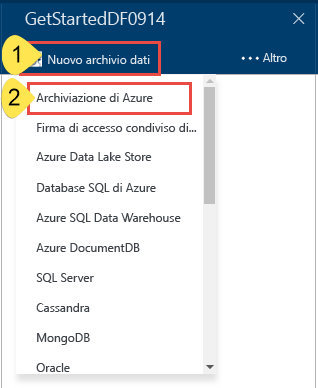
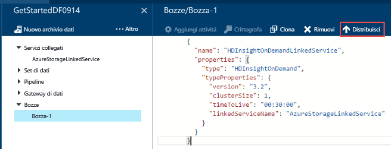
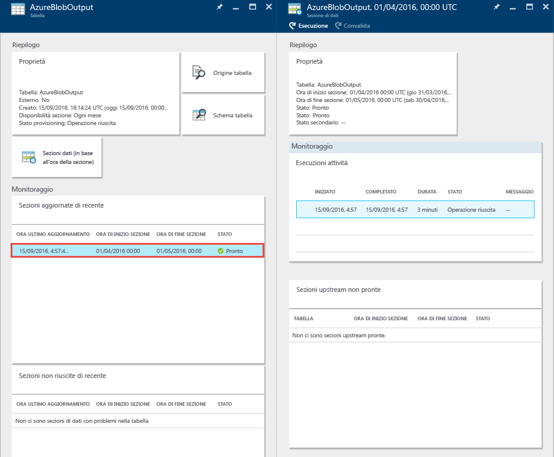
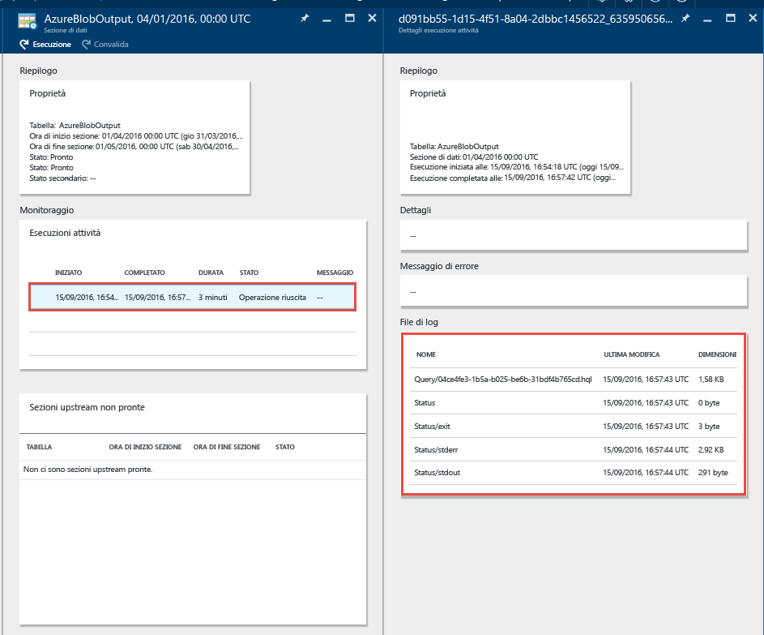
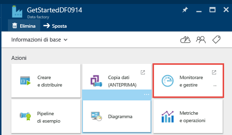

# <a name="tutorial-build-your-first-azure-data-factory-using-azure-portal"></a>Esercitazione: Creare la prima data factory di Azure con il portale di Azure
> [!div class="op_single_selector"]
> * [Panoramica e prerequisiti](data-factory-build-your-first-pipeline.md)
> * [Portale di Azure](data-factory-build-your-first-pipeline-using-editor.md)
> * [Visual Studio](data-factory-build-your-first-pipeline-using-vs.md)
> * [PowerShell](data-factory-build-your-first-pipeline-using-powershell.md)
> * [Modello di Resource Manager](data-factory-build-your-first-pipeline-using-arm.md)
> * [API REST](data-factory-build-your-first-pipeline-using-rest-api.md)


Questo articolo descrive come usare il [portale di Azure](https://portal.azure.com/) per creare la prima istanza di Azure Data Factory. Per eseguire l'esercitazione usando altri strumenti/SDK, selezionare una delle opzioni dall'elenco a discesa. 

La pipeline in questa esercitazione include un'attività, l'**attività Hive di HDInsight**, che esegue uno script Hive in un cluster Azure HDInsight per trasformare i dati di input e generare i dati di output. L'esecuzione della pipeline è pianificata una volta al mese tra le ore di inizio e di fine specificate. 

> [!NOTE]
> La pipeline di dati in questa esercitazione trasforma i dati di input per produrre dati di output. Per un'esercitazione su come copiare dati usando Azure Data Factory, vedere [Copiare dati da un archivio BLOB al database SQL](data-factory-copy-data-from-azure-blob-storage-to-sql-database.md).
> 
> Una pipeline può includere più attività ed è possibile concatenarne due, ovvero eseguire un'attività dopo l'altra, impostando il set di dati di output di un'attività come set di dati di input dell'altra. Per altre informazioni, vedere [Pianificazione ed esecuzione in Data Factory](data-factory-scheduling-and-execution.md#multiple-activities-in-a-pipeline).

## <a name="prerequisites"></a>Prerequisiti
1. Vedere la [panoramica dell'esercitazione](data-factory-build-your-first-pipeline.md) ed eseguire i passaggi relativi ai **prerequisiti** .
2. Questo articolo non fornisce una panoramica concettuale del servizio Data factory di Azure. Si consiglia di leggere l'articolo [Introduzione al servizio Data factory di Azure](data-factory-introduction.md) per una panoramica dettagliata del servizio.  

## <a name="create-data-factory"></a>Creare un'istanza di Data Factory
Una data factory può comprendere una o più pipeline. Una pipeline può comprendere una o più attività. Ad esempio, un'attività di copia per copiare dati da un archivio dati di origine a uno di destinazione e un'attività Hive HDInsight per eseguire uno script Hive e trasformare i dati di input in dati di output di prodotto. In questo passaggio iniziale viene creata la data factory.

1. Accedere al [Portale di Azure](https://portal.azure.com/).
2. Fare clic su **NUOVO** nel menu a sinistra e quindi su **Dati e analisi** e **Data factory**.

   
3. Nel pannello **Nuova data factory** immettere **GetStartedDF** come nome.

   

   > [!IMPORTANT]
   > Il nome della data factory di Azure deve essere **univoco a livello globale**. Se viene visualizzato l'errore **Il nome "GetStartedDF" per la data factory non è disponibile**, cambiare il nome della data factory, ad esempio nomeutenteGetStartedDF, e provare di nuovo a crearla. Per informazioni sulle regole di denominazione per gli elementi di Data factory, vedere l'argomento relativo alle [regole di denominazione di Data factory](data-factory-naming-rules.md) .
   >
   > Il nome della data factory può essere registrato in futuro come nome **DNS** e diventare quindi visibile pubblicamente.
   >
   >
4. Selezionare la **sottoscrizione di Azure** in cui creare la data factory.
5. Selezionare un **gruppo di risorse** esistente o crearne uno. Per l'esercitazione creare un gruppo di risorse denominato **ADFGetStartedRG**.
6. Selezionare la **località** per la data factory. Nell'elenco a discesa vengono visualizzate solo le aree supportate dal servizio Data Factory.
7. Selezionare **Aggiungi al dashboard**. 
8. Fare clic su **Crea** nel pannello **Nuova data factory**.

   > [!IMPORTANT]
   > Per creare istanze di data factory, è necessario essere membri del ruolo [Collaboratore Data factory](../active-directory/role-based-access-built-in-roles.md#data-factory-contributor) a livello di sottoscrizione/gruppo di risorse.
   >
   >
7. Nel dashboard viene visualizzato il riquadro seguente con lo stato: Deploying data factory (Distribuzione della data factory).    

   
8. Congratulazioni. La creazione della prima data factory è così completata. Dopo la creazione della data factory, viene visualizzata la pagina corrispondente con elencato il contenuto della data factory.     

    

Prima di creare una pipeline nella data factory è necessario creare alcune entità di Data Factory. Creare prima di tutto i servizi collegati per collegare archivi dati/servizi di calcolo all'archivio dati, definire i set di dati di input e di output per rappresentare i dati di input/output negli archivi dati collegati e quindi creare la pipeline con un'attività che usa questi set di dati.

## <a name="create-linked-services"></a>Creazione di servizi collegati
In questo passaggio l'account di archiviazione di Azure e un cluster HDInsight su richiesta di Azure vengono collegati alla data factory. In questo esempio l'account di archiviazione di Azure contiene i dati di input e di output per la pipeline. Il servizio HDInsight collegato viene usato per eseguire uno script Hive specificato nell'attività della pipeline in questo esempio. Identificare l'[archivio dati](data-factory-data-movement-activities.md)/[i servizi di calcolo](data-factory-compute-linked-services.md) usati nello scenario e collegare tali servizi alla data factory creando servizi collegati.  

### <a name="create-azure-storage-linked-service"></a>Creare il servizio collegato Archiviazione di Azure
In questo passaggio l'account di archiviazione di Azure viene collegato alla data factory. In questa esercitazione viene usato lo stesso account di archiviazione di Azure per archiviare i dati di input/output e il file di script HQL.

1. Fare clic su **Creare e distribuire** nel pannello **DATA FACTORY** relativo a **GetStartedDF**. Verrà visualizzato l'editor di Data Factory.

   
2. Fare clic su **Nuovo archivio dati** e scegliere **Archiviazione di Azure**.

   
3. Nell'editor verrà visualizzato lo script JSON per la creazione di un servizio collegato Archiviazione di Azure.

   
4. Sostituire **account name** con il nome dell'account di archiviazione di Azure e **account key** con la chiave di accesso dell'account di archiviazione di Azure. Per informazioni su come ottenere la chiave di accesso alle risorse di archiviazione, vedere le informazioni su come visualizzare, copiare e rigenerare le chiavi di accesso alle risorse di archiviazione in [Gestire l'account di archiviazione](../storage/common/storage-create-storage-account.md#manage-your-storage-account).
5. Fare clic su **Distribuisci** sulla barra dei comandi per distribuire il servizio collegato.

    

   Al termine della distribuzione del servizio collegato, la finestra **Bozza-1** verrà nascosta e nella visualizzazione albero a sinistra verrà visualizzato **AzureStorageLinkedService**.

        

### <a name="create-azure-hdinsight-linked-service"></a>Creare un servizio collegato Azure HDInsight
In questo passaggio viene collegato un cluster HDInsight su richiesta alla data factory. Il cluster HDInsight viene creato automaticamente in fase di esecuzione ed eliminato al termine dell'elaborazione, se rimane inattivo per il periodo di tempo specificato.

1. Nell'**editor di Data Factory** fare clic su **... Altro** e quindi su **Nuovo calcolo** e selezionare **Cluster HDInsight su richiesta**.

    
2. Copiare e incollare il frammento di codice seguente nella finestra **Bozza-1** . Il frammento di codice JSON descrive le proprietà che vengono usate per creare il cluster HDInsight su richiesta.

    ```JSON
    {
        "name": "HDInsightOnDemandLinkedService",
        "properties": {
            "type": "HDInsightOnDemand",
            "typeProperties": {
                "version": "3.5",
                "clusterSize": 1,
                "timeToLive": "00:05:00",
                "osType": "Linux",
                "linkedServiceName": "AzureStorageLinkedService"
            }
        }
    }
    ```

    La tabella seguente fornisce le descrizioni delle proprietà JSON usate nel frammento di codice:

   | Proprietà | Descrizione |
   |:--- |:--- |
   | ClusterSize |Specifica le dimensioni del cluster HDInsight. |
   | TimeToLive | Specifica il tempo di inattività del cluster HDInsight, prima che sia eliminato. |
   | linkedServiceName | Specifica l'account di archiviazione che viene usato per archiviare i log generati da HDInsight. |

    Tenere presente quanto segue:

   * Data Factory crea automaticamente un cluster HDInsight **basato su Linux** con il codice JSON. Per i dettagli, vedere [Servizio collegato Azure HDInsight su richiesta](data-factory-compute-linked-services.md#azure-hdinsight-on-demand-linked-service) .
   * È possibile usare il **proprio cluster HDInsight** anziché un cluster HDInsight su richiesta. Per i dettagli, vedere [Servizio collegato Azure HDInsight](data-factory-compute-linked-services.md#azure-hdinsight-linked-service) .
   * Il cluster HDInsight crea un **contenitore predefinito** nell'archivio BLOB specificato nel file JSON (**linkedServiceName**). HDInsight non elimina il contenitore quando viene eliminato il cluster. Questo comportamento dipende dalla progettazione. Con il servizio collegato HDInsight su richiesta, viene creato un cluster HDInsight ogni volta che viene elaborata una sezione, a meno che non esista un cluster attivo (**timeToLive**). Il cluster viene eliminato al termine dell'elaborazione.

       Man mano che vengono elaborate più sezioni, vengono visualizzati numerosi contenitori nell'archivio BLOB di Azure. Se non sono necessari per risolvere i problemi relativi ai processi, è possibile eliminarli per ridurre i costi di archiviazione. I nomi dei contenitori seguono questo schema: "adf**yourdatafactoryname**-**linkedservicename**-datetimestamp". Per eliminare i contenitori nell'archivio BLOB di Azure, usare strumenti come [Microsoft Azure Storage Explorer](http://storageexplorer.com/) .

     Per i dettagli, vedere [Servizio collegato Azure HDInsight su richiesta](data-factory-compute-linked-services.md#azure-hdinsight-on-demand-linked-service) .
3. Fare clic su **Distribuisci** sulla barra dei comandi per distribuire il servizio collegato.

    
4. Verificare che nella visualizzazione albero a sinistra siano presenti sia **AzureStorageLinkedService** che **HDInsightOnDemandLinkedService**.

    

## <a name="create-datasets"></a>Creare set di dati
In questo passaggio vengono creati set di dati per rappresentare i dati di input e di output per l'elaborazione Hive. I set di dati fanno riferimento all'oggetto **AzureStorageLinkedService** creato in precedenza in questa esercitazione. Il servizio collegato punta a un account di archiviazione di Azure e i set di dati specificano il contenitore, la cartella e il nome del file nella risorsa di archiviazione che contiene i dati di input e di output.   

### <a name="create-input-dataset"></a>Creare set di dati di input
1. Nell'**editor di Data Factory** fare clic su **... Altro** sulla barra dei comandi e quindi fare clic su **Nuovo set di dati** e selezionare **Archivio BLOB di Azure**.

    
2. Copiare e incollare il frammento di codice seguente nella finestra Bozza-1. Nel frammento di codice JSON si crea un set di dati denominato **AzureBlobInput** che rappresenta i dati di input per un'attività nella pipeline. Si specifica anche che i dati di input si trovano nel contenitore BLOB denominato **adfgetstarted** e nella cartella denominata **inputdata**.

    ```JSON
    {
        "name": "AzureBlobInput",
        "properties": {
            "type": "AzureBlob",
            "linkedServiceName": "AzureStorageLinkedService",
            "typeProperties": {
                "fileName": "input.log",
                "folderPath": "adfgetstarted/inputdata",
                "format": {
                    "type": "TextFormat",
                    "columnDelimiter": ","
                }
            },
            "availability": {
                "frequency": "Month",
                "interval": 1
            },
            "external": true,
            "policy": {}
        }
    }
    ```
    La tabella seguente fornisce le descrizioni delle proprietà JSON usate nel frammento di codice:

   | Proprietà | Descrizione |
   |:--- |:--- |
   | type |La proprietà type è impostata su **AzureBlob** perché i dati risiedono in un archivio BLOB di Azure. |
   | linkedServiceName |Fa riferimento all'oggetto **AzureStorageLinkedService** creato in precedenza. |
   | folderPath | Specifica il **contenitore** BLOB e la **cartella** che contiene i BLOB di input. | 
   | fileName |Questa proprietà è facoltativa. Se si omette questa proprietà, vengono prelevati tutti i file da folderPath. In questo tutorial viene elaborato solo il file **input.log**. |
   | type |I file di log sono in formato testo, quindi viene usato **TextFormat**. |
   | columnDelimiter |Le colonne nei file di log sono delimitate da **virgola (`,`)**. |
   | frequenza/intervallo |La frequenza è impostata su **Month** e l'intervallo è **1**; ciò significa che le sezioni di input sono disponibili con cadenza mensile. |
   | external | Questa proprietà è impostata su **true** se i dati di input non vengono generati dalla pipeline. In questa esercitazione il file input.log non viene generato dalla pipeline, quindi questa proprietà viene impostata su true. |

    Per altre informazioni su queste proprietà JSON, vedere l'articolo relativo al [connettore BLOB di Azure](data-factory-azure-blob-connector.md#dataset-properties).
3. Fare clic su **Distribuisci** sulla barra dei comandi per distribuire il set di dati appena creato. Il set di dati viene visualizzato nella visualizzazione albero a sinistra.

### <a name="create-output-dataset"></a>Creare il set di dati di output
Viene creato ora il set di dati di output per rappresentare i dati di output archiviati nell'archivio BLOB di Azure.

1. Nell'**editor di Data Factory** fare clic su **... Altro** sulla barra dei comandi e quindi fare clic su **Nuovo set di dati** e selezionare **Archivio BLOB di Azure**.  
2. Copiare e incollare il frammento di codice seguente nella finestra Bozza-1. Nel frammento di codice JSON si crea un set di dati denominato **AzureBlobOutput**e si specifica la struttura dei dati che vengono generati dallo script Hive. Si specifica anche che i risultati vengono archiviati nel contenitore BLOB denominato **adfgetstarted** e nella cartella denominata **partitioneddata**. La sezione **availability** specifica che il set di dati di output viene generato su base mensile.

    ```JSON
    {
      "name": "AzureBlobOutput",
      "properties": {
        "type": "AzureBlob",
        "linkedServiceName": "AzureStorageLinkedService",
        "typeProperties": {
          "folderPath": "adfgetstarted/partitioneddata",
          "format": {
            "type": "TextFormat",
            "columnDelimiter": ","
          }
        },
        "availability": {
          "frequency": "Month",
          "interval": 1
        }
      }
    }
    ```
    Per le descrizioni di queste proprietà, vedere la sezione **Creare il set di dati di input** . La proprietà esterna non viene impostata su un set di dati di output perché il set di dati viene generato dal servizio Data factory.
3. Fare clic su **Distribuisci** sulla barra dei comandi per distribuire il set di dati appena creato.
4. Verificare se il set di dati è stato creato correttamente.

    

## <a name="create-pipeline"></a>Creare una pipeline
In questo passaggio viene creata la prima pipeline con un'attività **HDInsightHive** . La sezione di input è disponibile ogni mese (frequency: Month, interval: 1), la sezione di output viene generata ogni mese e anche la proprietà dell'utilità di pianificazione dell'attività è impostata su una frequenza mensile. Le impostazioni per il set di dati di output e l'utilità di pianificazione dell'attività devono corrispondere. In questo momento la pianificazione è basata sul set di dati di output, quindi è necessario creare un set di dati di output anche se l'attività non genera alcun output. Se l'attività non richiede input, è possibile ignorare la creazione del set di dati di input. Le proprietà usate nel codice JSON seguente sono illustrate in fondo a questa sezione.

1. Nell'**editor di Data Factory** fare clic sui **puntini di sospensione (…)** per visualizzare altri comandi e quindi su **Nuova pipeline**.

    
2. Copiare e incollare il frammento di codice seguente nella finestra Bozza-1.

   > [!IMPORTANT]
   > Nel codice JSON sostituire **storageaccountname** con il nome dell'account di archiviazione.
   >
   >

    ```JSON
    {
        "name": "MyFirstPipeline",
        "properties": {
            "description": "My first Azure Data Factory pipeline",
            "activities": [
                {
                    "type": "HDInsightHive",
                    "typeProperties": {
                        "scriptPath": "adfgetstarted/script/partitionweblogs.hql",
                        "scriptLinkedService": "AzureStorageLinkedService",
                        "defines": {
                            "inputtable": "wasb://adfgetstarted@<storageaccountname>.blob.core.windows.net/inputdata",
                            "partitionedtable": "wasb://adfgetstarted@<storageaccountname>.blob.core.windows.net/partitioneddata"
                        }
                    },
                    "inputs": [
                        {
                            "name": "AzureBlobInput"
                        }
                    ],
                    "outputs": [
                        {
                            "name": "AzureBlobOutput"
                        }
                    ],
                    "policy": {
                        "concurrency": 1,
                        "retry": 3
                    },
                    "scheduler": {
                        "frequency": "Month",
                        "interval": 1
                    },
                    "name": "RunSampleHiveActivity",
                    "linkedServiceName": "HDInsightOnDemandLinkedService"
                }
            ],
            "start": "2017-07-01T00:00:00Z",
            "end": "2017-07-02T00:00:00Z",
            "isPaused": false
        }
    }
    ```

    Nel frammento di codice JSON si crea una pipeline costituita da una singola attività che usa Hive per elaborare i dati in un cluster HDInsight.

    Il file di script Hive, **partitionweblogs.hql**, è archiviato nell'account di archiviazione di Azure (specificato da scriptLinkedService, denominato **AzureStorageLinkedService**) e nella cartella **script** nel contenitore **adfgetstarted**.

    La sezione **defines** è usata per specificare le impostazioni di runtime che vengono passate allo script Hive come valori di configurazione Hive, ad esempio, ${hiveconf:inputtable}, ${hiveconf:partitionedtable}.

    Le proprietà **start** ed **end** della pipeline ne specificano il periodo attivo.

    Nel codice JSON dell'attività si specifica che lo script Hive viene eseguito sulla risorsa di calcolo specificata da **linkedServiceName** - **HDInsightOnDemandLinkedService**.

   > [!NOTE]
   > Per informazioni dettagliate sulle proprietà JSON usate nell'esempio, vedere la sezione "Pipeline JSON" dell'articolo [Pipeline e attività in Azure Data Factory](data-factory-create-pipelines.md).
   >
   >
3. Verificare quanto segue:

   1. Il file **input.log** è presente nella cartella **inputdata** del contenitore **adfgetstarted** nell'archivio BLOB di Azure
   2. Il file **partitionweblogs.hql** è presente nella cartella **script** del contenitore **adfgetstarted** nell'archivio BLOB di Azure. Se questi file non sono visibili, completare i passaggi preliminari nella sezione [Panoramica dell'esercitazione](data-factory-build-your-first-pipeline.md) .
   3. Verificare di avere sostituito **storageaccountname** con il nome dell'account di archiviazione nel codice JSON della pipeline.
4. Fare clic su **Distribuisci** sulla barra dei comandi per distribuire la pipeline. Dal momento che gli orari di **inizio** e **fine** sono impostati nel passato e **isPaused** è impostato su false, la pipeline (l'attività nella pipeline) viene eseguita immediatamente dopo la distribuzione.
5. Verificare che la pipeline sia visibile nella visualizzazione albero.

    
6. La creazione della prima pipeline è così completata.

## <a name="monitor-pipeline"></a>Monitorare la pipeline
### <a name="monitor-pipeline-using-diagram-view"></a>Monitorare la pipeline con la vista diagramma
1. Fare clic su **X** per chiudere i pannelli dell'editor di Data Factory, tornare al pannello Data Factory e quindi fare clic su **Diagramma**.

    
2. In Vista diagramma saranno visualizzati una panoramica delle pipeline e i set di dati usati in questa esercitazione.

    
3. Per visualizzare tutte le attività nella pipeline, fare clic con il pulsante destro del mouse sulla pipeline nel diagramma e scegliere Apri pipeline.

    
4. Assicurarsi che l'attività HDInsightHive sia visualizzata nella pipeline.

    

    Per tornare alla visualizzazione precedente, fare clic su **Data Factory** nel menu di navigazione nella parte superiore.
5. In **Vista diagramma** fare doppio clic sul set di dati **AzureBlobInput**. Verificare che lo stato della sezione sia **Pronto** . Potrebbero essere necessari alcuni minuti perché lo stato della sezione venga visualizzato come Pronto. Se dopo qualche minuto ciò non accade, verificare che il file di input, input.log, sia posizionato nel contenitore adfgetstarted e nella cartella inputdata corretti.

   
6. Fare clic su **X** per chiudere il pannello **AzureBlobInput**.
7. In **Vista diagramma** fare doppio clic sul set di dati **AzureBlobOutput**. Viene visualizzata la sezione in fase di elaborazione.

   
8. Al termine dell'elaborazione lo stato della sezione è **Pronta** .

     

   > [!IMPORTANT]
   > La creazione di un cluster HDInsight su richiesta di solito richiede tempo (circa 20 minuti). Di conseguenza, prevedere **circa 30 minuti** per l'elaborazione della sezione nella pipeline.
   >
   >

9. Quando lo stato della sezione è **Pronto**, cercare i dati di output nella cartella **partitioneddata** del contenitore **adfgetstarted** nell'archivio BLOB.  

   
10. Fare clic sulla sezione per visualizzare i relativi dettagli in un pannello **Sezione dati** .

     
11. Fare clic su un'esecuzione di attività nell'elenco **Esecuzioni attività** (in questo scenario, un'attività Hive) per visualizzare i relativi dettagli nella finestra **Dettagli esecuzione attività**.   

       

   Nei file di log sono riportate la query Hive eseguita e le informazioni sullo stato. Tali file di log sono utili per risolvere eventuali problemi.
   Vedere l'articolo [Monitorare e gestire le pipeline di Azure Data Factory](data-factory-monitor-manage-pipelines.md) per altri dettagli.

> [!IMPORTANT]
> Il file di input viene eliminato quando la sezione viene elaborata correttamente. Per eseguire di nuovo la sezione o ripetere l'esercitazione, caricare quindi il file di input (input.log) nella cartella inputdata del contenitore adfgetstarted.
>
>

### <a name="monitor-pipeline-using-monitor--manage-app"></a>Monitorare la pipeline con l'app Monitoraggio e gestione
È anche possibile usare l'applicazione Monitoraggio e gestione per monitorare le pipeline. Per informazioni dettagliate sull'uso di questa applicazione, vedere [Monitorare e gestire le pipeline di Azure Data Factory con la nuova app di monitoraggio e gestione](data-factory-monitor-manage-app.md).

1. Fare clic sul riquadro **Monitoraggio e gestione** nella home page della data factory.

    
2. Verrà visualizzata l'applicazione **Monitoraggio e gestione**. Modificare **Ora di inizio** e **Ora di fine** in modo che corrispondano alle ore di inizio e di fine della pipeline e quindi fare clic su **Applica**.

    
3. Selezionare una finestra attività nell'elenco **Activity Windows** (Finestre attività) per visualizzare i relativi dettagli.

    

## <a name="summary"></a>Riepilogo
In questa esercitazione è stata creata un'istanza di Azure Data Factory per elaborare i dati eseguendo lo script Hive in un cluster Hadoop di HDInsight. È stato usato l'editor di Data Factory nel portale di Azure per eseguire questa procedura:  

1. Creare un'istanza di Azure **Data Factory**.
2. Creare due **servizi collegati**:
   1. **Archiviazione di Azure** per collegare l'archivio BLOB di Azure che contiene i file di input/output alla data factory.
   2. **Azure HDInsight** per collegare un cluster Hadoop di HDInsight alla data factory. Azure Data Factory crea un cluster Hadoop di HDInsight JIT per elaborare i dati di input e generare i dati di output.
3. Creare due **set di dati**che descrivono i dati di input e di output per l'attività Hive di HDInsight nella pipeline.
4. Creare una **pipeline** con un'attività **Hive di HDInsight**.

## <a name="next-steps"></a>Passaggi successivi
In questo articolo è stata creata una pipeline con un'attività di trasformazione (attività HDInsight) che esegue uno script Hive in un cluster HDInsight su richiesta. Per informazioni su come usare un'attività di copia per copiare i dati da un BLOB di Azure ad Azure SQL, vedere [Esercitazione: Copiare i dati di un BLOB di Azure in Azure SQL](data-factory-copy-data-from-azure-blob-storage-to-sql-database.md).

## <a name="see-also"></a>Vedere anche
| Argomento | Descrizione |
|:--- |:--- |
| [Pipeline](data-factory-create-pipelines.md) |Questo articolo fornisce informazioni sulle pipeline e sulle attività in Azure Data Factory e su come usarle per costruire flussi di lavoro end-to-end basati sui dati per lo scenario o l'azienda. |
| [Set di dati](data-factory-create-datasets.md) |Questo articolo fornisce informazioni sui set di dati in Azure Data Factory. |
| [Pianificazione ed esecuzione](data-factory-scheduling-and-execution.md) |Questo articolo descrive gli aspetti di pianificazione ed esecuzione del modello applicativo di Data factory di Azure. |
| [Monitorare e gestire le pipeline con l'app di monitoraggio](data-factory-monitor-manage-app.md) |Questo articolo descrive come monitorare, gestire ed eseguire il debug delle pipeline usando l'app di monitoraggio e gestione. |

