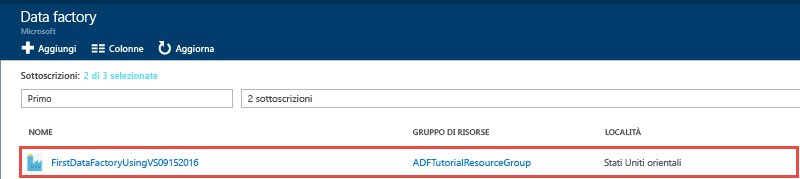
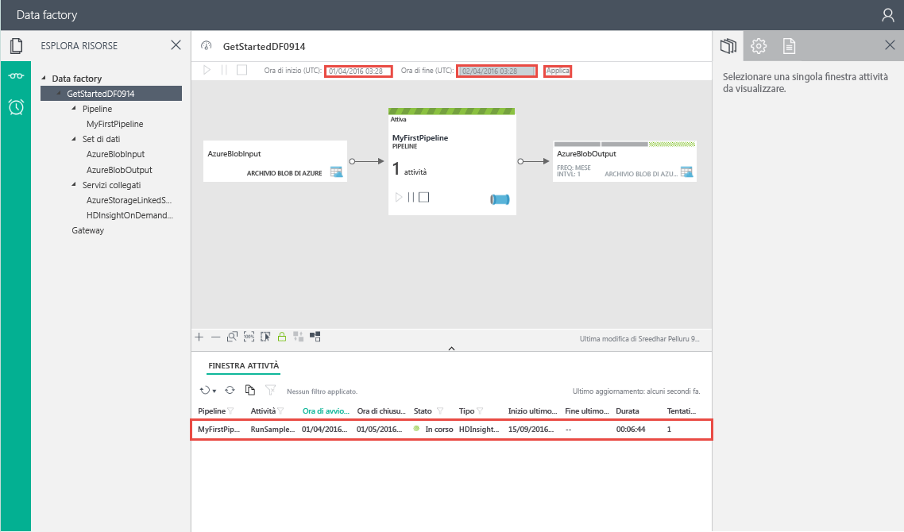
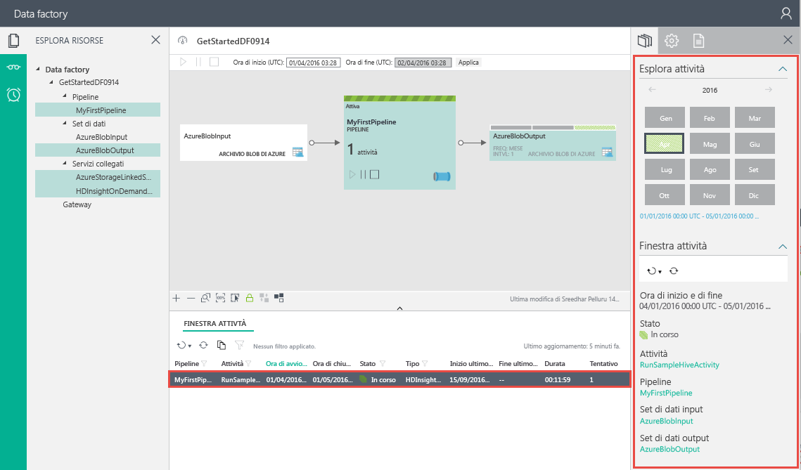

# Esercitazione: Creare la prima data factory di Azure con Microsoft Visual Studio
> [!div class="op_single_selector"]
> * [Panoramica e prerequisiti](data-factory-build-your-first-pipeline.md)
> * [Portale di Azure](data-factory-build-your-first-pipeline-using-editor.md)
> * [Visual Studio](data-factory-build-your-first-pipeline-using-vs.md)
> * [PowerShell](data-factory-build-your-first-pipeline-using-powershell.md)
> * [Modello di Resource Manager](data-factory-build-your-first-pipeline-using-arm.md)
> * [API REST](data-factory-build-your-first-pipeline-using-rest-api.md)
>
>

In questo articolo viene usato Microsoft Visual Studio per creare la prima data factory di Azure.

## Prerequisiti
1. Vedere la [panoramica dell'esercitazione](data-factory-build-your-first-pipeline.md) ed eseguire i passaggi relativi ai **prerequisiti** .
2. Per potere pubblicare entità di Data Factory in da Visual Studio Azure Data Factory, è necessario essere un **amministratore della sottoscrizione di Azure** .
3. È necessario disporre dei seguenti prodotti installati nel computer in uso:
   * Visual Studio 2013 o Visual Studio 2015
   * Download di Azure SDK per Visual Studio 2013 o Visual Studio 2015. Passare alla [pagina di download di Azure](https://azure.microsoft.com/downloads/) e fare clic su **VS 2013** o **VS 2015** nella sezione **.NET**.
   * Scaricare il plug-in Azure Data Factory più recente per Visual Studio: [VS 2013](https://visualstudiogallery.msdn.microsoft.com/754d998c-8f92-4aa7-835b-e89c8c954aa5) o [VS 2015](https://visualstudiogallery.msdn.microsoft.com/371a4cf9-0093-40fa-b7dd-be3c74f49005). È anche possibile aggiornare il plug-in nel modo seguente: dal menu scegliere **Strumenti** -> **Estensioni e aggiornamenti** -> **Online** -> **Visual Studio Gallery** -> **Microsoft Azure Data Factory Tools for Visual Studio** -> **Aggiorna**.

Verrà ora usato Visual Studio per creare una data factory di Azure.

## Creare un progetto di Visual Studio
1. Avviare **Visual Studio 2013** o **Visual Studio 2015**. Fare clic su **File**, scegliere **Nuovo** e quindi fare clic su **Progetto**. Si dovrebbe vedere la finestra di dialogo **Nuovo progetto** .  
2. Nella finestra di dialogo **Nuovo progetto** selezionare il modello **DataFactory** e fare clic su **Progetto data factory vuoto**.   

    
3. Immettere un **nome** per il progetto, un **percorso** e un nome per la **soluzione** e fare clic su **OK**.

    

## Creazione di servizi collegati
Una data factory può comprendere una o più pipeline. Una pipeline può comprendere una o più attività. Ad esempio, attività di copia per copiare dati da un'origine a un archivio dati di destinazione e attività Hive di HDInsight per eseguire uno script Hive e trasformare i dati di input. Vedere gli [archivi dati supportati](data-factory-data-movement-activities.md#supported-data-stores-and-formats) per tutte le origini e i sink supportati dall'attività di copia. Per l'elenco di servizi di calcolo supportati da Data Factory, vedere [Servizi collegati di calcolo](data-factory-compute-linked-services.md) .

In questo passaggio l'account di archiviazione di Azure e un cluster HDInsight su richiesta di Azure vengono collegati alla data factory. In questo esempio l'account di archiviazione di Azure contiene i dati di input e di output per la pipeline. In questo esempio il servizio collegato HDInsight viene usato per eseguire lo script Hive specificato nell'attività della pipeline. Identificare l'archivio dati/i servizi di calcolo usati nello scenario e collegare tali servizi alla data factory creando servizi collegati.  

Il nome e le impostazioni per la data factory vengono specificati in un secondo momento, quando si pubblica la soluzione Data Factory.

#### Creare il servizio collegato Archiviazione di Azure
In questo passaggio l'account di archiviazione di Azure viene collegato alla data factory. Per questa esercitazione viene usato lo stesso account di archiviazione di Azure per archiviare i dati di input/output e il file di script HQL.

1. Fare clic con il pulsante destro del mouse su **Servizi collegati** in Esplora soluzioni, scegliere **Aggiungi** e fare clic su **Nuovo elemento**.      
2. Nella finestra di dialogo **Aggiungi nuovo elemento** selezionare **Servizio collegato Archiviazione di Azure** nell'elenco e fare clic su **Aggiungi**.
3. Sostituire **accountname** e **accountkey** con il nome e la chiave dell'account di archiviazione di Azure. Per informazioni su come ottenere la chiave di accesso alle risorse di archiviazione, vedere le informazioni su come visualizzare, copiare e rigenerare le chiavi di accesso alle risorse di archiviazione in [Gestire l'account di archiviazione](../storage/storage-create-storage-account.md#manage-your-storage-account).
    
4. Salvare il file **AzureStorageLinkedService1.json** .

#### Creare un servizio collegato Azure HDInsight
In questo passaggio viene collegato un cluster HDInsight su richiesta alla data factory. Il cluster HDInsight viene creato automaticamente in fase di esecuzione ed eliminato al termine dell'elaborazione, se rimane inattivo per il periodo di tempo specificato. È possibile usare il proprio cluster HDInsight anziché un cluster HDInsight su richiesta. Per informazioni dettagliate, vedere [Servizi collegati di calcolo](data-factory-compute-linked-services.md) .

1. Fare clic con il pulsante destro del mouse su **Servizi collegati** in **Esplora soluzioni**, scegliere **Aggiungi** e fare clic su **Nuovo elemento**.
2. Selezionare **HDInsight On Demand Linked Service** (Servizio collegato HDInsight su richiesta) e fare clic su **Aggiungi**.
3. Sostituire il codice **JSON** con quanto segue:

        {
          "name": "HDInsightOnDemandLinkedService",
          "properties": {
            "type": "HDInsightOnDemand",
            "typeProperties": {
              "version": "3.2",
              "clusterSize": 1,
              "timeToLive": "00:30:00",
              "linkedServiceName": "AzureStorageLinkedService1"
            }
          }
        }

    La tabella seguente fornisce le descrizioni delle proprietà JSON usate nel frammento di codice:

   | Proprietà | Descrizione |
   | --- | --- |
   |  Versione |Specifica che la versione di HDInsight creata è 3.2. |
   |  ClusterSize |Specifica le dimensioni del cluster HDInsight. |
   |  TimeToLive |Specifica il tempo di inattività del cluster HDInsight, prima che sia eliminato. |
   |  linkedServiceName |Specifica l'account di archiviazione che viene usato per archiviare i log generati da HDInsight. |

    Tenere presente quanto segue:

   * Data Factory crea automaticamente un cluster HDInsight **basato su Windows** con il codice JSON precedente. È anche possibile creare automaticamente un cluster HDInsight **basato su Linux** . Per i dettagli, vedere [Servizio collegato Azure HDInsight su richiesta](data-factory-compute-linked-services.md#azure-hdinsight-on-demand-linked-service) .
   * È possibile usare il **proprio cluster HDInsight** anziché un cluster HDInsight su richiesta. Per i dettagli, vedere [Servizio collegato Azure HDInsight](data-factory-compute-linked-services.md#azure-hdinsight-linked-service) .
   * Il cluster HDInsight crea un **contenitore predefinito** nell'archivio BLOB specificato nel file JSON (**linkedServiceName**). HDInsight non elimina il contenitore quando viene eliminato il cluster. Questo comportamento dipende dalla progettazione. Con il servizio collegato HDInsight su richiesta, viene creato un cluster HDInsight ogni volta che viene elaborata una sezione, a meno che non esista un cluster attivo (**timeToLive**). Il cluster viene eliminato al termine dell'elaborazione.

       Man mano che vengono elaborate più sezioni, vengono visualizzati numerosi contenitori nell'archivio BLOB di Azure. Se non sono necessari per risolvere i problemi relativi ai processi, è possibile eliminarli per ridurre i costi di archiviazione. I nomi dei contenitori seguono questo schema: "adf**yourdatafactoryname**-**linkedservicename**-datetimestamp". Per eliminare i contenitori nell'archivio BLOB di Azure, usare strumenti come [Microsoft Azure Storage Explorer](http://storageexplorer.com/) .

     Per i dettagli, vedere [Servizio collegato Azure HDInsight su richiesta](data-factory-compute-linked-services.md#azure-hdinsight-on-demand-linked-service) .
4. Salvare il file **HDInsightOnDemandLinkedService1.json** .

## Creare set di dati
In questo passaggio vengono creati set di dati per rappresentare i dati di input e di output per l'elaborazione Hive. I set di dati fanno riferimento all'oggetto **AzureStorageLinkedService1** creato in precedenza in questa esercitazione. Il servizio collegato punta a un account di archiviazione di Azure e i set di dati specificano il contenitore, la cartella e il nome del file nella risorsa di archiviazione che contiene i dati di input e di output.   

#### Creare set di dati di input
1. In **Esplora soluzioni** fare clic con il pulsante destro del mouse su **Tabelle**, scegliere **Aggiungi** e fare clic su **Nuovo elemento**.
2. Selezionare **BLOB di Azure** dall'elenco, cambiare il nome del file in **InputDataSet.json** e quindi fare clic su **Aggiungi**.
3. Sostituire il codice **JSON** nell'editor con quanto segue:

    Nel frammento di codice JSON si crea un set di dati denominato **AzureBlobInput** che rappresenta i dati di input per un'attività nella pipeline. Si specifica anche che i dati di input si trovano nel contenitore BLOB denominato **adfgetstarted** e nella cartella denominata **inputdata**

        {
            "name": "AzureBlobInput",
            "properties": {
                "type": "AzureBlob",
                "linkedServiceName": "AzureStorageLinkedService1",
                "typeProperties": {
                    "fileName": "input.log",
                    "folderPath": "adfgetstarted/inputdata",
                    "format": {
                        "type": "TextFormat",
                        "columnDelimiter": ","
                    }
                },
                "availability": {
                    "frequency": "Month",
                    "interval": 1
                },
                "external": true,
                "policy": {}
            }
        }

    La tabella seguente fornisce le descrizioni delle proprietà JSON usate nel frammento di codice:

   | Proprietà | Descrizione |
   |:--- |:--- |
   | type |La proprietà type è impostata su AzureBlob perché i dati si trovano nell'archiviazione BLOB di Azure. |
   | linkedServiceName |Fa riferimento all'oggetto AzureStorageLinkedService1 creato in precedenza. |
   | fileName |Questa proprietà è facoltativa. Se si omette questa proprietà, vengono prelevati tutti i file da folderPath. In tal caso viene elaborato solo il file input.log. |
   | type |I file di log sono in formato testo, quindi viene usato TextFormat. |
   | columnDelimiter |Le colonne nei file di log sono delimitate da virgola (,). |
   | frequenza/intervallo |La frequenza è impostata su Month e l'intervallo è 1, ciò significa che le sezioni di input sono disponibili con cadenza mensile. |
   | external |Questa proprietà è impostata su true se i dati di input non vengono generati dal servizio Data factory. |
4. Salvare il file **InputDataset.json** .

#### Creare il set di dati di output
Viene creato ora il set di dati di output per rappresentare i dati di output archiviati nell'archivio BLOB di Azure.

1. In **Esplora soluzioni** fare clic con il pulsante destro del mouse su **Tabelle**, scegliere **Aggiungi** e fare clic su **Nuovo elemento**.
2. Selezionare **Blob di Azure** dall'elenco, cambiare il nome del file in **OutputDataset.json** e quindi fare clic su **Aggiungi**.
3. Sostituire il codice **JSON** nell'editor con quanto segue:

    Nel frammento di codice JSON si crea un set di dati denominato **AzureBlobOutput**e si specifica la struttura dei dati che vengono generati dallo script Hive. Si specifica anche che i risultati vengono archiviati nel contenitore BLOB denominato **adfgetstarted** e nella cartella denominata **partitioneddata**. La sezione **availability** specifica che il set di dati di output viene generato su base mensile.

        {
          "name": "AzureBlobOutput",
          "properties": {
            "type": "AzureBlob",
            "linkedServiceName": "AzureStorageLinkedService1",
            "typeProperties": {
              "folderPath": "adfgetstarted/partitioneddata",
              "format": {
                "type": "TextFormat",
                "columnDelimiter": ","
              }
            },
            "availability": {
              "frequency": "Month",
              "interval": 1
            }
          }
        }

    Per le descrizioni di queste proprietà, vedere la sezione **Creare il set di dati di input** . La proprietà esterna non viene impostata su un set di dati di output perché il set di dati viene generato dal servizio Data factory.
4. Salvare il file **OutputDataset.json** .

### Creare una pipeline
In questo passaggio viene creata la prima pipeline con un'attività **HDInsightHive** . La sezione di input è disponibile ogni mese (frequency: Month, interval: 1), la sezione di output viene generata ogni mese e anche la proprietà dell'utilità di pianificazione dell'attività è impostata su una frequenza mensile. Le impostazioni per il set di dati di output e l'utilità di pianificazione dell'attività devono corrispondere. In questo momento la pianificazione è basata sul set di dati di output, quindi è necessario creare un set di dati di output anche se l'attività non genera alcun output. Se l'attività non richiede input, è possibile ignorare la creazione del set di dati di input. Le proprietà usate nel codice JSON seguente sono illustrate in fondo a questa sezione.

1. In **Esplora soluzioni** fare clic con il pulsante destro del mouse su **Pipeline**, scegliere **Aggiungi** e fare clic su **Nuovo elemento.**
2. Selezionare **Hive Transformation Pipeline** (Pipeline di trasformazione Hive) dall'elenco e fare clic su **Aggiungi**.
3. Sostituire il codice **JSON** con il frammento seguente.

   > [!IMPORTANT]
   > Sostituire **storageaccountname** con il nome del proprio account di archiviazione.
   >
   >

        {
            "name": "MyFirstPipeline",
            "properties": {
                "description": "My first Azure Data Factory pipeline",
                "activities": [
                    {
                        "type": "HDInsightHive",
                        "typeProperties": {
                            "scriptPath": "adfgetstarted/script/partitionweblogs.hql",
                            "scriptLinkedService": "AzureStorageLinkedService1",
                            "defines": {
                                "inputtable": "wasb://adfgetstarted@<storageaccountname>.blob.core.windows.net/inputdata",
                                "partitionedtable": "wasb://adfgetstarted@<storageaccountname>.blob.core.windows.net/partitioneddata"
                            }
                        },
                        "inputs": [
                            {
                                "name": "AzureBlobInput"
                            }
                        ],
                        "outputs": [
                            {
                                "name": "AzureBlobOutput"
                            }
                        ],
                        "policy": {
                            "concurrency": 1,
                            "retry": 3
                        },
                        "scheduler": {
                            "frequency": "Month",
                            "interval": 1
                        },
                        "name": "RunSampleHiveActivity",
                        "linkedServiceName": "HDInsightOnDemandLinkedService"
                    }
                ],
                "start": "2016-04-01T00:00:00Z",
                "end": "2016-04-02T00:00:00Z",
                "isPaused": false
            }
        }

     Nel frammento di codice JSON si crea una pipeline costituita da una singola attività che usa Hive per elaborare i dati in un cluster HDInsight.

    Nel frammento di codice JSON si crea una pipeline costituita da una singola attività che usa Hive per elaborare i dati in un cluster HDInsight.

    Il file di script Hive, **partitionweblogs.hql**, si trova nell'account di archiviazione di Azure (specificato da scriptLinkedService, denominato **AzureStorageLinkedService1**) e nella cartella **script** del contenitore **adfgetstarted**.

    La sezione **defines** è usata per specificare le impostazioni di runtime che vengono passate allo script Hive come valori di configurazione Hive, ad esempio, ${hiveconf:inputtable}, ${hiveconf:partitionedtable}.

    Le proprietà **start** ed **end** della pipeline ne specificano il periodo attivo.

    Nel codice JSON dell'attività si specifica che lo script Hive viene eseguito sulla risorsa di calcolo specificata da **linkedServiceName** - **HDInsightOnDemandLinkedService**.

   > [!NOTE]
   > Per informazioni dettagliate sulle proprietà JSON usate nell'esempio, vedere la sezione "Pipeline JSON" dell'articolo [Pipeline e attività in Azure Data Factory](data-factory-create-pipelines.md).

4. Salvare il file **HiveActivity1.json** .

### Aggiungere partitionweblogs.hql e input.log come dipendenza
1. Fare clic con il pulsante destro del mouse su **Dipendenze** nella finestra **Esplora soluzioni**, scegliere **Aggiungi** e quindi fare clic su **Elemento esistente**.  
2. Passare a **C:\ADFGettingStarted**, selezionare i file **partitionweblogs.hql** e **input.log** e quindi fare clic su **Aggiungi**. Questi due file sono stati creati come prerequisiti nella [Panoramica dell'esercitazione](data-factory-build-your-first-pipeline.md).

Quando si pubblica la soluzione nel passaggio successivo, il file **partitionweblogs.hql** viene caricato nella cartella degli script del contenitore BLOB **adfgetstarted**.   

### Pubblicare/Distribuire le entità della data factory
1. Fare clic con il pulsante destro del mouse sul progetto in Esplora soluzioni e scegliere **Pubblica**.
2. Se viene visualizzato **Sign in to your Microsoft account** (Accedere all'account Microsoft), nella finestra di dialogo immettere le credenziali per l'account associato alla sottoscrizione di Azure e fare clic su **Accedi**.
3. Verrà visualizzata la finestra di dialogo seguente:

   
4. Nella pagina Configura data factory, procedere come segue:

   1. Selezionare l’opzione **Crea nuova data factory** .
   2. Immettere un **nome** univoco per la data factory, ad esempio **FirstDataFactoryUsingVS09152016**. Il nome deve essere univoco a livello globale.  

        > [AZURE.IMPORTANT] Se viene visualizzato l'errore **Il nome "FirstDataFactoryUsingVS" per la data factory non è disponibile** al momento della pubblicazione, modificare il nome (ad esempio, nomeutenteFirstDataFactoryUsingVS). Per informazioni sulle regole di denominazione per gli elementi di Data factory, vedere l'argomento relativo alle [regole di denominazione di Data factory](data-factory-naming-rules.md) .
3. Selezionare la sottoscrizione adatta per il campo **Sottoscrizione** .

        > [AZURE.IMPORTANT] Se non viene visualizzata alcuna sottoscrizione, verificare di aver eseguito l'accesso con un account amministratore o coamministratore della sottoscrizione.  

    4. Selezionare il **gruppo di risorse** per la data factory da creare.
    5. Selezionare l' **area** per la data factory.
    6. Fare clic su **Avanti** per passare alla pagina **Pubblica elementi**. Premere **TAB** per uscire dal campo Nome se il pulsante **Avanti** è disabilitato.
1. Nella pagina **Pubblica elementi** assicurarsi che tutte le data factory siano selezionate e fare clic su **Avanti** per passare alla pagina **Riepilogo**.     
2. Esaminare il riepilogo e fare clic su **Avanti** per avviare il processo di distribuzione e visualizzare lo **Stato della distribuzione**.
3. Nella pagina **Stato della distribuzione** , è possibile visualizzare lo stato del processo di distribuzione. Fare clic su Finish (Fine) dopo il termine della distribuzione.

Elementi importanti da considerare:

* Se viene visualizzato l'errore "**La sottoscrizione non è registrata per l'uso dello spazio dei nomi Microsoft.DataFactory**", eseguire una di queste operazioni e provare a ripetere la pubblicazione:

  * In Azure PowerShell eseguire questo comando per registrare il provider di Data Factory.

          Register-AzureRmResourceProvider -ProviderNamespace Microsoft.DataFactory

      È possibile eseguire questo comando per verificare che il provider di Data Factory sia registrato.

          Get-AzureRmResourceProvider
  * Accedere usando la sottoscrizione di Azure nel [portale di Azure](https://portal.azure.com) e passare al pannello Data Factory oppure creare un'istanza di Data Factory nel portale di Azure. Questa azione registra automaticamente il provider.
* Il nome di Data Factory può essere registrato come un nome DNS in futuro e pertanto divenire visibile pubblicamente.
* Per creare istanze di data factory, è necessario essere un amministratore o un coamministratore della sottoscrizione di Azure.

## Monitorare la pipeline
### Monitorare la pipeline con la vista diagramma
1. Accedere al [portale di Azure](https://portal.azure.com/)e seguire questa procedura:
   1. Fare clic su **Altri servizi** e quindi su **Data factory**.
       
   2. Selezionare il nome della data factory (ad esempio, **FirstDataFactoryUsingVS09152016**) nell'elenco di data factory.
       
2. Nella home page della data factory fare clic su **Diagramma**.

    
3. In Vista diagramma saranno visualizzati una panoramica delle pipeline e i set di dati usati in questa esercitazione.

    
4. Per visualizzare tutte le attività nella pipeline, fare clic con il pulsante destro del mouse sulla pipeline nel diagramma e scegliere Apri pipeline.

    
5. Assicurarsi che l'attività HDInsightHive sia visualizzata nella pipeline.

    

    Per tornare alla visualizzazione precedente, fare clic su **Data Factory** nel menu di navigazione nella parte superiore.
6. In **Vista diagramma** fare doppio clic sul set di dati **AzureBlobInput**. Verificare che lo stato della sezione sia **Pronto** . Potrebbero essere necessari alcuni minuti perché lo stato della sezione venga visualizzato come Pronto. Se dopo qualche minuto ciò non accade, verificare che il file di input, input.log, sia posizionato nel contenitore adfgetstarted e nella cartella inputdata corretti.

   
7. Fare clic su **X** per chiudere il pannello **AzureBlobInput**.
8. In **Vista diagramma** fare doppio clic sul set di dati **AzureBlobOutput**. Viene visualizzata la sezione in fase di elaborazione.

   
9. Al termine dell'elaborazione lo stato della sezione è **Pronta** .

   > [!IMPORTANT]
   > La creazione di un cluster HDInsight su richiesta di solito richiede tempo (circa 20 minuti). Di conseguenza, prevedere **circa 30 minuti** per l'elaborazione della sezione nella pipeline.  
   >
   >

        
10. Quando lo stato della sezione è **Pronto**, cercare i dati di output nella cartella **partitioneddata** del contenitore **adfgetstarted** nell'archivio BLOB.  

    
11. Fare clic sulla sezione per visualizzare i relativi dettagli in un pannello **Sezione dati** .

      
12. Fare clic su un'esecuzione di attività nell'elenco **Esecuzioni attività** (in questo scenario, un'attività Hive) per visualizzare i relativi dettagli nella finestra **Dettagli esecuzione attività**.   
        

    Nei file di log sono riportate la query Hive eseguita e le informazioni sullo stato. Tali file di log sono utili per risolvere eventuali problemi.  

Per istruzioni su come usare il portale di Azure per monitorare la pipeline e i set di dati creati in questa esercitazione, vedere [Monitorare e gestire le pipeline di Azure Data Factory](data-factory-monitor-manage-pipelines.md) .

### Monitorare la pipeline con l'app Monitoraggio e gestione
È anche possibile usare l'applicazione Monitoraggio e gestione per monitorare le pipeline. Per informazioni dettagliate sull'uso di questa applicazione, vedere [Monitorare e gestire le pipeline di Azure Data Factory con la nuova app di monitoraggio e gestione](data-factory-monitor-manage-app.md).

1. Fare clic sul riquadro Monitoraggio e gestione.

    
2. Verrà visualizzata l'applicazione Monitoraggio e gestione. Modificare **Ora di inizio** e **Ora di fine** in modo che corrispondano alle ore di inizio (04-01-2016 12:00 AM) e di fine (04-02-2016 12:00 AM) della pipeline e quindi fare clic su **Applica**.

    
3. Selezionare una finestra attività nell'elenco Activity Windows (Finestre attività) per visualizzare i relativi dettagli.
    

> [!IMPORTANT]
> Il file di input viene eliminato quando la sezione viene elaborata correttamente. Per eseguire di nuovo la sezione o ripetere l'esercitazione, caricare quindi il file di input (input.log) nella cartella inputdata del contenitore adfgetstarted.
>
>

## Usare Esplora Server per visualizzare le data factory
1. In **Visual Studio** fare clic su **Visualizza** nel menu e fare clic su **Esplora server**.
2. Nella finestra Esplora server espandere **Azure** e **Data factory**. Se viene visualizzata la finestra **Accedi a Visual Studio**, immettere l'**account** associato alla sottoscrizione di Azure e fare clic su **Continua**. Immettere la **password** e fare clic su **Accedi**. Visual Studio cerca di ottenere le informazioni su tutte le data factory di Azure nella sottoscrizione. Lo stato di questa operazione viene visualizzato nella finestra **Data Factory Task List** (Elenco attività Data Factory).

    
3. È possibile fare clic con il pulsante destro del mouse su una data factory e scegliere l'opzione **Export Data Factory to New Project** (Esporta la data factory in un nuovo progetto) per creare un progetto di Visual Studio basato su una data factory esistente.

    

## Aggiornare gli strumenti di Data factory di Azure per Visual Studio
Per aggiornare gli strumenti di Data Factory di Azure per Visual Studio, eseguire le operazioni seguenti:

1. Fare clic su **Strumenti**nel menu e selezionare **Estensioni e aggiornamenti**.
2. Selezionare **Aggiornamenti** nel riquadro sinistro e quindi selezionare **Visual Studio Gallery**.
3. Selezionare **Azure Data Factory tools for Visual Studio** e fare clic su **Aggiorna**. Se questa voce non è visibile, si dispone già della versione più recente dello strumento.

## Usare i file di configurazione
È possibile usare i file di configurazione in Visual Studio per configurare le proprietà di pipeline/tabelle/servizi collegati in modo diverso a seconda dell'ambiente.

Considerare la definizione JSON seguente per un servizio collegato Archiviazione di Azure. Per specificare **connectionString** con valori diversi per accountname e accountkey in base all'ambiente di sviluppo, di test o di produzione, in cui vengono distribuite le entità di Data Factory, usare un file di configurazione separato per ogni ambiente.

    {
        "name": "StorageLinkedService",
        "properties": {
            "type": "AzureStorage",
            "description": "",
            "typeProperties": {
                "connectionString": "DefaultEndpointsProtocol=https;AccountName=<accountname>;AccountKey=<accountkey>"
            }
        }
    }

### Aggiungere un file di configurazione
Per aggiungere un file di configurazione per ogni ambiente, seguire questa procedura:   

1. Fare clic con il pulsante destro del mouse sul progetto Data Factory nella soluzione di Visual Studio, scegliere **Aggiungi** e fare clic su **Nuovo elemento**.
2. Selezionare **Config** nell'elenco di modelli installati a sinistra, selezionare **File di configurazione**, immettere un **nome** per il file di configurazione e fare clic su **Aggiungi**.

    
3. Aggiungere i parametri di configurazione e i valori nel formato seguente.

        {
            "$schema": "http://datafactories.schema.management.azure.com/vsschemas/V1/Microsoft.DataFactory.Config.json",
            "AzureStorageLinkedService1": [
                {
                    "name": "$.properties.typeProperties.connectionString",
                    "value": "DefaultEndpointsProtocol=https;AccountName=<accountname>;AccountKey=<accountkey>"
                }
            ],
            "AzureSqlLinkedService1": [
                {
                    "name": "$.properties.typeProperties.connectionString",
                    "value":  "Server=tcp:spsqlserver.database.windows.net,1433;Database=spsqldb;User ID=spelluru;Password=Sowmya123;Trusted_Connection=False;Encrypt=True;Connection Timeout=30"
                }
            ]
        }

    Questo esempio configura la proprietà connectionString di un servizio collegato Archiviazione di Azure e di un servizio collegato Azure SQL. Si noti che la sintassi per specificare il nome è [JsonPath](http://goessner.net/articles/JsonPath/).   

    Se JSON ha una proprietà con una matrice di valori come indicato nel codice seguente:  

        "structure": [
              {
                  "name": "FirstName",
                "type": "String"
              },
              {
                "name": "LastName",
                "type": "String"
            }
        ],

    Configurare le proprietà come illustrato nel file di configurazione seguente, ovvero usare l'indicizzazione in base zero:

        {
            "name": "$.properties.structure[0].name",
            "value": "FirstName"
        }
        {
            "name": "$.properties.structure[0].type",
            "value": "String"
        }
        {
            "name": "$.properties.structure[1].name",
            "value": "LastName"
        }
        {
            "name": "$.properties.structure[1].type",
            "value": "String"
        }

### Nomi delle proprietà con spazi
Se il nome di una proprietà contiene spazi, usare le parentesi quadre come illustrato nell'esempio seguente per il nome del server di database:

     {
         "name": "$.properties.activities[1].typeProperties.webServiceParameters.['Database server name']",
         "value": "MyAsqlServer.database.windows.net"
     }

### Distribuire la soluzione usando una configurazione
Quando si pubblicano entità di Data factory di Azure in VS, è possibile specificare la configurazione che si vuole usare per tale operazione di pubblicazione.

Per pubblicare entità in un progetto di Data factory di Azure usando il file di configurazione:   

1. Fare clic con il pulsante destro del mouse sul progetto Data Factory e scegliere **Pubblica** per visualizzare la finestra di dialogo **Publish Items** (Pubblica elementi).
2. Selezionare una data factory esistente o specificare i valori per crearne una nella pagina **Configure data factory** (Configura data factory) e fare clic su **Avanti**.   
3. Nella pagina **Publish Items** (Pubblica elementi) è presente un elenco a discesa con le configurazioni disponibili per il campo **Select Deployment Config** (Seleziona configurazione di distribuzione).

    
4. Selezionare il **file di configurazione** che si vuole usare e fare clic su **Avanti**.
5. Verificare che il nome del file JSON sia presente nella pagina **Riepilogo** e fare clic su **Avanti**.
6. Fare clic su **Fine** al termine dell'operazione di distribuzione.

Quando si esegue la distribuzione, i valori del file di configurazione vengono usati per impostare i valori per le proprietà nei file JSON per le entità di Data Factory prima che le entità vengano distribuite nel servizio Azure Data Factory.   

## Riepilogo
In questa esercitazione è stata creata un'istanza di Azure Data Factory per elaborare i dati eseguendo lo script Hive in un cluster Hadoop di HDInsight. È stato usato l'editor di Data Factory nel portale di Azure per eseguire questa procedura:  

1. Creare un'istanza di Azure **Data Factory**.
2. Creare due **servizi collegati**:
   1. **Archiviazione di Azure** per collegare l'archivio BLOB di Azure che contiene i file di input/output alla data factory.
   2. **Azure HDInsight** per collegare un cluster Hadoop di HDInsight alla data factory. Azure Data Factory crea un cluster Hadoop di HDInsight JIT per elaborare i dati di input e generare i dati di output.
3. Creare due **set di dati**che descrivono i dati di input e di output per l'attività Hive di HDInsight nella pipeline.
4. Creare una **pipeline** con un'attività **Hive di HDInsight**.  

## Passaggi successivi
In questo articolo è stata creata una pipeline con un'attività di trasformazione (attività HDInsight) che esegue uno script Hive in un cluster HDInsight su richiesta. Per informazioni su come usare un'attività di copia per copiare i dati da un BLOB di Azure ad Azure SQL, vedere [Esercitazione: Copiare i dati di un BLOB di Azure in Azure SQL](data-factory-copy-data-from-azure-blob-storage-to-sql-database.md).

## Vedere anche
| Argomento | Descrizione |
|:--- |:--- |
| [Attività di trasformazione dei dati](data-factory-data-transformation-activities.md) |Questo articolo fornisce un elenco di attività di trasformazione dei dati (ad esempio, la trasformazione Hive di HDInsight usata in questa esercitazione) supportate da Azure Data Factory. |
| [Pianificazione ed esecuzione](data-factory-scheduling-and-execution.md) |Questo articolo descrive gli aspetti di pianificazione ed esecuzione del modello applicativo di Data factory di Azure. |
| [Pipeline](data-factory-create-pipelines.md) |Questo articolo fornisce informazioni sulle pipeline e sulle attività in Azure Data Factory e su come usarle per costruire flussi di lavoro end-to-end basati sui dati per lo scenario o l'azienda. |
| [Set di dati](data-factory-create-datasets.md) |Questo articolo fornisce informazioni sui set di dati in Azure Data Factory. |
| [Monitorare e gestire le pipeline con l'app di monitoraggio](data-factory-monitor-manage-app.md) |Questo articolo descrive come monitorare, gestire ed eseguire il debug delle pipeline usando l'app di monitoraggio e gestione. |

<!--HONumber=Nov16_HO2-->

