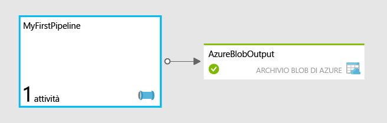

<properties
	pageTitle="Creare la prima data factory | Microsoft Azure"
	description="Questa esercitazione mostra come creare una data factory con una pipeline di dati che trasforma i dati usando Azure HDInsight."
	services="data-factory"
	documentationCenter=""
	authors="spelluru"
	manager="jhubbard"
	editor="monicar"/>

<tags
	ms.service="data-factory"
	ms.workload="data-services"
	ms.tgt_pltfrm="na"
	ms.devlang="na"
	ms.topic="article" 
	ms.date="05/23/2016"
	ms.author="spelluru"/>

# Esercitazione: Creare la prima data factory (panoramica)
> [AZURE.SELECTOR]
- [Panoramica dell'esercitazione](data-factory-build-your-first-pipeline.md)
- [Con l'editor di Data factory](data-factory-build-your-first-pipeline-using-editor.md)
- [Tramite PowerShell](data-factory-build-your-first-pipeline-using-powershell.md)
- [Con Visual Studio](data-factory-build-your-first-pipeline-using-vs.md)
- [Con il modello di Azure Resource Manager](data-factory-build-your-first-pipeline-using-arm.md)

Questo articolo consente di iniziare a compilare la prima Data factory di Azure.

> [AZURE.NOTE] Questo articolo non fornisce una panoramica concettuale del servizio Data factory di Azure. Per una panoramica dettagliata del servizio, vedere [Introduzione al servizio Data factory di Azure](data-factory-introduction.md).

## Panoramica dell'esercitazione
Questa esercitazione illustra i passaggi necessari per rendere operativa la prima data factory. Verrà creata una pipeline nella data factory che trasforma/elabora i dati di input per generare dati di output.

## Prerequisiti
Prima di iniziare questa esercitazione, sono necessari i prerequisiti seguenti:

1.	**Sottoscrizione di Azure**: se non è disponibile una sottoscrizione di Azure, è possibile creare un account di valutazione gratuito in pochi minuti. Vedere l'articolo [Versione di valutazione gratuita](https://azure.microsoft.com/pricing/free-trial/) per informazioni su come ottenere un account di valutazione gratuito.

2.	**Archiviazione di Azure**: in questa esercitazione si userà un account di archiviazione di Azure per archiviare i dati. Se non è disponibile un account di archiviazione di Azure, vedere l'articolo [Creare un account di archiviazione](../storage/storage-create-storage-account.md#create-a-storage-account). Dopo avere creato l'account di archiviazione, sarà necessario ottenere la chiave dell'account usata per accedere alla risorsa di archiviazione. Vedere [Visualizzare, copiare e rigenerare le chiavi di accesso alle risorse di archiviazione](../storage/storage-create-storage-account.md#view-copy-and-regenerate-storage-access-keys).

## Contenuto dell'esercitazione	
**Data factory di Azure** consente di comporre attività di **spostamento** dati e di **elaborazione** dati come flusso di lavoro basato sui dati. Si apprenderà come creare la prima pipeline che userà HDInsight per trasformare e analizzare i blog ogni mese.

In questa esercitazione si eseguirà la procedura seguente:

1.	Creare la **data factory**. Una data factory può contenere una o più pipeline di dati che spostano ed elaborano i dati. 
2.	Creare i **servizi collegati**. Creare un servizio collegato per collegare un archivio dati o un servizio di calcolo alla data factory. Un archivio dati come Archiviazione di Azure contiene i dati di input/output delle attività nella pipeline. Un servizio di calcolo come Azure HDInsight elabora/trasforma i dati.    
3.	Creare **set di dati** di input e di output. Un set di dati di input rappresenta l'input per un'attività nella pipeline, un set di dati di output rappresenta l'output dell'attività.
3.	Creare la **pipeline**. Una pipeline può comprendere una o più attività, ad esempio attività di copia per copiare dati da un'origine a una destinazione o attività Hive di HDInsight per trasformare i dati di input usando uno script Hive per generare dati di output. Questo esempio usa un'attività Hive di HDInsight che esegue uno script Hive. Lo script crea prima di tutto una tabella esterna che fa riferimento ai dati di log Web non elaborati presenti nell'archiviazione BLOB di Azure e quindi esegue il partizionamento dei dati non elaborati, per anno e per mese.

La prima pipeline, denominata **MyFirstPipeline**, usa un'attività Hive per trasformare e analizzare un log Web che verrà caricato nella cartella **inputdata** presente nel contenitore **adfgetstarted** (adfgetstarted/inputdata) nell'archiviazione BLOB di Azure.
 

In questa esercitazione, adfgetstarted (contenitore) = > inputdata (cartella) contiene un file denominato input.log. Questo file di log contiene voci relative ai tre mesi di gennaio, febbraio e marzo 2014. Ecco le righe di esempio per ogni mese nel file di input.

	2014-01-01,02:01:09,SAMPLEWEBSITE,GET,/blogposts/mvc4/step2.png,X-ARR-LOG-ID=2ec4b8ad-3cf0-4442-93ab-837317ece6a1,80,-,1.54.23.196,Mozilla/5.0+(Windows+NT+6.3;+WOW64)+AppleWebKit/537.36+(KHTML,+like+Gecko)+Chrome/31.0.1650.63+Safari/537.36,-,http://weblogs.asp.net/sample/archive/2007/12/09/asp-net-mvc-framework-part-4-handling-form-edit-and-post-scenarios.aspx,\N,200,0,0,53175,871 
	2014-02-01,02:01:10,SAMPLEWEBSITE,GET,/blogposts/mvc4/step7.png,X-ARR-LOG-ID=d7472a26-431a-4a4d-99eb-c7b4fda2cf4c,80,-,1.54.23.196,Mozilla/5.0+(Windows+NT+6.3;+WOW64)+AppleWebKit/537.36+(KHTML,+like+Gecko)+Chrome/31.0.1650.63+Safari/537.36,-,http://weblogs.asp.net/sample/archive/2007/12/09/asp-net-mvc-framework-part-4-handling-form-edit-and-post-scenarios.aspx,\N,200,0,0,30184,871
	2014-03-01,02:01:10,SAMPLEWEBSITE,GET,/blogposts/mvc4/step7.png,X-ARR-LOG-ID=d7472a26-431a-4a4d-99eb-c7b4fda2cf4c,80,-,1.54.23.196,Mozilla/5.0+(Windows+NT+6.3;+WOW64)+AppleWebKit/537.36+(KHTML,+like+Gecko)+Chrome/31.0.1650.63+Safari/537.36,-,http://weblogs.asp.net/sample/archive/2007/12/09/asp-net-mvc-framework-part-4-handling-form-edit-and-post-scenarios.aspx,\N,200,0,0,30184,871

Quando il file viene elaborato dalla pipeline con attività Hive di HDInsight, l'attività esegue uno script Hive nel cluster HDInsight che esegue il partizionamento dei dati di input per anno e per mese. Lo script crea tre cartelle di output che contengono un file con le voci di ogni mese.

	adfgetstarted/partitioneddata/year=2014/month=1/000000_0
	adfgetstarted/partitioneddata/year=2014/month=2/000000_0
	adfgetstarted/partitioneddata/year=2014/month=3/000000_0

Dalle righe di esempio mostrate sopra, la prima (con 2014-01-01) verrà scritta nel file 000000\_0 nella cartella month=1. Allo stesso modo, la seconda verrà scritta nel file nella cartella month=2 e la terza verrà scritta nel file nella cartella month=3.

## Caricare i file nell'archiviazione di Azure per l'esercitazione
Prima di iniziare l'esercitazione, bisogna preparare l'archiviazione di Azure con i file necessari per l'esercitazione.

In questa sezione si dovrà:

2. Caricare il file di query Hive (HQL) nella cartella **script** del contenitore **adfgetstarted**.
3. Caricare il file di input nella cartella **inputdata** del contenitore **adfgetstarted**. 

### Creare file di script HQL 

1. Avviare il **Blocco note** e incollare lo script HQL seguente. Questo script Hive crea due tabelle esterne: **WebLogsRaw** e **WebLogsPartitioned**. Scegliere **Salva con nome** dal menu **File**. Passare alla cartella **C:\\adfgetstarted** sul disco rigido. Selezionare **Tutti i file (*.*)** per il campo **Tipo file**. Immettere **partitionweblogs.hql** in **Nome file**. Verificare che il campo **Codifica** nella parte inferiore della finestra di dialogo sia impostato su **ANSI**. In caso contrario, impostarlo su **ANSI**.  
	
		set hive.exec.dynamic.partition.mode=nonstrict;
		
		DROP TABLE IF EXISTS WebLogsRaw; 
		CREATE TABLE WebLogsRaw (
		  date  date,
		  time  string,
		  ssitename string,
		  csmethod  string,
		  csuristem  string,
		  csuriquery string,
		  sport int,
		  susername string,
		  cipcsUserAgent string,
		  csCookie string,
		  csReferer string,
		  cshost  string,
		  scstatus  int,
		  scsubstatus  int,
		  scwin32status  int,
		  scbytes int,
		  csbytes int,
		  timetaken int
		)
		ROW FORMAT DELIMITED FIELDS TERMINATED BY ' '
		LINES TERMINATED BY '\n' 
		tblproperties ("skip.header.line.count"="2");
		
		LOAD DATA INPATH '${hiveconf:inputtable}' OVERWRITE INTO TABLE WebLogsRaw;
		
		DROP TABLE IF EXISTS WebLogsPartitioned ; 
		create external table WebLogsPartitioned (  
		  date  date,
		  time  string,
		  ssitename string,
		  csmethod  string,
		  csuristem  string,
		  csuriquery string,
		  sport int,
		  susername string,
		  cipcsUserAgent string,
		  csCookie string,
		  csReferer string,
		  cshost  string,
		  scstatus  int,
		  scsubstatus  int,
		  scwin32status  int,
		  scbytes int,
		  csbytes int,
		  timetaken int
		)
		partitioned by ( year int, month int)
		ROW FORMAT DELIMITED FIELDS TERMINATED BY ',' 
		STORED AS TEXTFILE 
		LOCATION '${hiveconf:partitionedtable}';
		
		INSERT INTO TABLE WebLogsPartitioned  PARTITION( year , month) 
		SELECT
		  date,
		  time,
		  ssitename,
		  csmethod,
		  csuristem,
		  csuriquery,
		  sport,
		  susername,
		  cipcsUserAgent,
		  csCookie,
		  csReferer,
		  cshost,
		  scstatus,
		  scsubstatus,
		  scwin32status,
		  scbytes,
		  csbytes,
		  timetaken,
		  year(date),
		  month(date)
		FROM WebLogsRaw

### Creare un file di input di esempio
Usando il Blocco note, creare un file denominato **input.log** in **C:\\adfgetstarted** con il contenuto seguente:

	#Software: Microsoft Internet Information Services 8.0
	#Fields: date time s-sitename cs-method cs-uri-stem cs-uri-query s-port cs-username c-ip cs(User-Agent) cs(Cookie) cs(Referer) cs-host sc-status sc-substatus sc-win32-status sc-bytes cs-bytes time-taken
	2014-01-01 02:01:09 SAMPLEWEBSITE GET /blogposts/mvc4/step2.png X-ARR-LOG-ID=2ec4b8ad-3cf0-4442-93ab-837317ece6a1 80 - 1.54.23.196 Mozilla/5.0+(Windows+NT+6.3;+WOW64)+AppleWebKit/537.36+(KHTML,+like+Gecko)+Chrome/31.0.1650.63+Safari/537.36 - http://weblogs.asp.net/sample/archive/2007/12/09/asp-net-mvc-framework-part-4-handling-form-edit-and-post-scenarios.aspx www.sample.com 200 0 0 53175 871 46
	2014-01-01 02:01:09 SAMPLEWEBSITE GET /blogposts/mvc4/step3.png X-ARR-LOG-ID=9eace870-2f49-4efd-b204-0d170da46b4a 80 - 1.54.23.196 Mozilla/5.0+(Windows+NT+6.3;+WOW64)+AppleWebKit/537.36+(KHTML,+like+Gecko)+Chrome/31.0.1650.63+Safari/537.36 - http://weblogs.asp.net/sample/archive/2007/12/09/asp-net-mvc-framework-part-4-handling-form-edit-and-post-scenarios.aspx www.sample.com 200 0 0 51237 871 32
	2014-01-01 02:01:09 SAMPLEWEBSITE GET /blogposts/mvc4/step4.png X-ARR-LOG-ID=4bea5b3d-8ac9-46c9-9b8c-ec3e9500cbea 80 - 1.54.23.196 Mozilla/5.0+(Windows+NT+6.3;+WOW64)+AppleWebKit/537.36+(KHTML,+like+Gecko)+Chrome/31.0.1650.63+Safari/537.36 - http://weblogs.asp.net/sample/archive/2007/12/09/asp-net-mvc-framework-part-4-handling-form-edit-and-post-scenarios.aspx www.sample.com 200 0 0 72177 871 47
	2014-01-01 02:01:09 SAMPLEWEBSITE GET /blogposts/mvc4/step5.png X-ARR-LOG-ID=9b0c14b1-434d-495a-9b0d-46775194257b 80 - 1.54.23.196 Mozilla/5.0+(Windows+NT+6.3;+WOW64)+AppleWebKit/537.36+(KHTML,+like+Gecko)+Chrome/31.0.1650.63+Safari/537.36 - http://weblogs.asp.net/sample/archive/2007/12/09/asp-net-mvc-framework-part-4-handling-form-edit-and-post-scenarios.aspx www.sample.com 200 0 0 37931 871 32
	2014-01-01 02:01:09 SAMPLEWEBSITE GET /blogposts/mvc4/step6.png X-ARR-LOG-ID=f99cff81-ec38-4a13-b2fe-21b10adca996 80 - 1.54.23.196 Mozilla/5.0+(Windows+NT+6.3;+WOW64)+AppleWebKit/537.36+(KHTML,+like+Gecko)+Chrome/31.0.1650.63+Safari/537.36 - http://weblogs.asp.net/sample/archive/2007/12/09/asp-net-mvc-framework-part-4-handling-form-edit-and-post-scenarios.aspx www.sample.com 200 0 0 27146 871 47
	2014-01-01 02:01:09 SAMPLEWEBSITE GET /blogposts/mvc4/step1.png X-ARR-LOG-ID=af94d3b4-8e05-4871-82c4-638f866d4e83 80 - 1.54.23.196 Mozilla/5.0+(Windows+NT+6.3;+WOW64)+AppleWebKit/537.36+(KHTML,+like+Gecko)+Chrome/31.0.1650.63+Safari/537.36 - http://weblogs.asp.net/sample/archive/2007/12/09/asp-net-mvc-framework-part-4-handling-form-edit-and-post-scenarios.aspx www.sample.com 200 0 0 66259 871 140
	2014-02-01 02:01:10 SAMPLEWEBSITE GET /blogposts/mvc4/step7.png X-ARR-LOG-ID=d7472a26-431a-4a4d-99eb-c7b4fda2cf4c 80 - 1.54.23.196 Mozilla/5.0+(Windows+NT+6.3;+WOW64)+AppleWebKit/537.36+(KHTML,+like+Gecko)+Chrome/31.0.1650.63+Safari/537.36 - http://weblogs.asp.net/sample/archive/2007/12/09/asp-net-mvc-framework-part-4-handling-form-edit-and-post-scenarios.aspx www.sample.com 200 0 0 30184 871 47
	2014-02-01 02:01:10 SAMPLEWEBSITE GET /blogposts/mvc4/step7.png X-ARR-LOG-ID=d7472a26-431a-4a4d-99eb-c7b4fda2cf4c 80 - 1.54.23.196 Mozilla/5.0+(Windows+NT+6.3;+WOW64)+AppleWebKit/537.36+(KHTML,+like+Gecko)+Chrome/31.0.1650.63+Safari/537.36 - http://weblogs.asp.net/sample/archive/2007/12/09/asp-net-mvc-framework-part-4-handling-form-edit-and-post-scenarios.aspx www.sample.com 200 0 0 30184 871 47
	2014-02-01 02:01:10 SAMPLEWEBSITE GET /blogposts/mvc4/step7.png X-ARR-LOG-ID=d7472a26-431a-4a4d-99eb-c7b4fda2cf4c 80 - 1.54.23.196 Mozilla/5.0+(Windows+NT+6.3;+WOW64)+AppleWebKit/537.36+(KHTML,+like+Gecko)+Chrome/31.0.1650.63+Safari/537.36 - http://weblogs.asp.net/sample/archive/2007/12/09/asp-net-mvc-framework-part-4-handling-form-edit-and-post-scenarios.aspx www.sample.com 200 0 0 30184 871 47
	2014-02-01 02:01:10 SAMPLEWEBSITE GET /blogposts/mvc4/step7.png X-ARR-LOG-ID=d7472a26-431a-4a4d-99eb-c7b4fda2cf4c 80 - 1.54.23.196 Mozilla/5.0+(Windows+NT+6.3;+WOW64)+AppleWebKit/537.36+(KHTML,+like+Gecko)+Chrome/31.0.1650.63+Safari/537.36 - http://weblogs.asp.net/sample/archive/2007/12/09/asp-net-mvc-framework-part-4-handling-form-edit-and-post-scenarios.aspx www.sample.com 200 0 0 30184 871 47
	2014-02-01 02:01:10 SAMPLEWEBSITE GET /blogposts/mvc4/step7.png X-ARR-LOG-ID=d7472a26-431a-4a4d-99eb-c7b4fda2cf4c 80 - 1.54.23.196 Mozilla/5.0+(Windows+NT+6.3;+WOW64)+AppleWebKit/537.36+(KHTML,+like+Gecko)+Chrome/31.0.1650.63+Safari/537.36 - http://weblogs.asp.net/sample/archive/2007/12/09/asp-net-mvc-framework-part-4-handling-form-edit-and-post-scenarios.aspx www.sample.com 200 0 0 30184 871 47
	2014-02-01 02:01:10 SAMPLEWEBSITE GET /blogposts/mvc4/step7.png X-ARR-LOG-ID=d7472a26-431a-4a4d-99eb-c7b4fda2cf4c 80 - 1.54.23.196 Mozilla/5.0+(Windows+NT+6.3;+WOW64)+AppleWebKit/537.36+(KHTML,+like+Gecko)+Chrome/31.0.1650.63+Safari/537.36 - http://weblogs.asp.net/sample/archive/2007/12/09/asp-net-mvc-framework-part-4-handling-form-edit-and-post-scenarios.aspx www.sample.com 200 0 0 30184 871 47
	2014-02-01 02:01:10 SAMPLEWEBSITE GET /blogposts/mvc4/step7.png X-ARR-LOG-ID=d7472a26-431a-4a4d-99eb-c7b4fda2cf4c 80 - 1.54.23.196 Mozilla/5.0+(Windows+NT+6.3;+WOW64)+AppleWebKit/537.36+(KHTML,+like+Gecko)+Chrome/31.0.1650.63+Safari/537.36 - http://weblogs.asp.net/sample/archive/2007/12/09/asp-net-mvc-framework-part-4-handling-form-edit-and-post-scenarios.aspx www.sample.com 200 0 0 30184 871 47
	2014-02-01 02:01:10 SAMPLEWEBSITE GET /blogposts/mvc4/step7.png X-ARR-LOG-ID=d7472a26-431a-4a4d-99eb-c7b4fda2cf4c 80 - 1.54.23.196 Mozilla/5.0+(Windows+NT+6.3;+WOW64)+AppleWebKit/537.36+(KHTML,+like+Gecko)+Chrome/31.0.1650.63+Safari/537.36 - http://weblogs.asp.net/sample/archive/2007/12/09/asp-net-mvc-framework-part-4-handling-form-edit-and-post-scenarios.aspx www.sample.com 200 0 0 30184 871 47
	2014-03-01 02:01:10 SAMPLEWEBSITE GET /blogposts/mvc4/step7.png X-ARR-LOG-ID=d7472a26-431a-4a4d-99eb-c7b4fda2cf4c 80 - 1.54.23.196 Mozilla/5.0+(Windows+NT+6.3;+WOW64)+AppleWebKit/537.36+(KHTML,+like+Gecko)+Chrome/31.0.1650.63+Safari/537.36 - http://weblogs.asp.net/sample/archive/2007/12/09/asp-net-mvc-framework-part-4-handling-form-edit-and-post-scenarios.aspx www.sample.com 200 0 0 30184 871 47
	2014-03-01 02:01:10 SAMPLEWEBSITE GET /blogposts/mvc4/step7.png X-ARR-LOG-ID=d7472a26-431a-4a4d-99eb-c7b4fda2cf4c 80 - 1.54.23.196 Mozilla/5.0+(Windows+NT+6.3;+WOW64)+AppleWebKit/537.36+(KHTML,+like+Gecko)+Chrome/31.0.1650.63+Safari/537.36 - http://weblogs.asp.net/sample/archive/2007/12/09/asp-net-mvc-framework-part-4-handling-form-edit-and-post-scenarios.aspx www.sample.com 200 0 0 30184 871 47
	2014-03-01 02:01:10 SAMPLEWEBSITE GET /blogposts/mvc4/step7.png X-ARR-LOG-ID=d7472a26-431a-4a4d-99eb-c7b4fda2cf4c 80 - 1.54.23.196 Mozilla/5.0+(Windows+NT+6.3;+WOW64)+AppleWebKit/537.36+(KHTML,+like+Gecko)+Chrome/31.0.1650.63+Safari/537.36 - http://weblogs.asp.net/sample/archive/2007/12/09/asp-net-mvc-framework-part-4-handling-form-edit-and-post-scenarios.aspx www.sample.com 200 0 0 30184 871 47
	2014-03-01 02:01:10 SAMPLEWEBSITE GET /blogposts/mvc4/step7.png X-ARR-LOG-ID=d7472a26-431a-4a4d-99eb-c7b4fda2cf4c 80 - 1.54.23.196 Mozilla/5.0+(Windows+NT+6.3;+WOW64)+AppleWebKit/537.36+(KHTML,+like+Gecko)+Chrome/31.0.1650.63+Safari/537.36 - http://weblogs.asp.net/sample/archive/2007/12/09/asp-net-mvc-framework-part-4-handling-form-edit-and-post-scenarios.aspx www.sample.com 200 0 0 30184 871 47
	2014-03-01 02:01:10 SAMPLEWEBSITE GET /blogposts/mvc4/step7.png X-ARR-LOG-ID=d7472a26-431a-4a4d-99eb-c7b4fda2cf4c 80 - 1.54.23.196 Mozilla/5.0+(Windows+NT+6.3;+WOW64)+AppleWebKit/537.36+(KHTML,+like+Gecko)+Chrome/31.0.1650.63+Safari/537.36 - http://weblogs.asp.net/sample/archive/2007/12/09/asp-net-mvc-framework-part-4-handling-form-edit-and-post-scenarios.aspx www.sample.com 200 0 0 30184 871 47

### Caricare file di input e file HQL nell'archiviazione BLOB di Azure

Per eseguire questa operazione è possibile usare strumenti quali [Microsoft Azure Storage Explorer](http://storageexplorer.com/) o CloudXPlorer di ClumsyLeaf Software. Questa sezione fornisce istruzioni sull'uso dello strumento AzCopy.
	 
2. Per preparare l'archiviazione di Azure per l'esercitazione:
	1. Scaricare l'[ultima versione di **AzCopy**](http://aka.ms/downloadazcopy) o l'[ultima versione di anteprima](http://aka.ms/downloadazcopypr). Per istruzioni sull'uso dell'utilità, vedere l'articolo [Come usare AzCopy](../storage/storage-use-azcopy.md).
	2. Dopo avere installato AzCopy, è possibile aggiungerlo al percorso del sistema eseguendo il comando seguente al prompt dei comandi. 
	
			set path=%path%;C:\Program Files (x86)\Microsoft SDKs\Azure\AzCopy

	3. Passare alla cartella C:\\adfgetstarted ed eseguire il comando seguente per caricare il file **input.log** nell'account di archiviazione (contenitore **adfgetstarted** e cartella **inputdata**). Sostituire **StorageAccountName** con il nome del proprio account di archiviazione e **Storage Key** con la chiave dell'account di archiviazione.

			AzCopy /Source:. /Dest:https://<storageaccountname>.blob.core.windows.net/adfgetstarted/inputdata /DestKey:<storagekey>  /Pattern:input.log

		> [AZURE.NOTE] Il comando precedente crea un contenitore denominato **adfgetstarted** nell'archiviazione BLOB di Azure e copia il file **partitionweblogs.hql** dall'unità locale alla cartella **inputdata** nel contenitore.
	
	5. Al termine del caricamento del file, verrà visualizzato un output simile al seguente da AzCopy.
	
			Finished 1 of total 1 file(s).
			[2015/12/16 23:07:33] Transfer summary:
			-----------------
			Total files transferred: 1
			Transfer successfully:   1
			Transfer skipped:        0
			Transfer failed:         0
			Elapsed time:            00.00:00:01
	1. Eseguire il comando seguente per caricare il file **partitionweblogs.hql** nella cartella **script** del contenitore **adfgetstarted**. Il comando è il seguente: 
	
			AzCopy /Source:. /Dest:https://<storageaccountname>.blob.core.windows.net/adfgetstarted/script /DestKey:<storagekey>  /Pattern:partitionweblogs.hql

A questo punto è possibile iniziare l'esercitazione. Fare clic su una delle schede nella parte superiore per creare la prima data factory di Azure usando una delle risorse seguenti:

- Portale di Azure (editor di Data factory)
- Azure PowerShell
- Visual Studio
- Modelli di Gestione risorse di Azure 

<!---HONumber=AcomDC_0525_2016-->