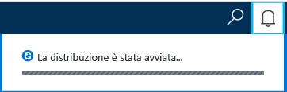
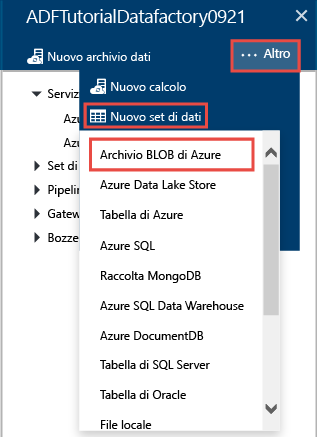
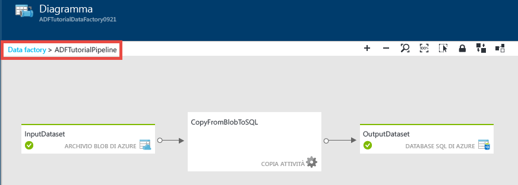
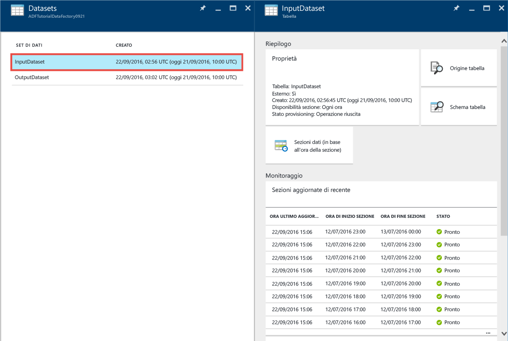
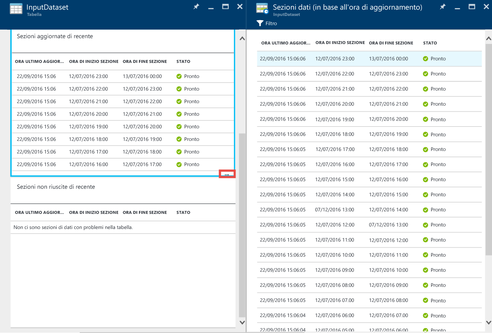
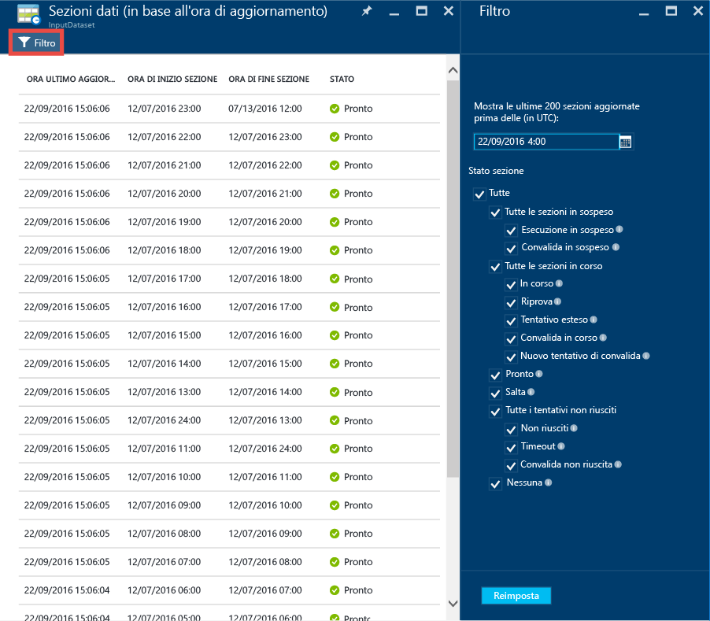
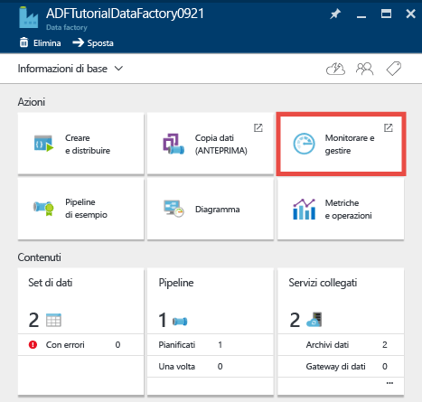
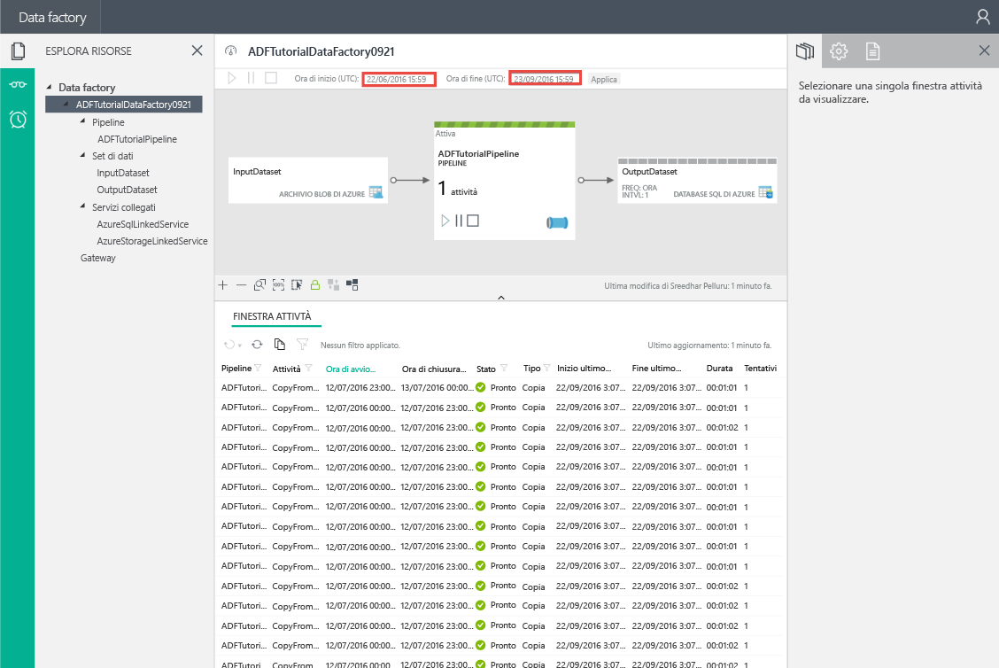
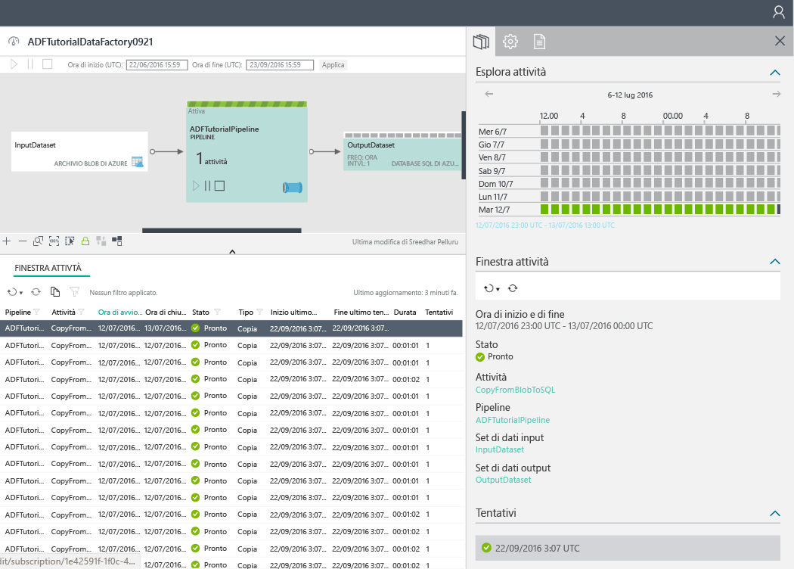

# <a name="tutorial-create-a-pipeline-with-copy-activity-using-azure-portal"></a>Esercitazione: Creare una pipeline con l'attività di copia usando il portale di Azure
> [!div class="op_single_selector"]
> * [Panoramica e prerequisiti](data-factory-copy-data-from-azure-blob-storage-to-sql-database.md)
> * [Copia guidata](data-factory-copy-data-wizard-tutorial.md)
> * [Portale di Azure](data-factory-copy-activity-tutorial-using-azure-portal.md)
> * [Visual Studio](data-factory-copy-activity-tutorial-using-visual-studio.md)
> * [PowerShell](data-factory-copy-activity-tutorial-using-powershell.md)
> * [Modello di Azure Resource Manager](data-factory-copy-activity-tutorial-using-azure-resource-manager-template.md)
> * [API REST](data-factory-copy-activity-tutorial-using-rest-api.md)
> * [API .NET](data-factory-copy-activity-tutorial-using-dotnet-api.md)
> 
> 

Questa esercitazione illustra come creare e monitorare una data factory di Azure con il portale di Azure. La pipeline nella data factory usa un'attività di copia per copiare i dati dall'archivio BLOB di Azure al database SQL di Azure.

Di seguito sono elencati i passaggi da eseguire in questa esercitazione:

| Passaggio | Descrizione |
| --- | --- |
| [Creazione di un'istanza di Data factory di Azure](#create-data-factory) |In questo passaggio viene creata un'istanza di Azure Data Factory denominata **ADFTutorialDataFactory**. |
| [Creazione di servizi collegati](#create-linked-services) |In questo passaggio vengono creati due servizi collegati: **AzureStorageLinkedService** e **AzureSqlLinkedService**. <br/><br/>AzureStorageLinkedService collega la risorsa di archiviazione di Azure e AzureSqlLinkedService collega il database SQL di Azure ad ADFTutorialDataFactory. I dati di input per la pipeline si trovano in un contenitore BLOB nell'archivio BLOB di Azure e i dati di output vengono archiviati in una tabella nel database SQL di Azure. Questi due archivi dati vengono quindi aggiunti alla data factory come servizi collegati. |
| [Creare set di dati di input e di output](#create-datasets) |Nel passaggio precedente sono stati creati servizi collegati che fanno riferimento agli archivi dati che includono dati di input/output. Questo passaggio permette di definire due set di dati, **InputDataset** e **OutputDataset**, che rappresentano i dati di input/output memorizzati negli archivi dati. <br/><br/>Per InputDataset si specifica il contenitore BLOB che include un BLOB con i dati di origine, mentre per OutputDataset si specifica la tabella SQL contenente i dati di output. Specificare anche altre proprietà come struttura, disponibilità e criteri. |
| [Creare una pipeline](#create-pipeline) |In questo passaggio viene creata una pipeline denominata **ADFTutorialPipeline** in ADFTutorialDataFactory. <br/><br/>Si aggiunge alla pipeline un'**attività di copia** che copia i dati di input dal BLOB di Azure nella tabella SQL di Azure di output. L'attività di copia esegue lo spostamento dei dati in Azure Data Factory e si basa su un servizio disponibile a livello globale che può copiare dati tra diversi archivi dati in modo sicuro, affidabile e scalabile. Per informazioni dettagliate sull'attività di copia, vedere [Attività di spostamento dei dati](data-factory-data-movement-activities.md) . |
| [Monitorare la pipeline](#monitor-pipeline) |In questo passaggio vengono monitorate sezioni delle tabelle di input e di output mediante il portale di Azure. |

## <a name="prerequisites"></a>Prerequisiti
Prima di eseguire questa esercitazione, completare i prerequisiti indicati nella [panoramica dell'esercitazione](data-factory-copy-data-from-azure-blob-storage-to-sql-database.md) .

## <a name="create-data-factory"></a>Creare un'istanza di Data Factory
In questo passaggio viene usato il portale di Azure per creare un'istanza di Azure Data Factory denominata **ADFTutorialDataFactory**.

1. Dopo aver eseguito l'accesso al [portale di Azure](https://portal.azure.com/), fare clic su **Nuovo**, selezionare **Intelligence e analisi** e quindi scegliere **Data Factory**. 
   
       
2. Nel pannello **Nuova data factory** :
   
   1. Immettere **ADFTutorialDataFactory** come **nome**. 
      
         
      
       Il nome della data factory di Azure deve essere **univoco a livello globale**. Se viene visualizzato l'errore seguente, modificare il nome della data factory, ad esempio, nomeutenteADFTutorialDataFactory, e provare di nuovo a crearla. Per informazioni sulle regole di denominazione per gli elementi di Data Factory, vedere l'argomento [Azure Data Factory - Regole di denominazione](data-factory-naming-rules.md) .
      
           Data factory name “ADFTutorialDataFactory” is not available  
      
       
   2. Selezionare la **sottoscrizione**di Azure.
   3. Per il gruppo di risorse, eseguire una di queste operazioni:
      
      - Selezionare **Usa esistente**e scegliere un gruppo di risorse esistente dall'elenco a discesa. 
      - Selezionare **Crea nuovo**e immettere un nome per il gruppo di risorse.   
         
          Alcuni dei passaggi di questa esercitazione presuppongono l'uso del nome **ADFTutorialResourceGroup** per il gruppo di risorse. Per informazioni sui gruppi di risorse, vedere l'articolo relativo all' [uso di gruppi di risorse per la gestione delle risorse di Azure](../azure-resource-manager/resource-group-overview.md).  
   4. Selezionare la **località** per la data factory. Nell'elenco a discesa vengono visualizzate solo le aree supportate dal servizio Data Factory.
   5. Selezionare **Aggiungi alla Schermata iniziale**.     
   6. Fare clic su **Crea**.
      
      > [!IMPORTANT]
      > Per creare istanze di data factory, è necessario essere membri del ruolo [Collaboratore Data factory](../active-directory/role-based-access-built-in-roles.md#data-factory-contributor) a livello di sottoscrizione/gruppo di risorse.
      > 
      > Il nome di Data Factory può essere registrato come un nome DNS in futuro e pertanto divenire visibile pubblicamente.                
      > 
      > 
3. Per visualizzare i messaggi di stato o notifica, fare clic sull'icona a forma di campanello sulla barra degli strumenti. 
   
    
4. Al termine della creazione verrà visualizzato il pannello **Data Factory** , come illustrato nell'immagine.
   
   

## <a name="create-linked-services"></a>Creazione di servizi collegati
I servizi collegati collegano archivi dati o servizi di calcolo a una data factory di Azure. Vedere gli [archivi dati supportati](data-factory-data-movement-activities.md#supported-data-stores-and-formats) per tutte le origini e i sink supportati dall'attività di copia. Per l'elenco di servizi di calcolo supportati da Data Factory, vedere [Servizi collegati di calcolo](data-factory-compute-linked-services.md) . Questa esercitazione non prevede l'uso di servizi di calcolo. 

In questo passaggio vengono creati due servizi collegati: **AzureStorageLinkedService** e **AzureSqlLinkedService**. Il servizio collegato AzureStorageLinkedService collega un account di archiviazione di Azure e AzureSqlLinkedService collega un database SQL di Azure ad **ADFTutorialDataFactory**. Più avanti in questa esercitazione viene creata una pipeline che copia i dati da un contenitore BLOB di AzureStorageLinkedService e li inserisce in una tabella SQL di AzureSqlLinkedService.

### <a name="create-a-linked-service-for-the-azure-storage-account"></a>Creare un servizio collegato per l'account di archiviazione di Azure
1. Nel pannello **Data Factory** fare clic sul riquadro **Creare e distribuire** per avviare l'**Editor** per la data factory.
   
    
2. Nell'**Editor** fare clic sul pulsante **Nuovo archivio dati** sulla barra degli strumenti, quindi scegliere **Archiviazione di Azure** dal menu a discesa. Nel riquadro a destra verrà visualizzato il modello JSON per la creazione di un servizio collegato di archiviazione di Azure. 
   
        
3. Sostituire `<accountname>` e `<accountkey>` con i valori del nome e della chiave dell'account di archiviazione di Azure. 
   
        
4. Fare clic su **Distribuisci** sulla barra degli strumenti. Nella visualizzazione albero dovrebbe essere visibile il servizio **AzureStorageLinkedService** distribuito. 
   
    

> [!NOTE]
> Per informazioni dettagliate sulle proprietà JSON, vedere la sezione relativa allo [spostamento di dati da o in BLOB di Azure](data-factory-azure-blob-connector.md#azure-storage-linked-service) .
> 
> 

### <a name="create-a-linked-service-for-the-azure-sql-database"></a>Creare un servizio collegato per il database SQL di Azure
1. Nell'**editor di Data Factory** fare clic sul pulsante **Nuovo archivio dati** sulla barra degli strumenti e scegliere **Database SQL di Azure** dal menu a discesa. Nel riquadro a destra verrà visualizzato il modello JSON per la creazione di un servizio collegato SQL di Azure.
2. Sostituire `<servername>`, `<databasename>`, `<username>@<servername>` e `<password>` con i nomi del server di Azure SQL e del database, l'account utente e la password. 
3. Fare clic su **Distribuisci** sulla barra degli strumenti per creare e distribuire **AzureSqlLinkedService**.
4. Assicurarsi che **AzureSqlLinkedService** sia visibile nella visualizzazione albero. 

> [!NOTE]
> Per informazioni dettagliate sulle proprietà JSON, vedere la sezione relativa allo [spostamento di dati da o nel database SQL di Azure](data-factory-azure-sql-connector.md#azure-sql-linked-service-properties) .
> 
> 

## <a name="create-datasets"></a>Creare set di dati
Nel passaggio precedente sono stati creati i servizi collegati **AzureStorageLinkedService** e **AzureSqlLinkedService** per collegare un account di archiviazione di Azure e un database SQL di Azure alla data factory **ADFTutorialDataFactory**. In questo passaggio vengono definiti due set di dati, **InputDataset** e **OutputDataset**, che rappresentano i dati di input/output memorizzati negli archivi dati a cui fanno riferimento rispettivamente AzureStorageLinkedService e AzureSqlLinkedService. Per InputDataset si specifica il contenitore BLOB che include un BLOB con i dati di origine, mentre per OutputDataset si specifica la tabella SQL contenente i dati di output. 

### <a name="create-input-dataset"></a>Creare set di dati di input
In questo passaggio viene creato un set di dati denominato **InputDataset** che punta a un contenitore BLOB in Archiviazione di Azure rappresentato dal servizio collegato **AzureStorageLinkedService**.

1. Nell'**editor** della data factory fare clic su **... Altro**, fare clic su **Nuovo set di dati** e quindi scegliere **Archivio BLOB di Azure** dal menu a discesa. 
   
    
2. Sostituire il codice JSON nel riquadro a destra con il frammento di codice JSON seguente: 
   
    ```JSON
    {
      "name": "InputDataset",
      "properties": {
        "structure": [
          {
            "name": "FirstName",
            "type": "String"
          },
          {
            "name": "LastName",
            "type": "String"
          }
        ],
        "type": "AzureBlob",
        "linkedServiceName": "AzureStorageLinkedService",
        "typeProperties": {
          "folderPath": "adftutorial/",
          "fileName": "emp.txt",
          "format": {
            "type": "TextFormat",
            "columnDelimiter": ","
          }
        },
        "external": true,
        "availability": {
          "frequency": "Hour",
          "interval": 1
        }
      }
    }
    ```   
    Tenere presente quanto segue: 
   
   * Il set di dati **type** è impostato su **AzureBlob**.
   * L'oggetto **linkedServiceName** è impostato su **AzureStorageLinkedService**. Questo servizio collegato è stato creato nel passaggio 2.
   * L'oggetto **folderPath** è impostato sul contenitore **adftutorial**. È anche possibile specificare il nome di un BLOB all'interno della cartella usando la proprietà **fileName** . Poiché non si specifica il nome del BLOB, i dati da tutti i BLOB nel contenitore sono considerati come dati di input.  
   * L'oggetto **type** di format è impostato su **TextFormat**.
   * Nel file di testo sono presenti due campi, **FirstName** e **LastName**, separati da una virgola (**columnDelimiter**).    
   * L'oggetto **availability** è impostato su **hourly**. L'oggetto **frequency** è impostato su **hour** e l'oggetto **interval** è impostato su **1**. Quindi, il servizio Data Factory cerca i dati di input ogni ora nella cartella radice del contenitore BLOB**adftutorial**specificato. 
     
     Se non si specifica **fileName** per un set di dati di **input**, tutti i file e i BLOB della cartella di input **folderPath** vengono considerati input. Se si specifica un oggetto fileName nel JSON, solo il file/BLOB specificato viene considerato un input.
     
     Se non è stato specificato **fileName** per una **tabella di output**, i file generati in **folderPath** vengono denominati con il seguente formato: Data.&lt;Guid&gt;.txt (ad esempio: Data.0a405f8a-93ff-4c6f-b3be-f69616f1df7a.txt.).
     
     Per impostare **folderPath** e **fileName** dinamicamente in base all'ora **SliceStart**, usare la proprietà **partitionedBy**. Nell'esempio seguente folderPath usa Year, Month e Day dall'oggetto SliceStart (ora di inizio della sezione elaborata), mentre fileName usa Hour dall'oggetto SliceStart. Se viene generata una sezione per 2016-09-20T08:00:00, ad esempio, folderName è impostato su wikidatagateway/wikisampledataout/2016/09/20 e fileName è impostato su 08.csv. 

    ```JSON     
    "folderPath": "wikidatagateway/wikisampledataout/{Year}/{Month}/{Day}",
    "fileName": "{Hour}.csv",
    "partitionedBy": 
    [
       { "name": "Year", "value": { "type": "DateTime", "date": "SliceStart", "format": "yyyy" } },
       { "name": "Month", "value": { "type": "DateTime", "date": "SliceStart", "format": "MM" } }, 
       { "name": "Day", "value": { "type": "DateTime", "date": "SliceStart", "format": "dd" } }, 
       { "name": "Hour", "value": { "type": "DateTime", "date": "SliceStart", "format": "hh" } } 
    ],
    ```
3. Fare clic su **Distribuisci** sulla barra degli strumenti per creare e distribuire il set di dati **InputDataset**. Assicurarsi che **InputDataset** sia visibile nella visualizzazione albero.

> [!NOTE]
> Per informazioni dettagliate sulle proprietà JSON, vedere la sezione relativa allo [spostamento di dati da o in BLOB di Azure](data-factory-azure-blob-connector.md#azure-blob-dataset-type-properties) .
> 
> 

### <a name="create-output-dataset"></a>Creare il set di dati di output
In questa parte del passaggio si crea un set di dati di output denominato **OutputDataset**. Questo set di dati punta a una tabella SQL nel database SQL di Azure rappresentato da **AzureSqlLinkedService**. 

1. Nell'**editor** della data factory fare clic su **... Altro**, fare clic su **Nuovo set di dati** e quindi scegliere **Azure SQL** dal menu a discesa. 
2. Sostituire il codice JSON nel riquadro a destra con il frammento di codice JSON seguente:

    ```JSON   
    {
      "name": "OutputDataset",
      "properties": {
        "structure": [
          {
            "name": "FirstName",
            "type": "String"
          },
          {
            "name": "LastName",
            "type": "String"
          }
        ],
        "type": "AzureSqlTable",
        "linkedServiceName": "AzureSqlLinkedService",
        "typeProperties": {
          "tableName": "emp"
        },
        "availability": {
          "frequency": "Hour",
          "interval": 1
        }
      }
    }
    ```     
    Tenere presente quanto segue: 
   
   * Il set di dati **type** è impostato su **AzureSQLTable**.
   * L'oggetto **linkedServiceName** è impostato su **AzureSqlLinkedService**. Questo servizio collegato è stato creato nel passaggio 2.
   * L'oggetto **tablename** è impostato su **emp**.
   * La tabella emp del database include tre colonne: **ID**, **FirstName** e **LastName**. ID è una colonna Identity, quindi in questo caso è necessario specificare solo **FirstName** e **LastName**.
   * L'oggetto **availability** è impostato su **hourly**. L'oggetto **frequency** è impostato su **hour** e l'oggetto **interval** è impostato su **1**.  Il servizio Data Factory genera una porzione di dati di output ogni ora nella tabella **emp** nel database SQL di Azure.
3. Fare clic su **Distribuisci** sulla barra degli strumenti per creare e distribuire il set di dati **OutputDataset**. Assicurarsi che **OutputDataset** sia visibile nella visualizzazione albero. 

> [!NOTE]
> Per informazioni dettagliate sulle proprietà JSON, vedere la sezione relativa allo [spostamento di dati da o nel database SQL di Azure](data-factory-azure-sql-connector.md#azure-sql-linked-service-properties) .
> 
> 

## <a name="create-pipeline"></a>Creare una pipeline
In questo passaggio viene creata una pipeline con un'**attività di copia** che usa **InputDataset** come input e **OutputDataset** come output.

1. Nell'**editor** della data factory fare clic su **... Altro** e quindi su **Nuova pipeline**. In alternativa, è possibile fare clic con il pulsante destro del mouse su **Pipeline** nella visualizzazione ad albero e fare clic su **Nuova pipeline**.
2. Sostituire il codice JSON nel riquadro a destra con il frammento di codice JSON seguente: 

    ```JSON   
    {
      "name": "ADFTutorialPipeline",
      "properties": {
        "description": "Copy data from a blob to Azure SQL table",
        "activities": [
          {
            "name": "CopyFromBlobToSQL",
            "type": "Copy",
            "inputs": [
              {
                "name": "InputDataset"
              }
            ],
            "outputs": [
              {
                "name": "OutputDataset"
              }
            ],
            "typeProperties": {
              "source": {
                "type": "BlobSource"
              },
              "sink": {
                "type": "SqlSink",
                "writeBatchSize": 10000,
                "writeBatchTimeout": "60:00:00"
              }
            },
            "Policy": {
              "concurrency": 1,
              "executionPriorityOrder": "NewestFirst",
              "retry": 0,
              "timeout": "01:00:00"
            }
          }
        ],
        "start": "2016-07-12T00:00:00Z",
        "end": "2016-07-13T00:00:00Z"
      }
    } 
    ```   
    
    Tenere presente quanto segue:
   
   * Nella sezione delle attività esiste una sola attività con l'oggetto **type** impostato su **Copy**.
   * L'input per l'attività è impostato su **InputDataset** e l'output è impostato su **OutputDataset**.
   * Nella sezione **typeProperties** vengono specificati **BlobSource** come tipo di origine e **SqlSink** come tipo di sink.
     
     Sostituire il valore della proprietà **start** con il giorno corrente e il valore di **end** con il giorno successivo. È possibile specificare solo la parte relativa alla data e ignorare la parte relativa all'ora, ad esempio "2016-02-03", che equivale a "2016-02-03T00:00:00Z".
     
     Per la data e ora di inizio è necessario usare il [formato ISO](http://en.wikipedia.org/wiki/ISO_8601), ad esempio 2016-10-14T16:32:41Z. Il valore di **end** è facoltativo, ma in questa esercitazione viene usato. 
     
     Se non si specifica alcun valore per la proprietà **end**, il valore verrà calcolato come "**start + 48 hours**". Per eseguire la pipeline illimitatamente, specificare **9999-09-09** come valore per la proprietà **end**.
     
     Nell'esempio precedente sono visualizzate 24 sezioni di dati, perché viene generata una sezione di dati ogni ora.
3. Fare clic su **Distribuisci** sulla barra degli strumenti per creare e distribuire **ADFTutorialPipeline**. Verificare che la pipeline sia visibile nella visualizzazione albero. 
4. Chiudere quindi il pannello dell'**editor** facendo clic su **X**. Fare clic di nuovo su **X** per visualizzare la home page di **Data Factory** per **ADFTutorialDataFactory**.

**Congratulazioni.** Azure Data Factory, i servizi collegati, le tabelle e una pipeline sono stati creati correttamente e la pipeline è stata pianificata.   

### <a name="view-the-data-factory-in-a-diagram-view"></a>Visualizzare la data factory in una vista diagramma
1. Nel pannello **Data Factory** fare clic su **Diagramma**.
   
    
2. Verrà visualizzato un diagramma simile all'immagine seguente: 
   
    
   
    È possibile eseguire lo zoom avanti, lo zoom indietro e lo zoom al 100%, adattare alla finestra, posizionare automaticamente pipeline e tabelle e visualizzare le informazioni sulla derivazione, evidenziando gli elementi upstream e downstream degli elementi selezionati.  È possibile fare doppio clic su un oggetto (tabella di input/output o pipeline) per visualizzare le relative proprietà. 
3. Fare clic con il pulsante destro del mouse su **ADFTutorialPipeline** nella vista diagramma e scegliere **Apri pipeline**. 
   
    
4. Dovrebbero essere visualizzate le attività della pipeline, oltre ai set di dati di input e output per le attività. In questa esercitazione la pipeline include una sola attività, ovvero l'attività di copia, con InputDataset come set di dati di input e OutputDataset come set di dati di output.   
   
    
5. Fare clic su **Data factory** sulla barra di navigazione nell'angolo superiore sinistro per tornare alla vista diagramma in cui sono visualizzate tutte le pipeline. In questo esempio è stata creata una sola pipeline.   

## <a name="monitor-pipeline"></a>Monitorare la pipeline
In questo passaggio viene usato il portale di Azure per monitorare le attività in un'istanza di Azure Data Factory. 

### <a name="monitor-pipeline-using-diagram-view"></a>Monitorare la pipeline con la vista diagramma
1. Fare clic su **X** per chiudere la visualizzazione **Diagramma** e visualizzare la home page di Data Factory per la data factory. Se il Web browser è stato chiuso, seguire questa procedura: 
   1. Passare al [portale di Azure](https://portal.azure.com/). 
   2. Fare doppio clic su **ADFTutorialDataFactory** nella **schermata iniziale** oppure fare clic su **Data factory** nel menu a sinistra e cercare ADFTutorialDataFactory. 
2. Viene visualizzato il numero e i nomi delle tabelle e delle pipeline create nel pannello.
   
    
3. A questo punto, fare clic sul riquadro **Set di dati** .
4. Nel pannello **Set di dati** fare clic su **InputDataset**. Si tratta del set di dati di input per **ADFTutorialPipeline**.
   
       
5. Fare clic sui puntini di sospensione **…** per visualizzare tutte le sezioni dati.
   
      
   
    Si noti che le sezioni dati fino all'ora corrente sono nello stato **Pronto**, perché il file **emp.txt** è sempre presente nel contenitore BLOB **adftutorial\input**. Verificare che non sia visualizzata alcuna sezione in **Sezioni non riuscite di recente** nella parte inferiore della pagina.
   
    Gli elenchi **Sezioni aggiornate di recente** e **Sezioni non riuscite di recente** sono ordinati in base a **ORA ULTIMO AGGIORNAMENTO**. 
   
    Fare clic su **Filtro** sulla barra degli strumenti per filtrare le sezioni.  
   
    
6. Chiudere i pannelli fino a visualizzare il pannello **Set di dati** . Fare clic su **OutputDataset**. Si tratta del set di dati di output per **ADFTutorialPipeline**.
   
    
7. Il pannello **OutputDataset** visualizzato dovrebbe avere un aspetto simile al seguente:
   
     
8. Le sezioni di dati fino all'ora corrente sono state già generate e sono in stato **Pronto**. Non sono visualizzate sezioni in **Sezioni con errori** nella parte inferiore della pagina.
9. Fare clic su **… (puntini di sospensione)** per visualizzare tutte le sezioni.
   
    
10. Fare clic su una qualsiasi sezione dati dell'elenco per visualizzare il pannello **Sezione dati** .
    
     
    
     Se lo stato della sezione non è **Pronto**, sarà possibile visualizzare le sezioni upstream che non sono pronte e bloccano l'esecuzione della sezione corrente nell'elenco **Sezioni upstream non pronte**.
11. Nel pannello **SEZIONE DI DATI** è possibile visualizzare tutte le esecuzioni di attività nell'elenco in basso. Fare clic su un'**esecuzione di attività** per visualizzare il pannello **Dettagli esecuzione attività**. 
    
    
12. Fare clic su **X** per chiudere tutti i pannelli finché non viene visualizzato il pannello iniziale per **ADFTutorialDataFactory**.
13. (facoltativo) Fare clic su **Pipeline** nella home page di **ADFTutorialDataFactory**, quindi su **ADFTutorialPipeline** nel pannello **Pipeline** e infine eseguire il drill-through delle tabelle di input (**Utilizzate**) o di output (**Prodotte**).
14. Avviare **SQL Server Management Studio**, connettersi al database SQL di Azure e verificare che le righe vengano inserite nella tabella **emp** nel database.
    
    

### <a name="monitor-pipeline-using-monitor--manage-app"></a>Monitorare la pipeline con l'app Monitoraggio e gestione
È anche possibile usare l'applicazione Monitoraggio e gestione per monitorare le pipeline. Per informazioni dettagliate sull'uso di questa applicazione, vedere [Monitorare e gestire le pipeline di Azure Data Factory con la nuova app di monitoraggio e gestione](data-factory-monitor-manage-app.md).

1. Fare clic sul riquadro **Monitoraggio e gestione** nella home page della data factory.
   
     
2. Verrà visualizzata l'applicazione **Monitoraggio e gestione**. Modificare l'**ora di inizio** e l'**ora di fine** in modo da includere le ore di inizio (2016-07-12) e di fine (2016-07-13) della pipeline e quindi fare clic su **Applica**. 
   
     
3. Selezionare una finestra attività nell'elenco **Activity Windows** (Finestre attività) per visualizzare i relativi dettagli. 
    

## <a name="summary"></a>Riepilogo
In questa esercitazione è stata creata una data factory di Azure per copiare dati da un BLOB di Azure a un database SQL Azure. È stato usato il portale di Azure per creare la data factory, i servizi collegati, i set di dati e una pipeline. Ecco i passaggi generali eseguiti in questa esercitazione:  

1. Creare un'istanza di Azure **Data Factory**.
2. Creare **servizi collegati**:
   1. Un servizio collegato di **Archiviazione di Azure** per collegare l'account di archiviazione di Azure che include i dati di input.     
   2. Un servizio collegato di **Azure SQL** per collegare il database SQL di Azure che contiene i dati di output. 
3. Creare **set di dati** che descrivono dati di input e di output per le pipeline.
4. Creare una **pipeline** con un'**attività di copia** con **BlobSource** come origine e **SqlSink** come sink.  

## <a name="see-also"></a>Vedere anche
| Argomento | Descrizione |
|:--- |:--- |
| [Attività di spostamento dei dati](data-factory-data-movement-activities.md) |Questo articolo fornisce informazioni dettagliate sull'attività di copia usata nell'esercitazione. |
| [Pianificazione ed esecuzione](data-factory-scheduling-and-execution.md) |Questo articolo descrive gli aspetti di pianificazione ed esecuzione del modello applicativo di Data factory di Azure. |
| [Pipeline](data-factory-create-pipelines.md) |Questo articolo fornisce informazioni sulle pipeline e le attività in Azure Data Factory. |
| [Set di dati](data-factory-create-datasets.md) |Questo articolo fornisce informazioni sui set di dati in Azure Data Factory. |
| [Monitorare e gestire le pipeline con l'app di monitoraggio](data-factory-monitor-manage-app.md) |Questo articolo descrive come monitorare, gestire ed eseguire il debug delle pipeline usando l'app di monitoraggio e gestione. |


<!--HONumber=Jan17_HO2-->


