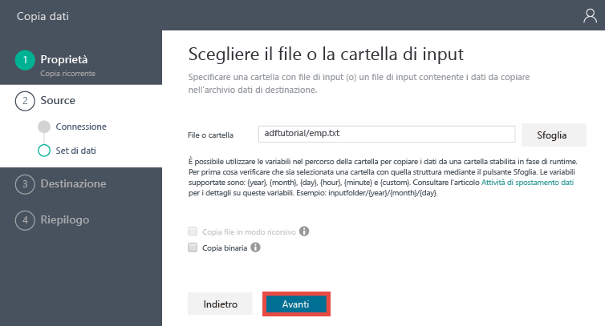
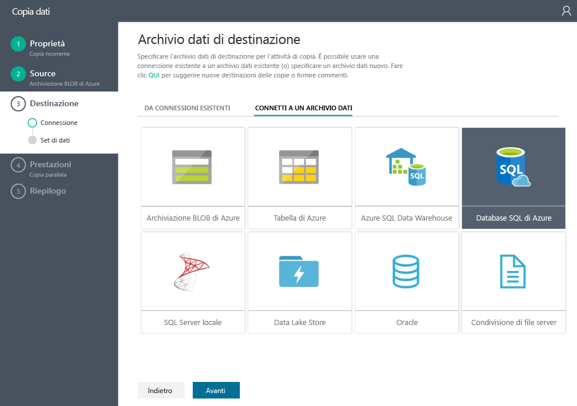
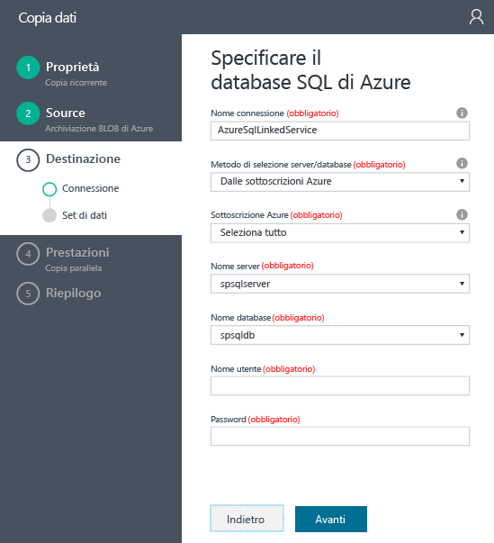
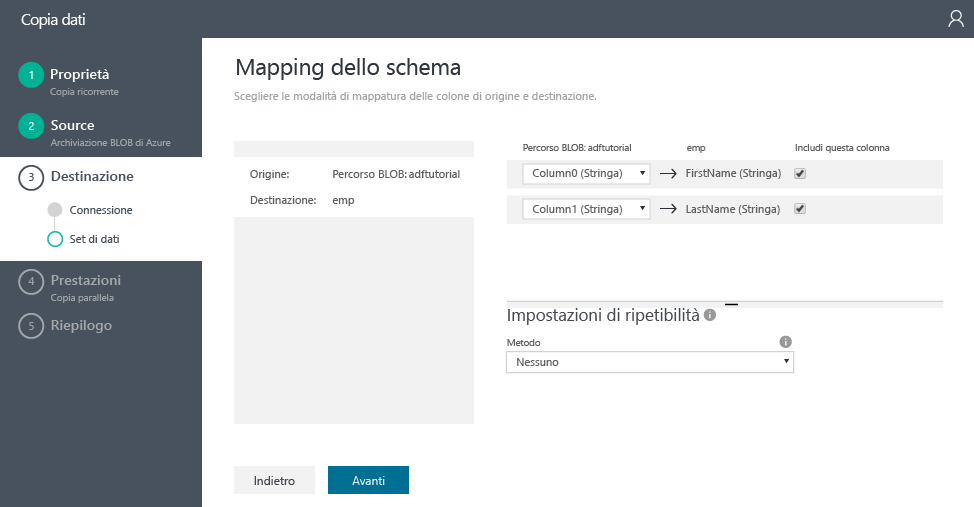
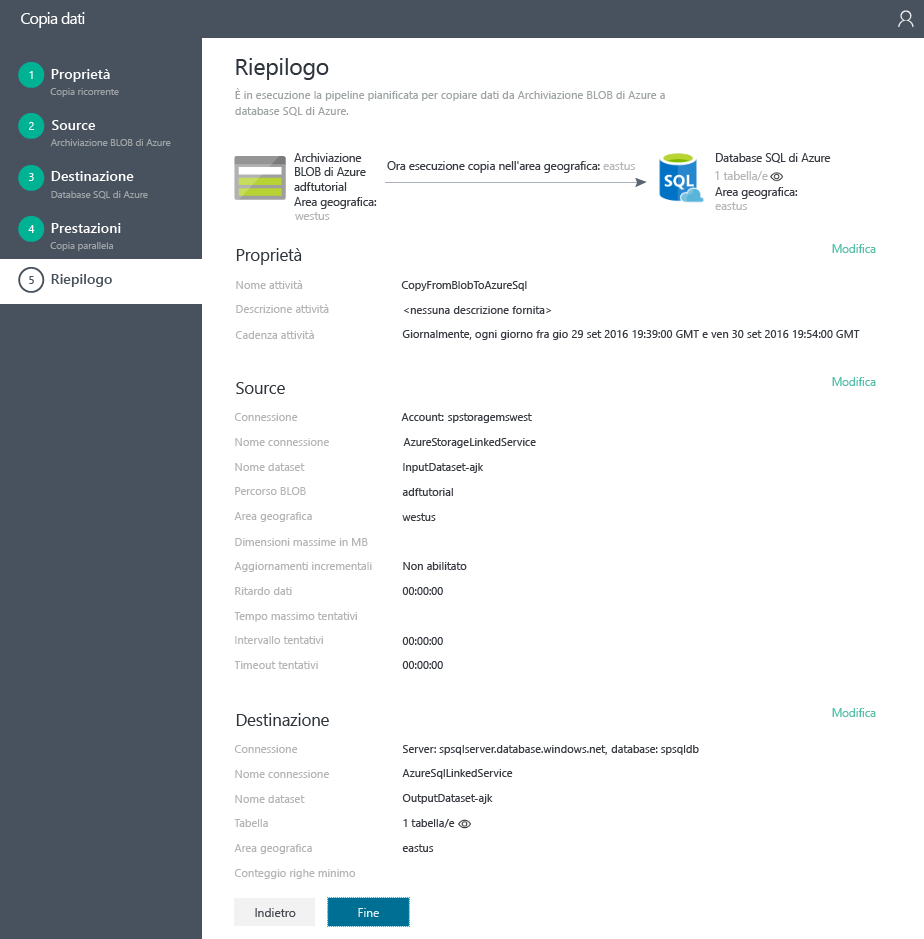

# Esercitazione: Creare una pipeline con l'attività di copia usando la Copia guidata di Data Factory
> [!div class="op_single_selector"]
> * [Panoramica e prerequisiti](data-factory-copy-data-from-azure-blob-storage-to-sql-database.md)
> * [Copia guidata](data-factory-copy-data-wizard-tutorial.md)
> * [Portale di Azure](data-factory-copy-activity-tutorial-using-azure-portal.md)
> * [Visual Studio](data-factory-copy-activity-tutorial-using-visual-studio.md)
> * [PowerShell](data-factory-copy-activity-tutorial-using-powershell.md)
> * [Modello di Azure Resource Manager](data-factory-copy-activity-tutorial-using-azure-resource-manager-template.md)
> * [API REST](data-factory-copy-activity-tutorial-using-rest-api.md)
> * [API .NET](data-factory-copy-activity-tutorial-using-dotnet-api.md)
> 
> 

La **Copia guidata** di Azure Data Factory consente di creare in modo semplice e rapido una pipeline che implementa lo scenario di inserimento/spostamento dei dati. È quindi consigliabile usare la procedura guidata come primo passaggio per creare una pipeline di esempio per uno scenario di spostamento dei dati. Questa esercitazione illustra come creare una data factory di Azure, avviare la Copia guidata ed eseguire una serie di passaggi per specificare i dettagli relativi allo scenario di inserimento/spostamento dei dati. Al termine dei passaggi della procedura guidata, verrà creata automaticamente una pipeline con un'attività di copia per copiare i dati da un archivio BLOB di Azure a un database SQL di Azure. Per informazioni dettagliate sull'attività di copia, vedere [Attività di spostamento dei dati](data-factory-data-movement-activities.md) . 

## Prerequisiti
- Per una panoramica dell'esercitazione e per eseguire i passaggi relativi ai [prerequisiti](data-factory-copy-data-from-azure-blob-storage-to-sql-database.md) , vedere **Panoramica e prerequisiti** .

## Creare un'istanza di Data Factory
In questo passaggio viene usato il portale di Azure per creare un'istanza di Azure Data Factory denominata **ADFTutorialDataFactory**.

1. Dopo aver eseguito l'accesso al [portale di Azure](https://portal.azure.com), fare clic su **+ Nuovo** nell'angolo in alto a sinistra e quindi su **Intelligence e analisi** e su **Data factory**. 
   
   
2. Nel pannello **Nuova data factory** :
   
   1. Immettere **ADFTutorialDataFactory** come **nome**.
       È necessario specificare un nome univoco globale per l'istanza di Azure Data Factory. Se viene visualizzato un errore simile a **Nome "ADFTutorialDataFactory" per la data factory non disponibile**, cambiare il nome della data factory (ad esempio, nomeutenteADFTutorialDataFactory) e provare di nuovo a crearla. Per informazioni sulle regole di denominazione per gli elementi di Data Factory, vedere l'argomento [Azure Data Factory - Regole di denominazione](data-factory-naming-rules.md) .  
      
       
      
      > [!NOTE]
      > Il nome di Data Factory può essere registrato come un nome DNS in futuro e pertanto divenire visibile pubblicamente.
      > 
      > 
   2. Selezionare la **sottoscrizione**di Azure.
   3. In Gruppo di risorse eseguire una di queste operazioni: 
      
      - Selezionare **Usa esistente** per scegliere un gruppo di risorse esistente.
      - Selezionare **Crea nuovo** per immettere un nome per un gruppo di risorse.
         
          Alcuni dei passaggi di questa esercitazione presuppongono l'uso del nome **ADFTutorialResourceGroup** per il gruppo di risorse. Per informazioni sui gruppi di risorse, vedere l'articolo relativo all' [uso di gruppi di risorse per la gestione delle risorse di Azure](../azure-resource-manager/resource-group-overview.md).
   4. Selezionare una **località** per la data factory.
   5. Selezionare la casella di controllo **Aggiungi al dashboard** nella parte inferiore del pannello.  
   6. Fare clic su **Crea**.
      
                   
3. Al termine della creazione verrà visualizzato il pannello **Data factory**, come illustrato nell'immagine seguente:
   
   

## Avviare la Copia guidata
1. Nella home page di Data Factory fare clic sul riquadro **Copia dati** per avviare la **Copy Wizard** (Copia guidata). 
   
   > [!NOTE]
   > Se il Web browser è bloccato su "Concessione autorizzazioni in corso...", disabilitare/deselezionare l'impostazione **Block third party cookies and site data** (Blocca cookie e dati del sito di terze parti) oppure lasciarla abilitata e creare un'eccezione per **login.microsoftonline.com** e quindi provare di nuovo ad avviare la procedura guidata.
   > 
   > 
2. Nella pagina **Proprietà** :
   
   1. Immettere **CopyFromBlobToAzureSql** per **Nome attività**.
   2. Immettere una **descrizione** (facoltativo).
   3. Modificare **Start date time** (Data e ora di inizio) ed **End date time** (Data e ora di fine) in modo che la data di fine corrisponda alla data odierna e la data di inizio a cinque giorni prima.  
   4. Fare clic su **Avanti**.  
      
       
3. Nella pagina **Source data store** (Archivio dati di origine) fare clic sul riquadro **Archivio BLOB di Azure**. Usare questa pagina per specificare l'archivio dati di origine per l'attività di copia. È possibile usare un servizio collegato di archivio dati esistente oppure specificare un nuovo archivio dati. Per usare un servizio collegato esistente, fare clic su **FROM EXISTING LINKED SERVICES** (DA SERVIZI COLLEGATI ESISTENTI) e selezionare il servizio collegato corretto. 
   
    
4. Nella pagina **Specify the Azure Blob storage account** (Specificare l'account di archiviazione BLOB di Azure):
   
   1. Immettere **AzureStorageLinkedService** per **Nome del servizio collegato**.
   2. Verificare che in **Account selection method** (Metodo di selezione dell'account) sia selezionata l'opzione **From Azure subscriptions** (Da sottoscrizioni di Azure).
   3. Selezionare la **sottoscrizione**di Azure.  
   4. Selezionare un **Account di archiviazione di Azure** nell'elenco di quelli disponibili nella sottoscrizione selezionata. È anche possibile scegliere di immettere manualmente le impostazioni dell'account di archiviazione, selezionando l'opzione **Immetti manualmente** per **Account selection method** (Metodo di selezione dell'account), quindi fare clic su **Avanti**. 
      
      
5. Nella pagina **Choose the input file or folder** (Scegliere il file o la cartella di input):
   
   1. Passare alla cartella **adftutorial** .
   2. Selezionare **emp.txt** e fare clic su **Scegli**.
   3. Fare clic su **Avanti**. 
      
      
6. Nella pagina **Choose the input file or folder** (Scegliere il file o la cartella di input) fare clic su **Next** (Avanti). Non selezionare **Binary copy**(Copia binaria). 
   
     
7. Nella pagina **File format settings** (Impostazioni di formato file) vengono visualizzati i delimitatori e lo schema rilevati automaticamente dalla procedura guidata analizzando il file. È anche possibile immettere i delimitatori manualmente per sostituirli o interrompere il rilevamento automatico nella Copia guidata. Dopo aver esaminato i delimitatori e i dati di anteprima, fare clic su **Next** (Avanti). 
   
      
8. Nella pagina Destination data store (Archivio dati di destinazione) selezionare **Azure SQL Database** (Database SQL di Azure) e quindi fare clic su **Next** (Avanti).
   
    
9. Nella pagina **Specify the Azure SQL database** (Specificare il database SQL di Azure):
   
   1. Immettere **AzureSqlLinkedService** nel campo **Connection name** (Nome connessione).
   2. Verificare che in **Server / database selection method** (Metodo di selezione del server/database) sia selezionata l'opzione **From Azure subscriptions** (Da sottoscrizioni di Azure).
   3. Selezionare la **sottoscrizione**di Azure.  
   4. Selezionare **Nome server** e **Database**.
   5. Immettere un **Nome utente** e una **Password**.
   6. Fare clic su **Avanti**.  
      
      
10. Nella pagina **Mapping tabella** selezionare **emp** dall'elenco a discesa per il campo **Destinazione**, fare clic sulla **freccia giù** (facoltativo) per visualizzare lo schema e l'anteprima dei dati.
    
      
11. Nella pagina **Mapping dello schema** fare clic su **Avanti**.
    
    
12. Nella pagina **Prestazioni** fare clic su **Avanti**. 
    
    
13. Verificare le informazioni nella pagina **Riepilogo** e fare clic su **Fine**. La procedura guidata crea due servizi collegati, due set di dati (input e output) e una pipeline nella data factory da cui è stata avviata la Copia guidata. 
    
    

## Avviare l'applicazione di monitoraggio e gestione
1. Nella pagina **Distribuzione** fare clic sul collegamento: `Click here to monitor copy pipeline`.
   
     
2. Per informazioni su come monitorare la pipeline creata, vedere [Monitorare e gestire le pipeline di Azure Data Factory con la nuova app di monitoraggio e gestione](data-factory-monitor-manage-app.md) . Fare clic sull'icona **Aggiorna** nell'elenco **ACTIVITY WINDOWS** (Finestre attività) per visualizzare la sezione. 
   
    
   
   
   Fare clic sul pulsante **Aggiorna** nell'elenco **ACTIVITY WINDOWS** (Finestre attività) nella parte inferiore per visualizzare lo stato più recente. L'elenco non viene aggiornato automaticamente. 

> [!NOTE]
> La pipeline di dati in questa esercitazione copia i dati da un archivio dati di origine a un archivio dati di destinazione. Non trasforma i dati di input per produrre dati di output. Per un'esercitazione su come trasformare i dati usando Azure Data Factory, vedere [Esercitazione: Creare la prima pipeline per elaborare i dati usando il cluster Hadoop](data-factory-build-your-first-pipeline.md).
> 
> È possibile concatenare due attività, ovvero eseguire un'attività dopo l'altra, impostando il set di dati di output di un'attività come set di dati di input di altre attività. Per informazioni dettagliate, vedere [Pianificazione ed esecuzione con Data Factory](data-factory-scheduling-and-execution.md).

## Vedere anche
| Argomento | Descrizione |
|:--- |:--- |
| [Pipeline](data-factory-create-pipelines.md) |Questo articolo fornisce informazioni sulle pipeline e sulle attività in Azure Data Factory e su come usarle per costruire flussi di lavoro end-to-end basati sui dati per lo scenario o l'azienda. |
| [Set di dati](data-factory-create-datasets.md) |Questo articolo fornisce informazioni sui set di dati in Azure Data Factory. |
| [Pianificazione ed esecuzione](data-factory-scheduling-and-execution.md) |Questo articolo descrive gli aspetti di pianificazione ed esecuzione del modello applicativo di Data factory di Azure. |

<!--HONumber=Feb17_HO1-->

