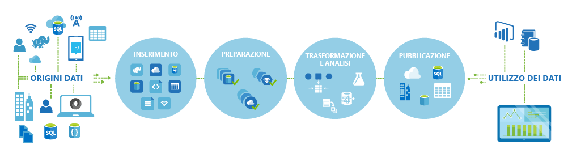
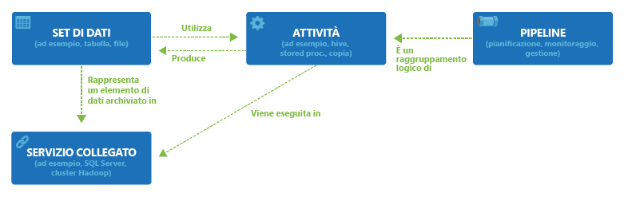

<properties 
	pageTitle="Introduzione a Data factory di Azure" 
	description="Informazioni su come usare il servizio Data factory di Azure per comporre l'elaborazione dei dati, l'archiviazione dei dati e servizi di spostamento dei dati al fine di creare pipeline che producono informazioni attendibili." 
	services="data-factory" 
	documentationCenter="" 
	authors="spelluru" 
	manager="jhubbard" 
	editor="monicar"/>

<tags 
	ms.service="data-factory" 
	ms.workload="data-services" 
	ms.tgt_pltfrm="na" 
	ms.devlang="na" 
	ms.topic="get-started-article" 
	ms.date="11/18/2015" 
	ms.author="spelluru"/>

# Introduzione al servizio Data factory di Azure

## Panoramica
Data factory è un servizio di integrazione delle informazioni basato sul cloud che permette di automatizzare lo spostamento e la trasformazione dei dati. Analogamente a quanto avviene in uno stabilimento di produzione, in cui vengono usate attrezzature per trasformare le materie prime in prodotti finiti, Data factory orchestra i servizi esistenti che raccolgono i dati non elaborati e li trasforma in informazioni pronte per l'uso.

Data factory usa origini dati nel cloud e locali, oltre ai servizi SaaS, per inserire, preparare, trasformare, analizzare e pubblicare i dati. È possibile usare Data factory per la composizione di servizi in pipeline di flussi di dati gestite per trasformare i dati mediante servizi quali [Azure HDInsight (Hadoop)](http://azure.microsoft.com/documentation/services/hdinsight/) e [Azure Batch](https://azure.microsoft.com/documentation/services/batch/) per le esigenze di calcolo relative ai Big Data e tramite [Azure Machine Learning](https://azure.microsoft.com/documentation/services/machine-learning/) per rendere operative le soluzioni di analisi, in modo da superare le visualizzazioni di monitoraggio tabulari e avvalersi delle visualizzazioni avanzate offerte da Data factory per visualizzare rapidamente le derivazioni e le dipendenze tra le pipeline di dati. Data factory permette di monitorare tutte le pipeline dei flussi di dati da un'unica visualizzazione unificata per individuare rapidamente i problemi e configurare avvisi di monitoraggio.

**Figura 1.** Data factory permette di raccogliere i dati da molte origini dati locali diverse, quindi di inserirli, prepararli, organizzarli e analizzarli tramite una serie di trasformazioni e infine di pubblicare dati pronti per l'uso.

È possibile usare Data factory ogni volta che è necessario raccogliere dati con forme e dimensioni diverse, trasformarli e pubblicarli per estrarre informazioni dettagliate, il tutto con tempi affidabili. Data Factory viene utilizzata per creare pipeline di flusso di dati a disponibilità elevata per molti scenari in diversi settori per le esigenze di analisi pipeline. I rivenditori in linea la utilizzano per generare [consigli sui prodotti](data-factory-product-reco-usecase.md) personalizzati in base al comportamento di esplorazione del cliente. I game studios la utilizzano per comprendere l’[efficacia delle loro campagne di commercializzazione](data-factory-customer-profiling-usecase.md). Ottenere informazioni direttamente dai nostri clienti sulle modalità e sui motivi di utilizzo di Data Factory esaminando[Casi di studio sui clienti](data-factory-customer-case-studies.md).

> [AZURE.VIDEO azure-data-factory-overview]

## Concetti principali

Le entità principali di Data factory di Azure interagiscono tra loro per definire i dati di input e di output, gli eventi di elaborazione e la pianificazione e le risorse necessarie per eseguire il flusso di dati desiderato.

**Figura 2.** Relazioni tra set di dati, attività, pipeline e servizio collegato

### Attività
Le attività definiscono le azioni da eseguire sui dati. Ogni attività accetta zero o più [set di dati](data-factory-create-datasets.md) come input e genera uno o più set di dati come output. Un'attività è un'unità di orchestrazione in Data factory di Azure. Ad esempio, è possibile usare un'[attività di copia](data-factory-data-movement-activities.md) per orchestrare la copia dei dati da un set di dati a un altro. Allo stesso modo, è possibile usare un'[attività Hive](data-factory-data-transformation-activities.md) che esegue una query Hive su un cluster Azure HDInsight per trasformare o analizzare i dati. Data factory di Azure offre un'ampia gamma di attività di trasformazione, analisi e spostamento dei dati.

### Pipeline
Le [pipeline](data-factory-create-pipelines.md) sono un raggruppamento logico di attività. Vengono usate per raggruppare in un'unità attività che insieme eseguono un'operazione. Ad esempio, per pulire i dati dei file di log potrebbe essere necessaria una sequenza di più attività di trasformazione. Questa sequenza potrebbe prevedere una pianificazione complessa e dipendenze che devono essere orchestrate e automatizzate. In questo caso, è possibile raggruppare tutte queste attività in una singola pipeline denominata "PuliziaFileLog" e distribuirla, pianificarla o eliminarla come una singola unità invece di gestire in modo indipendente ogni attività specifica.

### Set di dati
I [set di dati](data-factory-create-datasets.md) sono riferimenti denominati o puntatori ai dati da usare come input o output di un'attività. I set di dati identificano le strutture di dati all'interno di archivi dati diversi, tra cui tabelle, file, cartelle e documenti.

### Servizio collegato
I servizi collegati definiscono le informazioni necessarie affinché il servizio Data factory si connetta a risorse esterne. In Data factory i servizi collegati vengono usati per i due scopi seguenti:

- Per rappresentare un archivio dati, inclusi, a titolo esemplificativo, un'istanza di SQL Server locale, un database Oracle, una condivisione file o un account di archiviazione BLOB di Azure. Come indicato in precedenza, i set di dati rappresentano le strutture all'interno degli archivi dati connessi a Data factory tramite un servizio collegato.
- Per rappresentare una risorsa di calcolo che può ospitare l'esecuzione di un'attività. Ad esempio, l'attività "HDInsightHive" viene eseguita in un cluster HDInsight Hadoop.

Dopo aver acquisito familiarità con i quattro semplici concetti relativi a set di dati, attività, pipeline e servizi collegati, si è pronti per iniziare. È possibile [compilare la prima pipeline](data-factory-build-your-first-pipeline.md) da zero o distribuire un esempio pronto all'uso seguendo le istruzioni riportate nell'articolo [Data factory di Azure - Esempi](data-factory-samples.md).

<!---HONumber=AcomDC_0128_2016-->