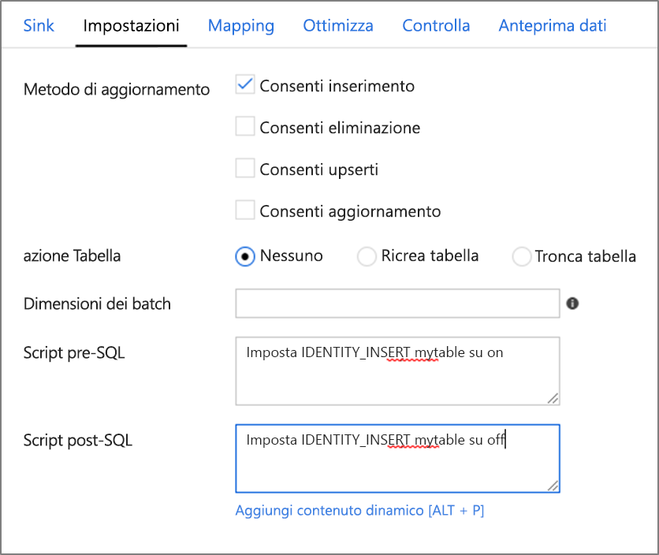

# <a name="sink-transformation-for-a-data-flow"></a>Trasformazione sink per un flusso di dati


Dopo aver trasformato il flusso di dati, è possibile affondare i dati in un set di dati di destinazione. Nella trasformazione sink scegliere una definizione del set di dati per i dati di output di destinazione. È possibile avere il numero di trasformazioni di sink necessario per il flusso di dati.

Per tenere conto della deriva dello schema e delle modifiche dei dati in ingresso, eseguire il sink dei dati di output in una cartella senza uno schema definito nel set di dati di output. È anche possibile tenere conto delle modifiche apportate alle colonne nelle origini selezionando **Consenti Drift schema** nell'origine. Quindi Automap tutti i campi del sink.


Per eseguire il sink di tutti i campi in ingresso, attivare il **mapping automatico**. Per scegliere i campi da affondare nella destinazione o per modificare i nomi dei campi nella destinazione, disabilitare **auto map**. Aprire quindi la scheda **mapping** per eseguire il mapping dei campi di output.


## <a name="output"></a>Output 
Per l'archiviazione BLOB di Azure o i tipi di sink di Data Lake Storage, restituire i dati trasformati in una cartella. Spark genera file di dati di output partizionati in base allo schema di partizionamento usato dalla trasformazione del sink. 

È possibile impostare lo schema di partizionamento dalla scheda **ottimizza** . Se si desidera Data Factory unire l'output in un singolo file, selezionare **partizione singola**.


## <a name="field-mapping"></a>Mapping dei campi
Nella scheda **mapping** della trasformazione sink è possibile eseguire il mapping delle colonne in ingresso a sinistra alle destinazioni a destra. Quando si affondano i flussi di dati in file, Data Factory scriveranno sempre nuovi file in una cartella. Quando si esegue il mapping a un set di dati del database, si scelgono le opzioni dell'operazione di tabella del database per inserire, aggiornare, Upsert o eliminare.


Nella tabella di mapping è possibile scegliere di collegare più colonne, decollegare più colonne o eseguire il mapping di più righe allo stesso nome di colonna.

Per eseguire sempre il mapping del set di campi in ingresso a una destinazione così come sono e per accettare completamente le definizioni flessibili dello schema, selezionare **Consenti Drift schema**.


Per reimpostare i mapping delle colonne, selezionare **nuova mappa**.


Selezionare **convalida schema** per interrompere il sink in caso di modifica dello schema.

Selezionare **Cancella la cartella** per troncare il contenuto della cartella sink prima di scrivere i file di destinazione nella cartella di destinazione.

## <a name="fixed-mapping-vs-rule-based-mapping"></a>Mapping fisso rispetto al mapping basato su regole
Quando si disattiva il mapping automatico, sarà possibile aggiungere il mapping basato su colonne (mapping fisso) o il mapping basato su regole. Il mapping basato su regole consente di scrivere espressioni con criteri di ricerca, mentre il mapping fisso eseguirà il mapping dei nomi delle colonne logiche e fisiche.


Quando si sceglie il mapping basato su regole, si indica ad ADF di valutare l'espressione corrispondente in modo che corrisponda alle regole dei criteri in ingresso e di definire i nomi dei campi in uscita. È possibile aggiungere qualsiasi combinazione di mapping di campi e basati su regole. I nomi dei campi vengono quindi generati in fase di esecuzione da ADF in base ai metadati in ingresso provenienti dall'origine. È possibile visualizzare i nomi dei campi generati durante il debug e utilizzando il riquadro di anteprima dei dati.

Per informazioni dettagliate sui criteri di ricerca, fare riferimento alla [documentazione del modello di colonna](concepts-data-flow-column-pattern.md).

È anche possibile immettere modelli di espressione regolare quando si usa la corrispondenza basata su regole espandendo la riga e immettendo un'espressione regolare accanto a "nome corrisponde:".


Un esempio comune molto semplice per un mapping basato su regole rispetto a un mapping fisso è il caso in cui si desidera eseguire il mapping di tutti i campi in ingresso allo stesso nome nella destinazione. Nel caso dei mapping fissi, è necessario elencare ogni singola colonna nella tabella. Per il mapping basato su regole, si disporrà di una singola regola che esegue il mapping di tutti i campi utilizzando ```true()``` allo stesso nome di campo in entrata rappresentato da ```$$```.

### <a name="sink-association-with-dataset"></a>Associazione di sink con DataSet

Il set di dati selezionato per il sink potrebbe avere o meno uno schema definito nella definizione del set di dati. Se non dispone di uno schema definito, è necessario consentire la deriva dello schema. Quando è stato definito un mapping fisso, il mapping del nome logico a fisico viene mantenuto nella trasformazione sink. Se si modifica la definizione dello schema del set di dati, si potrebbe interrompere il mapping del sink. Per evitare questo problema, usare il mapping basato sulle regole. I mapping basati su regole sono generalizzati, pertanto le modifiche dello schema nel set di dati non interromperanno il mapping.

## <a name="file-name-options"></a>Opzioni di nomi di file

Configurare la denominazione dei file: 

   * **Impostazione predefinita**: consente a Spark di assegnare un nome ai file in base alle impostazioni predefinite della parte.
   * **Modello**: immettere un modello per i file di output. Ad esempio, **Loans [n]** creerà loans1. csv, loans2. csv e così via.
   * **Per partizione**: immettere un nome di file per partizione.
   * **Come dati in column**: impostare il file di output sul valore di una colonna.
   * **Output in un singolo file**: con questa opzione, ADF combinerà i file di output partizionati in un singolo file denominato. Per usare questa opzione, il set di dati deve essere risolto in un nome di cartella. Tenere inoltre presente che l'operazione di Unione potrebbe avere esito negativo in base alle dimensioni del nodo.

> [!NOTE]
> Le operazioni sui file vengono avviate solo quando si esegue l'attività Esegui flusso di dati. Non vengono avviate in modalità di debug del flusso di dati.

## <a name="database-options"></a>Opzioni di database

Scegliere le impostazioni del database:


* **Metodo di aggiornamento**: il valore predefinito è consentire gli inserimenti. Deselezionare **Consenti inserimento** se si desidera arrestare l'inserimento di nuove righe dall'origine. Per aggiornare, Upsert o eliminare righe, aggiungere prima di tutto una trasformazione alter-Row alle righe di tag per tali azioni. 
* **Ricrea tabella**: eliminare o creare la tabella di destinazione prima del completamento del flusso di dati.
* **TRUNCATE TABLE**: rimuovere tutte le righe dalla tabella di destinazione prima del completamento del flusso di dati.
* **Dimensioni batch**: immettere un numero per il bucket delle Scritture in blocchi. Usare questa opzione per i caricamenti di dati di grandi dimensioni. 
* **Abilitare la gestione temporanea**: usare la polibase quando si carica data warehouse di Azure come set di dati del sink.
* **Script pre e post SQL**: immettere gli script SQL a più righe che verrà eseguito prima (pre-elaborazione) e dopo (post-elaborazione) i dati vengono scritti nel database sink



> [!NOTE]
> Nel flusso di dati è possibile indirizzare Data Factory per creare una nuova definizione di tabella nel database di destinazione. Per creare la definizione della tabella, impostare un set di dati nella trasformazione sink con un nuovo nome di tabella. Nel set di dati SQL sotto il nome della tabella selezionare **modifica** e immettere un nuovo nome di tabella. Quindi, nella trasformazione sink, attivare **Consenti Drift schema**. Impostare **Import Schema** su **None**.


> [!NOTE]
> Quando si aggiornano o si eliminano righe nel sink del database, è necessario impostare la colonna chiave. Questa impostazione consente alla trasformazione alter-Row di determinare la riga univoca nella libreria di spostamento dei dati (DML).

## <a name="next-steps"></a>Passaggi successivi
Ora che è stato creato il flusso di dati, aggiungere un' [attività flusso di dati alla pipeline](concepts-data-flow-overview.md).
