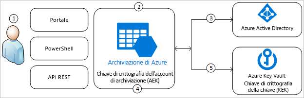
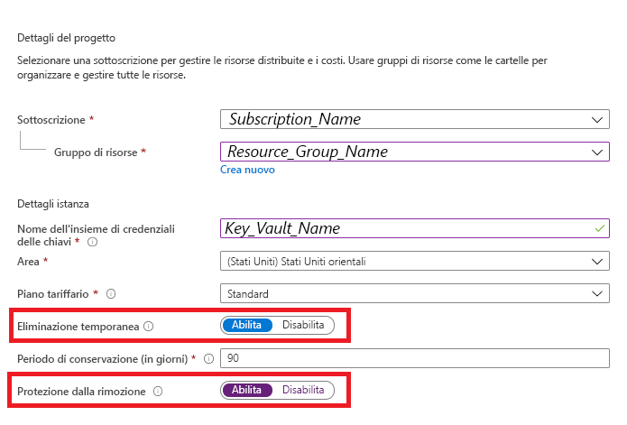
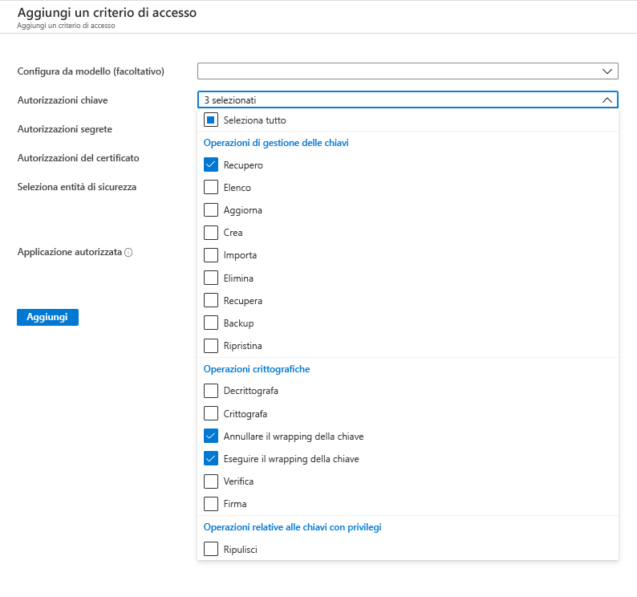
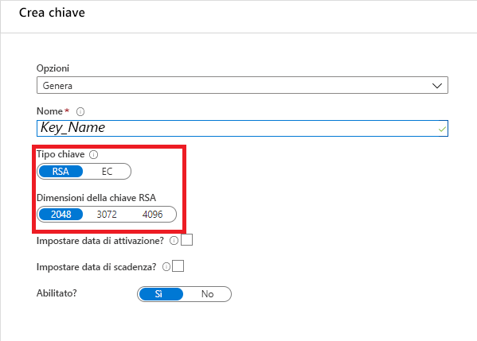
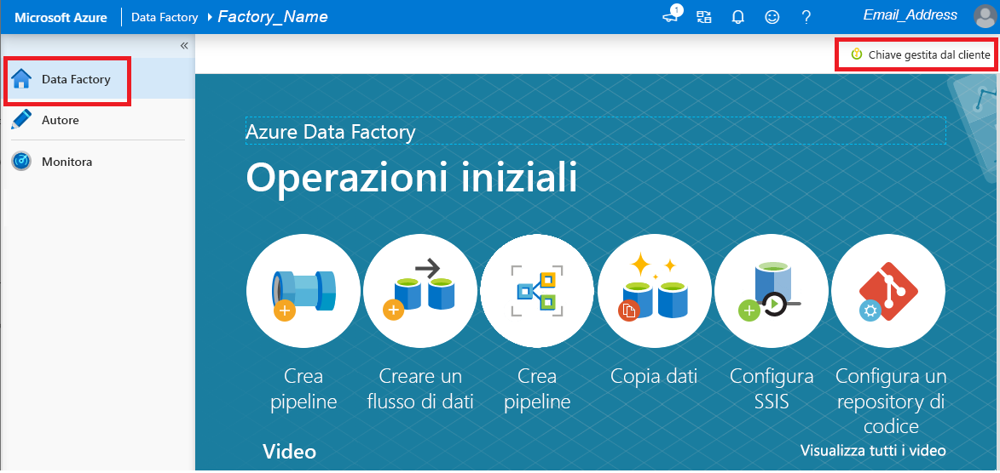

# Crittografare Azure Data Factory con le chiavi gestite dal cliente

[!INCLUDE[appliesto-adf-xxx-md](includes/appliesto-adf-xxx-md.md)]

Azure Data Factory crittografa i dati inattivi, ad esempio le definizioni delle entità e i dati memorizzati nella cache mentre le esecuzioni sono in corso. Per impostazione predefinita, i dati vengono crittografati con una chiave gestita da Microsoft e generata in modo casuale, assegnata in modo univoco alla data factory. Per garanzie aggiuntive sulla sicurezza, è ora possibile abilitare la modalità Bring Your Own Key (BYOK) con la funzionalità delle chiavi gestite dal cliente in Azure Data Factory. Quando si specifica una chiave gestita dal cliente, per crittografare i dati del cliente Data Factory usa __entrambe__ le chiavi, ovvero la chiave del sistema data factory e la chiave gestita dal cliente. La mancanza di una delle due chiavi può comportare la negazione dell'accesso ai dati e alla factory.

Per archiviare le chiavi gestite dal cliente, è necessario Azure Key Vault. È possibile creare chiavi personalizzate e archiviarle in un insieme di credenziali delle chiavi oppure usare le API Azure Key Vault per generare chiavi. L'insieme delle credenziali della chiavi e Data Factory devono essere presenti nello stesso tenant di Azure Active Directory (Azure AD) e nella stessa area, ma possono appartenere a sottoscrizioni diverse. Per altre informazioni sull'insieme di credenziali di Azure, vedere [Cos'è l'insieme di credenziali delle chiavi di Azure?](../key-vault/general/overview.md)

> [!NOTE]
> Una chiave gestita dal cliente può essere configurata solo in una data factory vuota. La data factory non può contenere risorse quali servizi collegati, pipeline e flussi di dati. È consigliabile abilitare la chiave gestita dal cliente subito dopo la creazione della factory.

## Informazioni sulle chiavi gestite dal cliente

Il diagramma seguente illustra il modo in cui Data Factory usa Azure Active Directory e Azure Key Vault per effettuare richieste usando la chiave gestita dal cliente:

  

Nell'elenco seguente vengono illustrati i passaggi numerati nel diagramma:

1. Un amministratore di Azure Key Vault concede le autorizzazioni per le chiavi di crittografia all'identità gestita associata a Data Factory
1. Un amministratore di Data Factory abilita la funzionalità chiave gestita dal cliente nella factory
1. Data Factory usa l'identità gestita associata alla factory per autenticare l'accesso ad Azure Key Vault tramite Azure Active Directory
1. Data Factory esegue il wrapping della chiave di crittografia della factory con la chiave del cliente in Azure Key Vault
1. Per le operazioni di lettura/scrittura, Data Factory invia richieste ad Azure Key Vault per annullare il wrapping della chiave di crittografia dell'account per l'esecuzione di crittografia e decrittografia

## Prerequisiti - Configurare Azure Key Vault e generare chiavi

### Abilitare l'eliminazione temporanea e non eliminare Azure Key Vault

L'uso delle chiavi gestite dal cliente con Data Factory richiede l'impostazione di due proprietà in Key Vault, ovvero __Eliminazione temporanea__ e __Do Not Purge__ (Non eliminare). Queste proprietà possono essere abilitate tramite PowerShell o l'interfaccia della riga di comando di Azure in un insieme di credenziali delle chiavi nuovo o esistente. Per informazioni su come abilitare queste proprietà in un insieme di credenziali delle chiavi esistente, vedere le sezioni _Abilitazione dell'eliminazione temporanea_ e _Abilitazione della protezione dall'eliminazione_ in uno degli articoli seguenti:

- [Come usare la funzionalità di eliminazione temporanea con PowerShell](../key-vault/general/soft-delete-powershell.md)
- [Come usare l'eliminazione temporanea con l'interfaccia della riga di comando](../key-vault/general/soft-delete-cli.md)

Se si crea un nuovo Azure Key Vault tramite il portale di Azure, le proprietà __Eliminazione temporanea__ e __Do Not Purge__ (Non eliminare) possono essere abilitate come indicato di seguito:

  

### Concedere a Data Factory l'accesso ad Azure Key Vault

Verificare che Azure Key Vault e Azure Data Factory si trovino nello stesso tenant di Azure Active Directory (Azure AD) e nella _stessa area_. Dal controllo di accesso di Azure Key Vault concedere le autorizzazioni di identità del servizio gestita della data factory seguenti: _Ottieni_, _Annulla il wrapping della chiave_ e _Esegui il wrapping della chiave_. Queste autorizzazioni sono necessarie per abilitare le chiavi gestite dal cliente in Data Factory.

  

### Generare o caricare la chiave gestita dal cliente in Azure Key Vault

È possibile creare chiavi personalizzate e archiviarle in un insieme di credenziali delle chiavi oppure usare le API Azure Key Vault per generare chiavi. Con la crittografia di Data Factory sono supportate solo le chiavi RSA a 2048 bit. Per i dettagli, vedere l'articolo relativo alle [informazioni su chiavi, segreti e certificati](../key-vault/general/about-keys-secrets-certificates.md).

  

## Abilitare chiavi gestite dal cliente

1. Verificare che la data factory sia vuota. La data factory non può contenere alcuna risorsa, ad esempio servizi collegati, pipeline e flussi di dati. Per il momento, la distribuzione della chiave gestita dal cliente in una factory non vuota comporterà un errore.

1. Per individuare l'URI della chiave nel portale di Azure, passare ad Azure Key Vault e selezionare l'impostazione Chiavi. Selezionare la chiave desiderata, quindi fare clic sulla chiave per visualizzarne le versioni. Selezionare una versione della chiave per visualizzare le impostazioni

1. Copiare il valore del campo di identificatore della chiave, che fornisce l'URI

    

1. Avviare il portale di Azure Data Factory e usare la barra di spostamento a sinistra per passare al portale di gestione di Data Factory

1. Fare clic sull'icona __Chiave gestita dal cliente__

    

1. Immettere l'URI per la chiave gestita dal cliente copiata in precedenza

1. Fare clic su __Salva__ per abilitare la crittografia delle chiavi gestite dal cliente in Data Factory

## Aggiornare la versione della chiave

Quando si crea una nuova versione di una chiave, per usarla è necessario aggiornare la data factory. Seguire i passaggi simili descritti nella sezione _Abilitare chiavi gestite dal cliente_, tra cui:

1. Individuare l'URI per la nuova versione della chiave tramite il portale di Azure Key Vault

1. Passare all'impostazione __Chiave gestita dal cliente__

1. Sostituire il valore e incollarlo nell'URI per la nuova chiave

1. Fare clic su __Salva__ e Data Factory eseguirà ora la crittografia con la nuova versione della chiave

## Usare una chiave diversa

Per modificare la chiave usata per la crittografia di Data Factory, è necessario aggiornare manualmente le impostazioni in Data Factory. Seguire i passaggi simili descritti nella sezione _Abilitare chiavi gestite dal cliente_, tra cui:

1. Individuare l'URI per la nuova chiave tramite il portale di Azure Key Vault

1. Passare all'impostazione __Chiave gestita dal cliente__

1. Sostituire il valore e incollarlo nell'URI per la nuova chiave

1. Fare clic su __Salva__ e Data Factory eseguirà ora la crittografia con la nuova chiave

## Disabilitare le chiavi gestite dal cliente

Per impostazione predefinita, dopo aver abilitato la funzionalità relativa alla chiave gestita dal cliente, non è possibile rimuovere il passaggio di sicurezza aggiuntivo. Si prevede sempre una chiave fornita dal cliente per crittografare i dati e la factory.

## Passaggi successivi

Per informazioni sull'uso di Data Factory in più scenari, fare riferimento alle [esercitazioni](tutorial-copy-data-dot-net.md).
