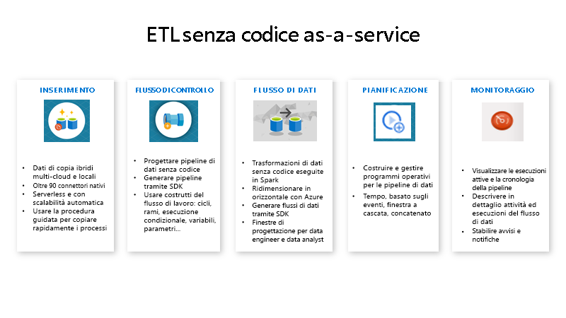

# Che cos'è Azure Data Factory?

Nel mondo dei Big Data, dati non elaborati e non organizzati vengono spesso archiviati in sistemi di archiviazione relazionali, non relazionali e di altro tipo. I dati non elaborati non hanno tuttavia intrinsecamente un contesto o significato appropriato per generare informazioni utili per gli analisti, i data scientist e i responsabili delle decisioni aziendali. 

I Big Data necessitano di un servizio che possa orchestrare e rendere operativi i processi per ottimizzare questi enormi archivi di dati non elaborati trasformandoli in informazioni aziendali di utilità pratica. Azure Data Factory è un servizio cloud gestito ideato per questi complessi progetti ibridi di estrazione, trasformazione e caricamento (ETL), di estrazione, caricamento e trasformazione (ELT) e di integrazione dei dati.

Si prenda ad esempio una società di giochi che raccoglie petabyte di log generati dai giochi nel cloud. La società intende analizzare questi log per ottenere informazioni sui clienti, tra cui preferenze, dati demografici e comportamento di utilizzo. Vuole anche identificare opportunità di up-selling e cross-selling, sviluppare nuove funzionalità interessanti per promuovere la crescita del business e fornire un'esperienza migliore ai clienti.

Per analizzare questi log, la società deve usare dati di riferimento presenti in un archivio dati locale, ad esempio le informazioni sui clienti, sui giochi e sulle campagne di marketing. La società intende usare questi dati presenti nell'archivio dati locale, integrandoli con i dati di log aggiuntivi disponibili in un archivio dati cloud. 

Per estrarre informazioni dettagliate, intende elaborare i dati uniti usando un cluster Spark nel cloud (Azure HDInsight) e infine pubblicare i dati trasformati in un data warehouse cloud, ad esempio Azure SQL Data Warehouse, per creare facilmente un report. La società vuole automatizzare il flusso di lavoro e monitorarlo e gestirlo in una pianificazione giornaliera. Intende anche eseguirlo quando vengono aggiunti file a un contenitore dell'archivio BLOB.

La piattaforma Azure Data Factory è in grado di gestire con successo scenari di dati di questo tipo. È il *servizio di estrazione, trasformazione e caricamento (ETL, extraction, transformation, loading) e integrazione di dati basato sul cloud che consente di creare flussi di lavoro basati sui dati per orchestrare lo spostamento e la trasformazione dei dati stessi su larga scala*. Con Azure Data Factory è possibile creare e pianificare flussi di lavoro basati sui dati (denominati "pipeline") che possono acquisire dati da archivi dati diversi. È possibile creare processi ETL complessi che trasformano visivamente i dati con flussi di dati o tramite servizi di calcolo come Azure HDInsight Hadoop, Azure Databricks e Database SQL di Azure. 

È inoltre possibile pubblicare i dati trasformati in archivi dati, ad esempio Azure SQL Data Warehouse, per consentirne l'utilizzo con applicazioni di business intelligence (BI). Infine, i dati non elaborati possono essere organizzati in archivi dati e data lake significativi per ottimizzare il processo decisionale aziendale usando Azure Data Factory.

## Come funziona?

Data Factory contiene una serie di sistemi interconnessi che forniscono una piattaforma end-to-end completa per gli ingegneri dei dati.

### Connettersi e raccogliere

Le aziende hanno dati di vari tipi archiviati in origini disomogenee in locale e nel cloud; dati strutturati, non strutturati e semistrutturati vengono tutti ricevuti a velocità e a intervalli diversi. 

Il primo passaggio per creare un sistema di produzione di informazioni consiste nel connettere tutte le origini di dati e di elaborazione necessarie, come servizi SaaS, database, condivisioni file, FTP e servizi Web. Il secondo passaggio prevede di spostare i dati in una posizione centralizzata in base alla necessità per l'elaborazione successiva.

Senza Data factory le grandi imprese devono creare componenti personalizzati per lo spostamento dei dati oppure scrivere servizi personalizzati per l'integrazione delle origini dati e delle elaborazioni. Integrare e gestire tali sistemi è costoso e complesso. Questi sistemi spesso non forniscono neppure il monitoraggio e gli avvisi di livello aziendale, oltre ai controlli che solo un servizio completamente gestito può offrire.

Con Data Factory è possibile usare l'[attività di copia](copy-activity-overview.md) in una pipeline di dati per spostare i dati dagli archivi dati di origine sia in locale che nel cloud a un archivio dati centralizzato nel cloud per analisi aggiuntive. È ad esempio possibile raccogliere i dati in Azure Data Lake Store e quindi trasformarli in seguito usando un servizio di calcolo di Azure Data Lake Analytics oppure raccogliere i dati in un archivio BLOB di Azure e quindi trasformarli usando un cluster Hadoop Azure HDInsight.

### Trasformare e arricchire
I dati raccolti in un archivio dati centralizzato nel cloud possono essere elaborati o trasformati tramite flussi di dati di mapping di Azure Data Factory. I flussi di dati permettono agli ingegneri dei dati di creare e gestire grafici di trasformazione dei dati eseguiti in Spark senza la necessità di avere competenze in programmazione o cluster Spark.

Se si preferisce scrivere manualmente il codice delle trasformazioni, Azure Data Factory supporta attività esterne per l'esecuzione delle trasformazioni in servizi di calcolo come HDInsight Hadoop, Spark, Data Lake Analytics e Machine Learning.

### CI/CD e pubblicazione
Data Factory offre il supporto completo per le attività CI/CD delle pipeline di dati tramite Azure DevOps e GitHub. È quindi possibile sviluppare e distribuire in modo incrementale i processi ETL prima di pubblicare il prodotto finito. Dopo che i dati non elaborati sono stati ottimizzati in un formato utilizzabile e pronto per il business, caricare i dati in Azure Data Warehouse, nel database SQL di Azure, in Azure CosmosDB o in qualsiasi motore di analisi a cui gli utenti business possono fare riferimento dai propri strumenti di Business Intelligence.

### Monitorare
Dopo avere compilato e distribuito la pipeline di integrazione di dati, fornendo il valore business dai dati ottimizzati, monitorare le attività e le pipeline pianificate per determinare il tasso di operazioni riuscite e non riuscite. Azure Data Factory integra il supporto per il monitoraggio delle pipeline tramite Monitoraggio di Azure, API, PowerShell, i log di Monitoraggio di Azure e i pannelli di integrità nel portale di Azure.

## Concetti principali
Una sottoscrizione di Azure può includere una o più istanze di Azure Data Factory (o data factory). Azure Data Factory è costituito da quattro componenti chiave. Questi componenti forniscono la piattaforma nella quale è possibile comporre flussi di lavoro basati sui dati con passaggi per lo spostamento e la trasformazione dei dati stessi.

### Pipeline
Una data factory può comprendere una o più pipeline. Una pipeline è un raggruppamento logico di attività che esegue un'unità di lavoro. L'insieme delle attività di una pipeline esegue un'operazione. Una pipeline, ad esempio, può contenere un gruppo di attività che inserisce dati da un BLOB di Azure e quindi esegue una query Hive in un cluster HDInsight per partizionare i dati. 

La pipeline offre il vantaggio di poter gestire le attività come un set anziché singolarmente. Le attività in una pipeline possono essere concatenate per funzionare in modo sequenziale o indipendentemente in parallelo.

### Flussi di dati di mapping
Creare e gestire grafici della logica di trasformazione dei dati che è possibile usare per trasformare dati di qualsiasi dimensione. È possibile creare una libreria riutilizzabile di routine di trasformazione dei dati ed eseguire tali processi applicando la scalabilità orizzontale dalle pipeline di Azure Data Factory. Data Factory eseguirà la logica in un cluster Spark che può essere attivato e disattivato secondo necessità. Non sarà mai necessario occuparsi della gestione o della manutenzione dei cluster.

### Attività
Le attività rappresentano un passaggio di elaborazione in una pipeline. È ad esempio possibile usare un'attività di copia per copiare i dati da un archivio dati all'altro. Allo stesso modo è possibile usare un'attività Hive che esegue una query Hive in un cluster Azure HDInsight per trasformare o analizzare i dati. Data Factory supporta tre tipi di attività: attività di spostamento dei dati, attività di trasformazione dei dati e attività di controllo.

### Set di dati
I set di dati rappresentano strutture dei dati all'interno degli archivi dati e fanno semplicemente riferimento ai dati da usare nelle attività come input o output. 

### Servizi collegati
I servizi collegati sono molto simili a stringhe di connessione e definiscono le informazioni necessarie per la connessione di Data Factory a risorse esterne. In sintesi, un servizio collegato definisce la connessione all'origine dati, mentre un set di dati rappresenta la struttura dei dati. Ad esempio, un servizio collegato di Archiviazione di Azure specifica una stringa per la connessione all'account di archiviazione di Azure. Un set di dati BLOB di Azure specifica il contenitore BLOB e la cartella che contiene i dati.

In Data factory i servizi collegati vengono usati per i due scopi seguenti:

- Per rappresentare un **archivio dati** che include, a titolo esemplificativo, un database di SQL Server locale, un database Oracle, una condivisione file o un account di archiviazione BLOB di Azure. Per un elenco degli archivi dati supportati, vedere l'articolo sull'[attività di copia](copy-activity-overview.md).

- Per rappresentare una **risorsa di calcolo** che può ospitare l'esecuzione di un'attività. Ad esempio, l'attività HDInsightHive viene eseguita in un cluster HDInsight Hadoop. Vedere l'articolo sulla [trasformazione di dati](transform-data.md) per un elenco di attività di trasformazione e degli ambienti di calcolo supportati.

### Trigger
I trigger rappresentano l'unità di elaborazione che determina quando deve essere avviata l'esecuzione di una pipeline. Esistono diversi tipi di trigger per i diversi tipi di eventi.

### Esecuzioni di pipeline
Un'esecuzione di pipeline è un'istanza dell'esecuzione della pipeline. Le istanze delle esecuzioni di pipeline vengono create in genere passando gli argomenti ai parametri definiti nelle pipeline. Gli argomenti possono essere passati manualmente o all'interno della definizione di trigger.

### Parametri
I parametri sono coppie chiave-valore della configurazione di sola lettura.  I parametri sono definiti nella pipeline. Gli argomenti per i parametri definiti vengono passati durante l'esecuzione dal contesto di esecuzione creato da un trigger o da una pipeline eseguita manualmente. Le attività all'interno della pipeline usano i valori dei parametri.

Un set di dati è un parametro fortemente tipizzato e un'entità referenziabile/riutilizzabile. Un'attività può fare riferimento a set di dati e può usare le proprietà contenute nella definizione del set di dati.

Anche un servizio collegato è un parametro fortemente tipizzato contenente le informazioni di connessione a un archivio dati o a un ambiente di calcolo. È anche un'entità referenziabile/riutilizzabile.

### Flusso di controllo
Il flusso di controllo è un'orchestrazione delle attività della pipeline che include il concatenamento di attività in una sequenza, la creazione di rami, la definizione di parametri a livello di pipeline e il passaggio di argomenti durante la chiamata della pipeline su richiesta o da un trigger. Include anche il passaggio di stati personalizzati e i contenitori di ciclo, vale a dire gli iteratori For-Each.

### variables
Le variabili possono essere usate all'interno delle pipeline per archiviare valori temporanei e anche in combinazione con altri parametri per consentire il passaggio di valori tra pipeline, flussi di dati e altre attività.

## Passaggi successivi
Ecco i documenti importanti da consultare per i passaggi successivi:

- [Set di dati e servizi collegati](concepts-datasets-linked-services.md)
- [Pipeline e attività](concepts-pipelines-activities.md)
- [Runtime di integrazione](concepts-integration-runtime.md)
- [Flussi di dati di mapping](concepts-data-flow-overview.md)
- [Interfaccia utente di Data Factory nel portale di Azure](quickstart-create-data-factory-portal.md)
- [Strumento Copia dati nel portale di Azure](quickstart-create-data-factory-copy-data-tool.md)
- [PowerShell](quickstart-create-data-factory-powershell.md)
- [.NET](quickstart-create-data-factory-dot-net.md)
- [Python](quickstart-create-data-factory-python.md)
- [REST](quickstart-create-data-factory-rest-api.md)
- [Modello di Azure Resource Manager](quickstart-create-data-factory-resource-manager-template.md)
 
